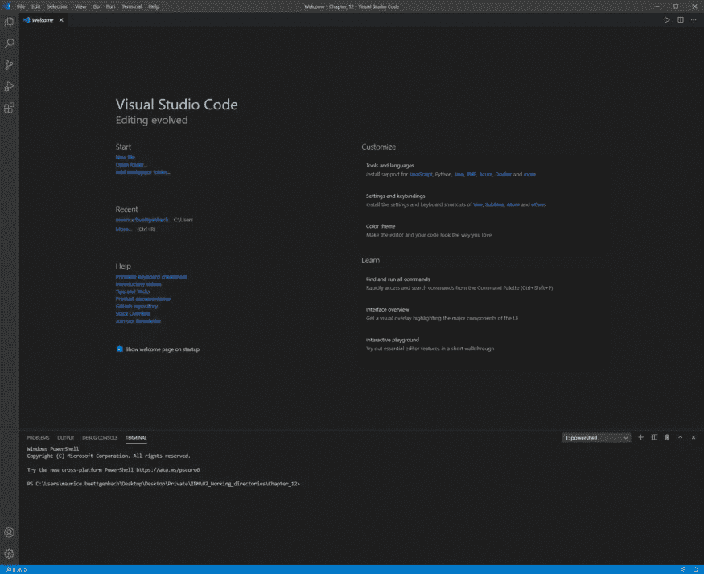
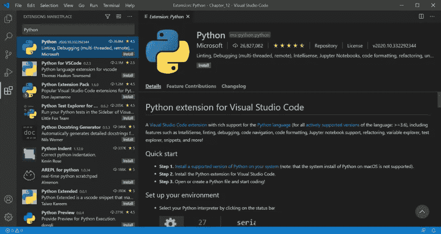
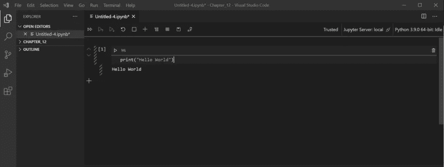
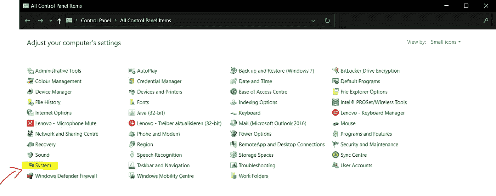
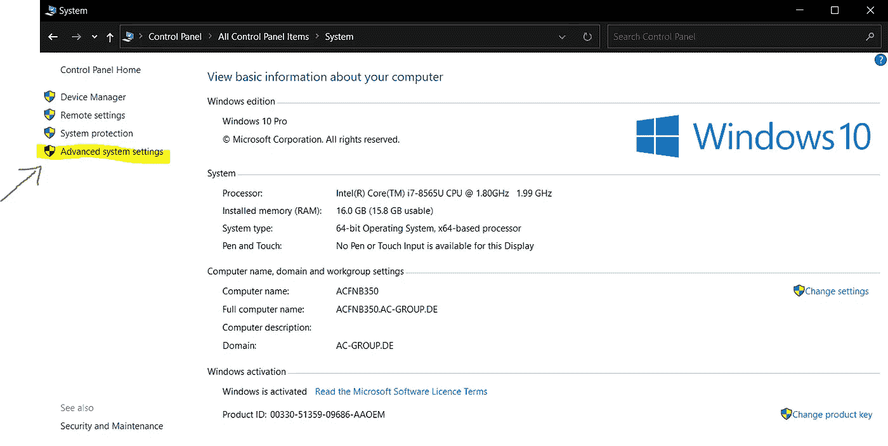
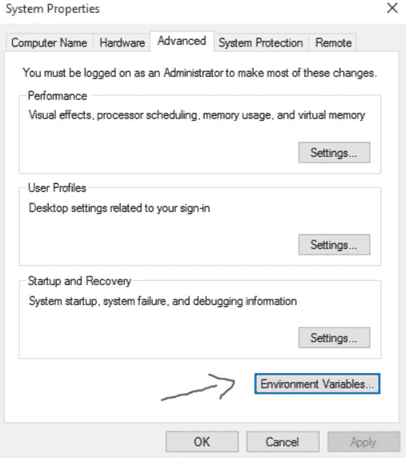
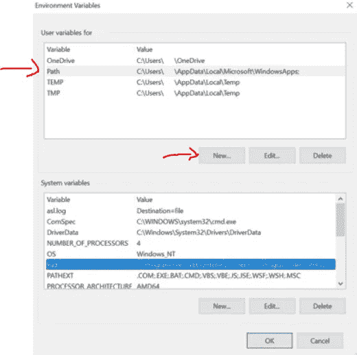
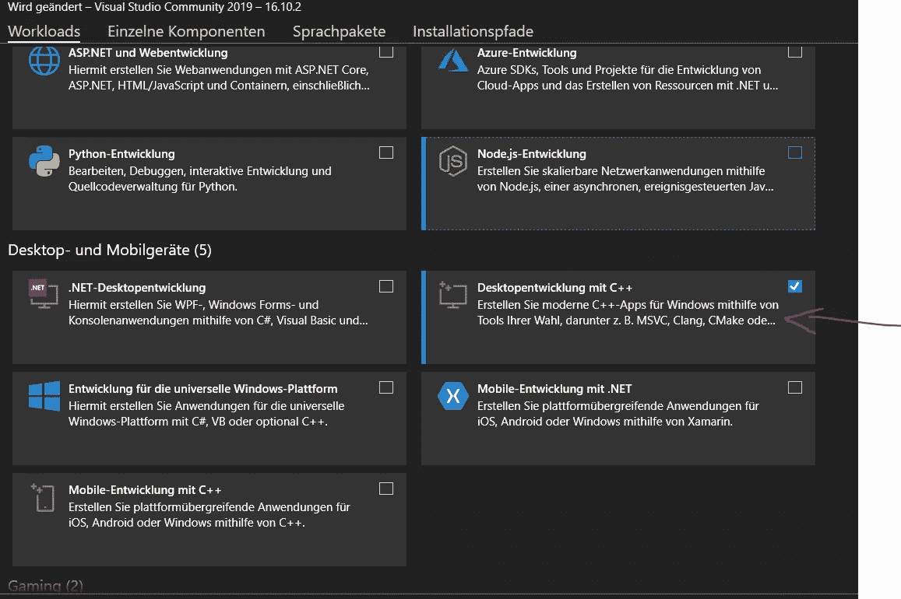
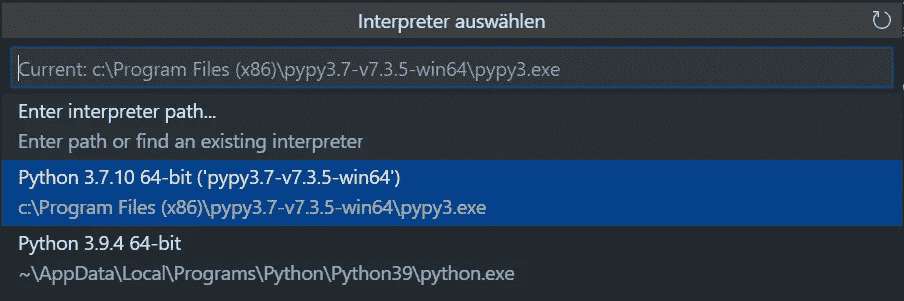

# 如何运行 PyPy 作为你的 VS 代码 Jupyter 解释器

> 原文：<https://levelup.gitconnected.com/how-to-run-pypy-as-your-vs-code-jupyter-interpreter-70836adf44c6>

想知道如何在 Visual Studio 代码中运行 PyPy 作为 Jupyter 笔记本的解释器吗？嗯，我有。我花了很长时间才成功。

我不知道这对你来说怎么样，但是我花在设置环境和安装所需库上的时间比实际编码的时间还多。

由于我无法找到一个关于如何在我的 windows 系统上为我的 VS 代码设置 PyPy 的全面指南，所以我决定分享我的发现，并且(可能)让你的生活变得稍微轻松一点。

# 你需要什么？

*   Visual Studio 代码 2021
*   Visual Studio 代码 Python 扩展
*   Visual Studio 2019
*   PyPy 3.7

# 步骤 1:安装 Visual Studio 代码

如果你还没有 VS 代码，现在是时候下载了！你可以在这里下载想要的版本[。](https://code.visualstudio.com/download)

下载启动执行文件后，请遵循安装指南。安装不需要任何管理权限。随后启动 VSCode，主屏幕将弹出。



VSCode 主屏幕。图片作者。

# 步骤 2:获取 Python 扩展

VS Code 提供了一个随时可用的 Python 扩展，使您能够在 VS Code 中使用 Jupyter 笔记本。要安装扩展，请打开 VSCode，然后按 Ctrl + Shift + X 打开扩展选项卡。在搜索栏中键入“Python”，选择 Microsoft 的 Python 扩展并安装。



微软的 Python 扩展包。图片作者。

要启动新的 Python 项目，请按 Ctrl + Shift + P 打开 VSCode 中的命令行，然后键入“Python:Create New Blank Jupyter Notebook”。按回车键，VSCode 将为您打开一个新的 Jupyter 笔记本:



VSCode 中的 Jupyter 笔记本。图片作者。

# 步骤 3:安装 PyPy

接下来，我们需要下载 PyPy 3.7 并将其安装在我们想要的路径中。你可以在这里下载 PyPy。下载完 ZIP 文件夹后，将它解压到您想要的路径。

理论上，您现在已经准备好在您的系统上执行 PyPy 了。但是，强烈建议您首先将 PyPy 执行文件的路径添加到 windows 系统中。为此，请遵循以下步骤:

通过按 windows 键并键入“控制面板”来打开系统控制面板。然后点击“系统”。



控制面板。图片作者。

接下来，单击“高级系统设置”并提供您的管理员详细信息。



系统面板。图片作者。

一个新窗口将会打开。在这里，选择“环境变量”。



高级系统设置。图片作者。

然后点击“路径”和“新建”。然后，您可以使用您的 pypy3.exe 将路径添加到文件夹中，并为环境变量指定一个相应的名称。



环境变量。图片作者。

# 第四步:确保 pip

好吧！既然我们现在已经成功安装了 PyPy，我们需要确保可以通过 pip 命令安装所需的库。为此，我们需要打开 windows 命令控制台并输入以下命令:

```
pypy -m ensurepip
```

有时上述命令不起作用，因为可能需要提供 pypy3.exe 的完整路径。在这种情况下，将完整路径添加到您的 pypy3.exe，并重复命令:

```
PATH -m ensurepip
```

在我的例子中是这样的:

```
C:\Users\MauriceHenry\Documents\PyPy\pypy3.7-v7.3.5-win64\pypy3.exe -m ensurepip
```

# 第五步:安装 Visual Studio 2019

完美！理论上，到现在为止，我们已经准备好选择 PyPy 作为我们 VS 代码 Jupyter 中的解释器了。但是，PyPy 要求我们重新安装 Ipython 内核。但是，由于安装程序找不到名为“vcvarsall.bat”的文件，安装将会抛出一个令人讨厌的小错误。

该文件是“使用 C++工作负载的桌面开发”包的一部分，可以通过 Visual Studio 2019 安装。为此，请从这个[页面](https://visualstudio.microsoft.com/de/downloads/)安装 Visual Studio 2019。

下载完成后，运行安装程序，选择以下软件包并点击 start。根据您的规格，这一步需要一些时间，所以我建议在这一点上有一个快速的咖啡休息。



Visual Studio 2019 中的工作负载部分。图片作者。

# 第六步:选择 PyPy 作为你的翻译

如果想在 VS 代码中切换不同的解释器，按 Ctrl + Shift + P 打开命令行，输入“Python: Select interpreter”。VSCode 将显示当前活动的解释器和其他选项。要添加一个新的解释器，选择“输入解释器路径…”并简单地将路径复制到你的 pypy3.exe 文件中，然后点击回车。



VS 代码中解释程序的选择。图片作者。

# 步骤 7:为 PyPy 安装 Ipython 内核

在我们准备用 PyPy 作为解释器开始编码之前，我们仍然需要安装 Ipython 内核。幸运的是，微软的 Python 扩展将帮助你做到这一点。

只需在第一个 Jupyter 单元格中键入您选择的代码片段并执行它。VS 代码随后会打开一个弹出窗口，询问您是否要安装 Ipython 内核。一旦你按下“安装”，你就可以往后靠，看 VS 代码为你安装内核。

幽居症反应 GIF。图片由 Gliphy 提供。

瞧啊。您将看到您的代码在安装后已经执行。现在，您可以在 VS Code Jupyter 笔记本中使用 PyPy 作为解释器了。