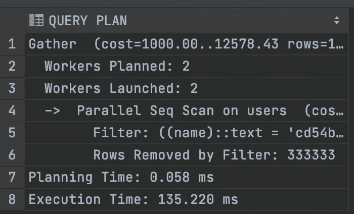
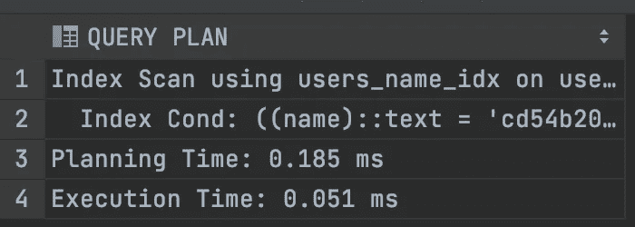

# 如何将查询速度提高 2600 倍

> 原文：<https://levelup.gitconnected.com/how-to-run-queries-2600-times-faster-a57506ed870f>

## 数据库索引初学者入门


恭喜

今天，在 ORM 时代，我们作为开发人员不必经常接触数据库。我自己构建了我的第一个项目，没有在项目中编写一行原始 SQL。

一开始它工作得很好。但是过了一段时间，我们有了一些真实的数据，API 响应时间也在增加。

为了让用户体验更好，我们试图优化我们的应用程序，但这并没有解决我们的实际问题。

很明显，查询数据库是我们应用程序的瓶颈。所以我们引入了缓存，而缓存本身也有成本。

今天我将解释什么是索引，以及我们如何大大提高我们的应用程序的性能。

让我们开始…

# 什么是索引？

我们都知道数据库是大量数据的集合。就像一本字典。

从字典中，我们可以很容易地找到任何单词，因为单词是以某种方式保存的。它们按字典顺序保存(按单词排序)。


照片由[皮斯特亨](https://unsplash.com/@pisitheng?utm_source=unsplash&utm_medium=referral&utm_content=creditCopyText)在 [Unsplash](https://unsplash.com/s/photos/dictionary?utm_source=unsplash&utm_medium=referral&utm_content=creditCopyText) 上拍摄

数据库索引正是如此。当任何新数据被插入数据库时，会创建一个单独的表来根据我们的需要组织数据，以便我们可以更快地找到它们。

> 因此，索引有助于在写入数据时花费一点额外的时间，但它有助于更快地读取数据。如果您的应用程序需要大量写入，并且不需要经常读取数据，那么您可能不需要使用索引

# 说够了！给我看代码

好吧，好吧，让我们先创建一个包含一些基本信息的表格。

## 步骤 1:创建表格

我将要展示的代码大部分是用 Postgres 编写的，但是其他 SQL 语言也非常非常相似。

*   `ID`是行的普通唯一标识符。
*   `NAME`是字符串
*   `SALARY`将持有员工的工资
*   `JOIN_DATE`是日期类型。

## 步骤 2:生成数据

好了，现在我们需要一些数据来玩。为此运行以下代码。

我们不会详细讨论这段代码。它所做的只是为我们生成一百万个随机行。

如果您已经有一个包含一百万个数据的表，那么您可以使用它。

## 第三步:让我们找一个名字

现在，我们将尝试在数据库中查找具有特定名称的用户。对于所有应用程序来说，这是一个非常常见的用例。

您可以运行以下代码来实现这一点。

> 请注意，我们查询的`EXPLAIN ANALYZE`部分是特定于`Postgres`的。它实际上并不运行查询。它只是分析查询并给我们更多的信息。

让我们看看输出，在底部，我们可以看到我们的查询执行时间是`**135ms**`



第一个查询

## 步骤 4:创建索引

现在我们将在字段`NAME`上创建一个索引。语法是针对`Postgres`的，但是其他 SQL 也有类似的格式。

```
CREATE INDEX ON EMPLOYEE(NAME);
```

创建索引需要一些时间。所以等一段时间。

# 斗牛中的最后一剑

现在我们将再次运行前面的查询。

现在看看输出。



索引后

查询的执行时间已经下降到仅仅`**0.051**`毫秒！

所以我们的查询现在会在`**2600 times**`附近运行得更快。多牛逼啊！

好极了。恭喜你走到这一步。希望你没有像我一样👊)现在可以理解索引的威力了。

今天到此为止。编码快乐！:D

**通过**[**LinkedIn**](https://www.linkedin.com/in/56faisal/)**或我的** [**个人网站**](https://www.mohammadfaisal.dev/) **与我取得联系。**