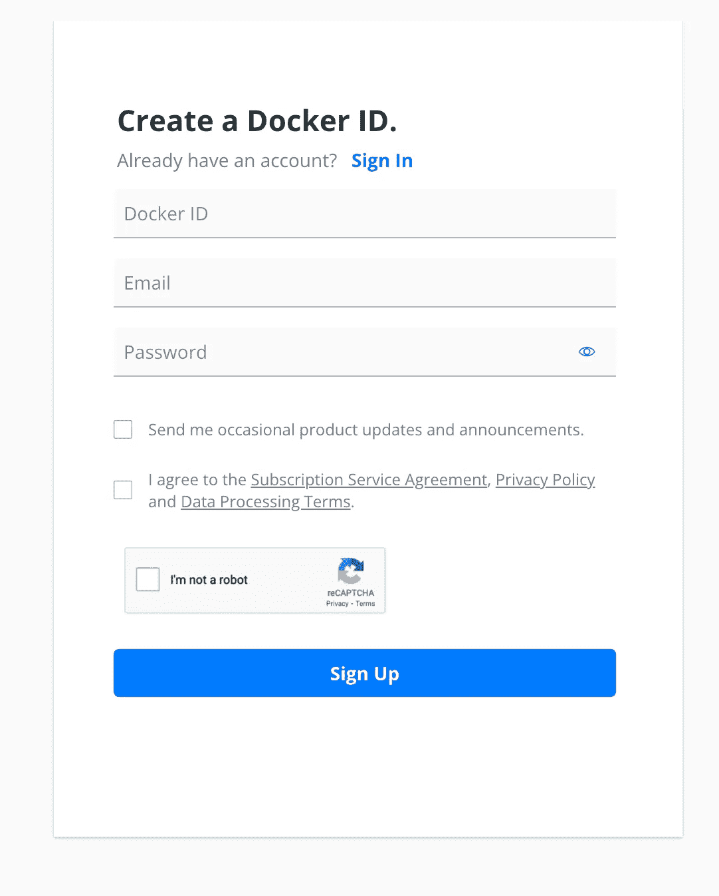
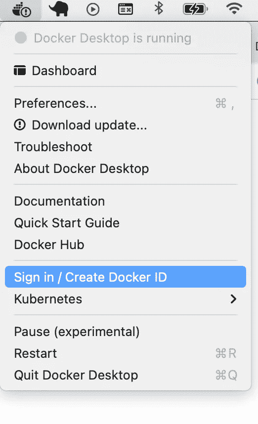

# 如何在 Docker 上运行 Solr

> 原文：<https://levelup.gitconnected.com/how-to-run-solr-on-docker-d7e7ea98255a>


*作者图片*

**什么是 Solr？**

搜索能力是大多数现代应用程序的关键特性。在积累大量数据的同时，他们需要让最终用户能够毫不延迟地找到他们正在搜索的内容。Solr 通过提供超快的开源搜索平台解决了这个问题。

> **Solr** (读作“solar”)是一个[开源](https://en.wikipedia.org/wiki/Open-source_software) [企业搜索](https://en.wikipedia.org/wiki/Enterprise_search)平台，用 [Java](https://en.wikipedia.org/wiki/Java_(programming_language)) 编写。其主要功能包括[全文搜索](https://en.wikipedia.org/wiki/Full_text_search)、点击突出显示、[分面搜索](https://en.wikipedia.org/wiki/Faceted_search)、实时索引、动态聚类、数据库集成、 [NoSQL](https://en.wikipedia.org/wiki/NoSQL) 功能[【2】](https://en.wikipedia.org/wiki/Apache_Solr#cite_note-2)，以及丰富文档(如 Word、PDF)处理。Solr 提供分布式搜索和索引复制，是为可伸缩性和容错性(T21)而设计的。[【3】](https://en.wikipedia.org/wiki/Apache_Solr#cite_note-3)Solr 广泛用于企业搜索和分析用例，拥有活跃的开发社区和定期发布。
> 
> **来自:** [**维基**](https://en.wikipedia.org/wiki/Apache_Solr)

在这篇文章中，我将讨论以下话题

1.  在 docker 容器中运行 Solr
2.  创建新的核心
3.  添加架构
4.  添加内容
5.  执行搜索

> **在 docker 容器中运行 Solr**

如果你没有安装 docker for desktop，那么从这里安装[https://www.docker.com/products/docker-desktop](https://www.docker.com/products/docker-desktop)(它是免费的)


*作者图片*

安装完成后，前往[https://hub.docker.com/](https://hub.docker.com/)创建一个账户(这是免费的)。



*作者图片*

启动您的 docker，并使用 docker hub 凭据登录



*作者图片*

docker 成功安装并运行在您的机器上后，我们现在就可以从 docker hub 中提取映像了。

在这种情况下，我们需要下拉一个 Solr 图像，您可以通过搜索 docker hub 网站找到它的详细信息，这将引导您进入此页面-【https://hub.docker.com/_/solr 


*作者图片*

在这里你可以看到所有已经发布的 Solr 图片的各种版本。我将为这个帖子选择一个最新的

打开终端并运行以下命令

让我们来理解这个命令

*   这将尝试从镜像中运行一个容器，如果你的机器上有，如果没有，它将把它从 docker 中心拉下来
*   ***d*** -这将在分离模式下运行 docker，这样您就可以继续使用您的终端
*   ***-p****-**这样会做端口映射。在这种情况下，Solr 运行在 8983 上，并与您的本地端口 8983 进行映射*
*   ****-名称****-**您的图像名称。它可以是你喜欢的任何东西**
*   *****-solr Solr-pre create my _ core****-**这是一个直接在现在包含 Solr 的容器上运行的命令。
    *solr-precreate* 将创建一个新的 solr 内核(更多关于 Solr 内核的内容即将推出)，并将其命名为 my_core。你可以随便给它起什么名字。***

**这就是你的终端应该看起来的样子**

****

***作者图片***

**你的 docker 桌面上应该有一个这样的运行容器**

****

***作者图片***

**您还可以通过在终端中运行这个命令来列出正在运行的容器**

**如果你现在进入[http://localhost:8983](http://localhost:8983/solr/#/)/，你应该能够看到这样的 solr 管理页面**

****

***作者图片***

**当涉及到 Solr 工作时，有一些基本的概念/术语。我会试着报道其中的一些，但是你可以从这里读到所有的相关内容[https://solr.apache.org/guide/8_0/index.html](https://solr.apache.org/guide/8_0/index.html)**

> **Solr 核心是什么？**

**在 Solr 中，术语*核心*用于指单个索引和相关的事务日志和配置文件(包括 solrconfig.xml 和模式文件等)。如果需要，您的 Solr 安装可以有多个内核，这允许您在同一个服务器中索引不同结构的数据，并对如何将数据呈现给不同的受众保持更多的控制。**

> **什么是 schema.xml？**

**它定义了被索引/接收到 Solr 中的文档的模式(即它们包含的字段集)。它还定义了这些字段的数据类型。它配置文档结构(文档由具有字段类型的字段组成)，以及在索引和查询期间如何处理字段类型。**

> **什么是文档？**

**在 Solr 中，一个**文档**是搜索和索引的单位。
**一个索引由一个或多个文档组成，一个文档由一个或多个字段组成。** 在数据库术语中，文档对应一个表格行，字段对应一个表格列。**

**由于我们在启动容器时添加了一个核心，我们现在可以在我们的管理 URL[http://localhost:8983/Solr/#/my _ core/core-overview](http://localhost:8983/solr/#/my_core/core-overview)上看到它**

**正如你所看到的，有相当多的项目下的核心和每一个都有一些特殊的功能。在这篇文章中，我们将专注于添加一个新的模式和一些文档。您可以在管理部分完成大部分工作，例如，您可以像这样添加 scheme 字段**

****

***作者图片***

**但是这样的麻烦是不太方便。想象一下，如果你想添加大量的字段。每当您必须构建一个模式时，这就成了一种痛苦。好消息是 Solr 自带 API，这使得管理这些操作变得非常容易。**

> **向架构添加字段**

**在这篇文章中，我将用这个数据集作为例子**

**因此，我需要将所有这些字段添加到我的模式中。为此，我将首先创建一个 schema.json 文件，如下所示**

**你可以在这里阅读所有关于这个模式的内容-[https://solr.apache.org/guide/8_1/schema-api.html](https://solr.apache.org/guide/8_1/schema-api.html)**

**现在转向 postman/失眠症(或任何类似的工具)并调用模式端点**

```
**curl -X POST -H 'Content-type:application/json' --data-binary '{...}' http://localhost:8983/solr/my_core/schema**
```

****

***作者图片***

**如果您现在前往管理仪表板并查找添加的字段，它们应该在那里，例如-**

****

***作者图片***

> **将文档添加到 Solr**

**现在，我们准备向 Solr 实例插入一些数据。这也可以通过控制台完成，方法是转到[http://localhost:8983/Solr/#/my _ core/documents](http://localhost:8983/solr/#/my_core/documents)并将您的内容直接粘贴到那里，但我们将通过提供的 API 来完成。**

**首先，准备您的数据以匹配模式，如下所示**

**现在把这个 API 叫做-**

```
**$ curl -X POST -H 'Content-Type: application/json' 'http://localhost:8983/solr/my_solr/update?commit=true' --data-binary '
[{ ... }]'**
```

****

***作者图片***

**现在，您的数据在 Solr 索引中，并准备好通过 Solr 搜索引擎提供🎉 🎉 🎉。您可以从管理员那里查询它们，或者直接通过 Solr 提供的 API 从您的应用程序中查询它们**

****

***作者图片***

**[http://localhost:8983/Solr/my _ core/selectin ent = true&q . op = OR&q = * % 3 *](http://localhost:8983/solr/my_core/select?indent=true&q.op=OR&q=*%3A*)**

**这只是一个开始，您可以在此基础上构建更多内容。和任何类似的工具一样，文档可能有点无聊，而且到处都是，但是我仍然建议浏览一下。**

**快乐寻找**

**感谢您的阅读，如果您想支持我，请关注我，成为会员，支持更广泛的社区。**

**[](https://medium.com/@metacollective/membership) [## 通过我的推荐链接加入媒体 Meta Collective

### 作为一个媒体会员，你的会员费的一部分会给你阅读的作家，你可以完全接触到每一个故事…

medium.com](https://medium.com/@metacollective/membership)**