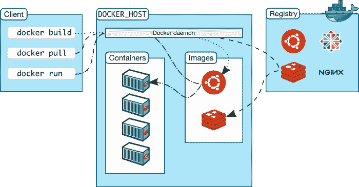
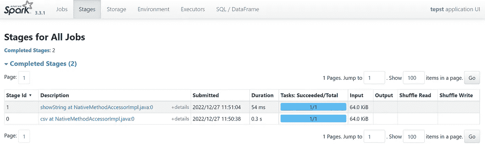

# 如何用 Docker 运行 Spark

> 原文：<https://levelup.gitconnected.com/how-to-run-spark-with-docker-c6287a11a437>

## Pyspak 教程


[阿帕奇 Spark](https://spark.apache.org/) 的官方 logo

在本教程中，我将指导您在 Docker 容器中安装和运行 Apache Spark 和 PySpark。

对于不熟悉 Spark 的人来说，它是一个开源的分布式计算系统，可以快速处理大量数据。PySpark 是 Spark 的 Python 接口，允许您使用 Spark 的强大功能和 Python 的简单性。

本文包含以下几个部分:

*   Spark 和 Docker 的介绍，解释使用它们进行数据处理的好处；
*   在 Docker 容器中安装和运行 Spark 和 PySpark 的过程，包括设置必要的依赖项和配置。
*   最后，在第三部分，我将向您展示如何运行您的第一个 PySpark 脚本。

在本教程结束时，您将拥有一个在 Docker 容器中运行的 Spark 和 PySpark 的工作安装，并准备好开始使用它们来完成您自己的数据处理任务。

本文将使用最完整的配置，而不是使用“jupyter/pyspark-notebook”Docker 映像的配置。

所以，让我们开始吧！😁

# 1.Spark 和 Docker 简介

# 火花/ Pyspark

Apache Spark 是一个流行的开源数据处理引擎，广泛应用于大数据领域。众所周知，它能够快速高效地处理大量数据，是数据科学家和分析师的宝贵工具。

在这里，我们展示了 Apache Spark 的三大特征。

*   **分布式处理—** Apache Spark 可以跨多个分布式计算集群处理大量数据，使其高效且可扩展。
*   **内存计算—** Apache Spark 将数据存储在内存中，从而实现更快的处理和实时分析
*   **支持多种语言** — Apache Spark 支持多种语言编程，包括 Python、Java 和 Scala。

# 码头工人

一年前，我开始从事 **Docker** 的工作，这是一套奇妙的平台软件(PAAS)产品，我现在是它的超级粉丝。

该工具使用操作系统级虚拟化，允许对容器中的软件进行奇妙的定制，可以轻松地与您的同事或开发环境之间共享，“*并确保您共享的每个人都获得以相同方式工作的相同容器”*(由[官方 Docker 网站](https://docs.docker.com/get-started/overview/#:~:text=Docker%20provides%20the%20ability%20to,simultaneously%20on%20a%20given%20host.))。

Docker 的工作方式非常简单，因为它使用了客户机-服务器架构。"*Docker 客户端与* ***Docker 守护进程*** *对话，后者负责构建、运行和分发 Docker 容器。Docker 客户机和守护进程可以在同一个系统上运行，或者您可以将 Docker 客户机连接到远程 Docker 守护进程。Docker 客户机和守护程序使用 REST API 通过 UNIX 套接字或网络接口进行通信。另一个 Docker 客户端是 Docker Compose，它让您可以使用由一组容器组成的应用程序。*(文字摘自 Docker 官方网站)。



Docker 架构(来自 Docker 官方网站)

使用 Docker 最常见的方式是在一个名为 **Dockerfile** 的文本文件中设置几个指令。该文件首先从公共 Docker 存储库中“调用”一个图像(例如 Python 图像、气流图像等)来设置基本图像。然后，它将运行几个用户定义的命令来定制您的新映像。

最后，在运行“docker build”命令后，一个新的映像被创建，整个上下文(递归地)被发送到守护进程。

# 3.使用 Docker 运行 Spark/PySpark

为了在 Docker 容器中运行 Spark 和 Pyspark，我们需要开发一个 Docker 文件来运行定制的映像。

首先，我们需要从 Docker Hub 调用 Python 3.9.1 镜像:

```
FROM python:3.9.1
```

对于接下来的步骤，您需要下载文件“fhvhv _ tripdata _ 2021–01 . CSV . gz ”,您可以在此[链接中获得该文件。](https://github.com/DataTalksClub/nyc-tlc-data/releases/tag/fhv)该文件也可用于其他项目。

接下来的步骤包括安装“curl”、“wget”和“pandas”。我们还将之前下载的文件复制到容器中。

```
RUN apt-get install curl wget
RUN pip install pandas

COPY fhvhv_tripdata_2021-01.csv.gz .
```

为了获得更有条理的配置，我们将设置要使用的 Spark、Hadoop 和 Java 版本:

```
# VERSIONS
ENV SPARK_VERSION=3.3.1 \
HADOOP_VERSION=3 \
JAVA_VERSION=11
```

然后我们需要设置 Java 环境变量，下载 JDK 11 并使用以下命令安装它:

```
# SET JAVA ENV VARIABLES
ENV JAVA_HOME="/home/jdk-${JAVA_VERSION}.0.2"
ENV PATH="${JAVA_HOME}/bin/:${PATH}"

# DOWNLOAD JDk 11 AND INSTALL
RUN DOWNLOAD_URL="https://download.java.net/java/GA/jdk${JAVA_VERSION}/9/GPL/openjdk-${JAVA_VERSION}.0.2_linux-x64_bin.tar.gz" \
    && TMP_DIR="$(mktemp -d)" \
    && curl -fL "${DOWNLOAD_URL}" --output "${TMP_DIR}/openjdk-${JAVA_VERSION}.0.2_linux-x64_bin.tar.gz" \
    && mkdir -p "${JAVA_HOME}" \
    && tar xzf "${TMP_DIR}/openjdk-${JAVA_VERSION}.0.2_linux-x64_bin.tar.gz" -C "${JAVA_HOME}" --strip-components=1 \
    && rm -rf "${TMP_DIR}" \
    && java --version
```

然后我们需要从 https://dlcdn.apache.org 下载并安装 Spark:

```
# DOWNLOAD SPARK AND INSTALL
RUN DOWNLOAD_URL_SPARK="https://dlcdn.apache.org/spark/spark-${SPARK_VERSION}/spark-${SPARK_VERSION}-bin-hadoop${HADOOP_VERSION}.tgz" \
    && wget --no-verbose -O apache-spark.tgz  "${DOWNLOAD_URL_SPARK}"\
    && mkdir -p /home/spark \
    && tar -xf apache-spark.tgz -C /home/spark --strip-components=1 \
    && rm apache-spark.tgz
```

最后，我们设置一些额外的环境变量:

```
# SET SPARK ENV VARIABLES
ENV SPARK_HOME="/home/spark"
ENV PATH="${SPARK_HOME}/bin/:${PATH}"

# SET PYSPARK VARIABLES
ENV PYTHONPATH="${SPARK_HOME}/python/:$PYTHONPATH"
ENV PYTHONPATH="${SPARK_HOME}/python/lib/py4j-0.10.9.5-src.zip:$PYTHONPATH"
```

最后，我们将入口点设置为 Python 命令行:

```
ENTRYPOINT ["python" ]
```

**完整的 Dockerfile 文件配置如下:**

```
FROM python:3.9.1

RUN apt-get install curl wget
RUN pip install pandas

COPY fhvhv_tripdata_2021-01.csv.gz .

# VERSIONS
ENV SPARK_VERSION=3.3.1 \
HADOOP_VERSION=3 \
JAVA_VERSION=11

# SET JAVA ENV VARIABLES
ENV JAVA_HOME="/home/jdk-${JAVA_VERSION}.0.2"
ENV PATH="${JAVA_HOME}/bin/:${PATH}"

# DOWNLOAD JAVA 11 AND INSTALL
RUN DOWNLOAD_URL="https://download.java.net/java/GA/jdk${JAVA_VERSION}/9/GPL/openjdk-${JAVA_VERSION}.0.2_linux-x64_bin.tar.gz" \
    && TMP_DIR="$(mktemp -d)" \
    && curl -fL "${DOWNLOAD_URL}" --output "${TMP_DIR}/openjdk-${JAVA_VERSION}.0.2_linux-x64_bin.tar.gz" \
    && mkdir -p "${JAVA_HOME}" \
    && tar xzf "${TMP_DIR}/openjdk-${JAVA_VERSION}.0.2_linux-x64_bin.tar.gz" -C "${JAVA_HOME}" --strip-components=1 \
    && rm -rf "${TMP_DIR}" \
    && java --version

# DOWNLOAD SPARK AND INSTALL
RUN DOWNLOAD_URL_SPARK="https://dlcdn.apache.org/spark/spark-${SPARK_VERSION}/spark-${SPARK_VERSION}-bin-hadoop${HADOOP_VERSION}.tgz" \
    && wget --no-verbose -O apache-spark.tgz  "${DOWNLOAD_URL_SPARK}"\
    && mkdir -p /home/spark \
    && tar -xf apache-spark.tgz -C /home/spark --strip-components=1 \
    && rm apache-spark.tgz

# SET SPARK ENV VARIABLES
ENV SPARK_HOME="/home/spark"
ENV PATH="${SPARK_HOME}/bin/:${PATH}"

# SET PYSPARK VARIABLES
ENV PYTHONPATH="${SPARK_HOME}/python/:$PYTHONPATH"
ENV PYTHONPATH="${SPARK_HOME}/python/lib/py4j-0.10.9.5-src.zip:$PYTHONPATH"

# Let's change to  "$NB_USER" command so the image runs as a non root user by default
USER $NB_UID

ENTRYPOINT ["python" ]
```

为了构建我们定制的 Docker 映像，我们需要运行 docker build 命令:

```
docker build -t spark_docker_v1 .
```

# 3.Pyspark 的首次运行

现在我们有了一个 Docker 映像，可以运行 Spark 了，因此也可以运行 Pyspark 了。

要设置容器运行，我们调用以下命令:

```
docker run --rm -it -p 4040:4040 spark_docker_v1
```

将容器设置为运行后，您将获得 Python 命令行:

```
Python 3.9.1 (default, Feb  9 2021, 07:42:03)
[GCC 8.3.0] on linux
Type "help", "copyright", "credits" or "license" for more information.
```

在命令行上，您可以通过导入所需的包、启动 Spark 会话、读取导入的文件，然后显示 Spark 数据帧的前 20 行来测试 Spark:

```
import pyspark
from pyspark.sql import SparkSession

spark = SparkSession.builder \
    .master("local[*]") \
    .appName('tepst') \
    .getOrCreate()

df = spark.read \
    .option("header", "true") \
    .csv('fhvhv_tripdata_2021-01.csv.gz')

df.show()
```

如果一切顺利，您将获得以下结果:


在 *localhost:4040* 上，您将看到这幅图像，表示 Spark 正在工作:



# 最后的想法

如果您想为 Spark 应用程序使用一致且隔离的环境，在 Docker 上运行 Spark 可能是一个不错的选择。

然而，在 Docker 上运行 Spark 可能并不总是最佳选择。例如，如果您有一个大型集群，拥有运行 Spark 的专用资源，那么直接在集群上运行 Spark 可能比使用 Docker 容器更有效。

一个好的替代方法可能是通过在 Kubernetes 集群上部署 Spark，使用 Kubernetes 为 Spark 提供更多的资源。这允许您通过向集群添加更多节点来水平扩展 Spark 应用程序。

你喜欢这篇文章吗？关注我更多关于[媒体](https://medium.com/@lgsoliveira)的文章。

[阅读路易斯·奥利维拉(以及媒体上成千上万的其他作家)的每一个故事](https://medium.com/@lgsoliveira/membership)

# 分级编码

感谢您成为我们社区的一员！在你离开之前:

*   👏为故事鼓掌，跟着作者走👉
*   📰查看[升级编码出版物](https://levelup.gitconnected.com/?utm_source=pub&utm_medium=post)中的更多内容
*   🔔关注我们:[Twitter](https://twitter.com/gitconnected)|[LinkedIn](https://www.linkedin.com/company/gitconnected)|[时事通讯](https://newsletter.levelup.dev)

🚀👉 [**加入升级人才集体，找到一份神奇的工作**](https://jobs.levelup.dev/talent/welcome?referral=true)