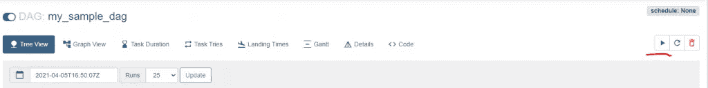
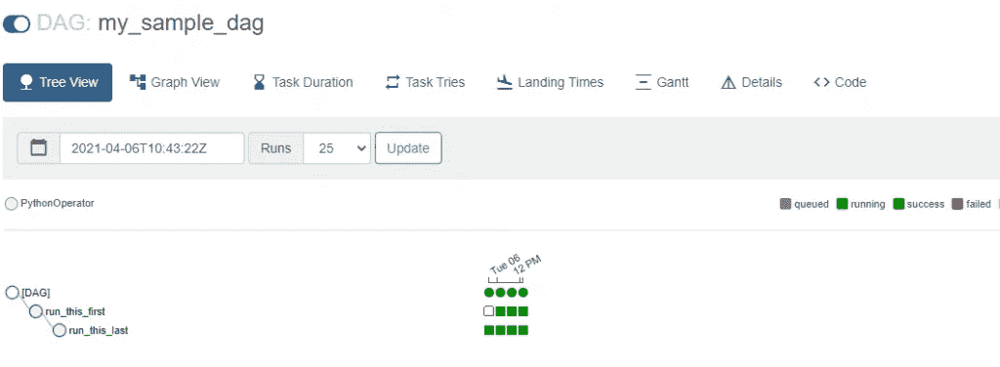

# 如何在 Docker 中运行您的第一个气流 DAG

> 原文：<https://levelup.gitconnected.com/how-to-run-your-first-airflow-dag-in-docker-555f994cda5c>

## 如何在 Docker 中运行气流 DAG 的示例

[](https://jorgepit-14189.medium.com/membership) [## 用我的推荐链接加入媒体-乔治皮皮斯

### 阅读乔治·皮皮斯(以及媒体上成千上万的其他作家)的每一个故事。您的会员费直接支持…

jorgepit-14189.medium.com](https://jorgepit-14189.medium.com/membership) 

在第一篇文章中，我们学习了如何在 Docker 中开始运行 Airflow，在这篇文章中，我们将提供一个如何在 Docker 中运行 DAG 的示例。我们假设您已经完成了在 Docker 中运行 Airflow 的步骤，并且准备好运行 compose。

# 运行 docker-compose

您需要做的第一件事是将您的工作目录设置为 airflow 目录，该目录很可能由以下文件夹组成。


此时，您可以运行 docker-compose 命令。

```
docker-compose up
```

现在，您应该能够进入`http://localhost:8080/home`并看到气流 UI。注意，用户名和密码的凭证分别是`airflow`和`airflow`。


您可以打开一个新的终端并运行命令`docker ps`来查看正在运行的容器。

```
docker ps
```


# 构建您的 Python 运算符 DAG

请记住，我们已经使用了 docker 卷，这意味着无论我们在本地环境中写什么，都会传递给 Docker (mount)。我们安装的文件夹是`dags`、`logs`和`plugins`。因此，我们可以转到本地计算机， `**dags**` **文件夹**中的**，并创建一个新的`.py`文件，我将其命名为`my_test_dag.py`**


这个 DAG 很简单，它是用于展览的目的。它只是简单地打印出**“我先来”**，然后是**“我最后来”**，只是为了显示 DAG 的顺序。`mytest_dag.py`如下:

```
from airflow.models import DAG
from airflow.utils.dates import days_ago
from airflow.operators.python_operator import PythonOperator
args = {'owner': 'pipis',
    'start_date': days_ago(1)
}dag = DAG(dag_id = 'my_sample_dag', default_args=args, schedule_interval=None)def run_this_func():
    print('I am coming first')def run_also_this_func():
    print('I am coming last')with dag:
    run_this_task = PythonOperator(
        task_id='run_this_first',
        python_callable = run_this_func
    )run_this_task_too = PythonOperator(
        task_id='run_this_last',
        python_callable = run_also_this_func
    )run_this_task >> run_this_task_too
```

# 检查您的 DAG 是否在 Docker 中

由于 Docker 的容量，我们应该能够在 UI 中看到`**mytest_dag**`。


# 跑你的狗

为了运行您的 DAG，您需要“取消暂停”它


然后单击 DAG，并单击播放按钮来触发它:



一旦您触发它，它将运行，您将获得每个任务的状态。



深绿色意味着成功。我们可以点击每个绿色圆圈和矩形来获得更多细节。让我们点击`run_this_first`并进入日志。


正如我们在日志中看到的，第一个任务有打印语句“我先来”,同样，您将看到第二个任务的另一个打印语句。太好了，你第一次和多克跑了！

# 与 Docker 环境交互

如果您想要进入气流环境，您应该执行以下步骤。

*   获取 he `airflow-docker_airflow-worker_1`的容器 ID
*   运行命令`docker exec -it <container id> bash`


现在你在气流码头的环境中。例如，让我们看看文件夹。


让我们得到所有的`dags`


正如我们所看到的，存在着`my_test_dag`。最后。你可以通过点击`exit`退出终端，也可以通过运行`docker-compose down`关闭 docker。


*原载于*[*https://predictivehacks.com*](https://predictivehacks.com/how-to-run-your-first-airflow-dag-in-docker/)*。*