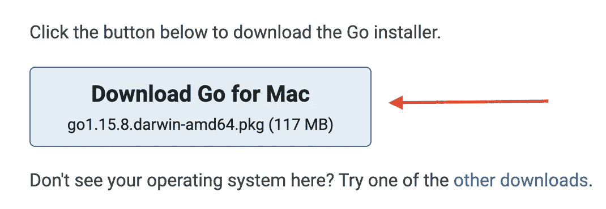
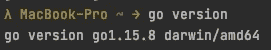
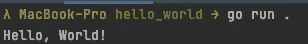
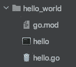
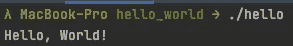

# 如何通过三个简单的步骤运行您的第一个 Go 应用程序

> 原文：<https://levelup.gitconnected.com/how-to-run-your-first-go-application-in-three-simple-steps-1539e846f792>

简单介绍在你的系统上安装 Go，并在 10 分钟内创建你的第一个“Hello-World”应用程序。


卢卡斯·法夫尔在 [Unsplash](https://unsplash.com/) 上的照片

# 1.装置

## 安装 Go 二进制文件

访问 https://golang.org/doc/install 的[并下载合适的安装程序。](https://golang.org/doc/install)



下载完成后，打开安装程序并按照其中描述的步骤操作。

## 验证安装

默认情况下，Go 二进制文件安装在`/usr/local/go` (Mac)下。您可以通过在新的终端中执行命令`go version`来验证安装。



如果 CLI 还没有找到`go`，你必须手动将`/usr/local/go/bin`添加到系统的 PATH 变量中。

# 2.创建您的第一个“Hello World”-Go 应用程序

首先，为您的应用程序创建一个新文件夹，并导航到其中:

```
$ mkdir hello_world
$ cd hello_world
```

接下来，创建一个名为`hello`的新 Go 模块。

```
$ go mod init hello
```

这个命令创建了一个名为`go.mod`的新文件，它包含了你的模块名、使用的 Go 版本，如果需要的话，还包含了你正在导入到你的应用程序中的第三方模块。但是在这个“Hello World”示例中，我们没有使用任何第三方模块，因此这部分没有列出任何内容。

如果你来自 JavaScript/Node.js 世界，那么`go.mod`文件就是 Go 世界的`package.json`。😉

最后但同样重要的是，我们当然必须定义我们实际的应用程序代码。所以让我们创建一个名为`hello.go`的新文件。

在我们的应用程序中，我们定义了三件事:

*   `package main`—`main`包的声明。Go 中的包是一种对来自同一目录中所有文件的函数进行分组的方式。
*   `import fmt` —导入`fmt`包。`fmt`包除了其他功能外，还用于格式化文本和打印到控制台。它是 Go 标准库的一部分，不需要第三方安装包。
*   `func main() { ...}` —定义`main`包运行时默认执行的`main`方法(入口点)。

# 3.构建和运行应用程序

完成上述步骤后，只需通过以下方式即可运行应用程序:

```
$ go run .
```



“Hello World”Go 应用程序打印“Hello，World！”

当然，当在生产环境中运行时，您绝不会希望从源文件中启动应用程序，而是希望一个预构建的应用程序能够被 Docker 容器轻松包装。

这就是`go build`命令的作用。顾名思义，它用于构建我们的 Go 应用程序。在我们的例子中，以下三个命令都做同样的事情，构建一个名为`hello`的可执行应用程序:

```
// Define target by the source folder
go build .// Define target by the module name
go build hello// Define target by the main file
go build hello.go
```



运行“开始生成”后的文件结构

可执行文件名`hello`来自于`go.mod`文件中的`module hello`定义，因为那是你定义模块/应用程序名的地方。

应用程序构建完成后，您只需通过 CLI 执行即可立即运行它:

```
$ ./hello
```



通过可执行文件运行“Hello World”Go 应用程序

# 最后的话

我希望这篇文章可以帮助你毫无问题地设置你的第一个 Go 应用程序。

感谢您花时间阅读我的文章。

## 你想联系吗？

如果你想联系我，请通过 LinkedIn 联系我。

另外，请随意查看我的书籍推荐[📚。](https://medium.com/@mr-pascal/my-book-recommendations-4b9f73bf961b)

[](https://mr-pascal.medium.com/my-book-recommendations-4b9f73bf961b) [## 我的书籍推荐

### 在接下来的章节中，你可以找到我对所有日常生活话题的书籍推荐，它们对我帮助很大。

mr-pascal.medium.com](https://mr-pascal.medium.com/my-book-recommendations-4b9f73bf961b) [](https://mr-pascal.medium.com/membership) [## 通过我的推荐链接加入 Medium—Pascal Zwikirsch

### 作为一个媒体会员，你的会员费的一部分会给你阅读的作家，你可以完全接触到每一个故事…

mr-pascal.medium.com](https://mr-pascal.medium.com/membership)