# 如何在 Azure Kubernetes 服务上省钱

> 原文：<https://levelup.gitconnected.com/how-to-save-a-fortune-on-azure-kubernetes-service-d4910239b8b3>

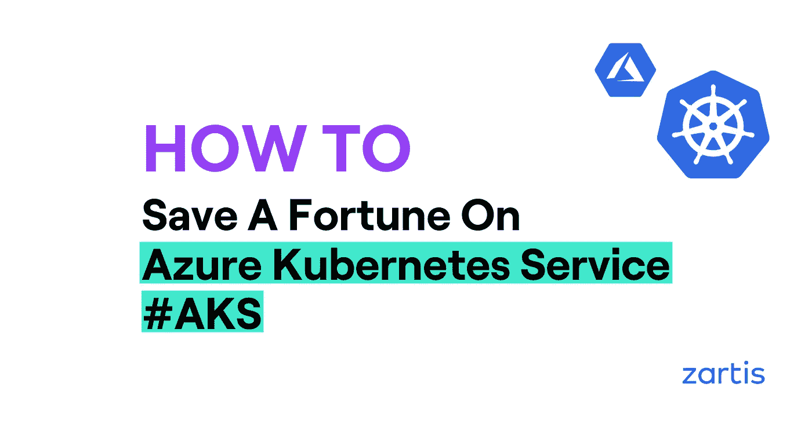

## 帮助您最大限度减少 AKS 支出的各种策略

我们都知道这个故事——您的团队获得了云提供商，第一个月每个人都很高兴并参与其中。DevOps 团队为开发、测试和生产环境快速启动多个 Kubernetes 集群。而且都很美好…直到第一张发票来了。突然就没那么多彩了。

# AK 对我的钱做了什么？

配置 Azure Kubernetes 集群(AKS)很容易，只需启动向导并单击“下一步”直到完成。然而，这种简化的方法可能会花费你很多钱。云供应商并不急于减少您的云支出，因此需要花费一些时间和精力来寻找所有可能的方法。

有多种方法可以控制你的 AKS 支出。在这里，我们收集了一些最重要的:

# 使用定点实例

Azure 云通常没有得到充分利用，客户没有使用大量的计算能力。这种未使用的容量促使微软提供了一种新型的虚拟机— Spot Instances。它们比普通虚拟机便宜得多，并且可以随时被驱逐。这使得 spot 实例非常适合开发和测试环境，但不太适合生产环境。除非您完全了解 spot 实例如何工作以及它们有什么风险，否则您不应该将它应用到生产环境中。

AKS 可以使用 Spot 实例作为额外的节点池，在底层映射到虚拟机规模集(VMSS)。让我们看一下默认 AKS 在节点池方面的表现——一个具有单个昂贵节点池的集群。

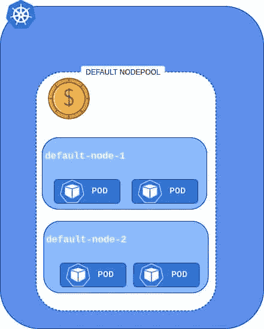

现在，如果我们添加廉价的 Spot 实例池，会发生什么呢？我们可以看到，该集群现在有两个节点池，但是我们添加的那个有点不同，它有一个特殊的[污点](https://kubernetes.io/docs/concepts/scheduling-eviction/taint-and-toleration/)。它使新的点池不可用于所有工作负载。

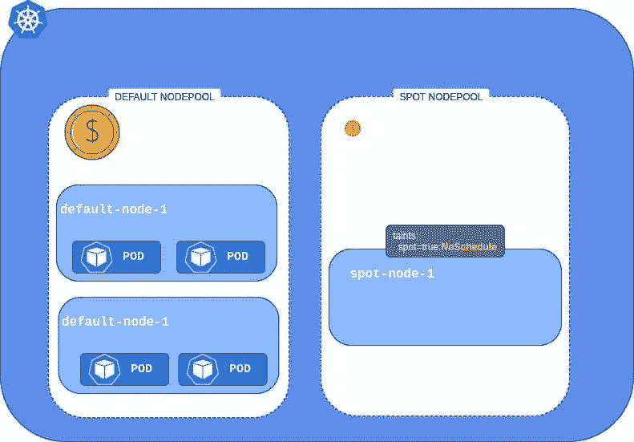

一个可能的解决方案是调整我们部署的 YAML 文件，并添加一个[容错](https://kubernetes.io/docs/concepts/scheduling-eviction/taint-and-toleration/)，这将允许 pod 被安排在受感染的节点上。

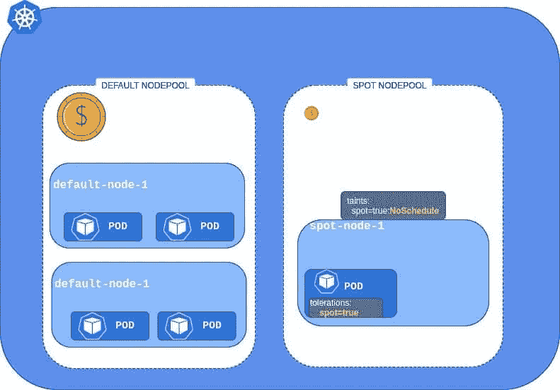

但是，如果您不想更改部署并允许每个工作负载在廉价节点上运行，可以通过自动清除 Spot 实例节点来实现。为此，您需要用下面的脚本创建一个守护进程集——它将在每个节点上运行并清除污点。

> kubernetes.azure.com/scalesetpriority-
> 
> ***这样，所有 pod 都将能够利用 Spot 实例***

**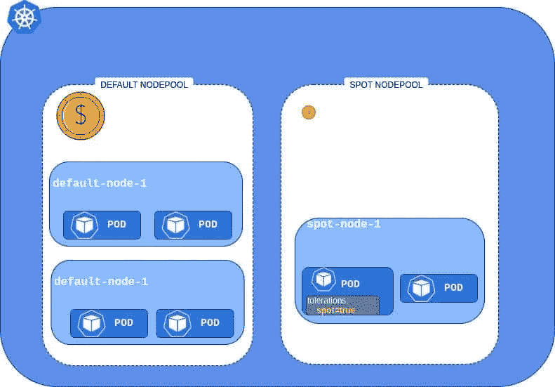**

> *****与标准实例类型相比，利用 Spot 实例可以节省高达 90%的成本。*****

# **计划集群关闭**

**开发人员是非常有弹性的人，他们可以长时间不间断地工作，只要他们的油箱里有足够的咖啡。然而，即使是最强硬的开发人员也需要休息一段时间。这就是为什么为非生产集群创建启动和关闭时间表是有益的。最简单也是最有效的策略是让集群在工作时间保持运行，在周末完全关闭。这种情况可以使用 Terraform [autoscale](https://registry.terraform.io/providers/hashicorp/azurerm/latest/docs/resources/monitor_autoscale_setting) 资源或直接在 VMSS 配置页面上实现。**

**群集时间线可能如下所示:**

**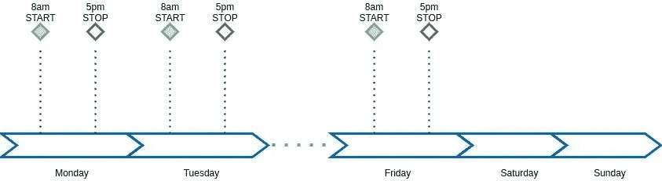**

> ****测试基础设施不是每周运行 168 小时，而是只运行 45 小时。这意味着成本降低了 73%。****

# **一起使用集群自动缩放和 HPA**

**没有人预先知道生产流量产生了多少计算能力。当您创建 AKS 集群时，通常使用“不要太多也不要太少”的范例来设置节点的数量。这种方法在开始时可能有效，但是随着流量的增长，应用程序需要更多的 CPU 和内存，您可能最终每天都要手动添加和删除节点。**

**这是投入时间对[水平吊舱自动缩放器](https://kubernetes.io/docs/tasks/run-application/horizontal-pod-autoscale/) (HPA)和[集群自动缩放器](https://github.com/kubernetes/autoscaler/tree/master/cluster-autoscaler) (CA)进行适当配置的重要时刻。正确配置的 HPA 将保持 pod 实例的最佳数量，从而使您的应用程序运行良好。如果负载更高，HPA 将动态添加新实例。在负载峰值之后，HPA 将去掉不再需要的 pod。要回答“我应该何时扩展我的应用程序”这个问题，您可以使用 CPU 或内存使用等基本指标。您还可以使用由 Prometheus 等公司提供的定制指标，并在 API 响应缓慢时开始扩展。另一种可能是，当 Azure 服务总线中存储了大量事件时，扩展部署。最后一种需要安装一个[额外的适配器](https://github.com/Azure/azure-k8s-metrics-adapter)。**

**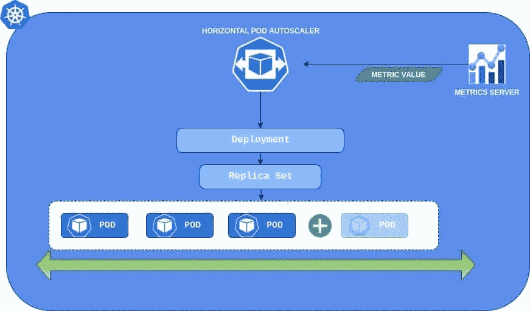**

**HPA 在单元级别工作，而群集自动缩放器在节点(虚拟机)上运行。这是一个调整 Kubernetes 集群规模的工具。它将监视类似“由于 CPU/MEM 不足而无法调度”的事件，并使用 Azure API 动态供应新的虚拟机。**

**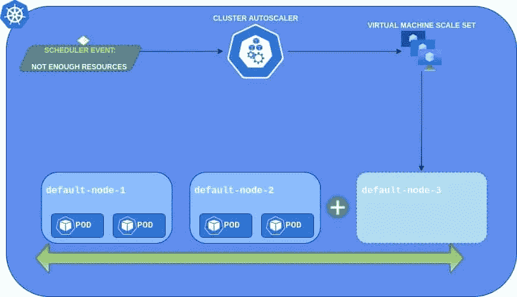**

**集群自动缩放和水平机架自动缩放一起为自动调整集群带来了终极解决方案。您可以只为当前需要的资源进行配置和付费。如果负载较低，集群将保持较小。如果负载增加，HPA 将开始扩展单元，这将触发 CA 配置新节点。当风暴结束时，一切都会变小。**

**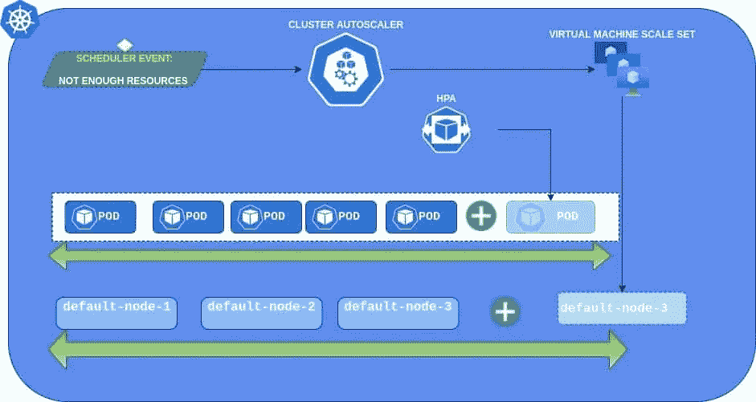**

# **使用保留实例**

**如果您计划让您的环境保持正常运行至少一年，那么使用保留的实例将让您不费吹灰之力就能立即降低成本。与标准价格相比，成本节约高达 72%。唯一的缺点是您失去了部分灵活性——您被绑定到您预订的云提供商和实例类型(尽管预订可以应用到灵活性[组](https://docs.microsoft.com/en-us/azure/virtual-machines/reserved-vm-instance-size-flexibility))。值得花一些时间来分析您的工作负载，并为未来几年选择最佳的实例类型。Azure 为您提供取消预订的可能性，但会收取 12%的额外费用。**

**下面您可以看到一个 6 节点 AKS 集群的成本节约图表，比较了按需实例与 1 年和 3 年预留的情况:**

**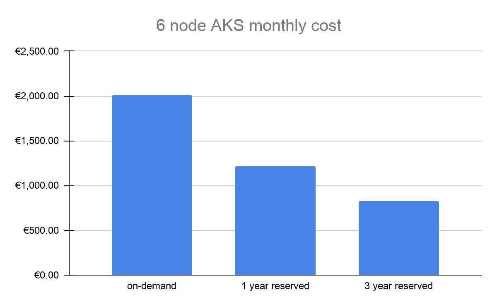**

**请记住，对于保留的实例，您是在为 24×7 的保留付费，因此对非全时运行的集群使用它是没有意义的。在您计划使用 Spot 实例的订阅中保留虚拟机也没有什么意义。**

# **调整节点池的大小**

**通常情况下，一个 Kubernetes 集群运行不同类型的工作负载—数据库、web 服务器、应用服务器等。当涉及到计算资源时，它们中的每一个都可能有完全不同的需求。数据库通常渴望内存，而应用服务器需要更多的 CPU。由于资源分配不当，将所有这些工作负载置于同一类型的虚拟机中可能会导致额外的成本。例如，您可以购买 8xD12s 实例来分配您的所有工作负载，但是如果您仔细查看资源使用情况，您会发现您几乎利用了 100%的 CPU，而 RAM 仅利用了 10%。**

**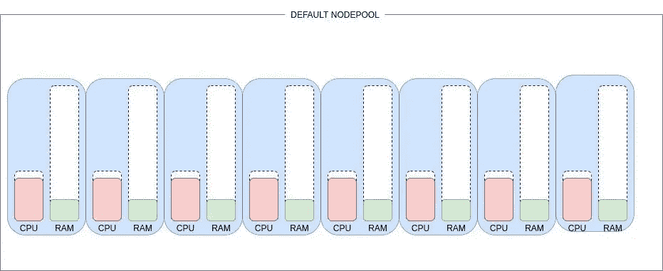**

**您的一些工作负载具有较高的 CPU 需求，因此最好将它们分配到由 3 个 Standard_F8s_v2 实例和 2 个 d12 实例组成的 CPU 优化节点池中。**

**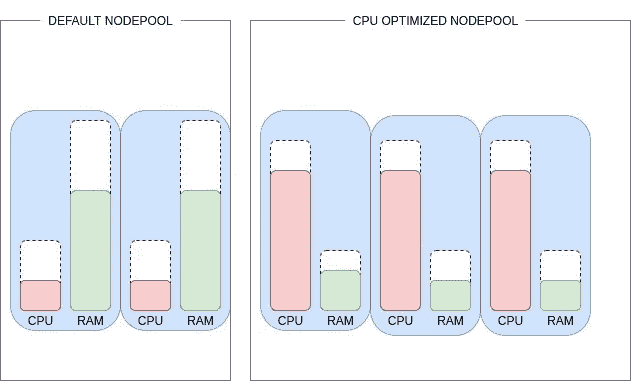**

> *****上面的例子节省了将近 36%的成本。*****

# **当心额外费用**

**通常不考虑日志存储的成本。然而，在非常嘈杂的环境中，应用程序被设置为调试模式，它们会生成大量的日志。日志分析的成本可能会出乎你的意料。您可以为您的工作区配置每日摄入限制，以避免额外成本。但是，请小心，因为一旦达到限制，您将丢失当天剩余时间的数据。这就是为什么我们建议在开发/测试环境中设置它，以及一个[警报](https://docs.microsoft.com/en-us/azure/azure-monitor/platform/manage-cost-storage#create-an-alert-when-data-collection-is-high)来通知您何时达到极限。**

**Azure Defender 是一个很好的工具来跟踪你的集群的安全得分。它与 Azure Security Center 集成在一起，因此在 AKS 中启用它只需点击几下鼠标。但是，要知道它会产生巨大的成本。在编写 Defender for AKS 时，每个虚拟机内核每月的成本为 2 美元，因此，对于拥有 100 个内核的集群，成本会增加 200 美元。考虑使用开源工具，如 [Kube-Bench](https://github.com/aquasecurity/kube-bench) 和 [Falco](https://falco.org/) 。**

**本指南由 Zartis 的 DevOps 工程师 Adam PAC zek 撰写。**