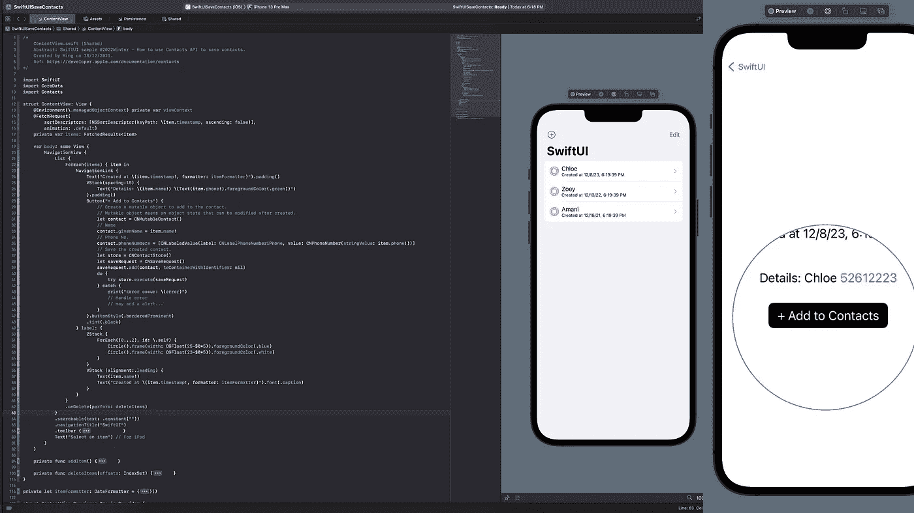
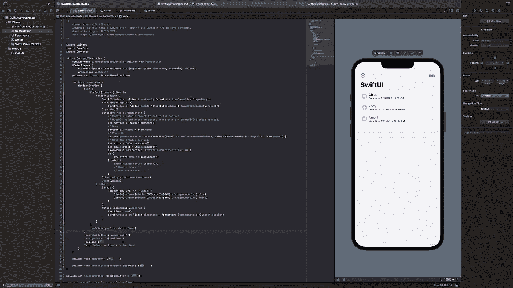
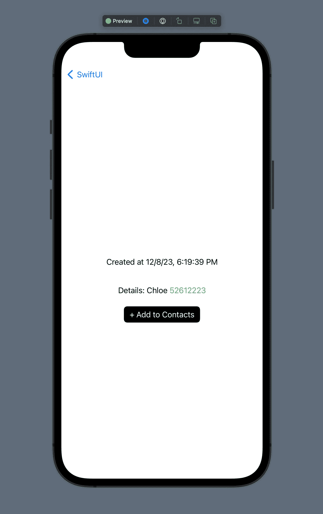
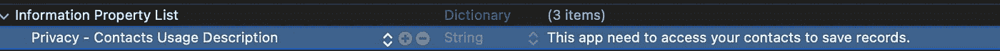
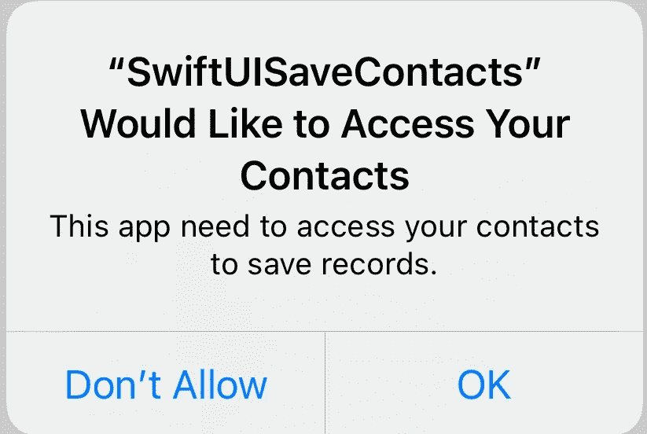
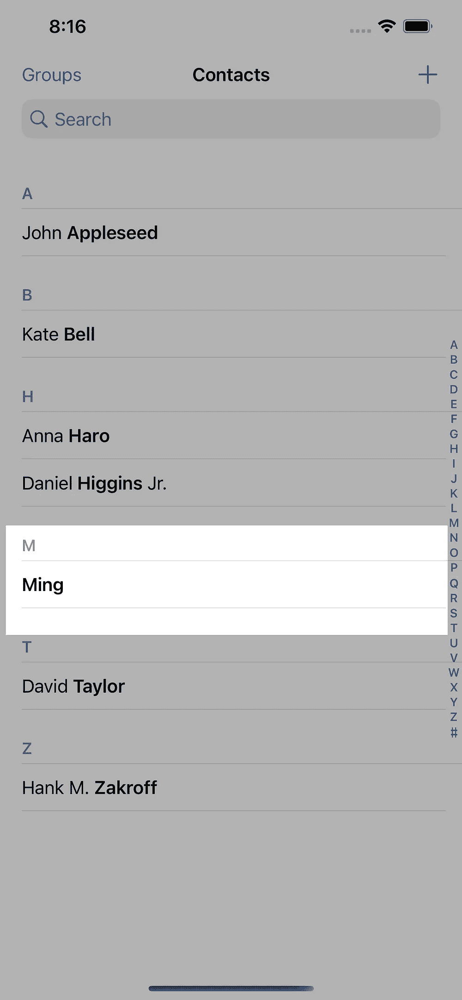
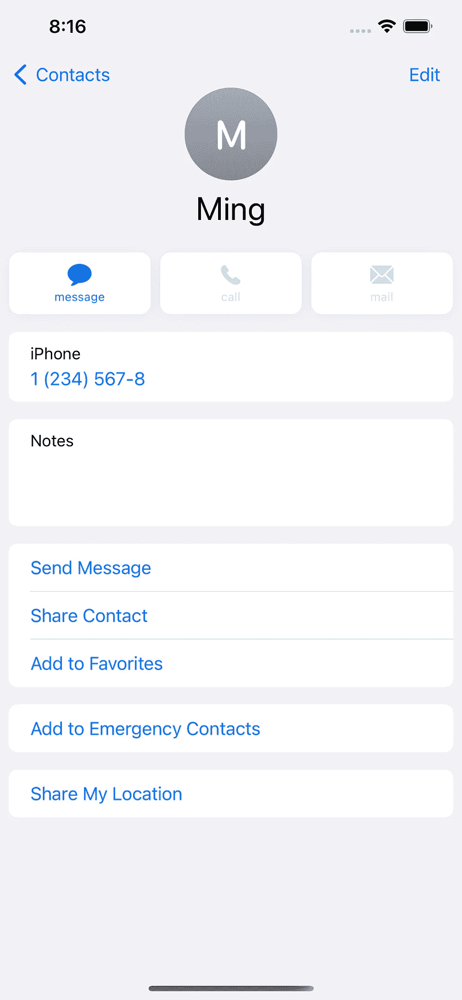

# 如何:在 SwiftUI 上保存联系人

> 原文：<https://levelup.gitconnected.com/how-to-save-contacts-on-swiftui-80ab70eb4da0>

## 将姓名、电话号码、地址等保存到 SwiftUI 上的 Apple Contacts 应用程序的简单教程。

Xcode 13

想使用 SwiftUI 保存联系人吗？这是给你的一个快速演示。

# 开始

## 环境

*   macOS 12.2
*   Xcode 13.2.1 (13C100)
*   SwiftUI + CoreData(可选)+ CloudKit(可选)
*   iOS 15.2

# 步伐

1.  `import Contacts`
2.  创建一个*可变对象*添加到联系人。
    *可变对象*是指创建后可以修改的对象状态。
3.  `let contact = CNMutableContact()`
4.  您可以添加不同的联系人信息，如姓名、地址、电话号码、生日等。
5.  例如，我们添加姓名和电话号码:
    `contact.givenName = "Ming"
    contact.phoneNumbers = [CNLabeledValue(label: CNLabelPhoneNumberiPhone, value: CNPhoneNumber(stringValue: "12345678"))]` *期望生日(DateComponents)，所有条目都应该是**字符串**。
6.  现在，我们保存创建的联系人。
    
7.  最后，我们将上面的代码放入一个按钮中。
    样本:

现在，打开一个模拟器或你的 iPhone，看看点击黑色按钮会发生什么。

哦不！应用程序崩溃…
让我们看看控制台中的错误日志。

从错误日志中，我们可以看到`Contacts Usage Privacy Description` 被遗漏了。所以，我们需要添加下面的`description` inside info.plist。

再次运行应用程序。
如果一切正确，点击黑色按钮后会弹出该警告框。

点击 **OK** 完成！最后，打开联系人应用程序，您会看到添加了一个新的联系人。

# 感谢阅读！👏

# **有困难或错误？别担心！今天 Github 上的所有源代码都是开源的👨‍💻**

 [## GitHub-1998 code/swiftuisavecontents:带有保存联系人 API 的 SwiftUI 3

github.com](https://github.com/1998code/SwiftUISaveContacts) 

# 参考

 [## Apple 开发者文档

developer.apple.com](https://developer.apple.com/documentation/contacts)