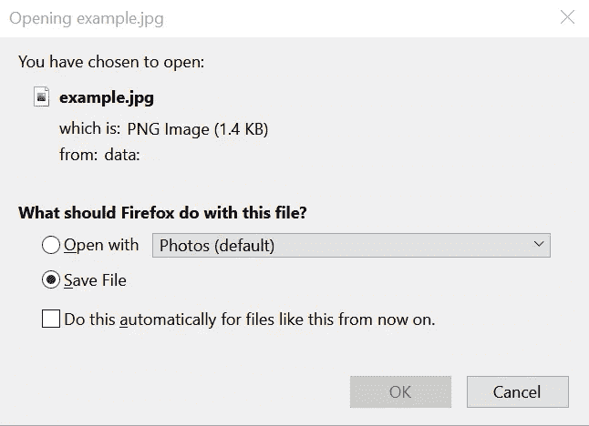

# 如何将 HTML5 画布绘图保存为图像

> 原文：<https://levelup.gitconnected.com/how-to-save-html5-canvas-drawing-as-animage-ca8047a9acf7>

## 通过超链接将其保存在本地或作为 blob 文件发送到远程服务器


照片由 [Hyeonji Im](https://unsplash.com/@hyeonji_ya?utm_source=unsplash&utm_medium=referral&utm_content=creditCopyText) 在 [Unsplash](https://unsplash.com/s/photos/canvas?utm_source=unsplash&utm_medium=referral&utm_content=creditCopyText) 上拍摄

通过阅读这篇文章，您将学会将 web 应用程序的 HTML5 canvas 元素上的绘图保存为图像。在本教程中，我将展示两种方法来保存它。

第一种方法是将图像数据存储在超链接中(使用`<a>`标签)。然后，您可以通过手动单击从浏览器中手动下载它，或者使用 JavaScript 以编程方式触发它。如果您打算让用户在他们的机器上下载它，或者只是想从画布上保存一些图像，这个选项是很好的。

至于第二种方法，我将把画布转换成 blob 数据，并通过`FormData`发送到远程服务器。之后，您可以轻松地将其保存在您的服务器上。如果您打算不时地收集数据或保存大量图像，这种方法是首选。

让我们进入下一部分，开始在您的应用程序中实现它

# 帆布

如果您已经有了一个现有的画布，请随意跳到下一节的超链接实现。

我们现在要架设画布。确保您已经在 HTML 文件中声明了 canvas 元素。

```
<canvas id="output" />
```

在`script`标签或外部 JavaScript 文件中添加以下代码。它会在画布上画一个简单的圆。

```
let canvas = document.getElementById("output");
let ctx = canvas.getContext("2d");
ctx.beginPath();
ctx.arc(95,50,40,0,2*Math.PI);
ctx.stroke();
```

# 超链接

## 手动点击下载

在 HTML 文件中添加超链接元素。超链接元素由`<a>`标签表示。您需要指定允许用户下载`href`文件并点击超链接的`download`属性。将`href`属性留空，因为我们稍后将在 JavaScript 中填充它。

```
<a download="example.jpg" href="" onclick="downloadCanvas(this);">Download example.jpg</a>
```

将`onclick`事件分配给一个名为`downloadCanvas`的函数，该函数的实现如下:

```
async function downloadCanvas(el) {
  const imageURI = canvas.toDataURL("image/jpg");
  el.href = imageURI;
};
```

您可以使用`toDataURL`功能将画布中的图形转换为`dataURL`，您可以通过超链接下载该图形。当你点击超链接，它应该提示打开文件对话框。



作者图片

## 以编程方式点击下载

事实上，您可以使用 JavaScript 以编程方式触发`click`事件。一个主要的优点是你可以控制和设置文件名。让我们用`id`属性声明另一个超链接元素。

```
<a id="link"></a>
```

创建一个新函数，并在其中添加以下代码。我们将利用`setAttribute`方法为超链接添加各自的属性。

```
async function autoDownloadCanvas() {
  let link = document.getElementById('link'); link.setAttribute('download', 'example.png');
  link.setAttribute('href', canvas.toDataURL("image/png"));
  link.click();
}
```

# 表单数据到远程服务器

在本节中，我们将把画布转换成 Blob 数据，并将其作为 FormData 发送到远程服务器。

## Blob 对象

创建一个新的异步函数，并添加以下代码。`canvas`元素自带`toBlob`函数，该函数创建一个 Blob 对象来保存画布中的图像数据。

```
let imageBlob = await new Promise(resolve => canvas.toBlob(resolve, 'image/png'));
```

`toBlob`功能接受以下输入参数。

*   `callback` —返回 Blob 对象的回调函数。
*   `mimeType` —图像的格式。默认值为 image/png。
*   `qualityArgument` —介于 0 和 1 之间的数字。代表图像质量。

## 表单数据

接下来，创建一个新的`FormData`并将 Blob 对象传递给`append`函数。`append`方法接受以下参数:

*   `name` —输入的名称属性
*   `value` —输入值。接受字符串或 Blob 对象。
*   `filename` —代表文件名称的可选参数。

```
let formData = new FormData();
formData.append("image", imageBlob, "image.png");
```

上面的代码片段类似于用户向包含`<input type="file" name="image">`的表单提交一个名为`image.png`的文件。

## 取得

完成后，继续添加下面的代码片段，该代码片段对远程服务器进行外部调用。在本教程中，我将使用获取 API。您也可以根据自己的喜好使用`XMLHttpRequest`或`jQuery’s AJAX`来实现。确保您有一个接受文件输入的现有服务器。记住替换指向你的服务器的 URL。

```
let response = await fetch('[http://localhost:8000/image'](http://localhost:8000/image'), {
  method: 'POST',
  body: formData
});
let result = await response.json();
```

看看下面的[要点](https://gist.github.com/wfng92/9d5fdacbcdaffa956010d177a4898591)以获得提交一个`FormData`到你的远程服务器的完整代码。

现在，您可以在 JavaScript 文件的任何地方调用`submitToServer`函数，将画布作为图像文件发送到您的服务器。

# 结论

让我们回顾一下今天所学的内容。

我们从创建一个简单的 canvas 元素开始，并将其分配给应用程序中的一个变量。

然后，我们实现了一个简单的特性，允许用户在点击超链接时以`dataURL`的身份下载画布。此外，我们还创建了该函数的修改版本，可以通过 JavaScript 以编程方式触发。

最后，我们编写了一个简单的函数，将图画转换成一个`Blob`对象，并通过`FormData`发送到远程服务器。

感谢您阅读这篇文章！希望在下一篇文章中再见到你！

# 参考

1.  [JavaScript 表单数据](https://javascript.info/formdata)