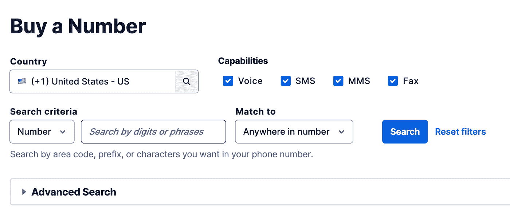

# 如何用 PHP 和 Twilio 消息传递 API 安排 SMS 营销消息

> 原文：<https://levelup.gitconnected.com/how-to-schedule-an-sms-marketing-message-with-php-and-the-twilio-messaging-api-d2652ee9a644>

肖恩·林在 [Unsplash](https://unsplash.com/s/photos/programming?utm_source=unsplash&utm_medium=referral&utm_content=creditCopyText) 上的照片

随着世界变得越来越数字化，智能手机开始在我们的日常生活中扮演越来越重要的角色。这些袖珍设备帮助我们更有效地工作，与来自世界任何地方的任何人交往，并允许我们访问无限的信息。如果所有这些活动变得相当激烈，我们可以通过一些购物疗法来放松，这又要感谢我们的智能手机。难怪我们会上瘾。

一个普通人每天查看他们的智能手机 [**160 次**](https://smallbiztrends.com/2020/03/2020-mobile-phone-usage-statistics.html) ，34%的人在收到短信的 [**5 分钟**](https://99firms.com/blog/sms-marketing-stats/#gref) 内阅读短信，平均回复率为 45% ，很明显，智能手机对于任何一个坚定的数字营销者来说都是有价值的不动产。当然，社交媒体和电子邮件营销可能会产生所有的嗡嗡声，但对于任何认真想把竞争对手甩在身后的品牌来说，短信是一个不可忽视的渠道。

短信营销非常有效，因为它以一种更加个性化的方式提供了与客户或潜在客户的直接接触。出于这个原因，它非常适合那些你想推动节日促销，发送秘密销售警报，甚至只是偶尔的生日问候的场景。通过在短信中加入你的产品或业务链接，你可以大幅提升你的参与度，因为短信的打开率要优于电子邮件。

目前，电子邮件的 [**使用率为 98%**](https://neilpatel.com/blog/sms-marketing/)**仅为 20%，手机短信可能是信息过载的**数字营销世界中最有保障的阅读方式。然而，似乎许多公司宁愿使用 [**莫尔斯电码**](https://www.forbes.com/sites/marketshare/2013/03/04/pulling-back-the-curtain-on-text-message-mobile-marketing/) 进行广告宣传，也不愿接近短信营销。如果你是短信害羞的营销人员，不要担心，因为有希望。恰好在 2022 年 1 月 12 日，Twilio 发布了一个 [**消息调度功能**](https://support.twilio.com/hc/en-us/articles/4406956913307-Can-I-schedule-Twilio-messages-to-be-sent-at-a-future-time-or-date-) ，我们将利用它来执行一次短信营销活动。****

****在本教程中，您将学习如何使用 PHP 和 Twilio Messaging API 发送预定的 SMS 营销消息。****

# ****教程要求****

*   ****PHP 7.4。最好是版本 8 或更高版本****
*   ****[全球安装的作曲家](https://getcomposer.org/)****
*   ****Twilio 账户:如果你是 Twilio [的新手，点击这里创建一个免费账户](http://www.twilio.com/referral/QlBtVJ)。****
*   ****接收短信的智能手机****

# ****开立一个 Twilio 帐户并获得一个电话号码****

****如果你是 Twilio 新手，那么首先要做的就是免费注册**并购买一个电话号码。Twilio 向所有新用户提供 10 美元的信用，您可以将这些信用用于该项目。******

******注册后，您需要选择您的 Twilio 电话号码，为此，请登录您的 [**控制台**](https://console.twilio.com/?frameUrl=%2Fconsole%3Fx-target-region%3Dus1) 并点击“探索产品”。******

********

****然后滚动到页面底部，在“超级网络”下，点击“电话号码”。然后点击“购买号码”选项，在此页面上，您可以继续选择您的号码。尽管您可以选择特定于您所在国家的号码，但请注意，并非所有国家都具备语音、短信、彩信和传真的全部功能。我在伦敦，Twilio 的英国号码没有彩信功能，所以我将选择美国号码。这是因为我想要一个数字，让我可以灵活地创造我想要的任何东西。****

********

****现在点击搜索按钮查看可用号码列表。如果您不喜欢呈现给您的第一个列表，请单击页面底部的“刷新结果”按钮，获得一个全新的列表。单击您要购买的号码旁边的“购买”按钮。****

# ****消息服务设置****

****接下来，您需要设置消息服务。再次点击“探索产品”,这次选择“信息”选项。点击服务，然后点击“创建信息服务”按钮。****

********

****在本教程中，我将通知我的用户一个情人节促销，所以我将在“消息服务友好名称”文本字段中键入“情人节促销”。你可以选择任何你想要的名字。然后在下拉列表中选择“选择您希望使用消息的目的”，点击“通知我的用户”选项。****

********

****完成后，单击“创建消息服务”按钮，这样您就可以进入此设置的第二步。接下来，您需要添加发件人。发送者代表可以使用 Twilio 消息传递 API 发送和接收消息的通道、号码类型或消息传递类型。您将在这里添加您刚刚购买的 Twilio 号码，因此请单击“添加发件人”按钮开始添加。选择“电话号码”选项，然后点击继续。****

********

****单击您要添加的号码旁边的复选框，然后单击“添加电话号码”按钮。****

********

****现在，单击“步骤 3:设置集成”按钮。您不需要更新此页面上的任何信息，因此请点击“第 4 步:添加合规信息”按钮。同样，此页面不需要进行任何更改，因此请单击“完成消息服务设置”按钮。****

********

****现在让我们通过点击“尝试发送消息”按钮来测试它是否工作。****

********

****在“至电话号码”文本字段中，添加您的[验证过的](https://support.twilio.com/hc/en-us/articles/223180048-Adding-a-Verified-Phone-Number-or-Caller-ID-with-Twilio)个人电话号码。在“来自消息服务 SID”中，选择您新创建的消息服务。对于“正文”字段，我添加了情人节 [**号召行动**](https://www.crazyegg.com/blog/call-to-action-examples/) 消息，但是你可以写任何你想写的。点击“发送测试短信”按钮，然后确认您的手机已收到该消息。****

********

****祝贺您成功设置了新的消息服务。现在是时候写一些 PHP 代码了，这样我们就可以安排我们的短信营销信息。****

# ****让我们创建 PHP 项目****

****首先，您需要创建一个项目目录，然后切换到该目录并安装 Twilio PHP 助手库。要做到这一切，请在终端中键入以下内容。****

****为了能够使用 Twilio 发送 SMS 消息，您的 PHP 应用程序需要访问您的帐户凭证，为此，您需要将以下代码行复制并粘贴到终端。****

****接下来，我们将创建一个名为“sms-scheduler.php”的文件来存放所有的代码，用于安排我们将发送给用户的 sms 营销消息。为此，请在项目的根目录中运行以下代码。****

****我们现在需要编写代码来安排 SMS 营销消息。****

# ****让我们写一些代码****

****打开 sms-scheduler.php 文件，然后将以下代码复制并粘贴到其中。****

****代码首先需要您需要的所有依赖项。然后一个新的 Twilio 对象用你的 Twilio 账户 SID 和令牌值初始化。然后，首先添加您的 Twilio 验证个人号码，创建一条短信发送给您的用户。接下来，您需要包含您之前创建的“消息服务 ID”。你可以进入你的控制台，点击“信息”下的“服务”来找到它****

****“正文”字段包含您想要发送的实际消息。“send_at”设置要发送的文本消息的确切日期和时间。目前，该功能仅允许提前 1 小时到 7 天安排消息。“scheduleType”描述了要设置的调度类型。同样，该功能目前仅允许“固定”选项最后，代码以一个命令结束，该命令打印出您在开始时用来初始化 Twilio 对象的“$sid”号。****

# ****我们去试驾吧****

****为了测试代码是否有效，通过在项目的根目录下运行下面的命令，使用 PHP 的内置服务器启动应用程序。****

****接下来，打开您的浏览器到 [http://0.0.0.0:8080](http://0.0.0.0:8080) ，假设一切顺利，您应该看到您的帐户“$id”打印在屏幕上。你需要等一个小时才能收到短信。****

********

****祝贺您完成本教程！****

****现在，您已经拥有了以编程方式安排 SMS 营销活动所需的所有工具和知识。****