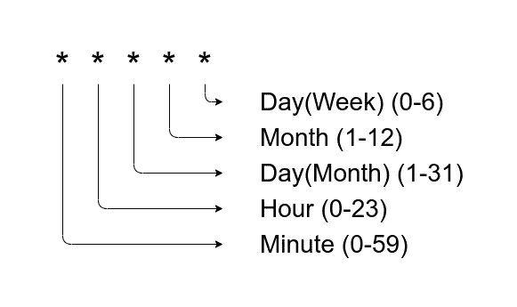

# 如何在 Node.js 中调度 Cron 作业和实现健康检查

> 原文：<https://levelup.gitconnected.com/how-to-schedule-cron-jobs-and-set-health-checks-in-node-js-93cf88d2c247>

使用 Node.js 中的 Cron 作业自动化您的任务


在 [Unsplash](https://unsplash.com?utm_source=medium&utm_medium=referral) 上由 [Fabrice Villard](https://unsplash.com/@fabulu75?utm_source=medium&utm_medium=referral) 拍摄的照片

# 1.介绍

Cron 作业是为了让我们的生活更轻松，并在特定时间将我们从运行任务中分离出来。

# 让我们开始吧

支持 Cron 作业的 Node.js 库是 **cron** 和 **node-cron。**

[**节点 Cron**](https://www.npmjs.com/package/node-cron)

1.  不如**克朗**受欢迎
2.  简单用法
3.  更少的选择
4.  无法控制 cron 作业进程

[**Cron**](https://www.npmjs.com/package/cron)

1.  比 **node-cron** 更受欢迎
2.  有更多用于计划任务的增强选项
3.  对 cron 作业过程有更好的控制

在这个故事中，我们将使用 **cron** 模块。

# Cron 模式

**Cron 作业**用 **Cron 模式**调度任务，这些模式的格式如(* * 1 * *)。

别害怕，这不是火箭科学，你两分钟就能学会。



允许操作员使用 **Cron 模式**:

1.  ***** 任意值
2.  **、**列表值 ex。(0 22,23 * * *)
3.  **-** 范围值 ex。(0 2–23 * * *)
4.  **/** 步长值 ex。( 0 0/2 * * *)

# Cron 模式示例

1.  每天每小时在第 5 分钟运行一个 Cron 作业:(5 * * * *)例如(00:05，01:05，…)
2.  每天 22:00 运行 Cron 作业:(0 22 * * *)
3.  每天 01:00，02:00，03:00 运行 Cron 作业:(01，2，3 * * *)
4.  在周一至周五的 22:00 运行 Cron 作业:(0 22 * * 1–5)

# 2.基本用法

首先，创建一个新目录:

```
mkdir cronJobs
cd cronJobs
```

使用默认设置创建 package.json 文件:

```
npm init -y
```

安装 **cron** 模块:

```
npm i cron
```

创建一个新文件 index.js 并粘贴以下代码:

```
var CronJob = require('cron').CronJob;// New CronJob run a task every 5 seconds
var job = new CronJob('*/5 * * * * *',task);// task to execute from cron job
function task(){
console.log('My First Cron Job task run at: '+new Date());
}// start the cron 
jobjob.start();
```

运行您的第一个 cron 作业:

```
node index.js
//Console Output
My First Cron Job task at: Wed Apr 29 2020 19:38:00 GMT+0300 (Eastern European Summer Time)
My First Cron Job task at: Wed Apr 29 2020 19:38:05 GMT+0300 (Eastern European Summer Time)
My First Cron Job task at: Wed Apr 29 2020 19:38:10 GMT+0300 (Eastern European Summer Time)
...
...
...
...
```

# 3.添加健康检查

假设您有一个 cron 作业正在运行，每天上午 10:00 备份一个数据库。数据库备份至关重要，我们必须确保任务已成功结束。出于这个原因，我们必须在 cron 作业中添加健康检查。

> ***Cron 作业失败会带来灾难性的后果！***

实施简单的健康检查

1.  我们将添加一个 **onComplete** 方法，该方法将在任务完成后执行。
2.  我们将设置一个每 10 秒调用一次的函数来检查**最后一次任务执行、cron 作业状态(运行或不运行)以及下一次预定执行**。

用以下代码替换 index.js 文件

```
var CronJob = require("cron").CronJob;
// New CronJob run a task every 5 seconds
var job = new CronJob("*/5 * * * * *", task,onComplete);
// task to execute from cron job
function task() {
console.log("My First Cron Job task run at: " + new Date());
console.log("Next task at: " + job.nextDates(1));
// call onComplete method
this.onComplete();
}function onComplete() {
console.log("Task completed");
}// start the cron jobjob.start();
// Add a health check every 10sec
setInterval(function () {
console.log("-- health check -- Last Execution" ,job.lastDate().toUTCString());
console.log("-- health check -- Is job running? ", job.running);
console.log("-- health check -- Next task at: " + job.nextDates(1));
}, 10*1000);
```

运行您的 cron 作业:

```
node index.js
//Console Output
My First Cron Job task run at: Wed Apr 29 2020 20:52:45 GMT+0300 (Eastern European Summer Time)
Next task at: Wed Apr 29 2020 20:52:50 GMT+0300
Task completed
My First Cron Job task run at: Wed Apr 29 2020 20:52:50 GMT+0300 (Eastern European Summer Time)
Next task at: Wed Apr 29 2020 20:52:55 GMT+0300
Task completed
-- health check -- Last Execution  Wed, 29 Apr 2020 17:52:50 GMT
-- health check -- Is job running?  true
-- health check -- Next task at: Wed Apr 29 2020 20:52:55 GMT+0300
```

# 参考

1.  [Node-Cron](https://www.npmjs.com/package/node-cron)
2.  [克朗](https://www.npmjs.com/package/cron)
3.  [crontab.guru](https://crontab.guru/)

# 您可能还喜欢:

[](https://medium.com/swlh/run-python-script-from-node-js-and-send-data-to-browser-15677fcf199f) [## 从 Node.js 运行 Python 脚本。

### 在本文中，我将介绍一个示例应用程序，它可以从 Node.js 运行 python 脚本，从脚本中获取数据…

medium.com](https://medium.com/swlh/run-python-script-from-node-js-and-send-data-to-browser-15677fcf199f) [](https://medium.com/javascript-in-plain-english/learn-to-use-regular-expressions-like-a-ninja-in-node-js-20cfb6806f26) [## Node.js 中的正则表达式备忘单

### 轻松学习、编写和执行正则表达式的详细故事。

medium.com](https://medium.com/javascript-in-plain-english/learn-to-use-regular-expressions-like-a-ninja-in-node-js-20cfb6806f26) [](https://medium.com/javascript-in-plain-english/store-clean-data-by-validating-models-with-mongoose-f6453dbdbff9) [## Node.js 中使用 Mongoose 进行数据验证

### 如何在用 mongoose 库将数据保存到 MongoDB 之前对其进行验证？

medium.com](https://medium.com/javascript-in-plain-english/store-clean-data-by-validating-models-with-mongoose-f6453dbdbff9)