# 如何在不编码的情况下抓取亚马逊产品数据

> 原文：<https://levelup.gitconnected.com/how-to-scrape-amazon-product-data-without-coding-4e484da2d6be>

## 用 Octoparse 避免所有的亚马逊抓取限制政策

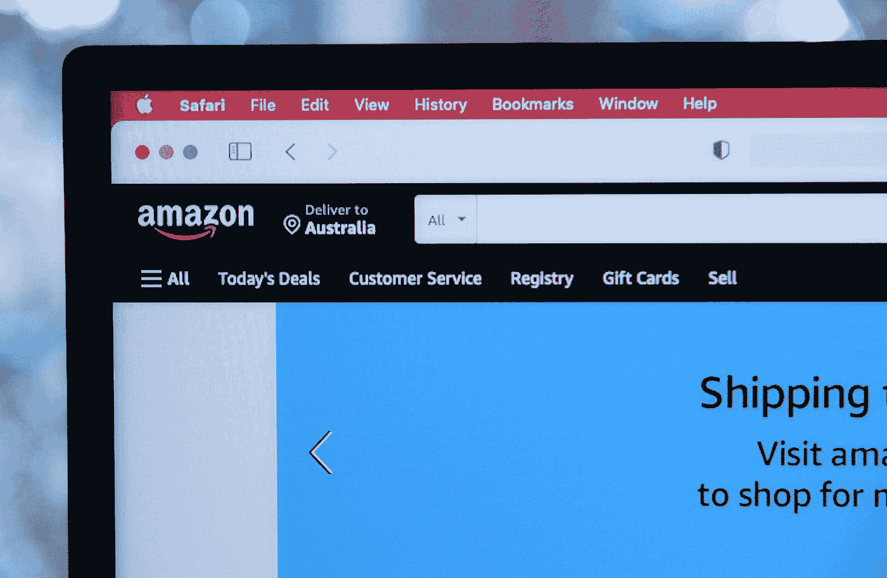

在 [Unsplash](https://unsplash.com?utm_source=medium&utm_medium=referral) 上由[Marques Thomas @ querysprout . com](https://unsplash.com/@querysprout?utm_source=medium&utm_medium=referral)拍摄的照片

Web 抓取允许您从 web 上检索任何公开可用的数据。但是每个网页都有独特的布局并存储不同的数据。因此，以编程方式从网页中提取数据涉及到自定义逻辑。

可以想象，构建这样的脚本会耗费您的时间和金钱。幸运的是，最近已经开发了几种抓取服务，它们使你不用写一行代码就能抓取网页。这也意味着任何人都可以使用它们，甚至是非技术用户！

在这里，您将学习如何使用 Octoparse 从亚马逊产品数据中提取数据，octo parse 是一种无代码、易于使用、功能齐全的抓取服务。让我们来学习你需要知道的关于亚马逊产品抓取的一切！

# 从亚马逊搜集什么数据

一个亚马逊产品由几个数据组成，但最重要的是:

*   产品名称
*   价格
*   折扣(如果有)
*   产品说明
*   与产品相关的功能列表(如果有)
*   等级
*   产品图片

所有这些信息都是你在搜索亚马逊产品时应该关注的。另一方面，您可能希望根据您的目标检索不同的数据。

现在，让我们来理解为什么你需要一个先进的工具来从亚马逊抓取数据。

# 为什么你需要一个先进的工具来拯救亚马逊

亚马逊已经实现了几种方法来避免网络抓取。与抓取亚马逊相关的最大挑战是:

*   你的知识产权可能会被禁止
*   每个亚马逊产品页面都可以有一个自定义布局
*   每个产品可以有不同的数据
*   亚马逊产品页面变化很快

因此，编写一个允许所有这些挑战的抓取脚本将花费您大量的时间、金钱和精力。这就是为什么你应该考虑采用一种先进的刮擦工具，可以处理所有这些问题。

现在，让我们深入研究 Octoparse，这是一个用来收集亚马逊产品数据的工具。

# 什么是 Octoparse？

> “Octoparse 是一款极其强大的数据提取工具，优化并推动了我们的数据抓取工作更上一层楼”*——*[*Octoparse 官网*](https://www.octoparse.com/?levelup=2022)

Octoparse 是一个先进的[网站爬虫](https://en.wikipedia.org/wiki/Web_crawler)，它使你能够从网络上提取任何你需要的数据。它有几个功能，包括[自动检测](https://www.octoparse.com/blog/extract-data-with-auto-detection/?levelup=2022)、[任务模板](https://service.octoparse.com/webscrapingtemplates/?levelup=2022)、[高级模式](https://helpcenter.octoparse.com/hc/en-us/articles/900003268086-Advanced-Mode-Build-your-own-crawler-using-point-and-click-Version-8-/?levelup=2022)、[分页和无限滚动](https://helpcenter.octoparse.com/hc/en-us/articles/4406988884249-Scrolling-within-a-designated-area-of-a-web-page/?levelup=2022)处理、[数据格式转换器](https://www.octoparse.com/tutorial/re-format-captured-data-add-prefix-replace-text-etc-in-octoparse/?levelup=2022)等等。

请记住，Octoparse 基于一个易于使用、直观的点击式界面，旨在指导您完成整个数据提取过程。因此，不涉及任何代码。但是您也可以使用 [Octoparse API 程序](https://www.octoparse.com/tutorial/advanced-api/?levelup=2022)以编程方式运行抓取任务。

Octoparse 还为您提供了[预定的云提取功能](https://www.octoparse.com/blog/extracting-dynamic-data-with-octoparse/?levelup=2022)，通过云实时提取动态数据。然后，它附带了一个 API 程序，我将很快向您展示如何使用。此外，该工具在浏览网页时再现人类活动，以避免在抓取时被检测到。但如果发生这种情况，它提供 IP 代理服务器和用户代理字符串旋转。

所以，它给了你所需要的一切，以避免亚马逊的反刮擦政策！

# 用 Octoparse 抓取亚马逊产品数据

按照这个循序渐进的教程，学习如何用 Octoparse 抓取亚马逊产品数据。

## 1.Octoparse 入门

首先，你需要一个 Octoparse 账户。还有，你得安装 Octoparse。

从这里下载 Octoparse 8.x:

```
[https://www.octoparse.com/download](https://www.octoparse.com/?levelup2022=)
```

然后，按照以下步骤操作:

1.  运行“八解析设置 X . y . z*”*文件(如“八解析设置 8.5.2”)
2.  遵循安装说明
3.  用你的 Octoparse 帐户登录，或者如果你还没有帐户，在这里注册。

注意，注册是免费的。但是如果你想获得所有 Octoparse 特性的完全访问权限，就需要一个标准计划。点击了解 Octoparse [提供的更多计划。](https://www.octoparse.com/pricing/?levelup=2022)

如果你正在考虑在你的业务中采用 Octoparse，[octo parse 2022 夏季销售正在等着你](https://www.octoparse.com/summer-sale-2022/?utm_source=levelupcoding&utm_medium=antonello&utm_campaign=22summersale)。从 6 月 15 日开始，您将有机会以较大的折扣订阅 Octoparse！利用这一点！

[](https://www.octoparse.com/summer-sale-2022/?utm_source=levelupcoding&utm_medium=antonello&utm_campaign=22summersale) [## Octoparse 夏季促销|节省 30%以上的免费爬虫和培训费用

### 准备好八分夏季销售了吗？在最受欢迎的数据收集套餐上节省高达 30%的费用。另外，定制……

www.octoparse.com](https://www.octoparse.com/summer-sale-2022/?utm_source=levelupcoding&utm_medium=antonello&utm_campaign=22summersale) 

现在，您已经具备了开始使用 Octoparse 的能力所需的一切。

## 2.确定要抓取的亚马逊产品

是时候选择你要刮的亚马逊产品了。在本教程中，您将看到如何抓取 2020 年苹果 MacBook Air 笔记本电脑的产品数据。

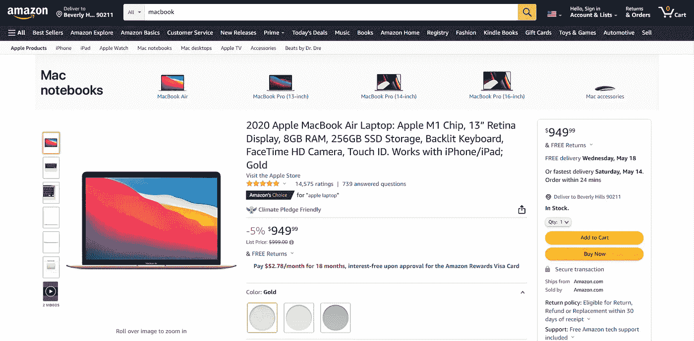

这是亚马逊产品链接的样子:

```
[https://www.amazon.com/Apple-MacBook-13-inch-256GB-Storage/dp/B08N5KWB9H/ref=sr_1_3?keywords=macbook%2Bair&qid=1652428198&sr=8-3&th=1](https://www.amazon.com/Apple-MacBook-13-inch-256GB-Storage/dp/B08N5KWB9H/ref=sr_1_3?keywords=macbook%2Bair&qid=1652428198&sr=8-3&th=1)
```

把它放在手边，因为下一步你会用到它。

## 3.用 Octoparse 只需点击几下鼠标就能抓取亚马逊产品数据

启动 Octoparse，经过之前在地址栏中检索到的亚马逊产品链接，然后按“开始”。

这是你现在应该看到的:

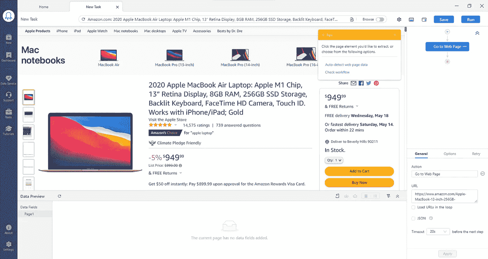

现在，点击您想要检索的页面元素，然后从*提示*面板中选择“提取元素文本”选项。这样，您就可以开始从亚马逊产品页面收集数据了。

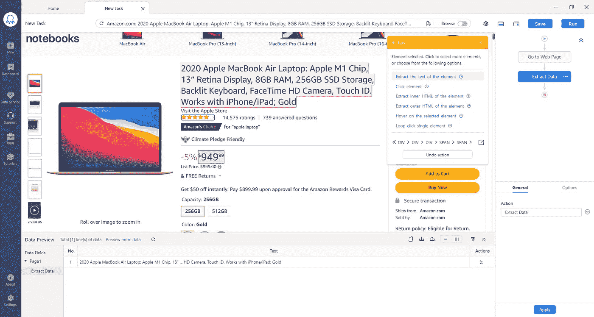

如果您还想检索产品图片，点击包含图片的页面元素，点击*提示*面板中的“>”，并选择“IMG”。

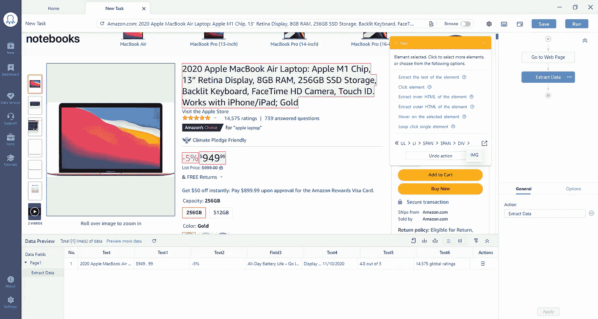

这样，您只是告诉 Octopare 考虑 img HTML 元素。现在，单击“提取所选图像的 URL”来检索图像 URL。

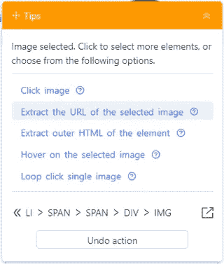

您可以按照这种方法来检索每个产品图像。

继续选择您想要抓取的元素，并检索您需要的所有亚马逊产品数据。此外，请记住重命名数据字段，以使它们更容易理解，如下所示:

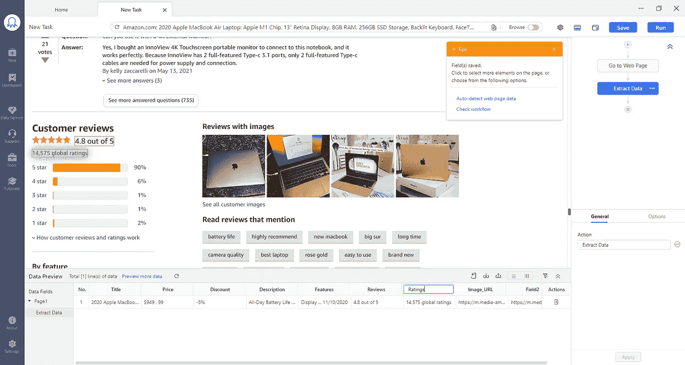

现在，请记住，抓取的数据可能包含不需要的字符，或者可能不是所需的格式。幸运的是，Octoparse 允许您清理数据并将其转换成您想要的格式。让我们看看怎么做。

考虑价格数据。这是它最初的样子:

```
$949
.
99
```

“.”之间的两个换行符字符应该被删除。为此，单击价格数据字段，然后“…”，并选择“清除数据”。

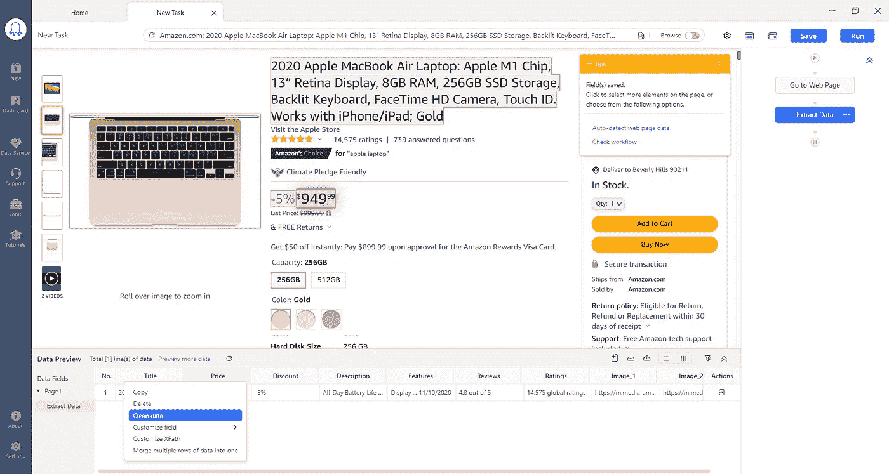

现在，点击“+添加步骤”，并选择“替换为正则表达式”选项。

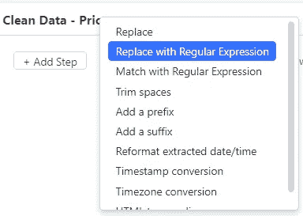

按如下方式定义正则表达式:

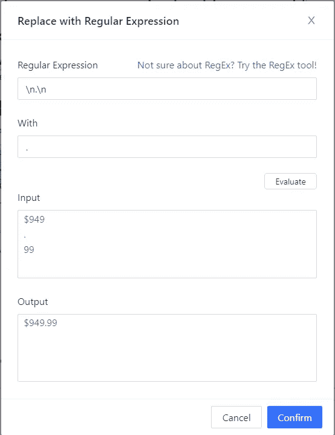

点击“确认”，然后点击“应用”，您的“价格”数据现在应该是这样的:

```
$949.99
```

清理你的所有数据，当你准备好的时候，保存你的八元解析任务。然后，点击右上角的“运行”。Octoparse 会问你是想在本地运行任务还是在云端运行[。](https://www.octoparse.com/tutorial/octoparse-cloud-service/?levelup=2022)

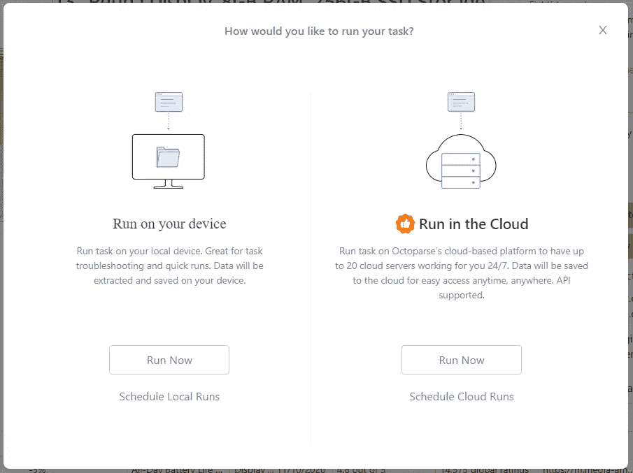

在这种情况下，本地运行就足够了。

等待任务执行完成:

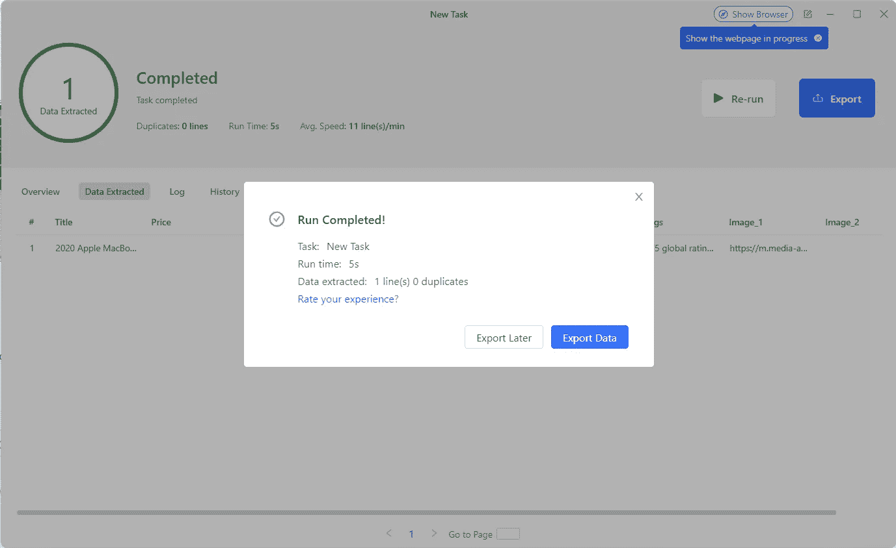

然后，单击“导出数据”，并在下面的弹出窗口中选择数据导出格式:

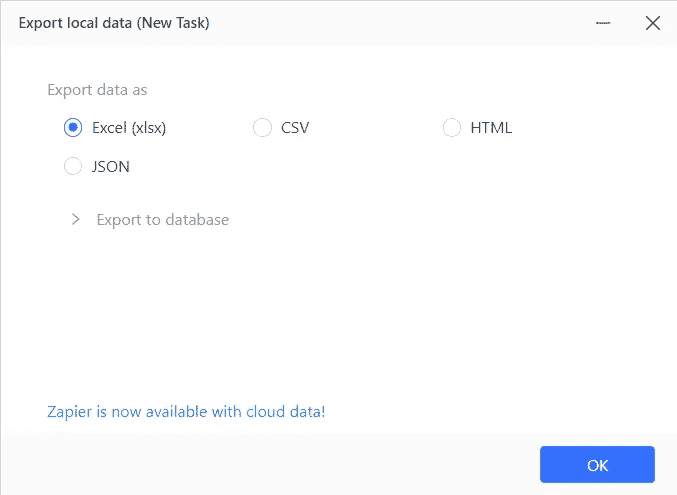

这是一个可以从 Octoparse 获得的输出 JSON 的例子:

如您所见，它包含了在 Octoparse 中选择的所有 Amazon 产品数据，并且是可读格式的！

瞧，你刚刚从一个亚马逊产品中抓取了数据，却没有一行代码。

# 结论

在本文中，您了解了应该从 Amazon 产品页面获取哪些数据，为什么，您将不得不面对哪些挑战，以及如何使用 Octoparse 来完成这些工作。这是一个强大的数据提取工具，允许您通过其点击式界面创建一个抓取任务，而无需一行代码。此外，Octoparse 非常先进，它本身就为你提供了避开亚马逊反抓取政策的功能。

感谢阅读！我希望这篇文章对你有所帮助。如果有任何问题、意见或建议，请随时联系我。