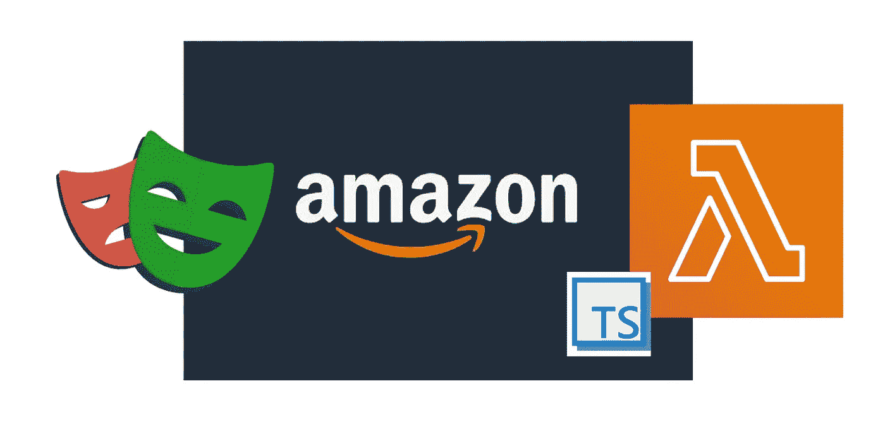
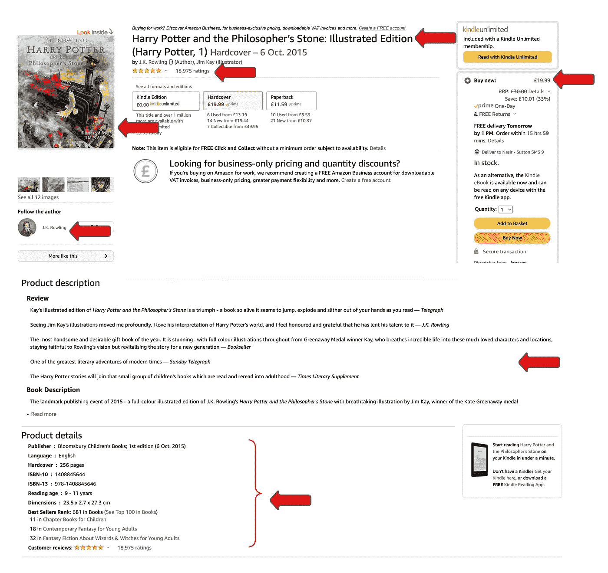

# 如何使用剧作家和 lambda 抓取亚马逊产品

> 原文：<https://levelup.gitconnected.com/how-to-scrape-amazon-product-using-playwright-and-lambda-a2de6adf4869>

在这篇文章中，我将介绍如何使用微软的[剧作家](https://playwright.dev/)(【https://playwright.dev/】)搜集亚马逊产品页面数据。

我的一个客户是亚马逊上的一个供应商，在那里销售 1000 多种产品。我用 cheerioJS 写了一个脚本，提取相关数据并生成警报，运行得很好。但是，最近我看到一篇关于 E2E 使用剧作家进行测试的文章，我立刻想尝试一下 scraping。

**什么是剧作家？**

> 剧作家是一个 Web 测试和自动化的框架。它允许用一个 API 测试 [Chromium](https://www.chromium.org/Home) 、 [Firefox](https://www.mozilla.org/en-US/firefox/new/) 和 [WebKit](https://webkit.org/) 。剧作家是为了实现跨浏览器的 web 自动化而构建的，它永远是绿色的、强大的、可靠的和快速的。
> 
> 所有平台上的所有浏览器都支持无头执行
> 
> 来源:[https://github.com/microsoft/playwright](https://github.com/microsoft/playwright)

**我们要刮什么？**

亚马逊的一个产品页面包含了大量的信息，但是在这篇文章中，我将主要关注这些信息

*   标题
*   描述
*   价格
*   作者姓名
*   评级计数
*   图像 URL
*   产品详细信息(出版商、语言、精装书、ISBN-10、ISBN-13、评级年龄和尺寸)
*   在不同类别中的排名
*   产品页面的全长截图

所有这些都将被提取成 JSON 格式，截图将被上传到 S3

**执行此操作的步骤**

我将使用无服务器框架来开发我的 lambda 函数。

**步骤 1:全局安装无服务器**

第二步:使用一个打字稿模板创建一个空项目

**第三步:安装需要的节点包**

*   [剧作家核心](https://www.npmjs.com/package/playwright-core):剧作家的轻版本。它不包含任何与浏览器相关的包。
*   [剧作家-aws-lambda](https://www.npmjs.com/package/playwright-aws-lambda) :支持运行在 AWS Lambda 和谷歌云功能上的剧作家。**注意:目前只支持铬。**
*   [aws-sdk:](https://www.npmjs.com/package/aws-sdk) 用于 JavaScript 的 AWS SDK
*   [无服务器-离线](https://www.npmjs.com/package/serverless-offline):这个[无服务器](https://github.com/serverless/serverless)插件在你的本地机器上模拟 [AWS λ](https://aws.amazon.com/lambda) 和 [API 网关](https://aws.amazon.com/api-gateway)来加速你的开发周期

**第四步:在 serverless.ts 中定义函数**

在 serverless.ts 中添加函数定义

**第五步:编写功能代码**

因此，剧作家的工作方式是允许你在你选择的浏览器中加载一个 URL(这里是 chromium ),然后通过各种[选择器](https://playwright.dev/docs/selectors)访问它的 DOM 元素。

您必须根据 DOM 元素的位置来选择选择器。在某些情况下，您可以通过使用它们的惟一 id 来访问它们，而在某些情况下，如果它们是嵌套的，那么您必须使用嵌套选择器来访问它们。这里有他们每个人的例子-

对我来说，这一切(来自使用 CheerioJS 抓取)的有趣部分是能够对页面进行完整的截图。
**截图前记得关闭 cookie 弹出窗口**

**第六步:部署功能**

请确保您的环境中有具有适当权限的 AWS_ACCESS_KEY & AWS_SECRET_KEY。

现在，运行这个命令-

**结果🎉 🎉🎉🎉🎉**

你现在应该可以访问你的 lambda 函数了。只需将“url”作为查询字符串传递，它将输出如下所示的结果

你可以用它做很多事情，特别是因为它是一个 lambda 函数，你可以通过使用排队服务(例如: [SQS](https://aws.amazon.com/sqs/) )或其他设计模式来大规模扩展它。

请注意，如果你在很短的时间内点击了大量的网址，一些网站(如亚马逊)会阻止你的访问。因此，您应该在访问它们之前屏蔽 IP 地址。有些公司会屏蔽你的 IP 地址，比如 https://www.scraperapi.com/、https://www.scrapingbee.com/。

你可以从这里查看这篇文章的代码-[https://github.com/appletreeat56/playwright-amz-scrape](https://github.com/appletreeat56/playwright-amz-scrape)

感谢您的阅读，如果您想支持我，请关注我，成为会员来支持更广泛的社区[https://medium.com/@metacollective/membership](https://medium.com/@metacollective/membership)