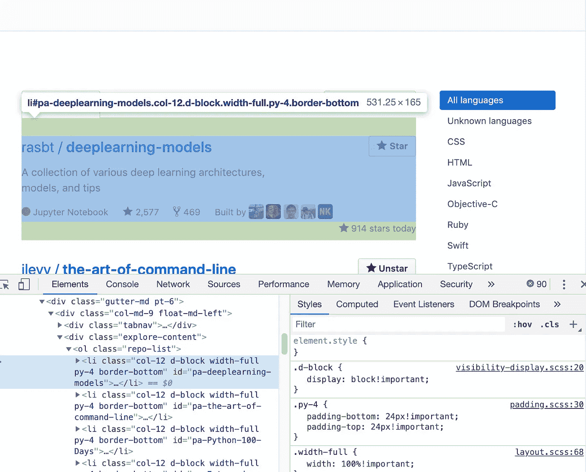
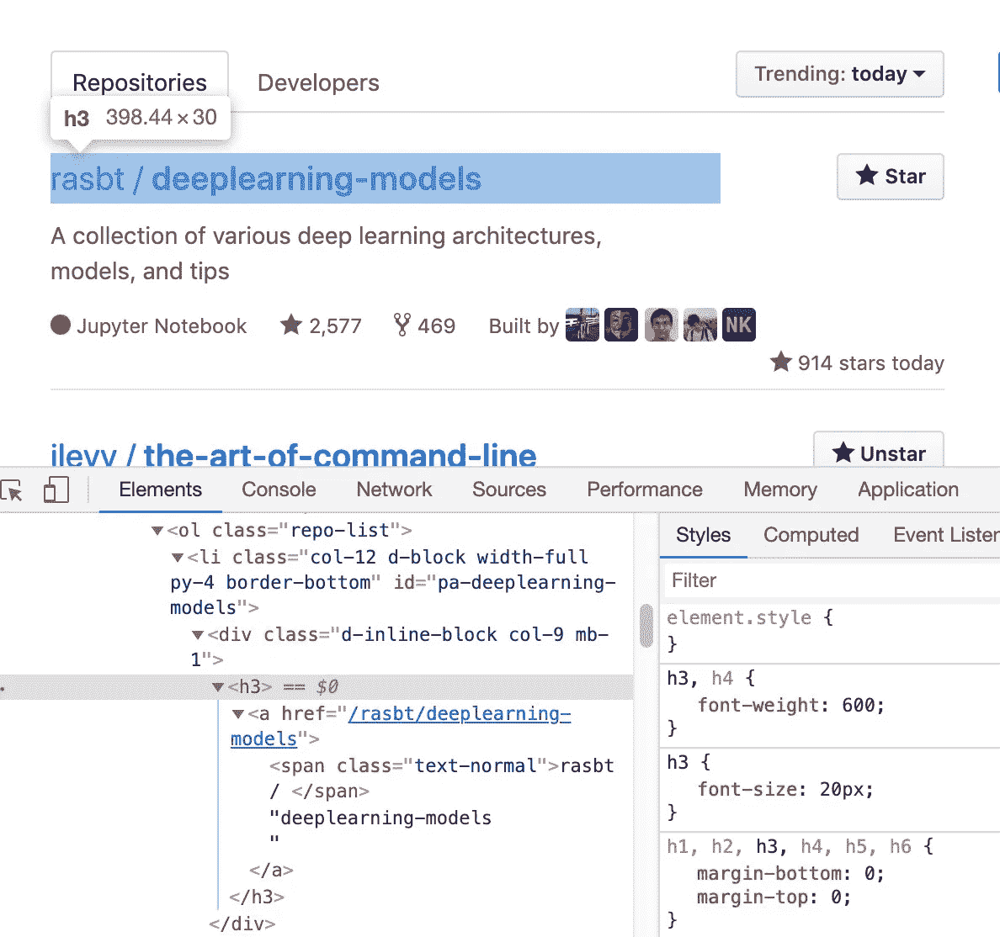
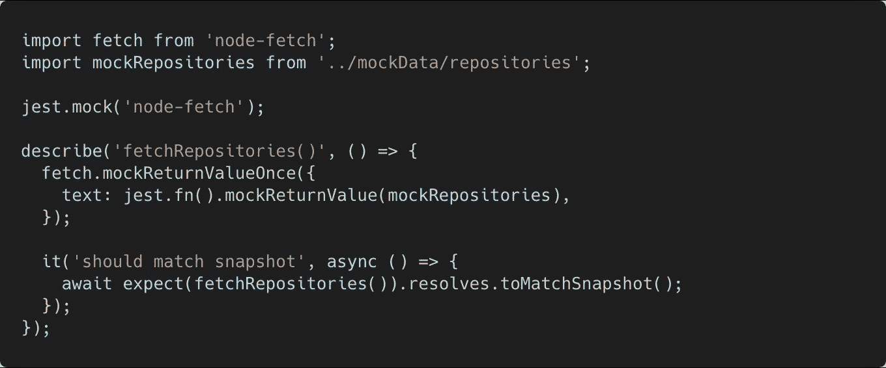
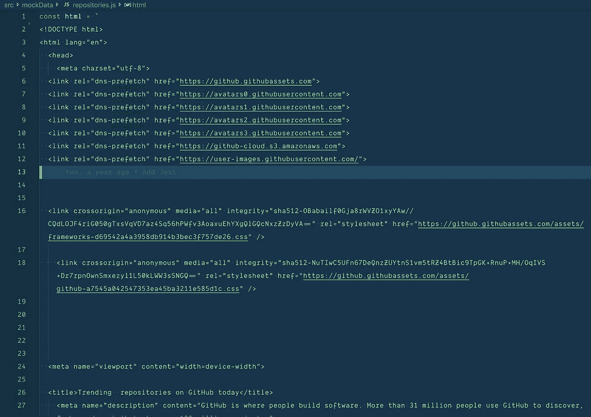
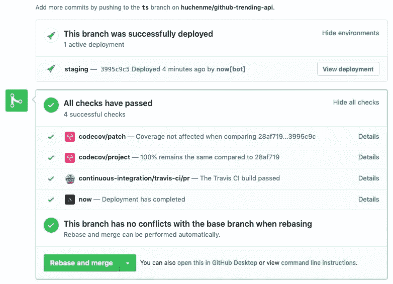
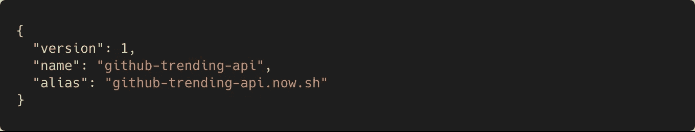

# 如何抓取任何网站并使用 cheerio.js 构建 API

> 原文：<https://levelup.gitconnected.com/how-to-scrape-any-website-and-build-an-api-using-cheerio-js-6a3f0c651d2e>

图片由[https://undraw.co](https://undraw.co/)

我在寻找 [GitHub 趋势项目](https://github.com/trending) API，但不幸的是，GitHub 没有为它提供官方 API。我决定使用 [cheerio.js](https://github.com/cheeriojs/cheerio) 自己构建 [github-trending-api](https://github.com/huchenme/github-trending-api) 。

在这篇文章中，我将与你分享我使用 [cheerio.js](https://github.com/cheeriojs/cheerio) 的经验，编写测试，并将新的更改自动推送到 API 服务器[现在](https://zeit.co/now)。

# 1.cheerio.js

当你想用 Javascript 抓取网页时，有很多工具。 [Cheerio.js](https://github.com/cheeriojs/cheerio) 就是其中之一。语法很像旧的 jQuery 风格，如果你熟悉 jQuery，你应该能很快熟悉 cheerio.js。

例如，如果您想从 [GitHub 趋势页面](https://github.com/trending)获取所有项目标题，您可以使用下面的代码片段。

上面的代码片段将以数组的形式打印出所有的存储库标题。

从上面的检查器中可以看到，可以使用`.repo-list li` 选择器来选择每个存储库。方法将检索所有 DOM 元素并作为数组返回。`$(repo)`将把 DOM 元素包装回 cheerio 对象，这样你以后就可以使用类似`find()`的选择器。

在每个存储库的范围内，可以从`h3`中选择标题，而`text()`方法将返回该选择器的文本值，尽管标题实际上被包装在一个链接中。

这是 cheerio.js 如何工作的一个简单版本，作为一种实践，你可以在这里暂停，尝试返回每个趋势项目的其余信息，并尝试使用其他[选择器](https://github.com/cheeriojs/cheerio#findselector)和方法复制[这个 API](https://github-trending-api.now.sh/repositories) 。如果你被卡住了，可以随意参考[源代码](https://github.com/huchenme/github-trending-api/blob/v1.7.2/src/fetch.js#L60-L153)。

# 2.使用 Jest 和快照编写测试

使用 Jest 和 snapshot 测试来测试上述方法非常容易。

__tests__/repositories.js

你需要做的就是模仿`fetch`库`text()`方法并返回一个固定的 HTML，你可以**查看实际页面的源代码**并复制粘贴到你的模仿数据文件中。

mockData/repositories.js

我的存储库模拟数据页面看起来是这样的，它只是一个 ES6 字符串，包含我从 GitHub 趋势页面源复制的所有 HTML。

您的快照将是您实际的 API 响应，您可以在开发 API 时验证结果是否正确。如果您稍后重构了一些代码，您将会非常有信心，如果测试仍然通过，您的 API 将不会中断。

# **3。使用 Express.js 构建 API**

有很多现有的[教程](https://www.robinwieruch.de/node-express-server-rest-api/)讲述了如何使用 Express.js 构建一个简单的 API，我在这里不做介绍，你可以在这里参考源代码[。](https://github.com/huchenme/github-trending-api/blob/v1.7.2/src/server.js)

# 4.立即使用自动部署

我使用现在的部署了 API。Now 是一个很棒的服务，如果你的 API 使用量不大的话，它是完全免费的。它与 GitHub 集成，这样你就可以使用一个唯一的 URL 在一个 Pull 请求中预览你的 API，并在你的代码被推送时自动部署和别名一个分支( **master** )。

这个工作流程很棒，你甚至可以在浏览器中执行所有任务。如果您正在进行快速修复，您可以在浏览器中更改您的代码，提交 pull 请求，Travis 将确保您的测试通过并构建成功，然后您可以使用 [Now + GitHub integration](https://zeit.co/docs/v2/integrations/now-for-github) 预览 API 结果，然后合并 pull 请求，修复将立即部署到您的生产 API 服务器。

现在，您可以按照这个指令来设置您的存储库。

现在. json

确保您有一个包含您的 [Now 配置设置](https://zeit.co/docs/v2/deployments/configuration)的`now.json`文件。如果你有这样的脚本，它将运行`npm install`、`npm run build`和`npm start`，所以你可以在`build`脚本中传输你的代码。

# 就是这样！

谢谢你读到这里。现在希望您已经准备好并部署了 API。你也可以在 [Github](https://github.com/huchenme/github-trending-api) 中查看源代码。

快乐黑客，让我知道你已经建立了什么！