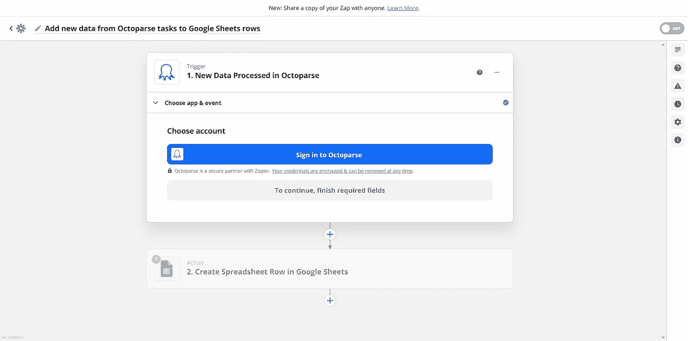

# 如何用 Octoparse 从谷歌地图中抓取数据

> 原文：<https://levelup.gitconnected.com/how-to-scrape-data-from-google-maps-with-octoparse-4c2f7e47dfe8>

## 使用 Zapier 轻松地从谷歌地图中提取数据，并将其存储在谷歌工作表文档中


照片由[亨利·佩克斯](https://unsplash.com/@hjkp?utm_source=medium&utm_medium=referral)在 [Unsplash](https://unsplash.com?utm_source=medium&utm_medium=referral) 上拍摄

从网页中抓取数据很快会变成一项耗时且困难的任务。如果你想了解更多关于网络抓取的信息，请点击[这个](https://www.octoparse.com/blog/what-is-web-scraping-basics-and-use-cases)链接。

[](https://www.octoparse.com/blog/what-is-web-scraping-basics-and-use-cases) [## 什么是网络抓取-基础和实际用途

### 带领你进入网络抓取世界的基本介绍。什么是网页抓取？它是如何工作的，如何使用的？什么…

www.octoparse.com](https://www.octoparse.com/blog/what-is-web-scraping-basics-and-use-cases) 

幸运的是，近年来已经开发出了一些工具，可以使这变得更容易，并避免所有众所周知的刮擦带来的挑战。特别是，Octoparse 是市场上最好、最聪明的解决方案之一。

Octoparse 是一款无代码的网络抓取软件，它可以让你轻松、自动地检测和提取任何网站的数据，比如谷歌地图。因为在抓取过程中不涉及任何代码，所以这个工具对任何人都是开放的。另外，它允许你通过使用[官方 API](https://helpcenter.octoparse.com/hc/en-us/articles/360026820692-Data-Export-API-and-Advanced-API?level=)按需执行抓取任务，如这里[所述](/web-scraping-made-simple-with-octoparse-9a966d888414)。从 [8.4.2 版本](https://www.octoparse.com/blog/introducing-the-new-octoparse-84?level=)开始，你还可以使用 [Zapier](https://zapier.com/) 将你的云数据自动导出到 [Google Drive](https://www.google.com/intl/en_en/drive/) 、 [Google Sheets](https://www.google.com/sheets/about/) 以及其他类似的服务。

现在让我们看看如何配置 Octoparse 从 Google Maps 中抓取数据，将其存储在云中，然后使用 Zapier 将其导出到 Google Sheets 文档中。

# 什么是八解析

> “Octoparse 提供基于点击式界面的数据抓取服务，任何人都可以使用该服务从任何动态网站抓取数据” *—* [*Octoparse 官方网站*](https://www.octoparse.com/?level=)

Octoparse 是一个专业的[网站爬虫](https://en.wikipedia.org/wiki/Web_crawler)，你可以用它从网络上提取多种类型的数据。具体来说，它附带的功能使刮擦成为一项琐碎的活动。例如，您可以配置它在浏览网站时跟随链接并不断提取数据，[自动旋转用户代理字符串](https://helpcenter.octoparse.com/hc/en-us/articles/900004036286-Anti-blocking-options-Version-8-?level=)，而[处理分页或无限滚动](https://helpcenter.octoparse.com/hc/en-us/articles/4406988884249-Scrolling-within-a-designated-area-of-a-web-page?level=) —即使局限于页面的特定部分。这些只是 Octoparse 附带的所有功能的有限集合。你可以在这里找到所有的[。](https://www.octoparse.com/featurescomparison?level=)

此外，它支持简单模式和高级模式。第一个是基于一个先进的自动检测算法，使数据提取容易和自动化，它是为有基本需求的用户。另一方面，第二个允许有定制需求的用户释放工具的真正力量。它们的共同点是 Octoparse 设计的用户友好的点击式界面，可以在数据发现、选择和提取的整个过程中为您提供指导。

总而言之，Octoparse 是一个简单易用的无代码服务，允许你在处理多个网站时抓取任何格式的数据，不管它们的结构如何。分页和无限滚动毫无障碍，还有[不同的日期格式](https://www.octoparse.com/faq/how-to-change-date-format-in-octoparse?level=)，以及防刮擦技术。事实上，Octoparse 附带了 IP 代理服务器，你可以用它来隐藏你的 IP 地址，并旋转它以避免 IP 阻塞。当您最终提取数据时，只需点击几下鼠标，就可以将数据保存在本地并备份到云中。所有这些都不需要任何编码技能。

# 从谷歌地图抓取数据

现在让我们使用 Octoparse 从谷歌地图上的[纽约餐馆页面获取数据。考虑到谷歌地图的工作方式，抓取它会很复杂。事实上，它在实现分页和无限滚动的同时，将最重要的数据显示在一个独立的部分中。](https://www.google.com/maps/search/google+maps+restaurant+new+york/@40.7832315,-74.0373696,12z/data=!3m1!4b1?hl=en)


谷歌地图互动

幸运的是，正如您将要看到的，Octoparse 使一切变得更容易。

首先，您将看到如何安装 Octoparse。然后，您将学习如何定义一个旨在从上面 GIF 中显示的 Google Maps 页面部分提取数据的抓取任务。

# 1.Octoparse 入门

是时候安装 Octoparse 了。要在谷歌地图上执行抓取任务，你需要 **Octoparse 8.4.2** 或更高版本。可以在这里下载:[https://www.octoparse.com/download](https://www.octoparse.com/download?level=)。

然后，遵循以下几个步骤:

1.  运行`Octoparse Setup 8.4.2.exe`文件
2.  遵循安装说明
3.  用你的 Octoparse 帐户登录，或者如果你还没有帐户，在这里注册。

注册是免费的，但一些高级宴会可能需要标准，专业或企业计划。你可以在这里找到 Octoparse [提供的所有计划信息。](https://www.octoparse.com/pricing?level=)

您现在已经准备好观看 Octoparse 的运行了！

# 2.定义刮擦任务

因为这里的目标是从谷歌地图中提取数据，所以推荐遵循关于如何抓取谷歌地图页面的官方指南[。](https://helpcenter.octoparse.com/hc/en-us/articles/360018842111-Scrape-data-in-Google-Maps?level=)

运行 Octoparse，执行登录，并将以下目标 URL 粘贴到主输入字段中:

```
[https://www.google.com/maps/search/google+maps+restaurant+new+york/@40.7725863,-74.0380563,12z?hl=en](https://www.google.com/maps/search/google+maps+restaurant+new+york/@40.7725863,-74.0380563,12z?hl=en)
```


输入输入 URL

现在，点击“开始”启动 Octoparse 抓取界面。因为结果分布在许多页面上，所以需要创建一个分页循环。为此，请遵循以下三个步骤:

1.  点击左边部分末尾的“>”谷歌地图按钮
2.  在“提示”面板上选择“循环单击单个图像”
3.  为“点击分页”操作设置一个 15 秒的 AJAX 超时


设置分页循环

现在，是时候创建一个滚动循环了。这是在分页循环中移动到下一页之前从当前页检索所有数据所必需的。您可以通过执行以下操作来设置它:

1.  在“分页操作”操作中，单击“+”(“添加一个步骤”)按钮
2.  选择“循环”选项，并确保在“分页 1”动作之前添加空白动作
3.  选择页面左侧的第一个和第二个餐馆部分
4.  单击“提示”面板上的“循环点击每个 URL”
5.  在“选项”标签中，取消选中“在新标签中打开”选项
6.  将“下一步之前 AJAX 超时”设置为 5s


完成滚动循环

现在，点击“提示”面板中的“自动检测网页数据”按钮，让 Octoparse 自动提取餐馆页面中显示的信息。然后，选择您感兴趣的数据。


从餐馆页面提取标题、图片、评论和类型信息

然后，点击“创建工作流”并完成刮擦流程。

您的抓取任务刚刚设置好，现在您可以通过“运行”按钮启动它。确保在弹出的“运行任务”窗口中选择“在云端运行选项”。


弹出“运行任务”窗口

该任务现在将在云上自动执行。这也将使您有可能通过使用 Octoparse API(这里的[解释为](/web-scraping-made-simple-with-octoparse-9a966d888414))以编程方式运行任务。

# 从 Octoparse 到 Zapier 的 Google Sheets

[奥克托帕瑟现在得到了扎皮尔](https://helpcenter.octoparse.com/hc/en-us/articles/4406338353689-How-to-Connect-Octoparse-with-Zapier?level=)的支持。这意味着您可以使用 Zapier 将上述抓取任务提取的数据存储到 Google Sheets 文件中。这可以通过遵循扎皮尔[在这里](https://zapier.com/webintent/create-zap?template=742162)定义的一步一步的向导过程来轻松实现。



Zapier 分步向导

通过执行该过程所需的每个操作，您将能够在 Google Sheets 文档中看到由云中执行的任务检索到的数据，如下所示:


Zapier 用 Octoparse 提取的数据生成的 Google Sheets 文档

# 结论

在这里，我们了解了 Octoparse 是什么，以及如何使用这个灵活的数据提取工具从 Google Maps 中提取数据。然后，我们学习了如何将它与 Zapier 集成，以自动将提取的数据存储在 Google Sheets 文档中。如果没有 Octoparse，这将是一项具有挑战性的任务。令人欣慰的是，这个无代码工具是一个强大的服务，允许任何人只需点击几下就可以浏览网页。这在处理采用无限滚动和实现防刮擦措施的复杂网站时特别有用——比如谷歌地图。

感谢阅读！我希望这篇文章对你有所帮助。如果有任何问题、意见或建议，请随时联系我。