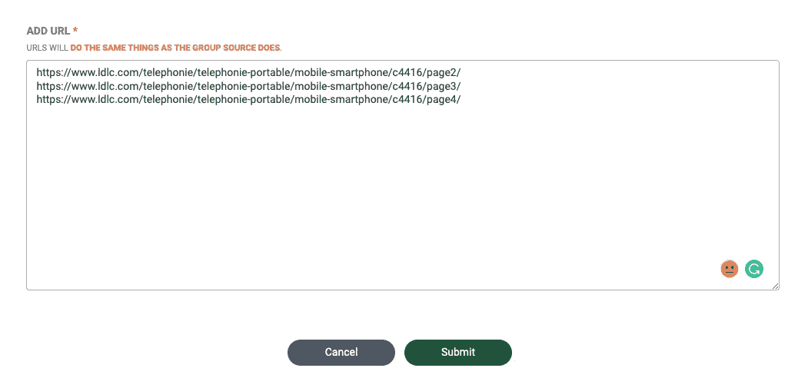
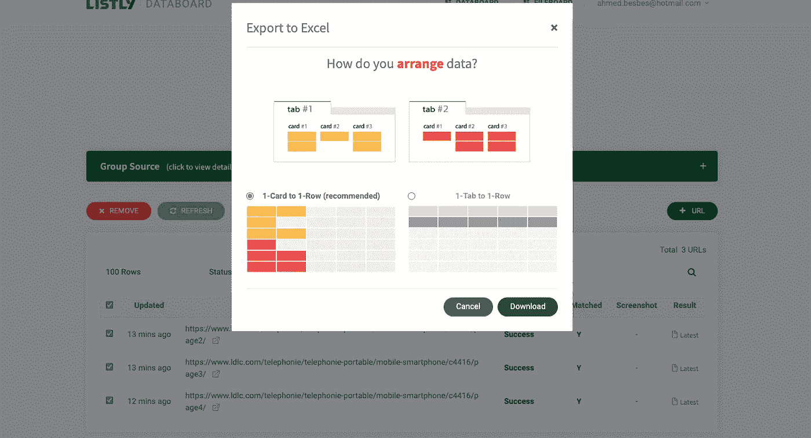

# 如何在不写代码的情况下抓取数据

> 原文：<https://levelup.gitconnected.com/how-to-scrape-data-without-writing-code-bd48fa7a226d>

## 一种新的挖掘工具，用于挖掘销售线索和市场洞察

马文·迈耶在 [Unsplash](https://unsplash.com?utm_source=medium&utm_medium=referral) 上的照片

如果我告诉你，你可以从任何网站抓取任何数据，只需点击一个按钮，无需编写任何代码，会怎么样？

听起来很诱人？

在这篇文章中，我正在评论一个承诺完成这个任务的产品。它的名字叫做 **Listly** 。

你可能从来没听说过。我也是，直到上周我第一次开始玩它。

> 这篇文章诚实地回顾了我的第一印象:我将首先浏览一下这个工具的特性。然后，我将向您展示如何在具体的刮削示例中使用它们。
> 
> 由于我有一些编写抓取器和网络爬虫的经验，我也会给你我关于功能的技术评估。

无论你是建立机器学习模型的数据科学家，还是需要提取市场见解的商业分析师，或者任何对将网站变成结构化数据库感兴趣的人(可能是为了好玩？)你一定要查一下这个帖子。

好吧，我们开始吧🏊。

 [## 加入我的介绍链接媒体-艾哈迈德贝斯

### 阅读 Ahmed Besbes 的每一个故事(以及媒体上成千上万的其他作家)。您的会员费直接支持…

medium.com](https://medium.com/membership/@ahmedbesbes) 

## Listly —“触手可及的结构化数据”

Listly 是一个无代码抓取工具，允许你自动提取和构建网页。

作者截图— [listly.io](https://www.listly.io/)

我在 Listly 中看到的主要创新是，它基于一个浏览器扩展(Chrome 和 EDGE 都支持)，允许你直接从浏览器定义刮刀的行为。

这很简单:当你访问一个你感兴趣的网页时，你点击浏览器扩展来启动 Listly，你突出显示你想要的重要部分，然后点击一个按钮开始收集。

作者 GIF——Listly 如何工作

差不多就是这样。我们将在接下来的章节中看到更多的细节和配置。

## 👉为 Listly 创建一个帐户并安装浏览器扩展

首先，去 [listly.io](https://www.listly.io/signup/) 创建一个账户。你可以从每月提供 100 个网址的免费账户开始。
如果你对更大的刮削能力感兴趣，你可以查看 Listly 的[产品](https://www.listly.io/pricing)。

然后，为了能够从您的浏览器使用 Listly，您需要安装浏览器扩展。目前支持 Chrome 和 T2 微软 Edge。

一旦扩展被固定在你的浏览器上，点击它，看看 Listly 是如何直接从页面中突出显示 HTML 组件的

## 👉用列表整体抓取数据

让我们从一个简单的例子开始，看看 Listly 是如何工作的:我将从 [LDLC](https://www.ldlc.com/telephonie/telephonie-portable/mobile-smartphone/c4416/) (一个专门销售高科技产品的法国市场)收集智能手机。

为了简单起见，我们只刮第一页。

作者截图

正如你所看到的，有各种各样的*可废弃的*项目，它们具有不同的结构:顶部销售的顶部水平栏(法语为*meillueres ventes*),所有智能手机的垂直列表，以及页面底部的品牌标志列表。

品牌标志—作者截图

如果你不确定你想要刮取什么或者你想要提取所有内容，你可以点击扩展按钮并点击**列表全部**。

启动扩展—作者截图

这将告诉 Listly 删除具有一致结构的重复项目。当 Listy 完成处理后，您将被重定向到提取结果的页面。

该页面类似于一个管理仪表板，您可以在其中全面了解您的抓取任务。

如果你看下面的截图，你会注意到 Listly 确定了 4 个区域。这些区域在 4 个独立的选项卡中表示。

第一个对应智能手机列表(竖排的那个)。

第二个对应于手机品牌列表

第三个非常有趣，它代表了显示在左边栏的搜索过滤器。Listly 不仅抓取了过滤器标签(DUAL SIM，DEFINITION ECRAN 等)，还提取了与之相关的可能选项。这个信息是隐藏的，但 Lislty 设法提取了它。

左:搜索过滤器—右:带有值的刮除过滤器

第四个区域有点奇怪。我首先不明白 Listly 是从哪里找到这些关于 cookies 的文本项的，因为它们不会直接出现在页面上(我无法搜索到它们)。

只是在点击底部的一个链接并打开一个弹出窗口后，我才发现了这些文本。

有趣的是，Listly 无法从这个模型中提取所有项目。

作者截图

如果您真的需要提取那些缺失的项目，您可能需要扩大提取数据的范围。为此，单击 TOP 30:这将突出显示 Listly 发现的 30 个提取区域。

这将显示在其他选项卡中。

作者截图

如果你点击第五个标签，你会找到我们需要的缺失数据。

作者截图

我们现在已经检查了四个区域，但是还没有提取或下载数据。

如果你对某个特定领域感兴趣，点击相应的选项卡，然后点击 EXCEL 按钮。

通过对第一个选项卡执行此操作，我们可以下载一个 EXCEL 文件，该文件提取数据并将其保存为一种清晰的结构化格式。

这又快又简单。

我个人喜欢的是重命名列的能力，而不是 LABEL-1、LABEL-2 等。这将提高摘录的可读性。

## 👉用列表部分抓取数据

如果你确切地知道你想从一个网页中抓取什么，你可以使用 LISTLY 的另一种提取方法:Listly 部分。

这个方法的工作方式如下:你点击扩展来启动 LISTLY，点击 Listly 部分按钮，选择你要从页面中抓取的 HTML 部分(比如一个容纳多个项目的容器)，点击“运行 Listly”。

之前的 GIF 说明了这个工作流程。

作者 GIF

## 👉使用组提取在多个页面上抓取元素

Listly 也处理分页。如果您想要提取跨多个页面的产品，这将非常有用。

以下是程序:一旦您执行了单个页面的提取，转到结果页面并单击右上角的 GROUP 按钮。

作者截图

一旦点击，你将被要求添加网址，同样的提取程序将被重复。

作者截图—组提取

例如，如果您想提取上例中列出的智能手机的前三页，您必须手动输入这些 URL

*   [https://www . ldlc . com/telephie/telephie-portable/mobile-smart phone/c 4416/page 2/](https://www.ldlc.com/telephonie/telephonie-portable/mobile-smartphone/c4416/page8/)
*   [https://www . ldlc . com/telephie/telephie-portable/mobile-smart phone/c 4416/page 3/](https://www.ldlc.com/telephonie/telephonie-portable/mobile-smartphone/c4416/page8/)
*   [https://www . ldlc . com/telephie/telephie-portable/mobile-smart phone/c 4416/page 4/](https://www.ldlc.com/telephonie/telephonie-portable/mobile-smartphone/c4416/page8/)

并提交。

作者截图

点击提交按钮将在三个不同的 URL 上触发相同的抓取任务。

当这些任务运行时，Listly 提供了一种在仪表板上可视化进度的方式。

作者截图——抓取多个页面上的进度

抓取完成后，您可以通过单击包含进度条的最后一个单元格将结果导出到 excel。这将把您重定向到下一页，其中显示了每个单独页面的结果。

作者截图

如果您单击 GROUP EXCEL，您可以选择导出这些结果中的一个或多个。为了连接多个结果，Listly 有两种安排抓取输出的模式，要么连接行，要么连接列。(对我来说，连接这些行似乎是自然的选择)。

作者截图

使用组抽取是从单页到多页抓取器的一个很好的技术技巧。然而，自动管理分页而不手动输入 URL 会更好。

## 👉提取嵌套数据

我们现在已经看到了如何使用 Listly 从单个页面或多个页面中抓取数据。

涉及分组提取的相同过程也可以应用于提取产品列表和每个产品的产品描述:技巧是在提取产品列表之前首先选中“显示超链接”复选框，从 Excel 文件中复制这些链接，并使用 Listly 对它们应用另一个分组提取。

你可以在这个视频中了解更多关于这种技术的知识。

这种方法肯定有效，但我个人更喜欢一种自动化程度更高的过程，在提取给定产品后，告诉抓取器查询其 URL 并获取其描述。这可能需要更复杂的用户界面。

## 👉自动化和调度

我非常喜欢 Listly 的一个特性是能够安排一个抓取任务在一个确定的时间间隔运行。

要创建计划，请从数据板上选择一个擦除任务，然后单击设置旁边的时钟图标。这将打开一个界面，您可以在其中指定时间段(每天、每月、每月 5 日等)。)和时间。

Listly 还会在计划的清理任务完成时通过电子邮件通知您。

我发现当您收集的数据随着时间的推移频繁变化时，这个特性特别有用。例如，加密货币利率、电子商务产品价格或房地产广告都会出现这种情况。

如果您必须从头开始构建 scraper 并实现自动化，您必须明确安排它运行服务器、调整和设置适当的虚拟机、管理存储、监控等。

## 👉更多令人兴奋的功能，让我们走得更远

Listly 提供了一系列其他功能来简化和扩展您的刮擦工作流程。

**代理服务器**改变你请求的 IP 地址

**自动滚动**自动滚动并在页面上加载更多数据

**自动点击**自动点击以在页面上加载更多内容

将您的数据与第三方服务连接起来的 API

# 包裹

如果你需要快速收集数据，并且不需要考虑技术细节，Listly 是一个有趣的工具。它提供了一套功能来创建复杂的工作流并快速扩展它们。

如果你是一名需要提取产品数据的分析师，或者是一名想要自动提取数据源以训练机器学习模型的数据科学家，Listly 是合适的选择。

您可以通过浏览这些资源了解更多关于 Listly 的信息:

*   [https://www.listly.io/how/en/](https://www.listly.io/how/en/)
*   [https://medium . com/python eers/the-best-in-class-the-best-tool-for-web-scraping-f 296424 ce 9 e 6](https://medium.com/pythoneers/the-best-in-class-tool-for-web-scraping-f296424ce9e6)
*   【https://www.youtube.com/playlist? list = plx w4 mww _ u2gadhurwpsn 5 zq 0 ao-KCtzUM

你觉得这个工具怎么样？你以前试过吗？请在评论中告诉我。