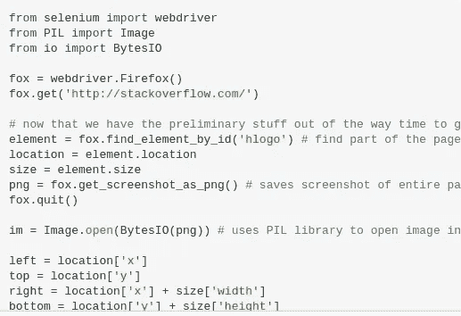
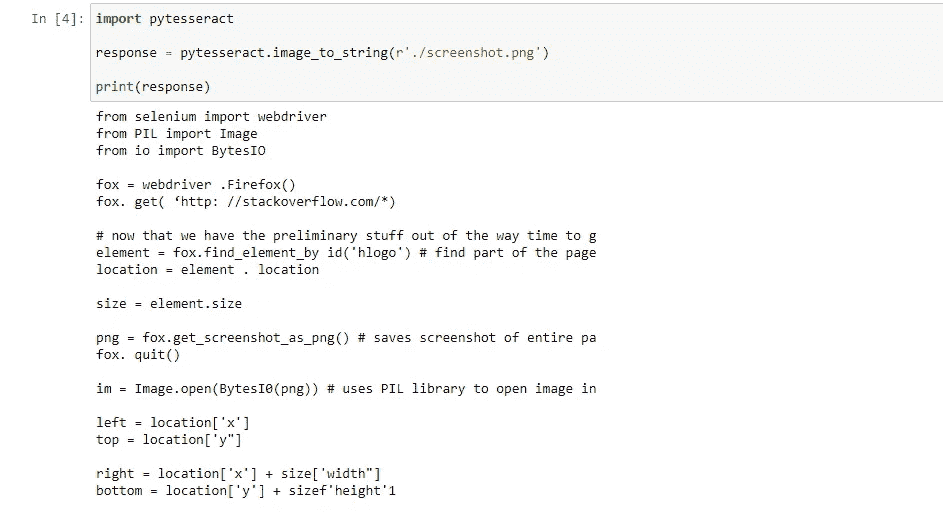

# 如何用 Python 刮图像

> 原文：<https://levelup.gitconnected.com/how-to-scrape-images-with-python-d9d7de2ffbdd>

不是最明显的刮网站的方法。



从截图中解析 Python 代码

在这篇博客文章中，我们将会发现如何从截图中抓取图像中包含的文本。当无法定位元素或处理非文本数据源时，这种方法会很有用。通过这篇文章，我将与您分享一个 python 代码，它打开一个 StackOverflow 页面，筛选代码，然后从屏幕上读取它。

**声明:**本教程是在 WSL 上运行的 Ubuntu 18.04 上创建的。它可能与其他基于 Linux 的系统兼容。

> 你可以在这里找到我关于[网页抓取的代码](https://bit.ly/3omBlaG)，格式简单。

在我们开始之前需要一些准备。首先，将 requirements.txt 安装到虚拟环境中。

```
$ python3 -m virtualenv venv
$ source ./venv/bin/activate
$ pip install -r requirements.txt
```

上面的命令序列将为您创建一个虚拟环境，并安装 requirements.txt 中列出的特定包。

您还需要在您的 Linux 发行版上安装一个 tesseract-osr 包。如果安装正确，tesseract-ocr 应该可以在您的终端上使用。

```
$ sudo apt-get install tesseract-ocr
```

Pytesseract 是 Google Tesseract OCR 引擎的一个版本，已经从 C++移植到 Python 中，以便更容易与更多 ML 项目集成。让它运行起来需要一点工作，但是安装后，您将拥有一个可以轻松扩展的纯 Python 解决方案。

我们现在可以通过 selenium 打开站点，用它创建一个屏幕截图。这是如何做到的:

当获得截图时，您只需要简单地调用一个特定的方法来解析其中的所有文本。执行的结果如下所示:



抓取的代码

# 结论

图像抓取允许您以数字格式快速获取所需的数据。不管是手写的还是打印的，只要是图像，pytesseract 都可以帮你读和转录！在大量文档中查找信息时，这个工具既省时又省力。

此外，如果你认为这是一个有用的服务，我很乐意为你建立一个。请在评论中告诉我你对这个想法的看法。