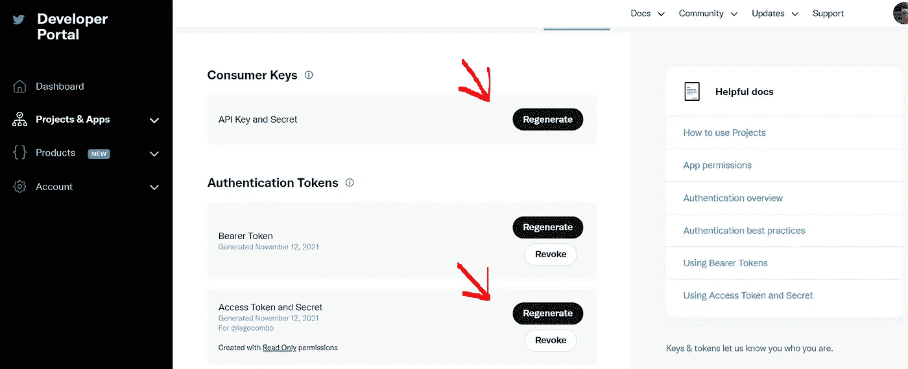
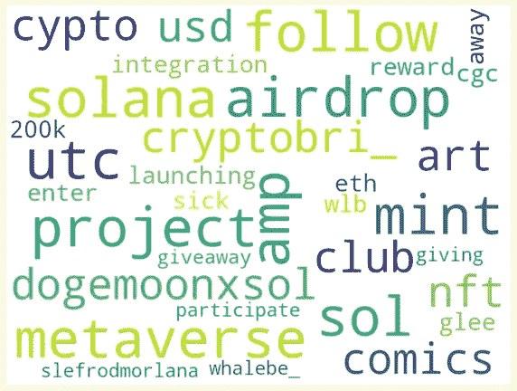

# 虚拟文本可视化

> 原文：<https://levelup.gitconnected.com/how-to-scrape-twitter-in-4-steps-db8029711e2b>


在这篇文章中，我将提供所有必要的基本步骤，以最简单的方式从 Twitter 上抓取推文！作为奖励，我将用一个合适的可视化图形来表示我的文本结果，所以我将向您展示如何创建一个 word cloud 位图。对于我们的食谱，我们使用 Python 3.8，并且只添加了两种成分:

*   Twitter Python 库(版本 1.19.3)
*   登录或注册 Twitter 帐户，以便从 Twitter 开发平台创建应用程序。

# 第一步

首先，你必须登录 Twitter，然后点击下面的链接[https://developer.twitter.com/en](https://developer.twitter.com/en/portal/dashboard)，以便在开发者平台创建一个新的应用。


Twitter 登录页面

# **第二步**

一旦创建并命名了应用程序(您不会在 Python 代码中使用该名称，因此不必担心命名约定)，您需要生成一些密钥和令牌，它们是:

*   消费者 API 密钥
*   消费者 API 秘密
*   访问令牌
*   访问令牌秘密



生成密钥和令牌

为了让您的 Python 代码能够与 Twitter“对话”,所有这些都是必须的。

# **第三步**

现在你只需要写几行代码就可以开始收集你感兴趣的推文了。复制步骤 2 中所示的 **Access_Token** 、 **Access_Token_secret** 、C**on Consumer _ API _ key**、 **Consumer_API_secret** ，并以字符串格式将它们插入 Twitter 函数中，如下所示:

```
from twitter import Twitter, OAuth
twitter = Twitter(auth=OAuth(
  '1358396053456846851-0zTJ6vKdB7hNLSREtMuT', #Access_Token
  'U2dCkzhNk7iToxvPElBtLhxT21AqwpbQZjv3xkcT', #Access_Token_secret
  'ytlFfSnSLzpw3ZzhNk7iToxvPElBtsZzjTH1ELTPl' #Consumer_API_key,                               '6oJbDXj84ulWVb9G6a6hPGyxLd4RWlTAh4GmHIsrC'   #Consumer_API_Secret))
```

# 第四步

在这一步中，我们根据想要抓取的推文类型使用了一些函数:

*   *从* ***你的时间线*** 中检索并打印最近五条推文:

```
l = twitter.statuses.home_timeline(count=5)
for e in l:
    print(e['text'])
```

打印你的时间线中最近的 5 条推文

*   *从* ***另一个用户的时间线*** *:* 中检索并打印最近十条推文

```
g = twitter.statuses.user_timeline(screen_name='elonmusk', count= 10)
for e in g:
    print(e['text'])
```

*   搜索带有#比特币标签的推文，并打印最近的七条

```
d = twitter.search.tweets(q='#Bitcoin', count=7)
for e in d['statuses']:
    print(e['text'])
```

# 奖励步骤

最后，我们可能希望用一个合适的可视化图形来显示所有这些结果。给定一个文本文档，这可能是一个**单词云位图**，我们将以与上面提取相似的方式获取该文本文档。下面的 **generate_word_cloud** 函数使用词频(TF)和逆文档频率(IDF)矢量化方法来导出单词的重要性，该重要性由单词在单词云中的大小来表示。

我们的词云的来源将是标签为#SOL 的 40 条最新推文，它代表索拉纳加密货币和网络。



使用#SOL 的推文的文字云位图

看来空投最近很流行！:)

感谢您的宝贵时间！如果你想阅读更多这样的文章，你可以在下面找到一些:

[](https://towardsdatascience.com/poker-test-pattern-based-random-number-detection-in-python-ec2dba4955bc) [## 扑克测试:Python 中基于模式的随机数检测

### 随机数还是伪随机数？这是一个琐碎的问题，有时需要基于…的知识

towardsdatascience.com](https://towardsdatascience.com/poker-test-pattern-based-random-number-detection-in-python-ec2dba4955bc) [](https://towardsdatascience.com/frawd-detection-using-benfords-law-python-code-9db8db474cf8) [## 使用本福德定律(Python 代码)进行欺诈检测

### 本福特定律的发现

towardsdatascience.com](https://towardsdatascience.com/frawd-detection-using-benfords-law-python-code-9db8db474cf8) [](https://medium.com/analytics-vidhya/log-rank-test-kaplan-meier-survival-curve-python-code-3fc78da644d5) [## 对数秩检验，卡普兰迈耶生存曲线(Python 代码)

### 什么是生存分析？

medium.com](https://medium.com/analytics-vidhya/log-rank-test-kaplan-meier-survival-curve-python-code-3fc78da644d5) 

参考资料:

[](https://www.oreilly.com/library/view/artificial-intelligence-in/9781492055426/) [## 金融中的人工智能

### 人工智能和机器学习的广泛采用正在彻底改变当今的许多行业。一旦这些技术…

www.oreilly.com](https://www.oreilly.com/library/view/artificial-intelligence-in/9781492055426/)