# 如何在零技术知识的情况下在几秒钟内抓取网页内容

> 原文：<https://levelup.gitconnected.com/how-to-scrape-web-content-in-seconds-even-with-zero-technical-knowledge-2758ad6991f6>

## 通过浏览器扩展实现快速、准确、物有所值的网络抓取

信用:Canva

你曾经希望你能得到隐藏在某个网站上的数据吗？但是你不知道该怎么做！或者也许你以前曾试图从一个网站上提取数据，但发现这个过程太复杂和耗时。

如果是这样，那么网络抓取就是你的解决方案。

Web 抓取是使用脚本从网站自动提取数据的过程。这是一种非常强大的方式来快速方便地收集内容。

然而，如果你想从网上搜集内容，会遇到一些重大的挑战。首先，您必须编写脚本来抓取页面并提取所需的数据。第二，不同的网站有不同的结构，需要相应地定制你的脚本。

因此，我避免了编写自己的脚本的麻烦。相反，我更喜欢使用现成的产品，这些产品可以轻松完成工作，但效率要高得多。

一个这样的网页抓取产品是 [Listly.io](https://www.listly.io/) 。

让我们进一步了解这个工具，看看它是如何毫不费力地解决网页抓取问题的。如果你也像我一样，想在没有创建自定义脚本的麻烦的情况下收集数据，那么你会喜欢使用 Listly。

# Listly.io 是干什么用的？

> Listly 是一个面向从非技术营销人员到高级开发人员的网络抓取服务。它可以在几秒钟内将网页转换成 Excel 电子表格。提取的数据用于零售、研究、大数据和其他与数据相关的工作。
> 
> ***—***[***listly . io***](https://www.listly.io/faq)

根据该产品的 FAQ 页面，Listly.io 是一种网络抓取服务，允许用户非常快速轻松地将网页中的数据提取到 Excel 电子表格中。它非常适合市场研究、数据挖掘和其他与数据相关的任务。

# 如何使用 Listly？

最近 Listly 团队联系了我。他们希望我尝试他们的网络抓取产品，并提供一个诚实的评论。

从那以后，我一直在摆弄它，探索它的特性。根据我的经验，我对它可以轻松完成大部分刮擦工作感到惊讶。

在讨论该工具的优缺点之前，让我们来看看该产品的一些关键特性以及如何使用它们。

**注意**:当您试用 Listly 时，请确保登录门户。这将帮助你为将来保存你的工作。此外，只有当您在登录后执行提取时，您的数据才会保持私密和安全。

## 1.安装浏览器扩展

Listly 是作为浏览器扩展而来的。你可以[跟着这个链接](https://www.listly.io/)安装。当您打开链接时，它会自动检测您的浏览器类型，并为您推荐正确的扩展名。

你只需要点击红色按钮，安装就完成了。

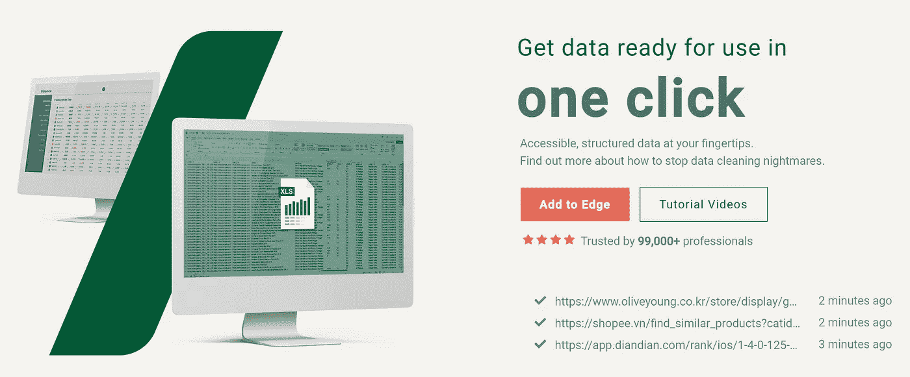

Edge 浏览器中 listly.io 的截图

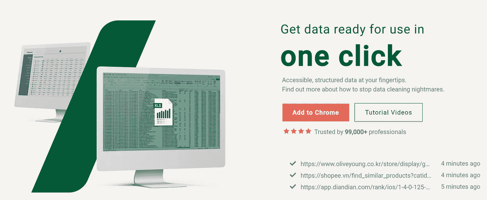

Chrome 浏览器中 listly.io 的截图

如果您需要进一步的安装帮助，您可以按照这个简单的视频在不到一分钟的时间内完成。

## 2.从一页上刮掉数据

对于这个例子，我决定从一个 Medium.com 页面中抓取数据。这些数据可以帮助我确定某个主题的趋势，为我未来的文章提供思路，了解其他读者对这些故事的看法，等等。

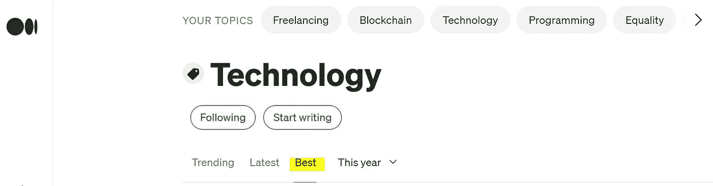

截图自 Medium.com

下面的截图显示了我提取的结果。我已经更改了标题并删除了我不想要的行。我只获取了前 50 篇文章，但是[工具可以自动滚动](https://www.youtube.com/watch?v=OqzppJ4lq5o)页面，不需要额外的努力就可以获取尽可能多的文章。Listly 还可以[自动点击按钮](https://www.youtube.com/watch?v=giP6e_DvHV8)执行你指示的动作。

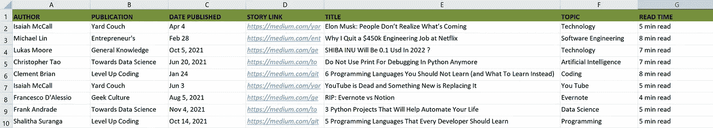

excel 中提取数据的截图

抓取过程毫不费力，设置和提取数据几乎不需要一分钟。我以前做过这样的提取，但总是比 Listly.io 花费更多的精力。

这段一分钟的视频让你了解执行任务的具体步骤。

## 3.从单独的页面增加数据

一旦我提取了上面的列表，我想知道每个故事的掌声和评论数。这些信息提供了读者如何接受主题和文章的洞察力。

然而，Medium 不再显示主题页面上的掌声和评论数。因此，我不能在前面的步骤中一次性抓取数据。我需要在每篇文章中找到这两个细节。您可以想象当需要浏览一长串链接时，任务会变得多么难以处理。

媒体截图:一篇文章的掌声和评论数

对 Listly 来说，即使这一步也是轻而易举的事。我花了一分钟不到十次点击就提取了我想要的东西。

我在 Medium 上打开了其中一个故事，在同一个浏览器中打开了 LISTLY 扩展，然后点击了“Listly 部分”按钮。

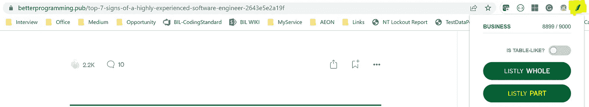

媒体上的故事页面截图

该工具让我可以选择突出显示页面中我想要提取的部分。我选择了掌声和评论部分。您可以选择页面的多个部分，然后一次性将它们刮掉。

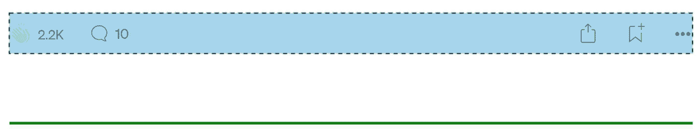

选择了所需部分的故事页面截图

当我在故事页面上选择了我想要的部分后，LISTLY 为我提供了“运行 Listly”选项来提取数据(如下图所示)。

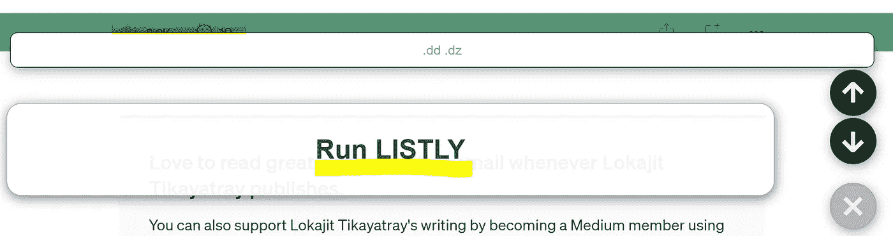

媒体上的故事页面截图

接下来，我点击了“Run Listly”按钮，该工具打开了一个新的浏览器选项卡，提供了更多选项来提取一组数据。我可以在“选择要提取的选项卡”部分看到 Listly 将为我提取的数据。

我选择了显示我想要提取的所有字段的选项卡，并单击页面上的“GROUP”按钮。

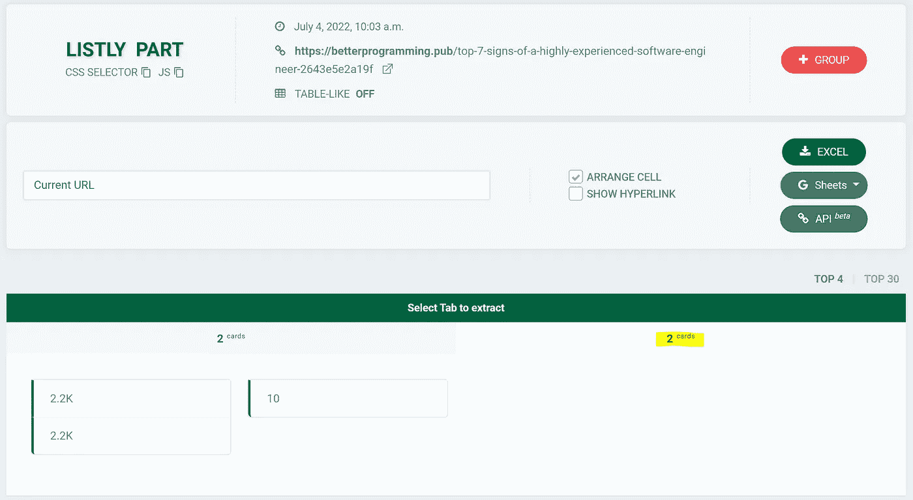

列表页面截图

接下来，我登陆了 Listly 页面，在那里我可以提供所有我想要的故事链接，以获得他们的掌声和评论。我复制粘贴了步骤 2 中已经提取的链接列表，并点击了“提交”按钮。

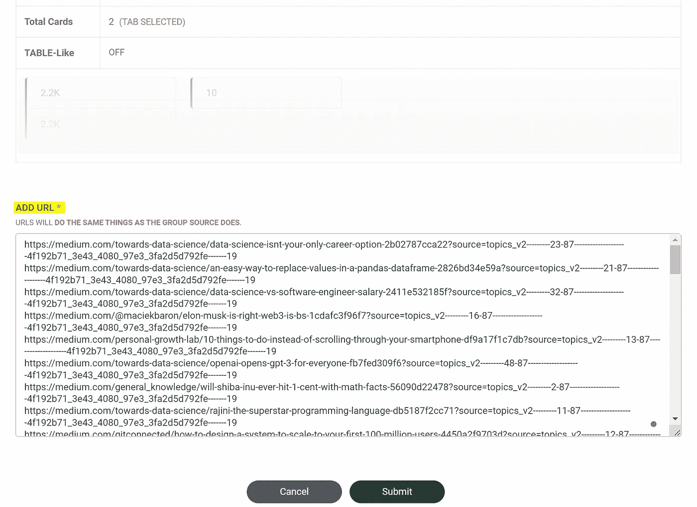

列表页面截图

不到一分钟，我就获得了每个故事所需的掌声和评论数据，并准备导出为 excel。

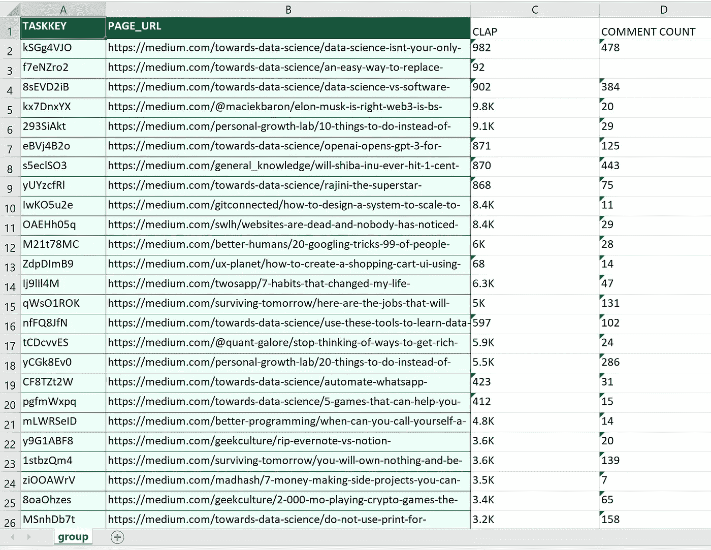

excel 中提取数据的截图

如果你需要进一步的帮助，你可以参考 Listly 的这个两分钟的视频。

## 4.安排刮擦任务—无需在线

我很喜欢这个功能。如果您需要定期执行清理任务，您不再需要登录来完成它们。你可以简单地安排它。设置工具以执行重复工作需要 2 秒钟。不仅如此，它还可以自动将输出发送到电子邮件中。您可以使用此功能向自己发送每日、每周或每月报告。

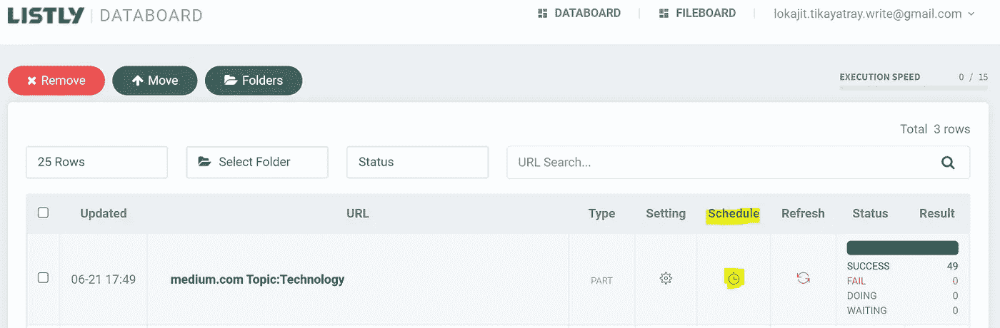

截图自 Listly.io

要设置您的时间表，请转到您的数据板(从浏览器扩展)。选择要重复的擦除作业，然后单击“日程”列下的“监视”图标。这将打开一个页面，您可以在其中选择运行作业的首选时间段。这个工具提供了很多选项来安排你的工作。

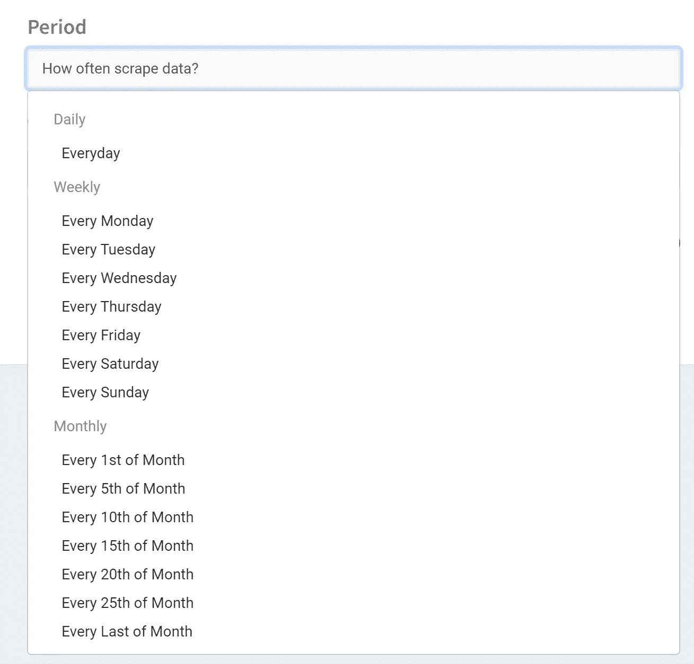

Listly.io 中的计划选项的屏幕截图

在同一个计划页面中，您可以选择通过电子邮件接收提取报告的链接。这有助于您在清理作业完成时获得警报。

Listly.io 中的计划窗口的屏幕截图

以上是我在过去几天探索的一些特性。从这些功能中，您可以看到 Listly 如何只需几次点击即可执行复杂的数据提取。最棒的是每次提取不到一分钟就完成了。对于一个可以在不同结构的网站上工作的工具来说，其速度和易用性令人难以置信。

# 我的反馈

根据我的经验，这里列出了利斯特利的利与弊。

## **优点:**

*   **容易上手:**安装过程轻而易举。这打破了非技术人员开始使用该工具的一个重大障碍。
*   **零技术知识需求:**该工具不需要用户理解网页的 HTML、CSS 或其他幕后技术细节。
*   **好用:**工具超级好用。用户界面非常直观，在每一步都提供了有用的指导。我确信即使是不精通技术的人也可以毫无问题地使用这个工具。
*   **快速性能**:我试用的用例甚至不需要一分钟就能完成。根据我的经验，我发现这个工具的处理逻辑非常快。
*   **作业调度:**我之前已经讲过了。能够调度重复的任务并获得输出的自动通知是一个很大的优势。
*   有用的教程和视频:好的软件需要同样好的文档才能成功。Listly 有非常好的简明视频，可以让你在几分钟内开始学习。它还提供了针对 UI 上每个选项的快速示例链接。跟着链接走，在使用这个工具的时候你永远不会感到失落。

## **缺点:**

*   **手动刷新检查状态:**如果您在页面上，数据板上的状态和结果列不会自动刷新。您必须刷新浏览器才能手动获取更新的状态。但是，这不会影响刮擦的性能。但是进度的自动刷新可以成为特性列表的一个很好的补充。
*   **有限的文件格式导出选项:**目前，您可以将提取的数据导出到 excel 表或 Google 表中。默认情况下，该工具的用户界面不支持任何其他文件格式。
*   **无字段排除选项:**当您在 Databoard 中选择一个页面部分时，该区域中的所有字段都会被提取。稍后，您必须从 excel 表中删除不需要的列。如果 UI 允许跨部分或页面选择目标字段，将会很方便。这同样适用于在提取之前提供从所选区域移除字段的选项。

# 最后的想法

过去几天我一直在使用 Listly，它的性能给我留下了深刻的印象。不得不说，Listly 是我用过的最直白的网络抓取工具之一。它对用户非常友好，不需要任何技术知识。

如果你也在寻找一个网页抓取工具，给 Listly 一个尝试，让我知道你的经验。

感谢您阅读这篇文章。你可以[通过访问这个推荐链接](https://lokajit-tikayatray.medium.com/membership)成为一个媒体成员，以支持我的写作，并获得所有跨媒体的故事。

**您可能也想阅读:**

 [## 这就是软件开发人员在职业生涯中失败的原因

### 知道原因，这样你就可以避免犯同样的错误

levelup.gitconnected.com](/this-is-why-software-developers-fail-to-succeed-in-their-career-5dd9fa94c006)  [## 成功程序员的 7 个习惯

### 你可以很容易地练习成为一个超级有效的程序员的习惯

medium.com](https://medium.com/codex/7-habits-of-highly-successful-coders-839ed8ab8b1b)  [## 这就是为什么安静的程序员是最好的

### 你认为自己是他们中的一员吗？

levelup.gitconnected.com](/this-is-why-quiet-programmers-are-the-best-291b425d5258)