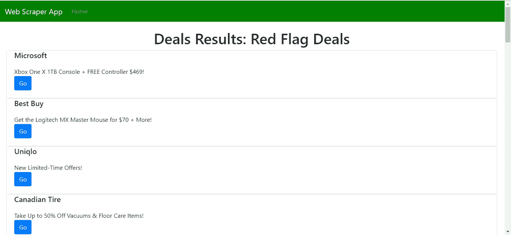
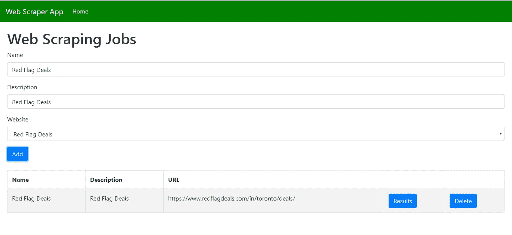

# 如何用 Node.js 刮网站

> 原文：<https://levelup.gitconnected.com/how-to-scrape-websites-with-node-js-ee67c8d87757>



Web 抓取是一种通过解析 HTML 从网站中提取数据的技术。这是通过将网站内容加载到 DOM 树中，解析元素，从所需元素中提取数据，并将结果存储在数据库中来实现的。

在本文中，我们将制作一个 web scraper，从一个名为 [Red Flag Deals](https://www.redflagdeals.com) 的交易网站获取列表，并将数据存储在数据库中。我们将有一个后端来管理一个我们称之为“作业”的抓取请求队列。我们提供添加、查看和删除作业的功能。然后，我们创建一个前端，让我们查看我们收集的数据。web scraper 将是一个 Node.js 脚本。后端将是一个作为 ORM 的 Sequelize 快速应用程序。我们将使用 SQLite 作为我们的数据库，以简化这个演示应用程序。前端会用 React 写。

## Web Scraper 后端

我们将从后端开始。创建一个项目文件夹，并在其中为我们的后端代码创建一个`backend`文件夹。接下来，我们通过执行`npx express-generator`来运行 Express Generator。这将创建基础 Express 应用程序所需的文件。现在，我们通过运行`npm install`来为我们的后端应用程序安装软件包。

一旦安装了包，我们将把 Babel 添加到应用程序中，这样我们就可以使用 Node.js 中没有的 JavaScript 特性，比如`import`。

跑`npm i @babel/cli @babel/core @babel/node @babel/preset-env`。接下来在`backend`文件夹中创建一个名为`.babelrc`的文件，并添加以下内容:

```
{
    "presets": [
        "[@babel/preset-env](http://twitter.com/babel/preset-env)"
    ]
}
```

在`package.json`中，我们将以下内容添加到`scripts`部分:

```
"start": "nodemon --exec npm run babel-node --  ./bin/www",
"babel-node": "babel-node"
```

我们用`babel-node`运行时启动我们的应用程序，而不是普通的节点运行时，这样我们就可以使用 Babel。请注意，我们还需要`nodemon`，以便应用程序将在文件更改时重新启动。要安装它，运行`npm i -g nodemon`。

接下来，我们需要安装自己的库。我们将使用 Bull 包创建抓取数据的作业队列，使用 CORS 允许来自前端的请求，使用 Request 和 Request Promise 获取网站文本，使用 Sequelize 创建 ORM，使用 SQLite3 存储数据。我们通过运行`npm i cors bull cheerio request request-promise sequelize sqlite3`来安装包。

我们还需要 Redis 来让我们的 Bull job 队列工作。最新版本只能在 Linux 上运行，所以我们必须使用它。在 Ubuntu 中，我们运行:

```
sudo apt-get update
sudo apt-get upgrade
sudo apt-get install redis-server
redis-server
```

这将安装并运行 Redis。详细说明在[https://tecadmin.net/install-redis-ubuntu/](https://tecadmin.net/install-redis-ubuntu/)。

接下来，我们将 Sequelize 的代码添加到我们的后端。运行`npx sequelize-cli init`。在`config.json`中，将代码替换为以下内容:

```
{
  "development": {
    "dialect": "sqlite",
    "storage": "development.db"
  },
  "test": {
    "dialect": "sqlite",
    "storage": "test.db"
  },
  "production": {
    "dialect": "sqlite",
    "storage": "production.db"
  }
}
```

然后，我们需要为数据库创建迁移和模型来存储我们的数据。跑`npx sequelize-cli model:create --name Deal --attributes name:string,description:string,url:string,content:text`。运行它将创建一个迁移和相关的模型。

当您运行`npx sequelize-cli db:migrate`时，您将在 SQLite 数据库中获得 Deals 表。

数据库代码完成后，我们可以开始编写逻辑了。在`backend`文件夹中创建一个`queues`文件夹，添加一个名为`scraperQueue.js`的文件，并添加如下内容:

```
const Queue = require("bull");
const cheerio = require("cheerio");
const rp = require("request-promise");
const models = require("../models");const scraperQueue = new Queue("web scraping");scraperQueue.process(async (job, done) => {
  const deal = job.data.deal;
  const response = await rp(deal.url);
  const $ = cheerio.load(response);
  const items = $(".list_item");
  let deals = [];
  Object.keys(items).forEach(key => {
    const dealer = $(items[key])
      .find(".offer_dealer")
      .text();
    const title = $(items[key])
      .find(".offer_title")
      .text(); let link = $(items[key])
      .find(".offer_title a")
      .attr("href");
    link = `[https://www.redflagdeals.com${link}`](https://www.redflagdeals.com${link}`);
    deals.push({ dealer, title, link });
  });
  await models.Deal.update(
    {
      content: JSON.stringify(deals),
    },
    {
      where: {
        id: deal.id,
      },
    }
  );
  done();
});export { scraperQueue };
```

这是我们网页抓取工作的队列。我们在这个文件中所做的是加载我们想要抓取的网页，也就是红旗交易页面。我们用 Cheerio 打开页面的响应，方法是将 HTML 加载到 DOM 树中，用类`list-item`定位条目，然后遍历每个元素，从`offer_dealer`和`offer_title`类中提取文本。对于链接，我们用 Cheerio 将元素加载到 DOM 树中，然后用类`offer_title`从节点中获取`a`元素。然后获取`href`属性并添加 URL 前缀和根 URL，因为它是一个相对路径。

这意味着如果页面结构发生变化，例如，类名发生变化，那么您必须更新代码以保持其工作。

获得数据后，我们将它保存到我们创建的作业条目中。

接下来，我们创建 API 端点来添加、获取和删除数据。在`routes`文件夹中创建一个名为`deals.js`的文件，并添加以下内容:

```
const express = require("express");
const models = require("../models");
const router = express.Router();
import { scraperQueue } from "../queues/scraperQueue";router.post("/scrape", async (req, res, next) => {
  const { name, description, url } = req.body;
  const deal = await models.Deal.create({
    name,
    description,
    url,
  });
  scraperQueue.add({ deal });
  res.json(deal);
});router.delete("/job/:id", async (req, res, next) => {
  const id = req.params.id;
  await models.Deal.destroy({ where: { id } });
  res.json({ id });
});router.get("/jobs", async (req, res, next) => {
  const deals = await models.Deal.findAll();
  res.json(deals);
});router.get("/job/:id", async (req, res, next) => {
  const id = req.params.id;
  const deals = await models.Deal.findAll({ where: { id } });
  const deal = deals[0];
  deal.content = JSON.parse(deal.content);
  res.json(deal);
});module.exports = router;
```

我们使用`scrape`路径将作业添加到队列中，并将数据保存到 Deals 表中。删除`/job/:id`路线用于从交易表中删除数据。`/jobs`表用于获取作业，get `/job/:id`路径用于将交易数据返回给用户。

最后，我们必须对`app.js`进行一些修改。我们用以下代码替换现有代码:

```
const createError = require("http-errors");
const express = require("express");
const path = require("path");
const cookieParser = require("cookie-parser");
const logger = require("morgan");
const cors = require("cors");const indexRouter = require("./routes/index");
const dealsRouter = require("./routes/deals");const app = express();// view engine setup
app.set("views", path.join(__dirname, "views"));
app.set("view engine", "jade");app.use(logger("dev"));
app.use(express.json());
app.use(express.urlencoded({ extended: false }));
app.use(cookieParser());
app.use(express.static(path.join(__dirname, "public")));
app.use(cors());app.use("/", indexRouter);
app.use("/deals", dealsRouter);// catch 404 and forward to error handler
app.use(function(req, res, next) {
  next(createError(404));
});// error handler
app.use(function(err, req, res, next) {
  // set locals, only providing error in development
  res.locals.message = err.message;
  res.locals.error = req.app.get("env") === "development" ? err : {};// render the error page
  res.status(err.status || 500);
  res.render("error");
});module.exports = app;
```

我们添加了`cors`插件来让应用程序与前端对话，我们添加了`const dealsRouter = require(“./routes/deals”);`和`app.use(“/deals”, dealsRouter);`来公开`deals`路线。

这就完成了我们的网络抓取应用程序的后端。现在我们需要前端添加或删除作业，并显示网页抓取作业的结果。

## 卷筒纸刮刀前端

我们首先用 Create React App 创建一个 React 项目。通过进入项目的根文件夹并运行`npx create-react-app frontend`来创建应用程序。

接下来，我们需要安装一些软件包。运行`npm i axios bootstrap formik mobx mobx-react react-bootstrap react-router-dom yup`。Axios 是我们向后端发出请求的 HTTP 客户端。Bootstrap 和 React Bootstrap 用于样式化，MobX 和 MobX React 用于状态管理，Formik 和 Yup 分别用于处理表单值变化和表单验证。

现在我们在`src`文件夹中添加和修改文件，除非另有说明。

首先，我们用以下代码替换`App.js`中的代码:

```
import React from "react";
import { Router, Route, Link } from "react-router-dom";
import HomePage from "./HomePage";
import ResultsPage from "./ResultsPage";
import TopBar from "./TopBar";
import { createBrowserHistory as createHistory } from "history";
import { JobsStore } from "./stores";
import "./App.css";
const history = createHistory();
const jobsStore = new JobsStore();function App() {
  return (
    <div className="App">
      <Router history={history}>
        <TopBar />
        <Route
          path="/"
          exact
          component={props => <HomePage {...props} jobsStore={jobsStore} />}
        />
        <Route path="/results/:id" exact component={ResultsPage} />
      </Router>
    </div>
  );
}export default App;
```

我们有一个`TopBar`组件，它显示我们将很快创建的顶部栏。下面是我们将要创建的页面的路径。注意，我们将我们的存储传递给路由中的组件。这是 MobX 存储，它将保存作业列表以便于访问。

在`App.css`中，我们将现有代码替换为:

```
.center {
    text-align: center;
}
```

接下来，我们将建立主页。创建一个名为`HomePage.js`的文件，并添加以下内容:

```
import React from "react";
import { useEffect, useState } from "react";
import { Formik } from "formik";
import Form from "react-bootstrap/Form";
import Col from "react-bootstrap/Col";
import Button from "react-bootstrap/Button";
import * as yup from "yup";
import Table from "react-bootstrap/Table";
import { Redirect } from "react-router";
import "./HomePage.css";
import { observer } from "mobx-react";
import { scrape, removeJob, getAllJobs } from "./requests";const schema = yup.object({
  name: yup.string().required("Name is required"),
  description: yup.string().required("Description is required"),
  url: yup.string().required("URL is required"),
});function HomePage({ jobsStore }) {
  const [redirect, setRedirect] = useState(false);
  const [jobId, setJobId] = useState(0);
  const [initialized, setInitialized] = useState(false);
  const handleSubmit = async evt => {
    const isValid = await schema.validate(evt);
    if (!isValid) {
      return;
    }
    jobsStore.jobs.push(evt);
    jobsStore.setJobs(jobsStore.jobs);
    await scrape(evt);
    getJobs();
  }; const selectJob = id => {
    setJobId(id);
    setRedirect(true);
  }; const getJobs = async () => {
    const response = await getAllJobs();
    jobsStore.setJobs(response.data);
  }; const deleteJob = id => {
    removeJob(id);
    getJobs();
  }; useEffect(() => {
    if (!initialized) {
      getJobs();
      setInitialized(true);
    }
  }); if (redirect) {
    return <Redirect to={`/results/${jobId}`} />;
  } return (
    <div className="home-page">
      <h1>Web Scraping Jobs</h1>
      <Formik
        validationSchema={schema}
        onSubmit={handleSubmit}
      >
        {({
          handleSubmit,
          handleChange,
          handleBlur,
          values,
          touched,
          isInvalid,
          errors,
        }) => (
          <Form noValidate onSubmit={handleSubmit}>
            <Form.Row>
              <Form.Group as={Col} md="12" controlId="name">
                <Form.Label>Name</Form.Label>
                <Form.Control
                  type="text"
                  name="name"
                  placeholder="Name"
                  value={values.name || ""}
                  onChange={handleChange}
                  isInvalid={touched.name && errors.name}
                />
                <Form.Control.Feedback type="invalid">
                  {errors.name}
                </Form.Control.Feedback>
              </Form.Group>
              <Form.Group as={Col} md="12" controlId="chatRoomName">
                <Form.Label>Description</Form.Label>
                <Form.Control
                  type="text"
                  name="description"
                  placeholder="Description"
                  value={values.description || ""}
                  onChange={handleChange}
                  isInvalid={touched.description && errors.description}
                /> <Form.Control.Feedback type="invalid">
                  {errors.description}
                </Form.Control.Feedback>
              </Form.Group><Form.Group controlId="url" as={Col} md="12">
                <Form.Label>Website</Form.Label>
                <Form.Control
                  as="select"
                  name="url"
                  value={values.url || ""}
                  onChange={handleChange}
                  isInvalid={touched.url && errors.url}
                >
                  <option value="">Select</option>
                  <option value="[https://www.redflagdeals.com/in/toronto/deals/](https://www.redflagdeals.com/in/toronto/deals/)">
                    Red Flag Deals
                  </option>
                </Form.Control>
                <Form.Control.Feedback type="invalid">
                  {errors.url}
                </Form.Control.Feedback>
              </Form.Group>
            </Form.Row>
            <Button type="submit" style={{ marginRight: "10px" }}>
              Add
            </Button>
          </Form>
        )}
      </Formik>
      <br />
      <Table striped bordered>
        <thead>
          <tr>
            <th>Name</th>
            <th>Description</th>
            <th>URL</th>
            <th></th>
            <th></th>
          </tr>
        </thead>
        <tbody>
          {jobsStore.jobs.map((j, i) => {
            return (
              <tr key={i}>
                <td>{j.name}</td>
                <td>{j.description}</td>
                <td>{j.url}</td>
                <td>
                  <Button onClick={selectJob.bind(this, j.id)}>Results</Button>
                </td>
                <td>
                  <Button onClick={deleteJob.bind(this, j.id)}>Delete</Button>
                </td>
              </tr>
            );
          })}
        </tbody>
      </Table>
    </div>
  );
}export default observer(HomePage);
```

此页面包含添加作业的表单。我们用 Yup 验证所有字段都是必需的，我们用它来创建`schema`对象。我们嵌套了我们的`Form`组件，它是由 React Bootstrap 和`Formik`组件提供的，这样它将处理所有的表单值更改，并返回在`handleSubmit`函数中输入的值。我们用`Form.Control.Feedback`组件显示表单验证错误。当用户点击“添加”时，执行`handleSubmit`功能。

在`handleSubmit`函数中，将通过运行`schema.validate`函数来验证表单值，该函数返回一个承诺。一旦执行并通过验证，我们就调用`requests.js`中的`scrape`函数，我们将创建该函数来将作业添加到队列中。之后，它将通过调用组件中的`getJobs`来获取最新的作业，将返回的条目放入我们的`jobsStore`中，并在底部的表格中显示这些条目。

我们需要`useEffect`回调函数在组件第一次加载时调用`getJobs`，这样我们就可以在页面加载时填充表格。我们通过检查`initialized`标志来做到这一点。如果为假，则`getJobs`运行，通过调用`setInitialized(true)`将`initialized`设置为`true`。

我们有一个按钮让我们用结果按钮来查看作业，我们有一个删除按钮，我们从`requests.js`调用`removeJob`函数来发出删除作业的 API 请求。

为了设计`HomePage`组件的样式，创建`HomePage.css`并添加:

```
.home-page {
  padding: 20px;
}
```

接下来，我们编写请求的代码。创建`requests.js`并添加:

```
const APIURL = "[http://localhost:3000](http://localhost:3000)";
const axios = require("axios");export const getAllDeals = id => axios.get(`${APIURL}/deals/job/${id}`);export const getAllJobs = () => axios.get(`${APIURL}/deals/jobs`);export const scrape = data => axios.post(`${APIURL}/deals/scrape`, data);export const removeJob = id => axios.delete(`${APIURL}/deals/job/${id}`);
```

接下来，我们创建一个页面来显示结果。创建一个名为`ResultsPage.js`的文件，并添加:

```
import React, { useState, useEffect } from "react";
import { withRouter } from "react-router-dom";
import { getAllDeals } from "./requests";
import Card from "react-bootstrap/Card";
import "./ResultsPage.css";function ResultsPage({ match: { params } }) {
  const [deals, setDeals] = useState([]);
  const [name, setName] = useState("");
  const [initialized, setInitialized] = useState(false); const getDeals = async () => {
    const id = params.id;
    const response = await getAllDeals(id);
    setDeals(response.data.content);
    setName(response.data.name);
  }; useEffect(() => {
    if (!initialized) {
      getDeals();
      setInitialized(true);
    }
  }); return (
    <div className="results-page">
      <h1 className="center">Deals Results: {name}</h1>
      {deals.map((d, i) => {
        return (
          <Card key={i}>
            <Card.Title className="title">{d.dealer}</Card.Title>
            <Card.Body>
              {d.title}
              <br />
              <a className="btn btn-primary" href={d.link}>
                Go
              </a>
            </Card.Body>
          </Card>
        );
      })}
    </div>
  );
}export default withRouter(ResultsPage);
```

我们通过 ID 获取 web 抓取作业条目，并在列表中显示结果。我们通过检查路由中的 ID 参数来获取 ID。当我们用`withRouter`函数包装`ResultsPage`时，我们在 props 中获得查询参数。

对于样式，我们创建一个名为`ResultsPage.css`的文件，并添加:

```
.results-page {
  padding: 20px;
}.title {
  margin: 0 20px;
}
```

现在我们需要创建 MobX 存储来存储`jobs`数据。创建文件`stores.js`并添加:

```
import { observable, action, decorate } from "mobx";class JobsStore {
  jobs = [];setJobs(jobs) {
    this.jobs = jobs;
  }
}JobsStore = decorate(JobsStore, {
  jobs: observable,
  setJobs: action,
});export { JobsStore };
```

在`HomePage.js`中使用`setJobs`来设置作业，并且我们通过使用`jobsStore.jobs`来访问存储在`jobs`字段中的作业列表，因为我们将它的一个实例作为`prop`传递给了`HomePage`。

最后，我们为我们的页面创建顶栏来显示应用程序的标题和链接。创建`TopBar.js`并添加:

```
import React from "react";
import Navbar from "react-bootstrap/Navbar";
import Nav from "react-bootstrap/Nav";
import NavDropdown from "react-bootstrap/NavDropdown";
import "./TopBar.css";
import { withRouter } from "react-router-dom";function TopBar({ location }) {
  const { pathname } = location; return (
    <Navbar expand="lg" variant="dark">
      <Navbar.Brand href="#home">Web Scraper App</Navbar.Brand>
      <Navbar.Toggle aria-controls="basic-navbar-nav" />
      <Navbar.Collapse id="basic-navbar-nav">
        <Nav className="mr-auto">
          <Nav.Link href="/" active={pathname == "/"}>
            Home
          </Nav.Link>
        </Nav>
      </Navbar.Collapse>
    </Navbar>
  );
}export default withRouter(TopBar);
```

这只是显示了 React Bootstrap 提供的`Navbar`以及到主页的链接。如果我们在主页上，那么链接将会突出显示。这就是`active`地产的目的。

接下来，我们创建`TopBar.css`并添加:

```
nav {
    background-color: green!important;
}
```

最后，在`public`文件夹的`index.html`中，将现有代码替换为:

```
<!DOCTYPE html>
<html lang="en">
  <head>
    <meta charset="utf-8" />
    <link rel="shortcut icon" href="%PUBLIC_URL%/favicon.ico" />
    <meta name="viewport" content="width=device-width, initial-scale=1" />
    <meta name="theme-color" content="#000000" />
    <meta
      name="description"
      content="Web site created using create-react-app"
    />
    <link rel="apple-touch-icon" href="logo192.png" />
    <!--
      manifest.json provides metadata used when your web app is installed on a
      user's mobile device or desktop. See [https://developers.google.com/web/fundamentals/web-app-manifest/](https://developers.google.com/web/fundamentals/web-app-manifest/)
    -->
    <link rel="manifest" href="%PUBLIC_URL%/manifest.json" />
    <!--
      Notice the use of %PUBLIC_URL% in the tags above.
      It will be replaced with the URL of the `public` folder during the build.
      Only files inside the `public` folder can be referenced from the HTML.Unlike "/favicon.ico" or "favicon.ico", "%PUBLIC_URL%/favicon.ico" will
      work correctly both with client-side routing and a non-root public URL.
      Learn how to configure a non-root public URL by running `npm run build`.
    -->
    <title>Web Scraper App</title>
    <link
      rel="stylesheet"
      href="[https://maxcdn.bootstrapcdn.com/bootstrap/4.3.1/css/bootstrap.min.css](https://maxcdn.bootstrapcdn.com/bootstrap/4.3.1/css/bootstrap.min.css)"
      integrity="sha384-ggOyR0iXCbMQv3Xipma34MD+dH/1fQ784/j6cY/iJTQUOhcWr7x9JvoRxT2MZw1T"
      crossorigin="anonymous"
    />
  </head>
  <body>
    <noscript>You need to enable JavaScript to run this app.</noscript>
    <div id="root"></div>
    <!--
      This HTML file is a template.
      If you open it directly in the browser, you will see an empty page.You can add webfonts, meta tags, or analytics to this file.
      The build step will place the bundled scripts into the <body> tag.To begin the development, run `npm start` or `yarn start`.
      To create a production bundle, use `npm run build` or `yarn build`.
    -->
  </body>
</html>
```

我们添加了引导样式并更改了标题。

既然艰难的工作已经完成。我们可以运行应用程序。

首先从`backend`文件夹运行`npm start`来运行后端应用。接下来转到`frontend`文件夹并运行`npm start`。当它询问您是否希望它从不同的端口运行时，键入`yes`。

最后我们得到:

