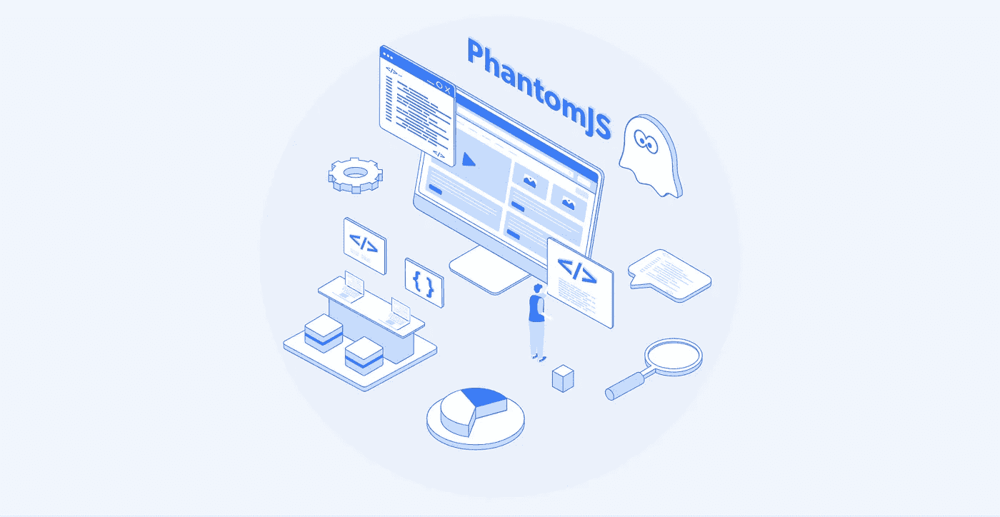
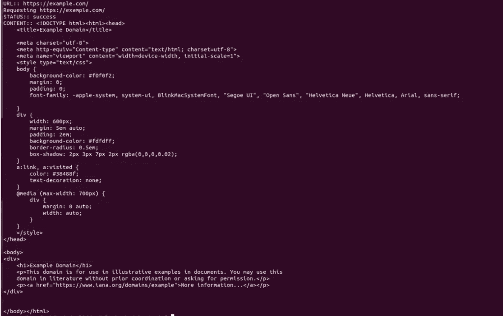

# 如何用幻想曲刮网站

> 原文：<https://levelup.gitconnected.com/how-to-scrape-websites-with-phantomjs-66c2296547b0>

## 了解如何利用无头 web 浏览器的功能来简化您的 web 数据收集操作以及完全自动化的替代方案



图片由光明数据博客提供

在本文中，我们将讨论:

*   **揭开幻象的神秘面纱**
*   **使用幻想曲进行数据抓取的利与弊**
*   **一步一步的 PhantomJS 数据收集指南**
*   **数据自动化:手动抓取的更简单替代方案**

# 揭开幻象的神秘面纱

PhantomJS 是一个无头网络浏览器。这意味着没有图形用户界面(GUI)，相反，它只在脚本上运行(使它更精简、更快速，从而更高效)。它可以用来自动化使用 JavaScript (JS)的不同任务，比如测试代码或收集数据。

对于初学者，我建议首先在 CLI 中使用“npm”在您的计算机上安装 PhantomJS。您可以通过运行以下命令来实现这一点:

npm 安装 phantomjs -g

现在' Phantomjs '命令将可供您使用。

# 使用幻想曲进行数据爬行的利与弊

PhantomJS 有很多优点，包括“无头”,正如我在上面解释的那样，这使得它更快，因为不需要加载图形来测试或检索信息。

**幻象可以被有效地使用，以便完成:**

# 屏幕捕获

PhantomJS 可以帮助自动捕捉和保存 png、JPEGs 甚至 gif。该功能使得执行前端用户界面/体验保证变得更加容易。例如，您可以运行命令行:Phantomjs amazon.js，以便收集竞争对手产品列表的图像，或者确保您公司的产品列表正确显示。

# 页面自动化

这是 PhantomJS 的一个主要优势，因为它帮助开发人员节省了大量时间。通过运行像 Phantomjs userAgent.js 这样的命令行，开发人员可以编写和检查与特定网页相关的 js 代码。节省时间的主要优势是这个过程可以自动完成，甚至不需要打开浏览器。

# 测试

在测试网站时，PhantomJS 是有利的，因为它简化了过程，就像其他流行的 [**web 抓取工具，如 Selenium**](https://brightdata.com/blog/how-tos/using-selenium-for-web-scraping) 。没有 GUI 的无头浏览意味着，通过在命令行级别发现和提交错误代码，可以更快地扫描问题。

开发人员还 [**将 PhantomJS**](https://github.com/ariya/phantomjs) 与不同类型的持续集成(CI)系统集成，以便在部署之前测试代码。这有助于开发人员实时修复损坏的代码，确保项目运行更加顺畅。

# 网络监控/网络数据收集

幻像还可以用来监控网络流量/活动。许多开发人员对其编程的方式有助于收集目标数据，例如:

*   特定网页的性能
*   当添加/删除代码行时
*   股票价格波动数据
*   [**刮抖音**](https://brightdata.com/products/data-collector/website/tiktok) 等网站时的影响者/参与度数据

使用幻像的一些缺点包括:

*   恶意方可以利用它来执行自动攻击(主要是因为它不使用用户界面)
*   当涉及到全周期/端到端测试和功能测试时，有时会被证明是棘手的。


光明数据博客提供

# 一步一步的幻想曲数据收集指南

PhantomJS 在 NodeJS 开发人员中很受欢迎，所以我们带来了一个如何在 NodeJS 环境中使用它的例子。该示例显示了如何从 URL 获取 HTML 内容。

# 第一步:安装 package.json 并安装 npm 包

创建一个项目文件夹，并在其中创建一个“package.json”文件。

```
{
"name": "phantomjs-example",
"version": "1.0.0",
"title": "PhantomJS Example",
"description": "PhantomJS Example",
"keywords": [
  	"phantom example"
],
"main": "./index.js",
"scripts": {
	"inst": "rm -rf node_modules && rm package-lock.json && npm install",
	"dev": "nodemon index.js"
},
"dependencies": {
	"phantom": "^6.3.0"
}
}
```

然后在您的终端中运行这个命令: **$ npm install** 。它将在您的本地项目文件夹“node_modules”中安装 Phantom。

# 第二步:创建一个虚幻的 JS 脚本

创建 JS 脚本，并将其命名为“index.js”

```
const phantom = require('phantom');const main = async () => {
  const instance = await phantom.create();
  const page = await instance.createPage();
  await page.on('onResourceRequested', function(requestData) {
    console.info('Requesting', requestData.url);
  }); const url = 'https://example.com/'; 
  console.log('URL::', url); const status = await page.open(url);
  console.log('STATUS::', status); const content = await page.property('content');
  console.log('CONTENT::', content); await instance.exit();
};main().catch(console.log);
```

# 第三步:运行 JS 脚本

要启动这个脚本，在您的终端中运行: **$ node index.js** 。结果将是 HTML 内容。



来源: [**npmjs**](https://www.npmjs.com/package/cheerio)

# 数据自动化:手动 web 抓取的更简单替代方案

当谈到 [**大规模收集数据**](/web-scraping-and-the-art-of-war-5-tools-that-will-help-your-bot-win-c2a3840d8b71) 时，一些公司可能更喜欢使用幻想曲。

其中包括:

1.  代理服务器:使用代理服务器的网络抓取是有益的，因为它可以让用户大规模收集数据，提交无限数量的并发请求。代理还可以帮助解决目标站点阻塞，如速率限制或基于地理位置的阻塞。在这种情况下，企业可以利用特定国家/城市的移动和住宅 IP/设备来路由数据请求，使他们能够检索更准确的面向用户的数据(例如，竞争对手的定价、广告活动和谷歌搜索结果)。
2.  **现成可用的数据集:** [**数据集**](https://brightdata.com/products/datasets) 本质上是已经收集好的‘信息包’，准备交付给算法/团队立即使用。它们通常包括来自目标站点的信息，并从 web 上的相关站点得到丰富(比如多个供应商和各种电子商务市场中相关类别的产品信息)。数据集还可以定期刷新，以确保所有数据点都是最新的。这里的主要优势是在数据收集行为上投入的时间/资源为零，这意味着可以将更多的时间花在数据分析和为客户创造价值上。
3.  **全自动数据收集器:**Bright Data 的数据收集器是一个零代码、零基础设施、可定制的数据收集解决方案。这种工具使公司能够积极参与网络数据收集过程，而不必担心软件/硬件的开发和维护。这三步过程包括选择目标站点、收集时间(实时或预定)、决定输出格式( **JSON、CSV、HTML 或 Microsoft Excel** )，以及将数据交付到任何你方便的地方(webhook、电子邮件、亚马逊 S3、谷歌云、微软 Azure、SFTP 或 API)。