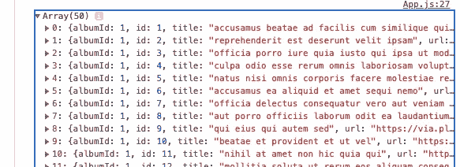
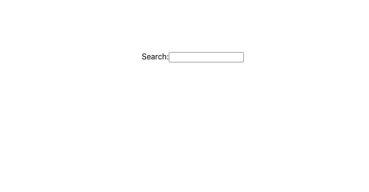
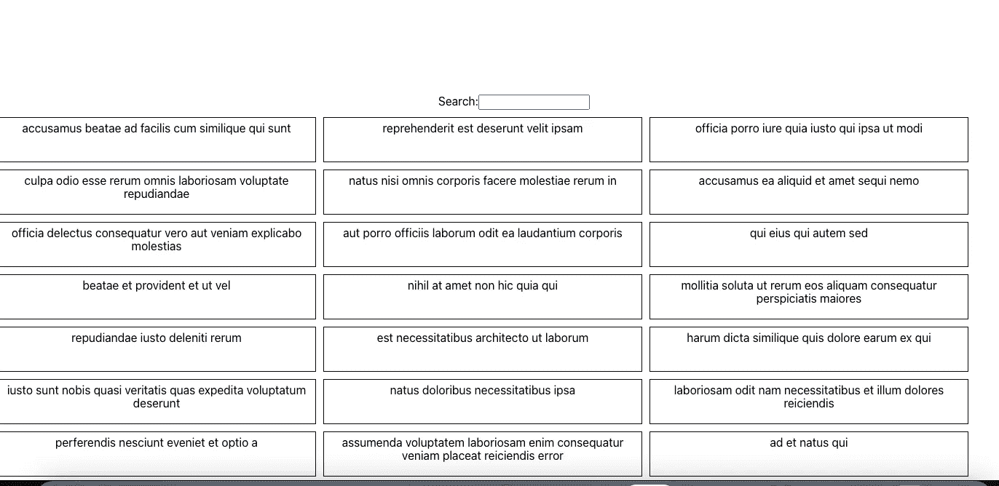
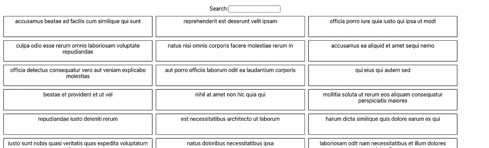
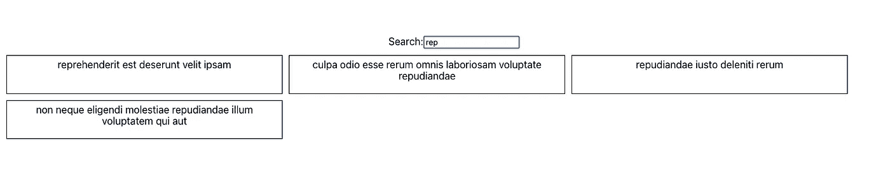

# 如何在 React 中搜索/过滤数据

> 原文：<https://levelup.gitconnected.com/how-to-search-filter-through-data-in-react-26f1545fe3a1>

在本文中，我将从头开始向您展示如何在 React 中实现可搜索/过滤的数据列表。


我们需要做的第一件事是创建一个 react 项目。为此，请在桌面上创建一个包含该项目的文件夹。此外，在终端中导航到该文件夹，然后输入以下命令。

```
npx create-react-app reactsearchable
```

现在，在您选择的代码编辑器中打开项目。

为了在列表中显示一些数据，我们将使用一个 API 链接，从这个链接返回图像和这些图像的标题。

[https://jsonplaceholder.typicode.com/albums/1/photos](https://jsonplaceholder.typicode.com/albums/1/photos)

现在打开 App.js 文件并添加下面的导入。

```
import React,{useState} from 'react';
```

我们将使用钩子“useState”来保存从 API 返回的数据以及从搜索返回的数据。

下一步是在 App 组件中创建两个状态。第一个状态将保存我们从 json 占位符中检索的所有信息，第二个状态将保存第一个状态的副本，然后当我们在数据中搜索一个单词时，第二个状态的值将发生变化。

```
const [allData,setAllData] = useState([]);const [filteredData,setFilteredData] = useState(allData);
```

此外，在 App 组件中创建一个箭头函数，如下所示，该函数将在 TextInput 组件的 onChange 方法上运行。

```
const handleSearch = (event) =>{ }
```

接下来我们将安装一个名为 ***axios*** 的包来处理 API 数据的检索。

```
npm install axios
```

安装完成后，你可以像下面这样在 App.js 中导入 axios。

```
import axios from 'axios';
```

我们现在将导入并使用一个名为 useEffect 的 React 挂钩，这将用于实现一个 ***副作用*** ，并在 App.js 组件呈现后从 API 中检索数据。所以现在我们的 import 语句将如下所示。

```
import React, { useState, useEffect } from 'react';
```

下一步是实现 useEffect，并给它一个回调函数和一个空数组作为第二个参数。

```
useEffect(() => {}, []);
```

现在，在这个 useEffect 钩子中，我们需要使用 axios 向 API 发出请求，然后将 API 调用的响应设置为我们创建的第一个和第二个状态。

```
useEffect(() => {axios('https://jsonplaceholder.typicode.com/albums/1/photos')}, []);
```

因为 axios 返回一个承诺，所以我们需要添加一个 then 和 catch，以便在响应成功或失败时做一些事情。

所以现在我们的 axios 将看起来如下。

```
useEffect(() => {axios('https://jsonplaceholder.typicode.com/albums/1/photos').then(response => {console.log(response.data)setAllData(response.data);setFilteredData(response.data);}).catch(error => {console.log('Error getting fake data: ' + error);})}, []);
```

在我们的 ***然后*** 中，我们获取响应参数，并将***response . data***属性(将等于一组包含关于来自 API 的数据的各种键和值的对象)设置为第一个和第二个状态。

如果现在使用命令运行项目。

```
npm start
```

打开浏览器的开发工具并检查控制台，您应该会看到来自 API 的大量数据。



除了将代码放到 useEffect 中，我们还可以将它移动到一个函数中，在 useEffect 中运行，以使代码更干净，但这只是暂时的。

我们的下一步是用下面的代码替换 App 函数中的代码。这将为我们提供一个简单的、居中的输入文本框来输入我们的搜索查询。输入文本框元素将实现我们之前创建的 ***handleSearch*** 函数。它将用于*onChange*事件，该事件允许我们监听输入值的变化，并将这个新值传递给我们的 ***handleSearch*** 函数。**

```
**<div className="App"><div style={{ margin: '0 auto', marginTop: '10%' }}><label>Search:</label><input type="text" onChange={(event) =>handleSearch(event)} /></div></div>**
```

**所以现在你的项目页面应该看起来像下面这样。**

****

**很神奇吧？**

**好的，那么我们的下一个任务是在屏幕上展示我们检索到的数据。为此，我们将映射到 ***filteredData*** 状态，并返回一个包含从 API 返回的 ***title*** 属性的 div，并将 div 的键设置为等于返回的 id。我们可以将这个 jsx 放入它自己的组件中。在真实的应用程序中，您很可能会这样做。现在我们的应用程序组件看起来如下。**

```
**<div className="App"><div style={{ margin: '0 auto', marginTop: '10%' }}><label>Search:</label><input type="text" onChange={(event) =>handleSearch(event)} /></div><div style={{padding:10}}>{filteredData.map((value,index)=>{return(<div key={value.id}><div style={styles}>{value.title}</div></div>)})}</div></div>**
```

**我们还需要添加一些 css 来使信息看起来更好看。**

**在 App 组件的 return 语句之前添加以下对象。**

```
**const styles = {display:'inline',width:'30%',height:50,float:'left',padding:5,border:'0.5px solid black',marginBottom:10,marginRight:10}**
```

**现在从 div 中删除内联样式，并用 styles 对象替换它。**

```
**<div><div style={styles} key={value.id}>{value.title}</div></div>**
```

**现在，在这样做之后，你应该看到以下内容:)**

****

**这个设计不会在 dribbble 网站上获奖，但现在已经足够了。**

**我们的最终任务是在这个数据列表上实现搜索/过滤功能。**

**在 ***handleSearch*** 函数中，我们需要检索传递到我们函数中的值，因此创建一个名为 ***value*** 的变量，它等于下面的值，并将值设置为小写。**

```
**let value = event.target.value.toLowerCase();**
```

**然后我们需要创建一个数组来保存被搜索数据的返回值。**

```
**let result = [];**
```

**我们将对 allData 状态进行过滤。所以我们将返回一个数组值。在过滤器内部，我们将对 allData 状态中的 ***title*** 属性进行过滤。在其他 API 中，您可能希望根据不同的属性进行过滤，例如相册名称、名字。您还可以使用||(或运算符)过滤多个键/属性，但是对于本例，我们将只过滤 ***标题*** 。**

**为此，我们将设置结果等于***all data . filter*****

```
**result = allData.filter**
```

**然后，我们将把数据作为参数传递给 filter 的回调函数，该函数表示数组中的每一项。**

```
**result = allData.filter((data) => {});**
```

**在过滤器内部，我们将返回一个数组，其中包含的值等于在搜索框中输入的值。因此，如果用户输入“arm ”,那么结果变量应该包含一个数组，该数组包含包含单词 arm 的值。**

**所以过滤器的内部看起来像下面这样。**

```
**return data.title.search(value) != -1;**
```

**这里我们查看数组中每个元素的 title 属性，然后在 title 属性中搜索用户在文本框中输入的值，如果值不等于-1，将返回该值。**

**的。search 函数搜索参数中指定的字符串，因此在我们的例子中，我们要搜索的值在 data.title 属性中，我们要查看用户在 textbox 中输入的内容是否在 data.title 属性中。的。如果找不到匹配的搜索，search 方法返回-1，所以我们返回与搜索条件匹配的值，因为它们不等于-1，因为会找到一些值。**

**然后我们需要将过滤后的数据状态设置为等于结果值，并将过滤后的数据状态设置为等于 ***结果*** 变量。**

```
**const handleSearch = (event) => {let value = event.target.value.toLowerCase();let result = [];console.log(value);result = allData.filter((data) => {return data.title.search(value) != -1;});setFilteredData(result);}**
```

**这就是我们的应用程序。我将展示一个简单的例子。**

****

**我将搜索单词“rep ”,如您所见，它返回列表中标题中带有单词“rep”的所有值。**

****

**这是一个如何使用 React 搜索列表的基本示例，有多种方法可以做到这一点，但我想我只会展示一种方法，如果我的文章写作有任何可以改进的地方，请随时让我在回复中知道，祝你愉快，如果你喜欢这篇文章，记得鼓掌:)**

**也可以随意看看我自己的博客——https://simplyreact.uk/**

**谢谢你。**

# **分级编码**

**感谢您成为我们社区的一员！升级正在改变技术招聘。 [**在最好的公司**](https://jobs.levelup.dev/talent) **找到你的完美工作**。**

**[](https://jobs.levelup.dev/talent) [## 提升——改变招聘流程

### 🔥让软件工程师找到他们热爱的完美角色🧠寻找人才是最痛苦的部分…

作业. levelup.dev](https://jobs.levelup.dev/talent)**