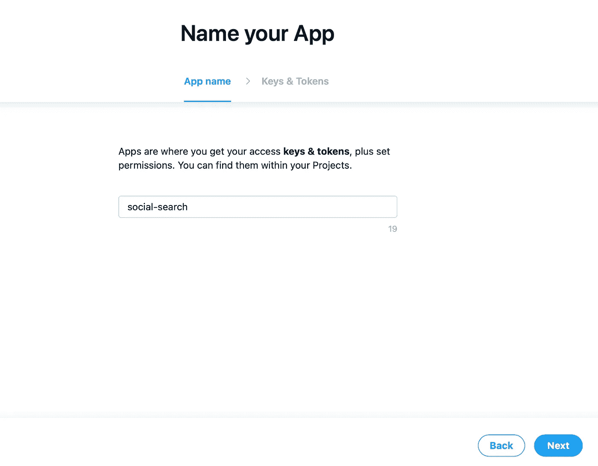
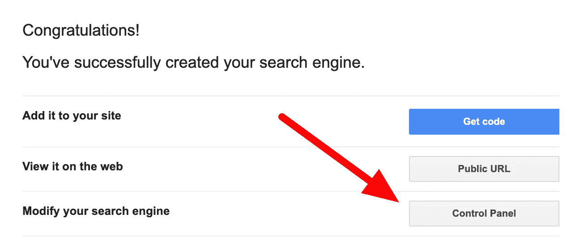

# 如何使用 Node.js 搜索不同的社交媒体平台

> 原文：<https://levelup.gitconnected.com/how-to-search-through-different-social-media-platforms-with-node-js-5a31b1f49b3d>


*本文原载于* [*我的个人博客*](https://blog.shahednasser.com/how-to-search-through-different-social-media-platforms-with-node-js/) *。*

在本教程中，我们将介绍如何在 Twitter、Instagram、Tumblr 和 Pinterest 中进行搜索。我们将设置一个带有`express`的服务器，通过简单的设置来演示其功能。

你可以在 GitHub 库中找到本教程的代码。

# 项目设置

为项目创建一个目录，然后切换到该目录:

```
mkdir social-search 
cd social-search
```

接下来，让我们用 NPM 初始化它:

```
npm init
```

您可以输入任何与您相关的信息，或者保留默认值。

完成后，我们将安装一些我们需要的初始包:

```
npm i express axios dotenv
```

其中`express`是我们的服务器，`axios`是发送请求，我们将在一些社交媒体平台上使用，而`dotenv`是用来在`.env`中存储必要的令牌。

然后，在根目录下创建一个名为`index.js`的文件，内容如下:

```
require('dotenv').config()
const app = require('express')()
const axios = require('axios')

app.listen(3000, function () {
    console.log("started server for social search!")
})
```

这将创建一个监听端口 3000 的简单服务器。启动我们的服务器需要做的最后一件事是在`package.json`中添加一个`start`脚本:

```
"scripts": {
    "start": "node index.js"
  },
```

就是这样！为了测试我们的服务器，让我们运行:

```
npm start
```

如果一切正常，你会看到一条消息说“启动社交搜索服务器！”

现在，我们准备开始通过社交媒体进行搜索。

# 搜索 Twitter

要搜索 twitter，你首先需要在 Twitter 的开发者门户上[创建一个新的应用](https://developer.twitter.com/en/portal/apps/new)。根据这是否是你的第一个应用程序，你可能需要输入一些额外的信息，但通常你只需要输入应用程序的名称。



然后，您将获得 API 密钥和 API 秘密。确保复制它们并保存在某个地方。

创建应用程序后，转到应用程序页面上的“密钥和令牌”选项卡。在“身份验证令牌”下，单击“生成”获取访问令牌和密码。您将获得两个额外的密钥，您需要复制并保存在某个地方。

回到我们的项目，创建保存密钥的`.env`文件:

```
TWITTER_API_KEY= 
TWITTER_API_SECRET= 
TWITTER_ACCESS_TOKEN= 
TWITTER_ACCESS_TOKEN_SECRET=
```

其中前两个密钥是您收到的前两个，后两个是您生成的。

为了方便地访问 Twitter 的 API，我们将使用库 [twitter-api-client](https://github.com/FeedHive/twitter-api-client) 。它提供了一个简单易用的界面来访问 Twitter 的 API。我们需要首先安装 NPM:

```
npm i twitter-api-client
```

现在，转到`index.js`，请求库并初始化 Twitter 客户端:

```
const TwitterClient = require('twitter-api-client').TwitterClient

const twitterClient = new TwitterClient({
    apiKey: process.env.TWITTER_API_KEY,
    apiSecret: process.env.TWITTER_API_SECRET,
    accessToken: process.env.TWITTER_ACCESS_TOKEN,
    accessTokenSecret: process.env.TWITTER_ACCESS_TOKEN_SECRET,
  });
```

由于我们已经在文件的开头添加了`require('dotenv').config()`，我们现在可以使用我们在`.env`到`process.env`中添加的密钥。

接下来，我们将添加一个带`query`参数的新 GET route，我们将使用它来搜索 Twitter:

```
app.get('/twitter/:query', function (req, res) {
});
```

在这个路由的回调函数中，我们需要在 twitter 中搜索包含这个给定查询的 tweets。为了搜索 tweets，我们将使用`twitterClient.tweets.search`，它将包含各种属性的对象作为参数。我们将使用的是`q`,我们将通过它进行查询:

```
const query = req.params.query

twitterClient.tweets.search({
    q: query
}).then((response) => {
    res.send(response)
}).catch((err) => {
        console.error(err)
        res.status(500).send('An error occurred, please try again later.')
})
```

当我们得到回应，我们只是把它送回去。如果出现错误，我们会将其打印到控制台，并发送状态 500 响应。

就是这样！要进行测试，请启动服务器:

```
npm start
```

然后转到我们指定的路由，传递任何您想要的查询。比如 localhost:3000/twitter/cats。如果一切正常，您应该会看到一个保存 tweets 数组的 JSON 对象。


您可以查看 twitter-api-client 的[文档，了解更多可以传递的选项、响应等…](https://github.com/FeedHive/twitter-api-client/blob/main/REFERENCES.md#twitterclienttweetssearchparameters)

# 搜索 Instagram

Instagram APIs 一塌糊涂。长话短说，现在有了可以通过 [Instagram Graph API](https://developers.facebook.com/docs/instagram-api) 访问的[标签搜索](https://developers.facebook.com/docs/instagram-api/guides/hashtag-search/)。然而，这只能让你搜索某个用户的帖子，而不是一般的搜索。更不用说这个 API 需要您访问一堆端点，以便最终获得带有您正在查询的标签的帖子。

还有另一种非官方的方式来搜索 Instagram。您可以在[https://www.instagram.com/explore/tags/KEYWORD/?__a=1](https://www.instagram.com/explore/tags/test/?__a=1)找到一个端点，当您用查询替换关键字时，您将得到一个 JSON 响应，其中包含所有使用 hashtag 的帖子。

我们将创建一个新的端点，允许我们通过 Instagram 进行搜索:

```
app.get('/instagram/:query', function (req, res) {

});
```

在回调中，我们将使用`axios`向上面提到的端点发送一个 GET 请求，然后在收到响应后发回:

```
const query = req.params.query

axios.get('https://www.instagram.com/explore/tags/' + query + '/?__a=1')
        .then((response) => {
            res.send(response.data)
        })
        .catch((err) => {
            console.error(err)
            res.status(500).send('An error occurred, please try again later.')
        })
```

就是这样。要进行测试，请启动服务器:

```
npm start
```

然后，转到我们刚刚创建的路由，向它传递您想要的查询。比如 localhost:3000/instagram/cats。如果一切都做得正确，响应将是一个 JSON 对象，其中包含使用标签 cats 的帖子。

# 搜索 Tumblr

要搜索 Tumblr，首先[注册一个新的应用](https://www.tumblr.com/oauth/apps)。你需要一个 tumblr 账户来做这件事。您必须输入应用程序名称、应用程序 URL(您只需输入 [http://example.com)、](http://example.com),)等信息…

完成后，您将被重定向到应用程序页面，并显示新创建的应用程序。您可以看到 OAuth 消费者密钥。复制并添加到`.env`:

```
TUMBLR_CONSUMER_KEY=
```

要通过标签搜索文章，我们可以使用`[/tagged](https://www.tumblr.com/docs/en/api/v2#tagged--get-posts-with-tag)` [端点](https://www.tumblr.com/docs/en/api/v2#tagged--get-posts-with-tag)。我们将把 API 键和标签传递给它，API 键是我们刚刚添加到`.env`中的消费者键，标签是我们正在搜索的查询。

首先，我们将创建新的 GET 路由:

```
app.get('/tumblr/:query', function (req, res) {
    const query = req.params.query
});
```

像往常一样，我们正在创建一个将查询作为参数的路由。

然后，我们将使用`axios`向 Tumblr 的`/tagged`端点发送 GET 请求，并向其传递参数，如上所述:

```
axios.get('https://api.tumblr.com/v2/tagged?tag=' + query + '&api_key=' + process.env.TUMBLR_CONSUMER_KEY)
        .then((response) => {
            res.send(response.data)
        })
        .catch((err) => {
            console.error(err)
            res.status(500).send('An error occurred, please try again later.')
        })
```

和以前一样，我们只是在收到响应后将其发送回去。

要进行测试，请启动服务器:

```
npm start
```

然后，转到我们创建的路由，向它传递您想要的查询。比如 localhost:3000/tumblr/cats。如果一切正常，响应将是一个 JSON 响应，带有一组使用标记 cats 的帖子

# 搜索 Pinterest

Pinterest 没有允许你搜索他们的 pin 的 API。要搜索 Pinterest，我们必须使用谷歌的定制搜索 JSON API。这个 API 允许您检索 JSON 格式的搜索结果。我们将用它来搜索 Pinterest。这不是最优的，但在我写这篇文章的时候，这是最简单的方法。你应该注意到，这个 API 每天免费提供 100 个查询，那么每增加 1000 个查询，你将被收取 5 美元的费用。

首先，你需要得到一个 [API 密匙](https://developers.google.com/custom-search/v1/overview#api_key)来使用。只需点击“获取钥匙”按钮。它将要求您创建一个项目或使用一个现有的项目，然后您将获得一个 API 密钥。复制密钥并将其添加到`.env`:

```
CUSTOM_SEARCH_API_KEY=
```

接下来，你需要创建一个“可编程搜索”。你可以在这里做。您需要输入您要搜索的网站的 URL。在我们的情况下，它将是 pinterest.com。您还可以更改可编程搜索的语言和名称。完成后，单击创建。它会带你到一个页面，向你展示一堆选项。选择“控制面板”按钮。



进入控制面板后，复制“搜索引擎 ID”并将其添加到`.env`:

```
CUSTOM_SEARCH_CX=
```

当我们向 API 发送请求时，我们需要将它作为参数传递。

让我们首先创建查询 Pinterest 的 GET 路径:

```
app.get('/pinterest/:query', function (req, res) {
    const query = req.params.query

});
```

接下来，我们将向自定义搜索 API 端点发送一个请求，向其传递 API 键、搜索引擎 ID CX 以及我们正在搜索的查询:

```
axios.get('https://www.googleapis.com/customsearch/v1?key=' + process.env.CUSTOM_SEARCH_API_KEY + 
        '&cx=' + process.env.CUSTOM_SEARCH_CX + '&q=' + query)
        .then((response) => {
            res.send(response.data.items)
        })
        .catch((err) => {
            console.error(err)
            res.status(500).send('An error occurred, please try again later.')
        })
```

像往常一样，我们只是发回收到的响应。

要进行测试，请启动服务器:

```
npm start
```

然后，转到我们刚刚创建的路由，向它传递一个查询。比如 localhost:3000/pinterest/cats。您将看到一个 JSON 数组，每个对象都有 pin 的标题、到它的链接和其他信息。

# 结论

在本教程中，我们复习了搜索 Twitter、Instagram、Tumblr 和 Pinterest。在下一篇文章中，我们将继续搜索更多的社交媒体平台！