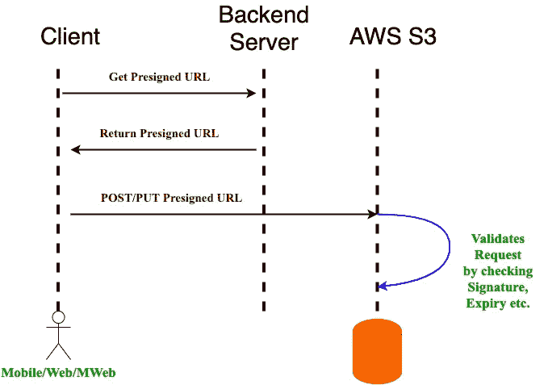

# 如何使用预先设计的 URL 保护 S3 对象

> 原文：<https://levelup.gitconnected.com/how-to-secure-s3-objects-using-a-presigned-url-ea2b0c57ae86>


格伦·卡斯滕斯-彼得斯在 [Unsplash](https://unsplash.com/) 拍摄的照片

假设我们需要公开一个 API，客户端可以上传一个图像文件到 S3，后端服务器需要发送回带有 S3 对象 URL 的响应。我们如何才能安全地实现这一点，而不暴露我们的 S3 桶网址给公众？我写这篇文章是为了解释我们如何利用 [AWS 预先设计的 URL](https://docs.aws.amazon.com/AmazonS3/latest/userguide/ShareObjectPreSignedURL.html)来完成上述任务。

> 如果我们的头脑充满了问题，我们将通过更快地解决它们来更快地进化。

# 先决条件

1.  S3 自动气象站的基本知识
2.  任何编程语言(这里使用 Python)
3.  想不出别的:)

# 为什么需要预先设计的网址？

大多数公司广泛使用亚马逊 AWS S3(简单存储服务)来存储持久且易于访问的对象、文件或更多数据。我们可以轻松地将 AWS S3 桶与几乎任何现代基础设施集成，如移动应用程序、web 应用程序等。如果我们在基础设施中使用 S3，我们需要将安全 URL 返回给 S3 对象，这样，如果有人试图窃取该 URL 并访问 S3 对象，那么它自己会在一段时间后过期。为了制作这个安全的网址，S3 提供了所谓的[预签名网址。](https://docs.aws.amazon.com/AmazonS3/latest/userguide/ShareObjectPreSignedURL.html)

假设我们在 S3 存储桶上托管了一些文件，我们需要向用户公开这些文件，但是我们不想将存储桶设置为开放(公共)，我们还希望对这些文件的访问保持一些控制，例如通过限制用户可以访问文件的时间范围。我们可以向外界公开我们在 S3 存储桶中的文件，而不公开存储桶，而是通过在特定时间段内使用预先设计的 URL 来共享资源。这是一个预先设计好的 URL 的样子。

```
[https://bucket.s3.region.amazonaws.com/myfile.jpg?X-Amz-Algorithm=AWS4-HMAC-SHA256&X-Amz-Credential=random-aws-credential-to-identify-the-signer&X-Amz-Date=timestamp-of-generation-of-url&X-Amz-Expires=validity-from-generation-timestamp&X-Amz-Signature=6ffca338-f5b2-48ad-89ec-4ae462cb46dc&X-Amz-SignedHeaders=host](https://bucket.s3.region.amazonaws.com/myfile.jpg?X-Amz-Algorithm=AWS4-HMAC-SHA256&X-Amz-Credential=random-aws-credential-to-identify-the-signature&X-Amz-Date=timestamp-of-generation-of-url&X-Amz-Expires=validity-from-generation-timestamp&X-Amz-Signature=6ffca338f5b248ad89ec4ae462cb46dc&X-Amz-SignedHeaders=host)
```

格式化的预签名 URL

```
[https://bucket.s3.region.amazonaws.com/myfile.jpg](https://bucket.s3.region.amazonaws.com/myfile.jpg) ?
X-Amz-Algorithm     =   AWS4-HMAC-SHA256 &
X-Amz-Credential    =   random-aws-credential-to-identify-the-signature &
X-Amz-Date          =   timestamp-of-generation-of-url &
X-Amz-Expires       =   validity-from-generation-timestamp &
X-Amz-Signature     =   6ffca338f5b248ad89ec4ae462cb46dc &
X-Amz-SignedHeaders =   host
```

我们可以使用 AWS SDK 功能生成预签名 URL 的签名头和凭证。当有人试图使用预先指定的 URL 访问 S3 文件时，S3 将尝试为指定的凭证计算相同的签名，包括可选的`SignedHeaders`参数，并检查签名是否有效以及链接是否尚未过期。

# 使用 Python 为 S3 桶生成预先设计的 URL

首先，我们来安装 Python ie 的 AWS SDK， [Boto3](https://aws.amazon.com/sdk-for-python/) 。Boto3 使我们的 python 应用程序、库或脚本与 AWS 服务的集成变得容易，AWS 服务包括 S3、EC2、Amazon Dynamo DB 等。

```
pip install boto3
```

现在，我们可以使用下面的代码片段为我们的 S3 桶生成预先设计的 URL。

```
import boto3AWS_S3_REGION = 'ap-south-1'
AWS_S3_BUCKET_NAME = "my_s3_bucket"
AWS_S3_FILE_NAME = "my-file.jpg"
PRESIGNED_URL_EXPIRY = 100 *# in seconds*s3_client = boto3.client('s3', aws_access_key_id=AWS_ACCESS_KEY_ID, region_name=AWS_S3_REGION, aws_secret_access_key=AWS_SECRET_ACCESS_KEY,)presigned_url = s3_client.generate_presigned_url('get_object',    Params={"Bucket": AWS_S3_BUCKET_NAME, "Key": AWS_S3_FILE_NAME}, ExpiresIn=PRESIGNED_URL_EXPIRY) 
```

# 我们如何使用预先设计的 URL 来上传 AWS S3 桶上的资源？

我们可以简单地向用动作“put_object”创建的预先设计的 URL 发出一个 PUT 请求，文件将被安全地上传到 S3。



使用预先指定的 URL 将文件上传到 S3 的框图

让我们首先使用下面的代码片段创建可以将文件上传到 S3 的预先设计的 URL。

```
import boto3s3_client = boto3.client('s3', aws_access_key_id=AWS_ACCESS_KEY_ID, region_name=AWS_S3_REGION,aws_secret_access_key=AWS_SECRET_ACCESS_KEY, config=Config(signature_version='s3v4'))presigned_url = s3_client.generate_presigned_url('put_object',
Params={"Bucket": AWS_S3_BUCKET_NAME, "Key": AWS_S3_FILE_NAME},
ExpiresIn=PRESIGNED_URL_EXPIRY)print presigned_url
```

现在我们可以使用上面预先设计的 URL，并使用下面的代码片段上传文件。

```
import requests

response = requests.put(presigned_url)print "File uploaded successfully!" 
```

# 问候！🙂

我们已经成功地为我们的 S3 桶创建了预先设计的 URL，现在我们可以安全地与我们的客户共享这个 URL。在预先指定的 URL 过期之前，客户端将能够访问资源。此外，客户端能够上传文件到 S3 使用预先指定的网址，直到到期时间。


*   *我们可以使用预先设计的 URL 来生成一个可用于访问我们的 S3 桶的 URL。*
*   *当我们创建一个预先设计好的 URL 并将其与一个特定的动作相关联时。*
*   *当我们与任何人共享预签名的 URL 时，该用户可以执行嵌入在 URL 中的操作，就像他们是原始签名用户一样。*
*   *该 URL 将过期，当其过期时，将无法再访问 S3 文件。*
*   *预签名 URL 的功能仅限于实际创建预签名 URL 的用户的权限。*

# 摘要

为了这篇文章的完整性，让我们快速回顾一下到目前为止我们所学的内容。

*   了解到每次都创建 S3 桶公共是不安全的。
*   了解到不是后端服务器只能上传文件到 S3，而是通过使用预先设计的 URL 客户端也可以上传文件到 S3。
*   我们了解了如何使用预先设计的 URL 安全地与我们的客户共享 S3 文件。
*   我们学会了如何将上传文件到 S3 的责任交给客户。

> 如果你喜欢这篇文章，别忘了为它鼓掌！


请随时在[**Linkedin**](https://www.linkedin.com/in/shubham-kaushik-temp/)**上 ping 我，敬请期待下一期！**