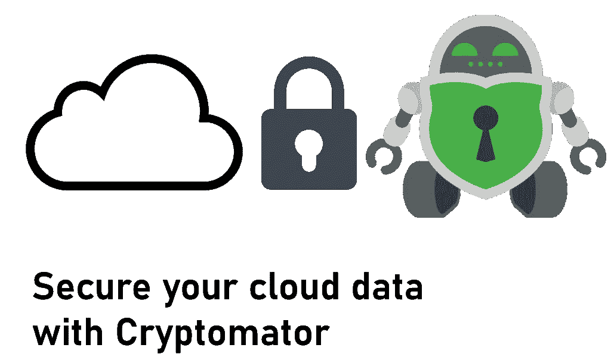
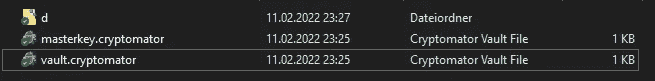
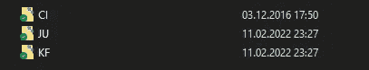
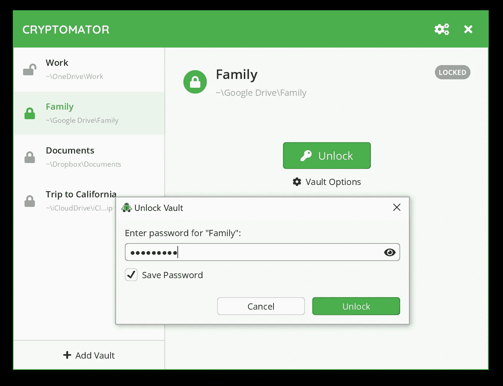
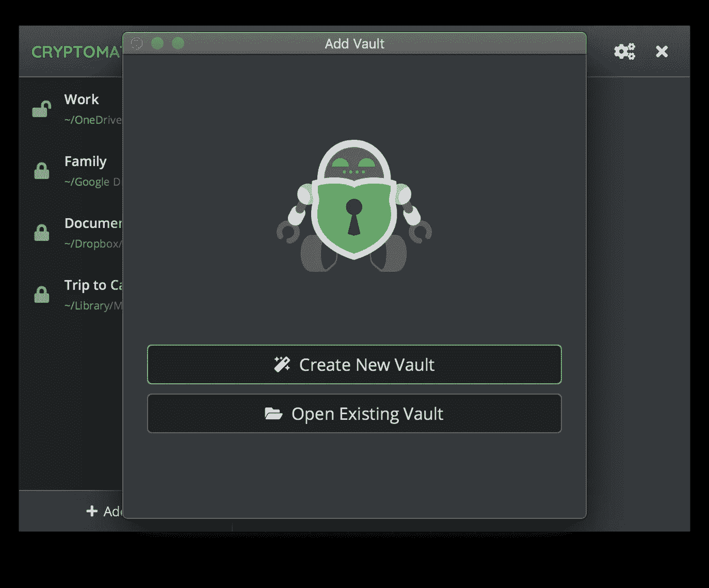
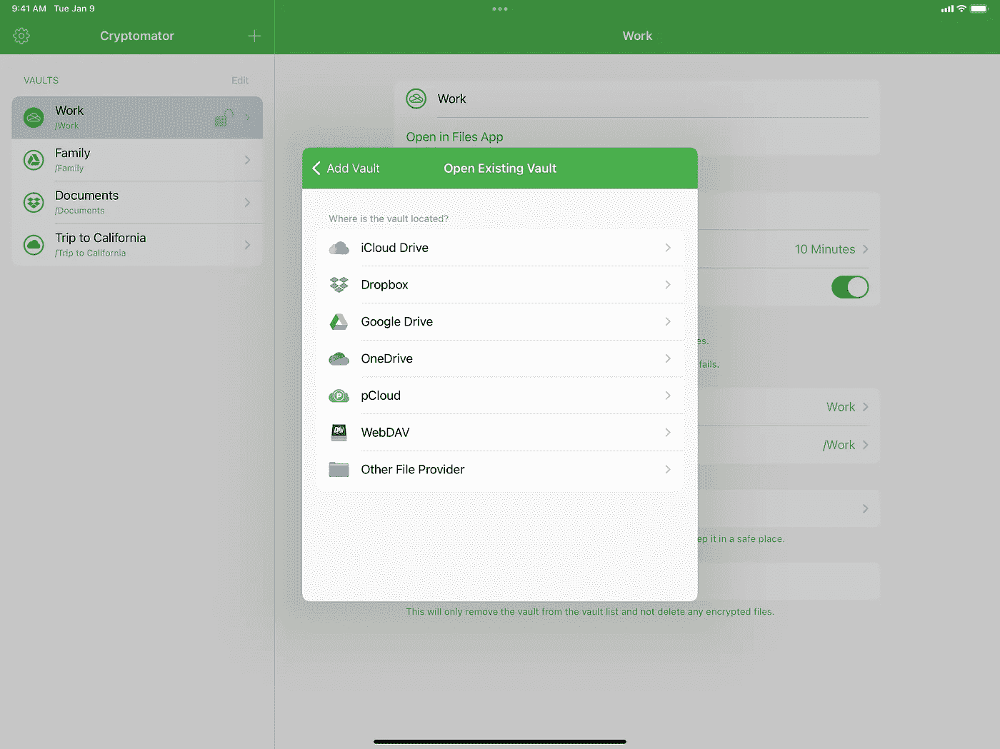

# 如何使用 Cryptomator 保护您的云数据

> 原文：<https://levelup.gitconnected.com/how-to-secure-your-cloud-data-with-cryptomator-35ff2c9709e2>

## 保护您的云数据！

## 如果你使用像微软 OneDrive、谷歌 Drive 或 Dropbox 这样的云存储解决方案，你可以用这个工具来保护你的数据秘密。

许多人使用云存储来存储、共享甚至在线备份他们的数据。当使用最新的手机或电脑时，你很可能会因为使用特定的操作系统而拥有数千兆字节的云存储空间。这些公司“强迫”你使用他们的存储空间，这样如果你没有空间了，你就可以购买升级。

总的来说，这是可以的。但是人们倾向于在云端保存非常私人的数据。由于默认情况下这些服务没有启用或内置加密功能，因此一旦发生数据泄露，您将面临丢失敏感信息的风险。我们谈论的是裸照、信用卡信息、互联网账户登录数据或私人加密钱包密钥。这些信息必须保密，在这篇文章中，我将帮助你做到这一点。

## 你为什么需要安全？

许多大公司都报告说，他们遭受了用户数据被盗的攻击。因此，您应该关心数据保护和安全性，因为很明显，公司无法自行提供。如果黑客攻击了你的云提供商，获得了你的信息，那就是你的问题了。提供商很可能会没事，但如果你的商业计划被盗或照片被泄露，你的整个生活可能会被摧毁。

## 什么是隐码器？

Cryptomator 是一款免费工具，可以在 Windows、macOS、Linux、iOS 和 Android 上运行。它会在你的数据上传到云端之前对其进行加密。该程序是**供应商不可知的**，这意味着它可以与任何在设备上使用本地文件夹系统的云服务一起工作。
该工具的支持和开发由位于德国波恩的初创公司 **Skymatic GmbH** 提供。该产品正在积极开发中，最新版本于 2022 年 4 月 27 日发布。
完整的源代码可以在 [GitHub](https://github.com/cryptomator/cryptomator) 上获得，许可**FOSS**GPLv3。2017 年，对加密库进行了审计。结果可以在这里[找到](https://cryptomator.org/audits/2017-11-27%20crypto%20cure53.pdf)，尽管它可能不再反映当前的实现。
针对不同的业务，通过[捐赠](https://cryptomator.org/donate/)、[赞助](https://cryptomator.org/sponsors/)、[定制企业实施](https://cryptomator.org/enterprise/)实现经济补偿。

## 支持的解决方案列表(无特定顺序)

🔹Dropbox
🔹OneDrive
🔹谷歌驱动
🔹MEGA
🔹pCloud
🔹ownCloud
🔹Nextcloud

## 特征

🔹**即时**文件加密
🔹文件名被加密
🔹文件夹结构混乱
🔹 **100%免费**和**开源**👍
🔹不需要帐户，**不与任何在线服务共享**数据🎉

## 它是如何工作的？

Cryptomator 在设备上创建一个虚拟文件夹，您可以像使用任何常规文件夹一样使用它。当您使用密码解锁文件夹时，您可以访问和修改数据。Cryptomator 动态解密/加密文件。写操作是原子的，这意味着如果失败，所有内容都将被写入，或者什么都不写。在任何时候你的磁盘上都不会有未加密的文件。加密是用 AES-256 算法完成的，这在今天被认为是安全的。没有关于加密被破解的报告。

关于安全架构的更多细节，请看下面的链接。

 [## 安全架构- Cryptomator 1.6.0 文档

### Cryptomator 提供了一个虚拟驱动器。添加、编辑、删除文件，就像您习惯使用任何磁盘驱动器一样。文件是…

docs.cryptomator.org](https://docs.cryptomator.org/en/latest/security/architecture/) 

在下图中，您可以看到 Cryptomator 创建的文件和文件夹。`vault.cryptomator`是将保险库注册到应用程序的标识符。`d`文件夹包含加密数据，包括文件和文件夹名称。

密码文件夹和文件结构

密码器数据文件夹的内容

最新版本可在 [Cryptomator 主页](https://cryptomator.org/downloads/)上获得。Google Play、F-Droid 和 App Store 上都有应用。

解锁 Windows 上 [Cryptomator 中的保险库](https://cryptomator.org/presskit/win-screenshot-1.png)

## 创建新的保管库

🔹打开 Cryptomator 并选择“添加保险库”→“创建新保险库”
🔹选择名称和存储位置
🔹设置密码并创建可选的恢复密钥
🔹保管库将被添加到您的仪表板，您可以使用密码解锁它

## 添加现有保管库

🔹确保您的云数据与您的设备同步
🔹打开 Cryptomator 并选择“添加保险库”→“打开现有保险库”
🔹使用文件浏览器，导航到云文件夹，找到`vault.cryptomator`文件
🔹保管库将被添加到您的仪表板，您可以使用密码解锁它

在 macOS 上的 [Cryptomator 中添加保险库](https://cryptomator.org/presskit/mac-screenshot-2.png)

## 工作流程

🔹打开保险库
🔹编辑文件
🔹锁定金库

保护您的云数据就是这么简单！

[iPad 上的 Cryptomator](https://cryptomator.org/presskit/ipad-screenshot-2.png) 提供商选择

## 可供选择的事物

[Boxcryptor](https://www.boxcryptor.com/) 类似于 Cryptomator。主要的区别在于，Boxcryptor 不是开源的，免费版本只允许一个云提供商，但它有更多的功能，如共享私人数据而不共享密码。网上找到的很多对比似乎有偏差或者不是很准确，建议你自己决定。

[VeraCrypt](https://www.veracrypt.fr/code/VeraCrypt/) (著名的 [TrueCrypt](https://en.wikipedia.org/wiki/TrueCrypt) 的分支)提供强大的加密功能，但没有 Cryptomator 这样的云集成功能。你可以用 VeraCrypt 复制 Cryptomator 的工作流程，但是它会比 Cryptomator 复杂得多。

OneDrive Personal Vault 是 OneDrive 文件夹结构中的一个文件夹，用于存储您的敏感数据。访问需要额外的身份验证来限制不必要的访问，这使得使用保险库比使用 Cryptomator 更复杂。

## 结论

如果你关心云数据的安全和隐私，你应该试试 Cryptomator。它非常易于使用，提供了很好的安全性增强，并且是完全开源的。我从 2017 年开始用产品，一次都没失望过。如果你喜欢这项工作和产品，考虑用捐款来支持他们。

如果你喜欢这篇文章，我会很高兴得到掌声👏(你知道可以拍几次吗？😎)另外，如果你还没有跟上我，我也很感激。

🌲 [linktr.ee](https://linktr.ee/xeladu) | ☕ [咖啡](https://www.buymeacoffee.com/xeladu) |🎁[捐赠](https://www.paypal.com/donate/?hosted_button_id=JPWK39GGPAAFQ) |💻GitHub |🔔[订阅](https://xeladu.medium.com/subscribe)

顺便说一句:如果你还没有 Medium 会员，我推荐你使用[│我的推荐链接◀](https://medium.com/@xeladu/membership) ，因为它会让你访问 Medium 上的所有内容，并以一小部分费用支持我，而不会为你带来任何额外费用。谢谢大家！✨

## 相关故事

 [## 让你对人性失去信心的代码示例

### 在本文中，我想展示一些我多年来收集的代码“瑰宝”。所有的例子都来自生命…

levelup.gitconnected.com](/code-examples-that-will-make-you-lose-faith-in-humanity-a2a36ea9d331)  [## 如何在终端中自定义命令提示符和图标

### 你使用终端吗？你厌倦了枯燥的命令提示符吗？看完这个教程你就不会了！

levelup.gitconnected.com](/how-to-customize-your-command-prompt-and-icons-in-your-terminal-f88ea15a5d58)  [## 作为软件开发人员，我在最初几年学到了一些重要的东西

### 以下是我作为软件开发人员最初几年学到的一些东西。这是关于文档，写作…

xeladu.medium.com](https://xeladu.medium.com/some-important-things-i-learnt-in-my-first-years-as-a-software-developer-638918f60b2c)