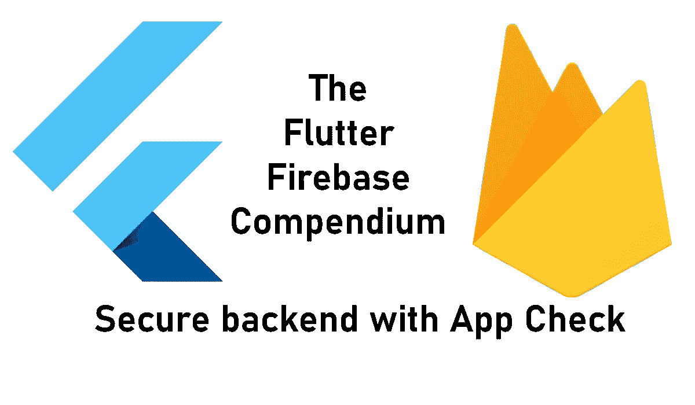
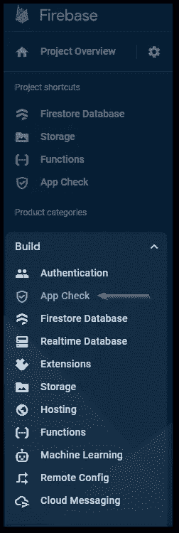
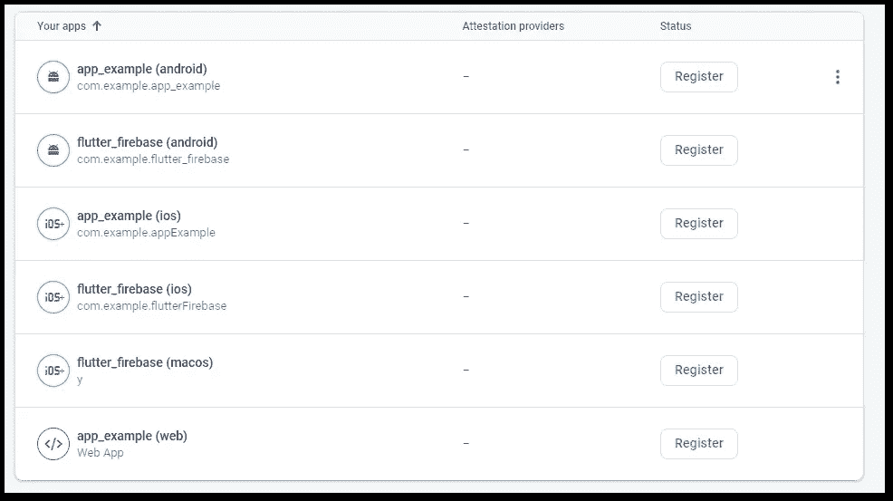
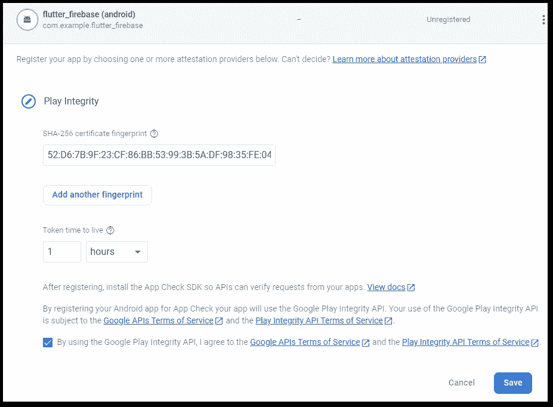
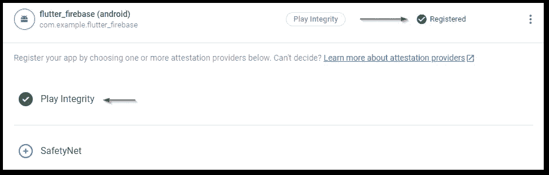
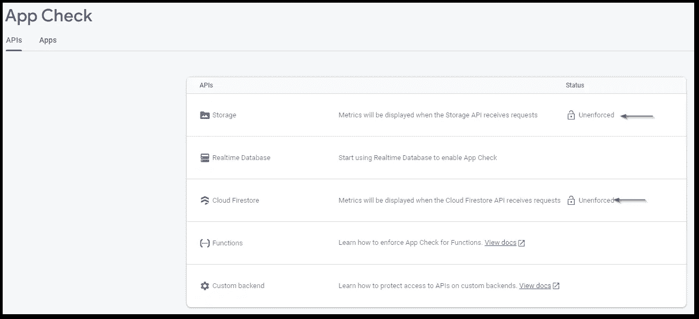
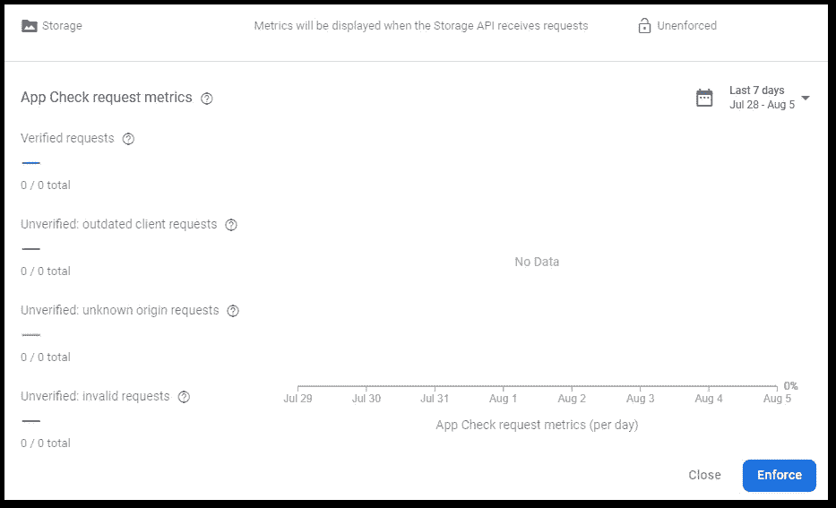
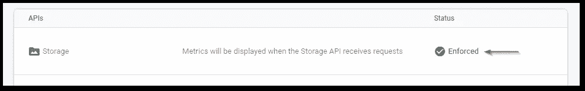
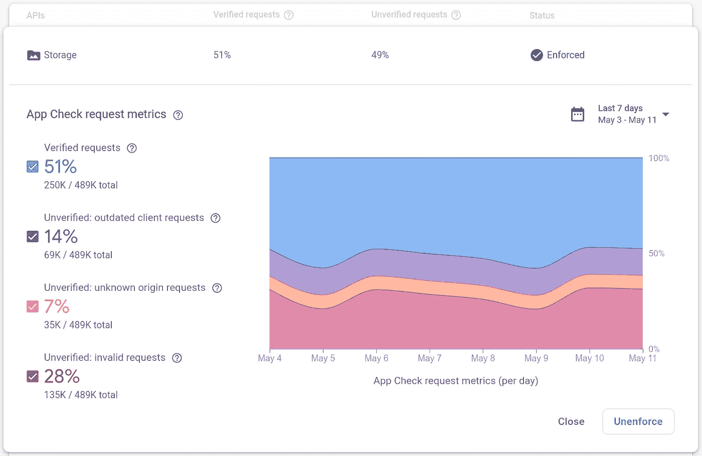

# 如何使用 Flutter 应用程序的应用程序检查来保护您的 Firebase 后端访问

> 原文：<https://levelup.gitconnected.com/how-to-secure-your-firebase-backend-access-with-app-check-for-flutter-apps-b54cbe777fb2>

## 安全是关键！

## 以下是如何通过应用程序检查来防止对 Firebase 后端服务的不必要访问。我将用一个 Flutter 应用程序演示这个设置。



保护您的后端可以为您省去很多麻烦。想想数据丢失或最后的巨额账单。Firebase 提供其服务应用程序检查，以大大降低攻击者成功的可能性。你想知道它是如何工作的吗？那就继续读下去！

```
👉 Do you want all the details? Check out [**my ebook**](https://xeladu.gumroad.com/l/ffc) with in-depth guides about building Flutter apps with Firebase! Buy it on [**Gumroad**](https://xeladu.gumroad.com) now!
```

🔔你已经有一个 Firebase 项目了吗？如果没有，请按照我下面的文章详细介绍所有步骤！

[](/how-to-create-a-firebase-project-and-link-it-with-your-flutter-app-acd826be8356) [## 如何创建一个 Firebase 项目并将其与您的 Flutter 应用程序链接

### 在本文中，我将向您展示如何创建一个 Firebase 项目，以及如何将它与您的 Flutter 应用程序链接起来。

levelup.gitconnected.com](/how-to-create-a-firebase-project-and-link-it-with-your-flutter-app-acd826be8356) 

## App Check 是如何工作的？

Firebase App Check 使用第三方证明提供商，如 [DeviceCheck](https://developer.apple.com/documentation/devicecheck) (苹果)、 [Play Integrity](https://developer.android.com/google/play/integrity) (安卓)或 [reCAPTCHA v3](https://developers.google.com/recaptcha) (Web)，以确保后端只处理经过验证的请求。您的应用程序调用证明提供程序并接收将发送到应用程序检查服务器的证明。App Check 验证证明并返回令牌。您的应用程序会将令牌附加到每个请求。如果令牌过期，验证过程将重新开始。

所有这一切都发生在幕后，除了一些初始配置，你不需要做任何事情。🌞

## App Check 涵盖哪些 Firebase 服务？

App Check 目前支持以下服务:

🔹实时数据库
🔹云火商店
🔹云存储
🔹云函数(仅用于可调用函数)

在之前的文章中，我已经讲过[云 Firestore](https://medium.com/gitconnected/how-to-use-firebase-cloud-firestore-with-a-flutter-app-2110da689e08) 、[云存储](/how-to-easily-store-objects-in-firebase-storage-from-your-flutter-app-deabc475d407)、[云功能](https://medium.com/gitconnected/how-to-work-with-firebase-cloud-functions-from-a-flutter-app-fb818c01b0db)。如果您集成了这些服务之一，您也可以使用应用程序检查。

应用程序检查也可用于保护您自己的非 Firebase 后端。由于这超出了本文的范围，感兴趣的读者可以查看[App Check 文档](https://firebase.google.com/docs/app-check/flutter/custom-resource)了解详情。

## 如何启用证明提供程序？

我们将看看认证提供商[发挥诚信](https://developer.android.com/google/play/integrity)。其他提供程序以类似的方式工作。

首先，在 Firebase 控制台中打开应用检查菜单。



作者提供的 Firebase 控制台菜单截图

然后点击**注册**按钮并选择一个认证提供商，选择您想要启用应用检查的应用。



Firebase 应用程序截图按作者检查应用程序选择

🔹选择**播放完整性**作为提供者

🔹插入您的 SHA256 指纹密钥。要生成密钥，请遵循本页[中的说明。您需要执行命令行程序`keytool`程序，它是 JAVA 运行时环境的一部分。完成后点击**保存**按钮。](https://developers.google.com/android/guides/client-auth?authuser=0&hl=en)



作者在 Firebase 中的游戏完整性设置截图

🔹之后，你会看到游戏完整性的成功注册。



作者在 Firebase 中完成游戏完整性设置的截图

💡**令牌生存时间注意事项**

🔹*较短的时间间隔减少了攻击者滥用泄漏或破解令牌的时间。
🔹**较短的时间间隔需要更频繁的应用检查令牌更新，这会耗费时间
🔹***较短的时间间隔需要更频繁的证明提供程序调用，这会更快地耗尽可用配额

## 如何对特定服务实施应用检查

添加证明提供程序后，您需要对所需的服务执行应用程序检查，以便最终在 Firebase 中激活它。大约需要 15 分钟才能完成该过程。之后，只有应用程序检查设置正确的应用程序才能访问您的安全后端服务。

🔹转到**API**选项卡，选择一个服务，例如**存储**。



Firebase 中 API 选项卡的截屏(按作者)



作者对 Firebase 中存储的应用程序检查请求概述的屏幕截图

🔹点击**执行**按钮，大约 15 分钟后，只有注册的应用程序才能访问你的 Firebase 存储后端。



作者在 Firebase 中强制存储 API 的屏幕截图

就是这样。您的后端是安全的！💪

💡请确保使用 App Check 注册您的应用程序的所有项目。仅仅注册 Android 应用程序是没有意义的，因为那样的话，你的 iOS 应用程序用户将无法访问 Firebase 后端！

## 如何在一个颤振 App 中设置 App Check？

按照以下几个步骤，让一个 Flutter 应用程序访问 App Check secure Firebase 后端服务。

1.  安装软件包 [firebase_app_check](https://pub.dev/packages/firebase_app_check) 。
2.  在您的`main()`函数中添加初始化代码。

确定，`FirebaseAppCheck`在 `Firebase`之后被初始化 ***。***

就是这样！从现在开始，您的 Firebase 应用程序检查仪表板应该监控传入的请求。

## 我已经使用 Firebase 认证。为什么我需要 App Check？

认证是识别**用户**，应用检查是识别**应用或设备**。这里有一个区别的小例子:

假设您创建了一个应用程序，其中有一个成员区，每个用户都有自己唯一的登录凭证。

如果用户 A 登录，他/她只能编辑用户 A 的数据。如果用户 B 登录，他/她只能编辑用户 B 的数据。

但他们都可以访问后端，因为应用程序通过了 App Check 的验证例程。如果 App Check 拒绝访问，任何用户都无法访问他或她的数据。💡

## 我的应用程序已经发布。还能集成 App Check 吗？

发布包含应用检查代码的新应用版本，**但不要在 Firebase 控制台中启用应用检查**。您需要给用户时间来获得更新。否则，从您为项目启用应用程序检查的那一刻起，您就会排除使用旧应用程序版本的用户。您可以在 App Check 菜单中监控自适应进度。高百分比的**验证请求**是用户获得更新的良好指标。



来自 [Google Firebase](https://firebase.google.com/static/docs/app-check/app-check-metrics.png) 的 Firebase 应用程序检查请求指标截图

## 加油！我真的需要 App 检查吗？

嗯，看情况。只是你为自己开发的一个私人 app，还是一个小受众？那你也许可以跳过它。但是一旦你开始用你的应用程序赚钱，你肯定应该考虑改善你的安全措施。仅仅一个事件就能让你的 Firebase 账单变得疯狂，因为有人不断地访问你的资源。或者想想无法轻易恢复的重要数据的丢失。之后，你会因为没有花 30 分钟到 1 小时来设置应用检查或其他安全协议而感到愤怒。

问问你自己这些问题:

🔹最坏的情况是什么？
🔹从最坏的情况中恢复需要多少成本？
🔹预先实施安全措施会不会更便宜？

然后，如果你需要 App 检查，你就知道答案了👍

## 结论

安全总比后悔好。App Check 通过额外的安全层保护您的后端，以最大限度地降低数据丢失或月底巨额账单的风险。如果你重视你的后端资源和你的神经，考虑使用它。万一遭到攻击，你会庆幸自己花了一个小时来保护机制。

您可以在我的 GitHub 页面上找到完整的示例源代码。

[](https://github.com/xeladu/flutter_firebase) [## GitHub - xeladu/flutter_firebase:一个用于与各种 firebase 服务交互的 flutter 演示应用程序

### 这是附带代码示例的 Flutter Firebase 概要的配套应用程序。颤振燃烧基地纲要是一个…

github.com](https://github.com/xeladu/flutter_firebase) 

这篇文章是 Flutter Firebase 纲要的一部分，其中有许多教程和操作指南，介绍了 Firebase 与 Flutter 应用程序相结合的可能性。


xeladu

## 了解 Flutter 和 Firebase 的威力

[View list](https://xeladu.medium.com/list/learn-about-the-power-of-flutter-and-firebase-2ec07e25baba?source=post_page-----b54cbe777fb2--------------------------------)13 stories

用我的电子书为 Flutter 开发者充分利用 Firebase。

[](https://xeladu.gumroad.com/l/ffc) [## 颤振燃烧基础概要

### 这本电子书着重于让你能够在你的应用中集成 Firebase 云服务。当你想要的时候，它是一个跳跃的开始…

xeladu.gumroad.com](https://xeladu.gumroad.com/l/ffc) 

[***通过我的推荐链接加入成千上万的媒体会员，每月只需 5 美元就可以阅读你想阅读的文章！***](https://medium.com/@xeladu/membership)

[](https://medium.com/@xeladu/membership) [## 通过我的推荐链接加入 Medium-xela du

### 只需点击一下，就可以通过会员资格访问数千篇文章！您的会员资格只需 5 美元一张…

medium.com](https://medium.com/@xeladu/membership) 

点击 [**此处**](https://xeladu.medium.com/subscribe) 将我所有的新文章发送到你的邮箱🔔浏览[我的 Gumroad 商店](https://xeladu.gumroad.com/)寻找有趣的编程素材🏬


xeladu

## 适合初学者的颤振文章

[View list](https://xeladu.medium.com/list/flutter-articles-for-beginners-a040ea777956?source=post_page-----b54cbe777fb2--------------------------------)24 stories

xeladu

## 软件工程师的高级颤振文章

[View list](https://xeladu.medium.com/list/advanced-flutter-articles-for-software-engineers-f074879fdef3?source=post_page-----b54cbe777fb2--------------------------------)9 stories

# 分级编码

感谢您成为我们社区的一员！在你离开之前:

*   👏为故事鼓掌，跟着作者走👉
*   📰查看[升级编码出版物](https://levelup.gitconnected.com/?utm_source=pub&utm_medium=post)中的更多内容
*   🔔关注我们:[Twitter](https://twitter.com/gitconnected)|[LinkedIn](https://www.linkedin.com/company/gitconnected)|[时事通讯](https://newsletter.levelup.dev)

🚀👉 [**加入升级达人集体，找到一份惊艳的工作**](https://jobs.levelup.dev/talent/welcome?referral=true)