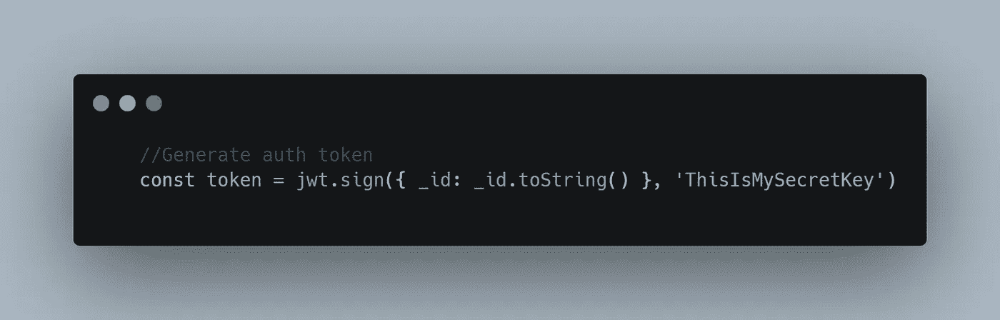
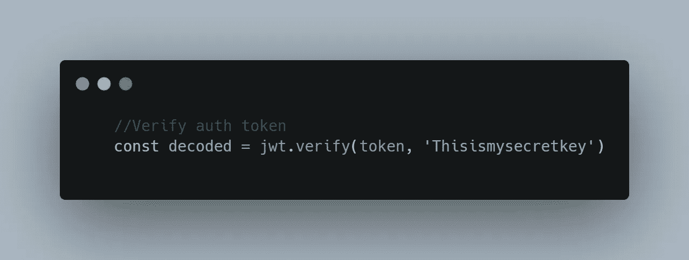

# 如何使用 JWT 保护您的 REST API

> 原文：<https://levelup.gitconnected.com/how-to-secure-your-rest-api-using-jwt-a923ba4a497e>


照片由 [Unsplash](https://unsplash.com?utm_source=medium&utm_medium=referral) 上的[émile Perron](https://unsplash.com/@emilep?utm_source=medium&utm_medium=referral)拍摄

您可能听说过 JSON Web Token (JWT)是当前保护 API 的最先进技术。

所以如果你打算使用它，理解它的工作原理是很重要的。这是一个将帮助你在下一个项目中从“理解 JWT 是什么”到“实际执行它”的指南。

# 什么是 API 认证？

API 身份验证是对试图访问您的私有 API 调用的用户进行身份验证的过程，然后将数据直接提供给他们。

这可以通过使用 JSON Web 令牌来实现。为每个用户分配一个唯一的令牌，当用户登录时，每当用户试图呼叫专用路由时，该令牌将被提供给服务器以验证用户。

假设您要入住一家酒店，而不是一个 API。“令牌”是你得到的塑料酒店安全卡，它允许你进入你的房间和酒店设施，但不能进入其他任何人的房间。

当你结帐离开旅馆时，你把卡还给我。这类似于注销。

# JSON Web Token 结构是什么？

JSON Web 令牌由点(`.`)分隔的三个部分组成，它们是:

*   页眉
*   有效载荷
*   签名

因此，JWT 通常如下所示。

`xxxxx.yyyyy.zzzzz`

让我们分别看看每个部分:

**表头**

标题由两部分组成:

1.  令牌的类型，即 JWT
2.  正在使用的签名算法，如 HMAC SHA256 或 RSA。

例如:

```
{
  "alg": "HS256",
  "typ": "JWT"
}
```

然后，这个 JSON 被 **Base64Url** 编码以形成 JWT 的第一部分。

**有效载荷**

Payload 可以包含您喜欢的任何数据，但是您可以只包含 userId，因为它只用于 API 认证。有效负载中的数据也以 Base64Url 编码。有效载荷是不安全的，任何人都可以解码它，这就是为什么我们不存储用户的任何敏感信息，如电子邮件或密码。

**签名**

要创建签名部分，您必须获取编码的报头、编码的有效载荷、秘密、报头中指定的算法，并对其进行签名。

例如，如果您想使用 HMAC SHA256 算法，签名将以如下方式创建:

```
HMACSHA256(
  base64UrlEncode(header) + "." +
  base64UrlEncode(payload),
  secret)
```

该签名用于验证消息在传输过程中没有被更改，并且，对于用私钥签名的令牌，它还可以验证 JWT 的发送者是否是他所声称的那个人。

现在我们对 JWT 有了一个概念，让我们转向实际的一面。

# 切实执行 JWT

我们将在任务管理器应用程序的帮助下实现这一点，此处提供了其代码。

认证用户的一般流程如下:

*   客户端向服务器发送用户名/密码组合
*   服务器验证身份验证
*   如果认证成功，服务器创建 JWT 令牌，否则建立错误响应
*   身份验证成功后，客户端会在响应正文中获得 JWT 令牌
*   客户端将该令牌存储在本地存储或会话存储中。
*   从下一次开始，发出任何请求的客户端都会像这样在请求头中提供 JWT 令牌。授权:持有人
*   服务器在接收到 JWT 时验证它并发送成功响应，否则出错。

整个认证可以分为两个部分:

1.  生成令牌
2.  验证令牌

**生成令牌**

为了生成令牌*，使用了 sign 方法。*



**验证令牌**

要验证令牌，请使用验证方法。



# 让我们借助一个演示项目来了解一下:

这是一个[任务管理器 api](https://github.com/SwapnilRSharma/task-manager-api) ，它使用

*   表达
*   MongoDB
*   猫鼬
*   jsonwebtokens
*   bcrypt
*   验证器

点击[这里的](https://github.com/SwapnilRSharma/task-manager-api)可以访问所有数据。

**登录**

登录分三步完成:

1.  成功验证后，使用 findByCredentials 方法验证电子邮件和密码。
2.  一个认证令牌(JSON Web 令牌)被生成并存储在数据库中。
3.  返回数据和令牌。

登录路线的代码

执行用户验证的代码

用于生成 JWT 令牌的代码

**使用快速中间件认证**

当用户试图访问任何 API 资源时，首先执行下面的中间件代码。这里，令牌是从头部接收的，并存储在一个令牌变量中。然后，使用秘密密钥并通过检查令牌在相应用户的数据库中是否可用来验证该令牌，如果令牌有效，则提取用户数据并将其传递给调用函数。

**注销**

要注销用户，我们只需从用户模型中删除令牌。

这是 Node.js 中 JWT 实现的概述

要查看完整的实现，请点击以下链接。如果你有任何疑问，欢迎在回复部分问我。

[](https://github.com/SwapnilRSharma/task-manager-api) [## 交换/任务管理器-api

### 在 GitHub 上创建一个帐户，为 SwapnilRSharma/task-manager-API 开发做贡献。

github.com](https://github.com/SwapnilRSharma/task-manager-api) 

# **参考文献**

[](https://jwt.io/introduction/) [## JWT。IO - JSON Web 令牌简介

### 新:免费获得 JWT 手册，深入学习 jwt！JSON Web Token (JWT)是一个开放标准(RFC 7519 ),它…

jwt.io](https://jwt.io/introduction/) [](https://medium.com/dev-bits/a-guide-for-adding-jwt-token-based-authentication-to-your-single-page-nodejs-applications-c403f7cf04f4) [## 向单页面 Node.js 应用程序添加基于 JWT 令牌的身份验证的指南

### JWT 认证现在变得非常流行。传统的认证使用 cookies 和会话。与……

medium.com](https://medium.com/dev-bits/a-guide-for-adding-jwt-token-based-authentication-to-your-single-page-nodejs-applications-c403f7cf04f4) [](https://dzone.com/articles/how-json-web-token-jwt-secures-your-api) [## JSON Web Token (JWT)如何保护您的 API - DZone 安全性

### 您可能听说过 JSON Web Token (JWT)是当前保护 API 的最先进技术。像大多数人一样…

dzone.com](https://dzone.com/articles/how-json-web-token-jwt-secures-your-api)