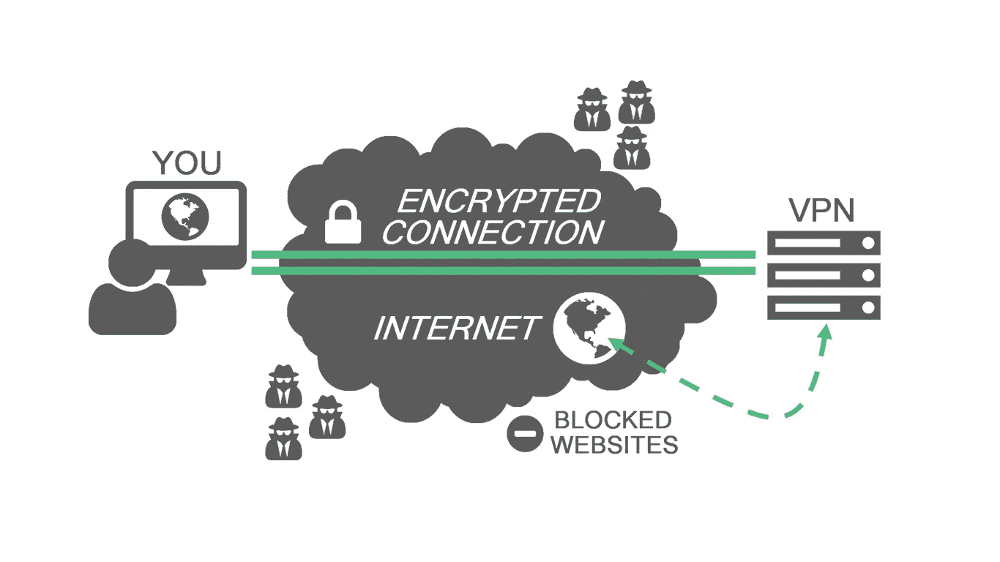
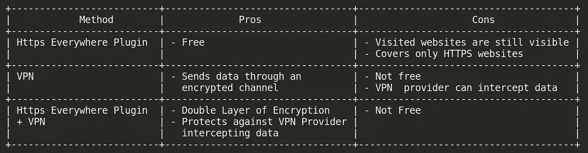

# 如何安全地浏览互联网|在连接到公共 WiFi 网络时防止数据泄露

> 原文：<https://levelup.gitconnected.com/how-to-securely-browse-the-internet-prevent-data-leaks-while-connecting-to-public-wifi-networks-81d5cdf19313>

> 在公共 WiFi 上浏览时感到不安全？这个博客是给你的。

# 与公共 wifi 网络相关的风险

每当有人连接到公共 wifi 网络，即酒店、图书馆、大学、餐厅、咖啡馆、机场或任何其他开放 wifi 网络提供的 WiFi 接入点时，这些网络的管理员就有可能秘密拦截他们的数据(如浏览历史、访问的 URL)，或者黑客可以访问管理员的计算机并分析数据或执行 [**中间人攻击**](https://blogs.gourav-dhar.com/man-in-the-middle-attack-by-arp-spoofing-tutorial-and-examples-e8f76d0b98f3) (javascript 注入，读取用户名、密码、访问的网站等个人数据。).默认情况下，所有的数据都将流经管理员的计算机，所以他将能够看到这些数据。

要了解更多关于中间人攻击的信息，请参考下面的博客。

 [## ARP 欺骗的中间人攻击:教程和示例

### 中间人(MITM)攻击是指机器将自己置于客户端和服务器之间。ARP 欺骗。—由…

blogs.gourav-dhar.com](https://blogs.gourav-dhar.com/man-in-the-middle-attack-by-arp-spoofing-tutorial-and-examples-e8f76d0b98f3) 

# 如何降低这种风险

解决方案很简单— **加密你的流量**。一旦流量被加密，我们真的不在乎是否有人拦截它，因为流量将是 jibberish，对拦截它的人没有任何用处。有多种加密数据的方法。最简单和最有效的方法是结合:

*   HTTPS 无处不在插件
*   使用 VPN

## HTTPS 无处不在插件

由 EFF(电子前沿基金会)开发的 HTTPS Everywhere 插件将防止攻击者/中间人将您的 HTTPS 连接降级为不安全的 HTTP 连接，从而防止数据拦截和中间人攻击。你可以谷歌搜索或者从下面的链接下载:

*   **对于谷歌 Chrome**:[https://Chrome . Google . com/web store/detail/https-everywhere/gcbommkclmclpchllfjekcdonpmejbdp？hl=en](https://chrome.google.com/webstore/detail/https-everywhere/gcbommkclmclpchllfjekcdonpmejbdp?hl=en)
*   **对于 Mozilla Firefox**:[https://addons . Mozilla . org/en-US/Firefox/addon/https-everywhere/](https://addons.mozilla.org/en-US/firefox/addon/https-everywhere/)

也支持 Edge、Brave、Opera、Tor 等浏览器。你可以从这里[https://www.eff.org/https-everywhere](https://www.eff.org/https-everywhere)下载这些浏览器的扩展。

> *注意:这个插件对于支持 HTTPS 的网站非常有用，但是使用 HTTP 的网站的数据仍然会被拦截。*

HTTPS 无处不在插件也不是 100%安全，因为它仍然不能防止攻击，如 DNS 欺骗，攻击者可以看到哪些网址(而不是数据，因为它是加密的)连接的计算机正在访问。

## 使用 VPN(虚拟专用网)

提供加密隧道的 VPN

如果你想让你的安全更上一层楼，并完全加密你在网络上浏览的一切，那么你应该考虑使用专用 VPN。

启用 VPN 将在您的计算机和您正在连接的 VPN 服务器之间创建一个加密隧道，所有数据都将通过该加密隧道流动。VPN 有用的原因有很多，其中一些是:

*   添加额外的加密层
*   绕过网络/互联网服务提供商批准的审查和过滤器
*   隐私和防止中间人攻击

人们在选择 VPN 服务器时需要小心，因为如果 VPN 服务器的管理员想要的话，他可以截取数据。选择 VPN 时需要注意的事项:

*   使用一个可信赖的和享有声誉的 VPN 服务提供商
*   不要使用免费的 VPN，(提供 VPN 是非常昂贵的，因此必须有另一个原因，为什么 VPN 是免费的)
*   确保 VPN 提供商不保留日志

> 注意:使用`Https Everywhere`插件消除了 VPN 服务器提供商拦截你的数据的可能性

在表格中总结以上所有内容:

因此，我们可以得出结论，如果我们想安全地浏览任何公共 WiFI，HTTPS 无处不在插件和专用 VPN 是非常好的组合。

大家安全浏览！

> 这里邀请您探索我们的博客平台 [**【极客思维**](https://www.thegeekyminds.com/) 。一个让您了解软件开发和技术领域最新发展的一站式平台。我们在 [**的极客头脑**](https://www.thegeekyminds.com/) 旨在写一些你实际上可以用来提高工作效率和充实你的职业生活的内容。
> 
> 邀请您在[**https://thegeekyminds.com**](https://thegeekyminds.com/)通过我们的平台。并订阅我们的时事通讯，以便在我们每次发布新帖子时收到电子邮件。我们承诺不会向您的收件箱发送垃圾邮件。点击下面的按钮订阅我们的时事通讯

