# 如何安全地连接到您的 Azure SQL 数据库？

> 原文：<https://levelup.gitconnected.com/how-to-securely-connect-to-your-azure-sql-database-53348804baa3>

照片由[马太·亨利](https://burst.shopify.com/@matthew_henry?utm_campaign=photo_credit&utm_content=Browse+Free+HD+Images+of+Man+Pointing+At+Laptop+Screen+Analytics&utm_medium=referral&utm_source=credit)发自[突发](https://burst.shopify.com/entrepreneur?utm_campaign=photo_credit&utm_content=Browse+Free+HD+Images+of+Man+Pointing+At+Laptop+Screen+Analytics&utm_medium=referral&utm_source=credit)

T***#网络安全*** 的话题最近很热，尤其是涉及到存储数据的数据库。本文总结了一些与 Azure SQL 网络安全设置相关的最佳实践和选项。

现在，我们开始吧！

首先，让我们看看 Azure SQL 的一个常见用例。

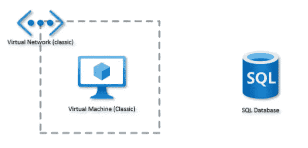

假设我们在 Azure 上有一个虚拟机，为了能够从这个虚拟机连接到 Azure SQL 数据库，Azure 云为我们提供了 4 个选项。

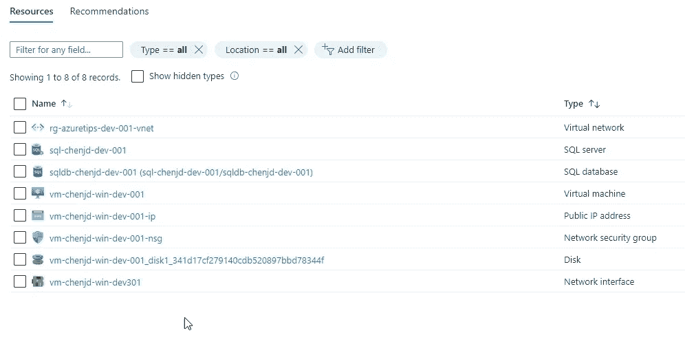

在本例中，我们设置了一个名为“ **sql-chenjd-dev-001** ”的 SQL server 和一个名为“ **vm-chenjd-dev-001** ”的 VM，如上图所示。

但是在我们开始探索这些选项之前，我们应该首先在虚拟机中下载并安装**微软 SQL Server Management Studio** 或 **SSMS** 。

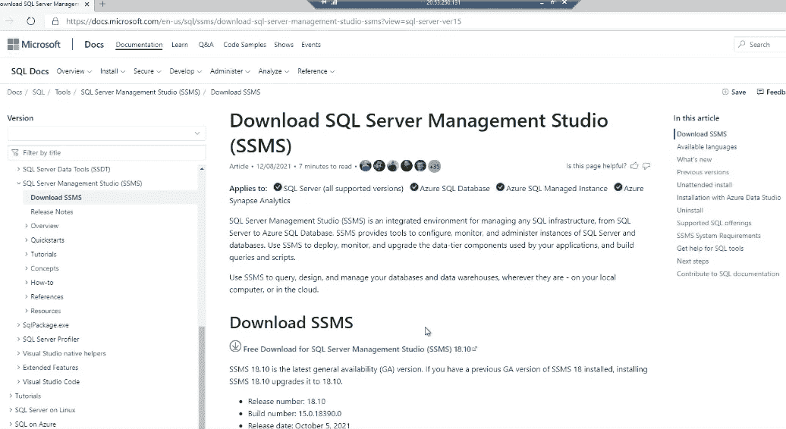 [## 下载 SQL Server Management Studio(SSMS)-SQL Server Management Studio(SSMS)

### 适用于:SQL Server(所有支持的版本)Azure SQL 数据库 Azure SQL 托管实例 Azure Synapse Analytics…

docs.microsoft.com](https://docs.microsoft.com/en-us/sql/ssms/download-sql-server-management-studio-ssms?WT.mc_id=DT-MVP-5001664) 

然后尝试从虚拟机直接连接到 SQL server，结果您可以看到此时无法从该虚拟机访问 SQL server。

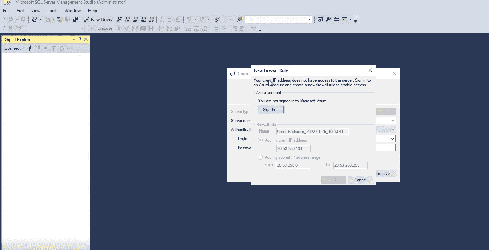

现在，让我们开始讨论如何连接到 Azure SQL，更重要的是，如何安全地连接到 Azure SQL。

# 允许 Azure 服务和资源访问此服务器

第一个选项是“**允许 Azure 服务和资源访问此服务器**”。你可以在 SQL Server 的“**防火墙和虚拟网络**面板中找到这个选项，如下图所示。

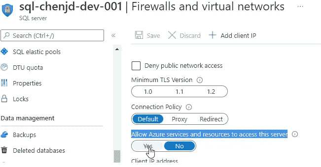

如果启用了这个设置，那么可以从 Azure 中的其他服务访问 SQL server，比如我们的 VM。

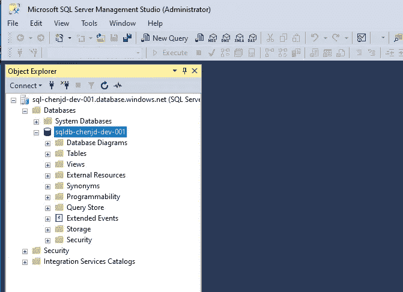

然而，显然这是最简单的方法，但也是最不安全的方法。例如，不在您组织中的人可以从他在 Azure 上设置的虚拟机访问您的 SQL，只要他知道 SQL 帐户密码。实际上，在上将“**允许 Azure 服务和资源访问此服务器**”设置切换到**会为 IP 0 . 0 . 0 . 0–0 . 0 . 0 . 0 创建一个名为**AllowAllWindowsAzureIps**的入站防火墙规则。**

 [## IP 防火墙规则- Azure SQL 数据库和 Azure Synapse 分析

### 适用于:Azure SQL 数据库 Azure Synapse Analytics 在 Azure SQL 数据库或 Azure 中创建新服务器时…

docs.microsoft.com](https://docs.microsoft.com/en-nz/azure/azure-sql/database/firewall-configure?WT.mc_id=DT-MVP-5001664) 

# 防火墙规则

第二种选择是使用**防火墙规则**。我们还在“**防火墙和虚拟网络**”面板上设置防火墙规则。如下图。

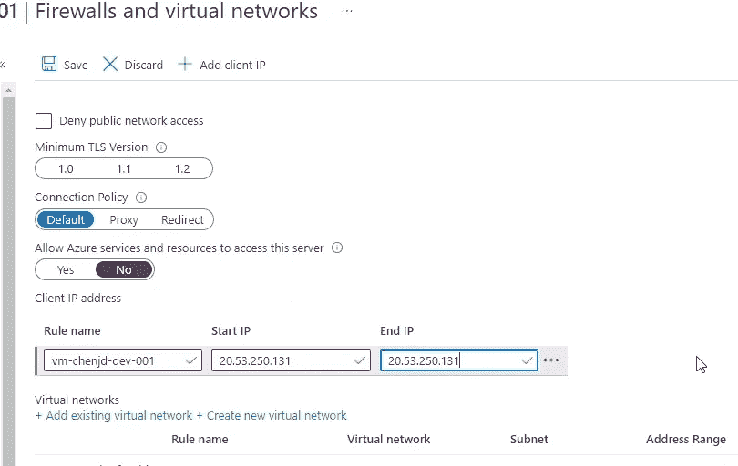

通常我们应该禁用“**允许 Azure 服务和资源访问此服务器**”设置，并将允许访问 SQL 的 IP 地址添加到防火墙规则中。需要注意的是，我们不仅可以添加 Azure 资源的 IP 地址，还可以添加本地客户端的 IP 地址。

但是这种选择也有缺点。比如 IP 地址是动态的，那么在使用过程中显然会造成一些不便。

 [## IP 防火墙规则- Azure SQL 数据库和 Azure Synapse 分析

### 适用于:Azure SQL 数据库 Azure Synapse Analytics 在 Azure SQL 数据库或 Azure 中创建新服务器时…

docs.microsoft.com](https://docs.microsoft.com/en-nz/azure/azure-sql/database/firewall-configure?WT.mc_id=DT-MVP-5001664) 

# 虚拟网络规则

第三个选项是“**虚拟网络规则**”。虚拟网络规则设置低于防火墙规则设置，因此您不会错过它。

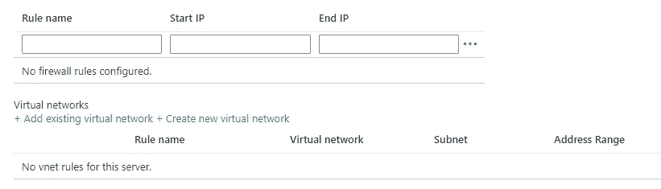

通过为此 SQL server 添加现有 VNET 或创建新 VNET，同一 VNET 内的 Azure 资源可以访问 SQL server，但不在此 VNET 内的虚拟机无法访问 SQL。这个选项相对更安全。

 [## Azure SQL 数据库中数据库的虚拟网络端点和规则- Azure SQL 数据库

### 适用于:Azure SQL 数据库 Azure Synapse Analytics 虚拟网络规则是一种防火墙安全功能，它…

docs.microsoft.com](https://docs.microsoft.com/en-nz/azure/azure-sql/database/vnet-service-endpoint-rule-overview?WT.mc_id=DT-MVP-5001664) 

# Azure 专用链接

为 Azure SQL 设置“**虚拟网络规则**”是相当安全的，但如果你想让你的 SQL 更安全，比如防止其 IP 地址暴露给公众。那么“ **Azure 私联**”就是理想的选择。

如下图所示，如果我们在 Azure 上的虚拟机上运行 ***nslookup*** 命令，我们可以获得 SQL server 的公共 IP 地址。接下来，我们将尝试隐藏其 IP 地址。

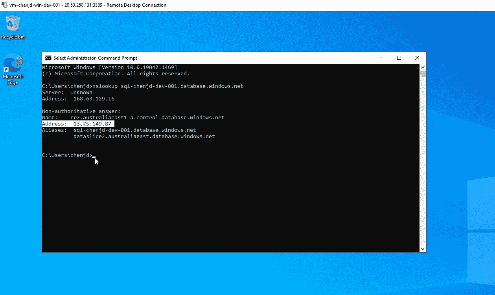

现在，让我们从在 Azure 上创建一个新的私有链接资源开始。正如你在下图中看到的，Private Link 不仅可以与 Azure SQL 一起工作，而且“*使用微软网络*在虚拟网络中部署的应用程序和 Azure 服务之间提供私有连接”。所以这次我们不会在 Azure SQL Server 面板上设置。

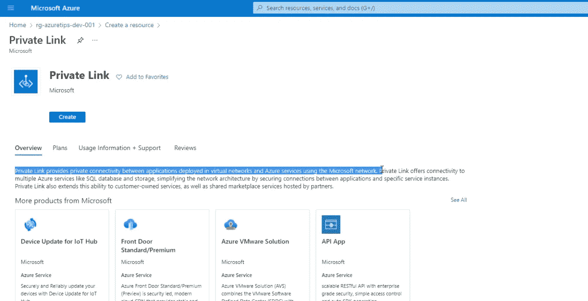

点击“**创建**按钮，我们将被重定向到“**专用链接中心**面板。在此页面上，我们应该选择“**创建私有端点**”来创建一个新的私有端点，这是一个使用来自您的虚拟网络的私有 IP 地址的网络接口。此网络接口将您安全地连接到由 Azure Private Link 支持的服务。

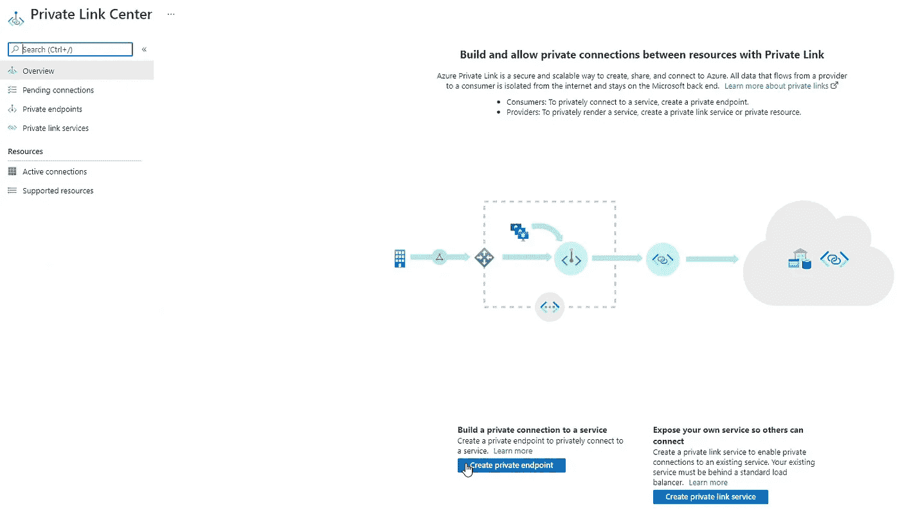 [## 什么是 Azure 私有端点？

### 专用端点是一个网络接口，它使用虚拟网络中的专用 IP 地址。这个网络…

docs.microsoft.com](https://docs.microsoft.com/en-nz/azure/private-link/private-endpoint-overview?WT.mc_id=DT-MVP-5001664) 

我假设您在创建新的 Azure 资源时已经熟悉了"**基础**"设置，所以让我们直接进入这个私有端点的"**资源**"设置和"**虚拟网络**"设置。

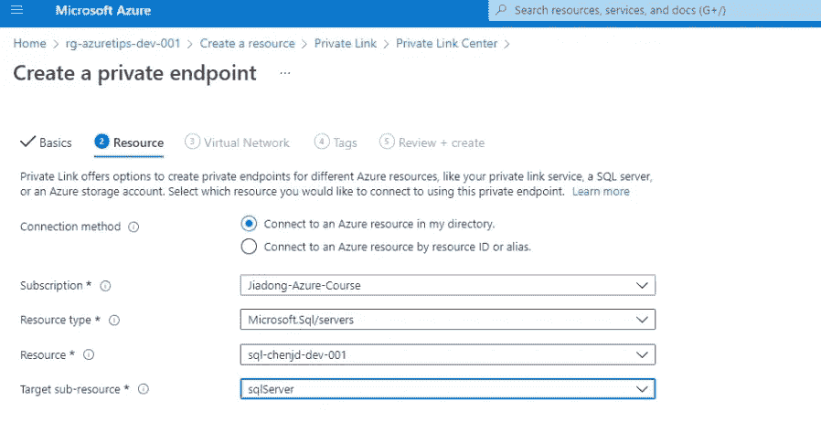

在“**资源**设置中，我们应该提供资源类型和该资源的一个实例。这里我们提供了“**SQL-chenjd-dev-001**”SQL server。

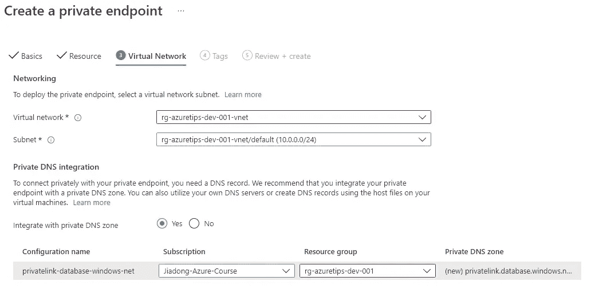

然后在“**虚拟网络**”设置面板中，我们为这个私有端点提供“虚拟网络”和“子网”信息。

在等待这个资源被创建之后(这需要几分钟，请耐心等待)，我们可以在 Azure SQL server 实例的“**私有端点连接**”面板上检查它是否已经建立了到我们的 SQL server 的私有连接。

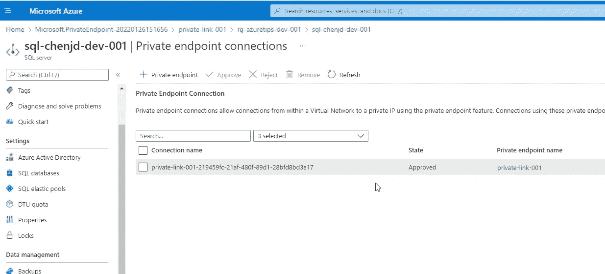

现在，让我们在虚拟机上再次运行 ***nslookup*** 命令，这一次 IP 地址不是公共的，如下所示。

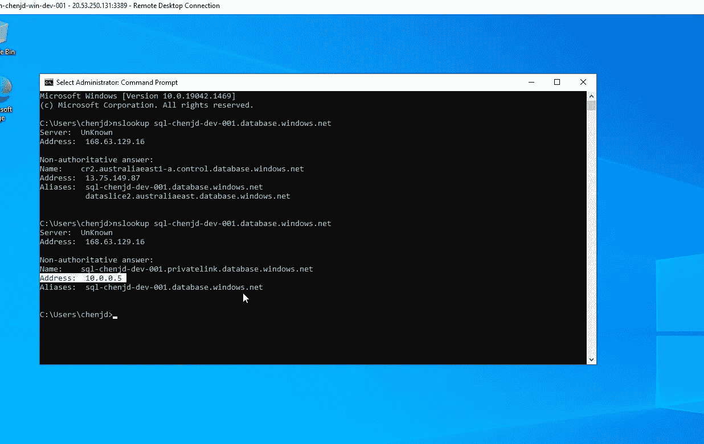 [## Azure 私有链接- Azure SQL 数据库和 Azure Synapse 分析

### 适用于:Azure SQL 数据库 Azure Synapse Analytics(仅专用 SQL 池(以前为 SQL DW ))专用链接允许…

docs.microsoft.com](https://docs.microsoft.com/en-nz/azure/azure-sql/database/private-endpoint-overview?WT.mc_id=DT-MVP-5001664) 

# 结论

从安全角度来看， **Azure 私联**显然是首选。但是如果你不能创建 Azure 私有链接资源，记得关闭“**允许 Azure 服务和资源访问此服务器**”选项，并为你的 Azure SQL server 配置“**防火墙规则**”和“**虚拟网络规则**”。

🏆 𝐌𝐢𝐜𝐫𝐨𝐬𝐨𝐟𝐭 𝐂𝐥𝐨𝐮𝐝 𝐒𝐤𝐢𝐥𝐥𝐬 𝐂𝐡𝐚𝐥𝐥𝐞𝐧𝐠𝐞 🚀
—📌[https://lnkd.in/dm5dGgJu](https://lnkd.in/dm5dGgJu)

**🎯关注我:** [**陈家东**](https://www.linkedin.com/in/chenjd/)