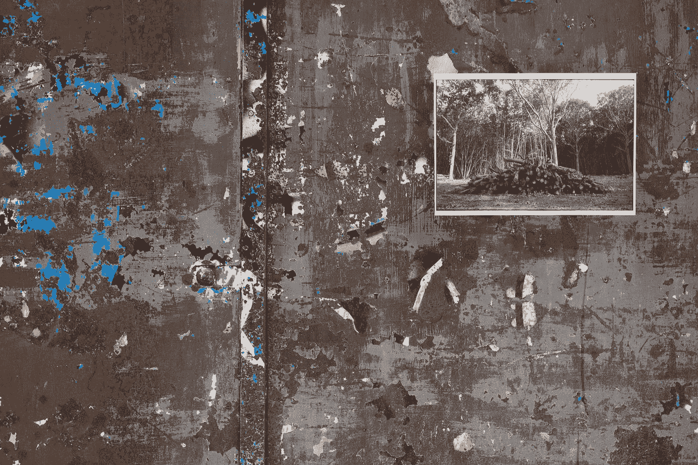

# 如何安全地将文件夹或文件从一台主机复制到另一台主机

> 原文：<https://levelup.gitconnected.com/how-to-securely-copy-folder-or-file-from-one-host-machine-to-another-b259dcd8572f>



[克劳福德·乔利](https://unsplash.com/@crawford?utm_source=medium&utm_medium=referral)在 [Unsplash](https://unsplash.com?utm_source=medium&utm_medium=referral) 上的照片

# 介绍

我们都遇到过需要在本地机器和远程机器之间或者远程机器之间复制文件夹/文件的情况。当然，我们也希望安全地这样做，尤其是当文件包含秘密或敏感信息时。

幸运的是，这一点也不难做到。多亏了一个叫做`scp`或者安全拷贝的 linux 命令。`scp`基于`ssh`协议。

在这个简短的教程中，让我们看看如何使用这个命令在机器/主机之间安全地传输文件夹或文件。

# 将您的源主机 ssh 公钥放入目标主机

如前所述，`scp`依靠`ssh`来完成它的复制。第一步是在机器/主机之间建立`ssh`连接。如果我们定期将文件传输到目的主机，那么只需将源主机的 ssh 公钥放在目的主机的已知主机中就更容易了。

复制您的 ssh 公钥的内容，它通常位于`~/.ssh/id_rsa.pub`，并将其放在目的主机的`~/.ssh/known_hosts`中，在远程主机的正确用户下。

# 安全副本

现在，我们准备做一个安全拷贝。让我们来看几个场景。

## 从本地主机到远程主机

假设我们需要在远程主机中放入一个用于本地开发的秘密文件，因为我们的应用程序将在那里运行。为此，您可以从本地计算机运行以下命令。

```
~ ❯ scp ./kafka-service/secrets.yml remote_username@190.123.321.55:/home/remote_username/kafka-service/secret/
```

在这个命令中，我们将位于本地机器的`secrets.yml`文件复制到位于远程主机`190.123.321.55`的`/home/remote_username/kafka-service/secret/`文件夹中。

要复制一个文件夹而不是一个文件，我们只需要在命令中添加递归标志`-r`。下面我们来看一个例子。

```
~ ❯ scp -r ./payment-processor/configuration/ remote_username@190.123.321.55:/home/remote_username/payment-processor/
```

该命令将把整个`./payment-processor/configuration/`文件夹从本地机器复制到远程主机的`/home/remote_username/payment-processor/`文件夹。

## 从远程主机到本地主机

有时，我们可能会在远程主机上进行大量的大数据处理，因为它有更多的内存和更快的处理器。结果是一个 csv 文件，我们想用它来玩，如果文件在本地主机上就更容易了。

要将文件从远程主机复制到本地主机，我们可以运行以下命令。

```
~ ❯ scp remote_username@190.123.321.55:/home/remote_username/big-data/result/result.csv ./big-data/result/
```

## 从一台远程主机到另一台远程主机

`scp`也可以用来将文件或文件夹从一台远程主机复制到另一台。我们只需要确保一个远程主机的 ssh 公钥存储在另一个远程主机的`~/.ssh/known_host`文件中。

以下命令将文件从一台远程主机复制到另一台远程主机。

```
~ ❯ scp remote_username@190.123.321.55:/home/remote_username/customer-service/config.yml another_remote_host@196.153.112.61:/home/another_remote_host/customer-service/
```

# 包裹

通过`scp`，将文件或文件夹从一台主机安全地复制到另一台主机变得很容易。所以，下次你需要这样做的时候，记得使用这个方便的命令。


照片由[沃尔坎·奥尔梅斯](https://unsplash.com/@volkanolmez?utm_source=medium&utm_medium=referral)在 [Unsplash](https://unsplash.com?utm_source=medium&utm_medium=referral) 上拍摄