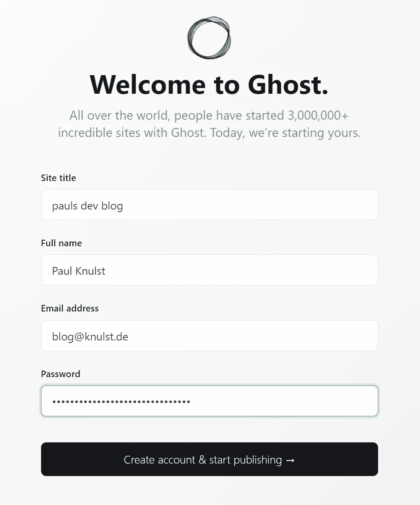
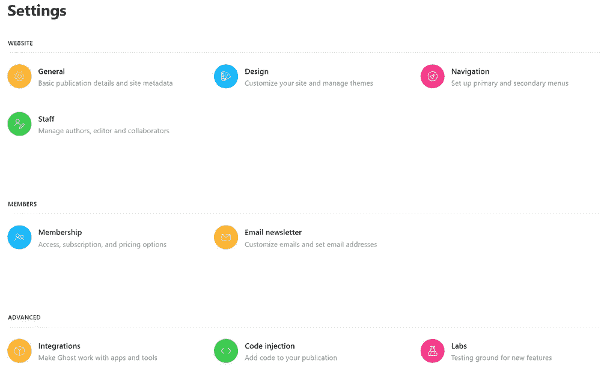

# 如何在 Docker Swarm 上自托管个人 Ghost 博客平台

> 原文：<https://levelup.gitconnected.com/how-to-self-host-a-personal-ghost-blogging-platform-on-docker-swarm-3548a272c346>

## 了解如何在 Docker(或 Docker Swarm)环境中设置 Ghost 博客平台作为您的个人博客。包括所有必要的文件。


安内特·lūsiņa 在 [Unsplash](https://unsplash.com/s/photos/blog?utm_source=unsplash&utm_medium=referral&utm_content=creditCopyText) 上拍摄的照片

如果你正在阅读这篇文章，你决定使用 Ghost 博客软件创建一个个人博客，并且正在寻找一种方法将它安装在 Docker(或 Docker Swarm)环境中。别再找了，你来对地方了！

在本教程中，我将向您展示如何使用 Docker 设置 Ghost，并在您的环境中使用子域/主域运行博客。首先，我将展示如何在 Docker Swarm 环境中设置一切，但我也将提供在一个简单的 Docker 环境中部署它所需的所有文件。

如果你想看一个幽灵博客平台的例子，你可以看看我的个人专栏:

[](https://www.knulst.de) [## //保罗开发博客

### Docker、Docker Swarm、Kubernetes、负载平衡器等等

www.knulst.de](https://www.knulst.de) 

# 为什么要用 Ghost？

Ghost 是一个开源博客平台，用于创建专业博客。它于 2013 年 10 月发布，作为 WordPress 的简单替代品，因为它变得过于复杂。Ghost 在 Node.js 内运行，用 JavaScript 编写。

以下是 Ghost 博客软件提供的主要功能:

*   分享任何帖子的私人链接。这对复习很有用。此外，你可以与所有人分享，而不仅仅是在文章平台上拥有账户的人
*   Ghost 有一个很棒的编辑器，允许**嵌入代码片段**(带 Prismjs)**YouTube**、 **Twitter** 、 **Codepen** 等
*   您可以安排每篇文章，使其在您选择的确切日期发表。
*   每个帖子/文章都可以在搜索引擎优化方面进行优化
*   您可以轻松地添加和管理作者
*   Ghost 已经有超过数百款应用，如 **Slack** 、 **Stripe** 、 **Shopify** 等
*   有几个主题可以定制，你可以在网站上为每篇文章手动注入你的个人代码
*   用户可以注册时事通讯和/或成为你博客的赞助商

此外，Ghost 还提供了更多功能。

# 先决条件

要遵循本教程中的每一步，并最终拥有一个运行的 Ghost 博客平台，你需要有一个运行的 Docker Swarm 环境。要做到这一点，你应该考虑阅读这篇文章:

[](https://www.knulst.de/docker-swarm-in-a-nutshell/) [## 码头工人蜂拥而至

### 这个简单的教程展示了如何在大约 15 分钟内创建一个正在运行的 docker swarm 集群。我创建了一个后续…

www.knulst.de](https://www.knulst.de/docker-swarm-in-a-nutshell/) 

此外，您需要一个 Traefik 负载平衡器，用于授予 Let's 加密 SSL 证书，并在 Docker Swarm 环境中转发您的服务。要了解这一点，您可以阅读本教程的第一章:

[](https://www.knulst.de/services-you-want-to-have-in-a-swarm-environment/) [## 每个人都应该在 Docker 群中部署的 4 项重要服务

### 在我的上一篇文章中，我展示了如何在大约 15 分钟内建立一个 Docker 群。记住:每当你读“码头工人群”时，我们…

www.knulst.de](https://www.knulst.de/services-you-want-to-have-in-a-swarm-environment/) 

此外，我将提供文件，以便在任何运行 Docker 的服务器上运行 Ghost blogging platform，该服务器带有 Traefik 负载平衡器。请阅读本文，了解 Traefik 如何安装在一个简单的 Docker 环境中:

[](https://www.knulst.de/how-to-setup-traefik-with-automatic-letsencrypt-certificate-resolver/) [## 如何使用自动加密证书解析器设置 Traefik v2

### 今天，拥有 SSL 加密的网站非常重要。本指南将向您展示拥有一台自动…

www.knulst.de](https://www.knulst.de/how-to-setup-traefik-with-automatic-letsencrypt-certificate-resolver/) 

# 安装幽灵

## 码头工人群

Ghost 将与 Docker Compose 一起安装。合成文件包含服务名、Traefik 的设置(具有唯一的 URL)和 SSL 证书。此外，还有两个中间件用于向主站点转发请求。

要在你的 Docker Swarm 中安装 Ghost，你可以将下面的代码粘贴到你的 docker-compose.yml 中，这将在后面解释。

**第 4 行:**安装期间将使用最新版本的 Ghost v4

**第 6 行:**主博客 URL 将被定义为 docker 服务中的一个环境变量

**第 7–12 行:**此部分可用于设置发送注册邮件、邀请、密码重置或会员登录链接的邮件配置。此邮件不能用于新闻邮件。对于这个功能，你必须建立一个类似 Mailgun 的服务。点击了解更多信息[。](https://ghost.org/docs/config/#mail)

**第 13–14 行:**网站内容将保存为 Docker 环境中的永久卷

**第 15–16 行:**这里将使用主 traefik 网络。这很重要，因为否则 Traefik 无法将请求转发给服务

**第 18–20 行:**只有标签`blogs.knulst`为真，服务才会被部署到 Docker 群节点。这可以通过在将 docker-compose.yml 部署到堆栈之前执行以下命令来实现:

将 ID_OF_NODE_TO_USE 替换为服务应该运行的 Docker 群中任何工作器/管理器节点的正确 ID。

**第 21–31 行:**用 Traefik 为 Docker Swarm 中部署的服务设置一个标准配置，让我们加密证书。在第 19 和 22 行中，为该服务注册了三个 URL:www。${DOMAIN}、${DOMAIN}和博客。${DOMAIN}。

**第 32 行:**Ghost 博客 Docker 容器使用的端口。Traefik 需要的。

**第 33–35 行:**创建一个永久的 Traefik 中间件，用于转发来自博客的每个请求。＄{ DOMAIN }到 www。${ *DO* MAIN}

**第 36–38 行:**创建一个永久的 Traefik 中间件，它将来自＄{ DOMAIN }的每个请求转发到 www。${DOMAIN}

**第 39 行:**为这个服务激活先前创建的中间件。这样做是因为我只想为我的博客有一个主要网站，但多个网址到达它。

在部署(或重新部署)多个环境变量之前，应该设置(根据您的需要进行调整):

```
export DOMAIN=knulst.de
export MAIL_HOST=smtp.your-domain.de
export MAIL_PORT=587
export MAIL_USER=blog@knulst.de
export MAIL_PASS=unbelievablehowsecurethisis
export MAIL_FROM=blog@knulst.de 
```

然后，您可以通过执行以下命令来部署 Docker Swarm 堆栈:

```
docker stack deploy -c docker-compose.yml blog
```

# 码头工人

如果你没有正在运行的 Docker Swarm，你可以下载[这个合成文件](https://www.knulst.de/how-to-self-host-ghost-blogging-platform-on-docker-docker-swarm/ftp.f1nalboss.de/data/docker-compose.blog.yml)。

在这个文件中，与 Docker Swarm Compose 文件只有两处不同。第一个是在第 17 行，这里使用了一个新的设置:`restart: always`。此配置用于在 Docker 服务中止时自动重新启动它。另一个变化是从 deploy - keyword 中移除了标签，并将其放在合成文件中的更高位置。这样做是因为 deploy 只在 Docker 群环境中使用，但是标签也可以在简单的 Docker 环境中使用。

请记住，只有当您有一个运行 Traefik 负载平衡器的[时，这才会起作用。](https://www.knulst.de/how-to-setup-traefik-with-automatic-letsencrypt-certificate-resolver/)

在启动 docker 服务之前，应该设置多个环境变量(根据您的需要进行调整):

```
export DOMAIN=knulst.de
export MAIL_HOST=smtp.your-domain.de
export MAIL_PORT=587
export MAIL_USER=blog@knulst.de
export MAIL_PASS=unbelievablehowsecurethisis
export MAIL_FROM=blog@knulst.de
```

然后，您可以通过执行以下命令来启动 Docker 服务:

```
docker-compose up -d
```

# 配置幽灵

如果您到达这一步，Ghost blog 已经以默认的 Casper 主题安装在您的 URL 上，如下所示:


新安装的 Ghost 博客截图

现在，您必须配置您的 ghost 博客实例，方法是打开您的网站并附加 Ghost 路径以打开管理菜单(应该是 https://your-domain . de**/Ghost**)。

如果您打开管理菜单，您必须设置标题、您的姓名、您的电子邮件地址和安全密码:



安装后的登记表

创建帐户后，您应该会收到一封来自您博客的电子邮件。如果您没有收到任何邮件，您可以检查 docker 日志中有关电子邮件问题的内容。

最后一步是调整你新创建的博客的个人设置。为此，您可以打开 Ghost 博客设置(https://your-domain.de/ghost/#/settings ),应该是这样的:



设置仪表板

选择**常规**并根据您的需求调整一切。之后，你要打开**设计**，安装一个适合你的主题。我可以推荐爱德华多·戈麦斯的《T4》和《T5》。它已经内置了翻译，看起来非常好。

此外，我建议选择**会员**，连接您的 **Stripe** 账户，并启用付费注册作为额外的会员选择。在我的博客里，我也这样做了，但是我不仅仅向付费会员提供额外的内容。它只有在有人想赞助我的时候才会被激活，不管提供的内容是什么。

# 结束语

恭喜您，您已经安装了自己的 Ghost 博客。如果您想改善用户体验或利用您的博客做更多事情，您可以:

*   注册 Grammarly 并安装 web 扩展来优化文章
*   用图片或主题自定义设计
*   [使用 Google analytics 设置分析](https://ghost.org/integrations/google/)
*   [添加代码语法高亮显示](https://ghost.org/docs/tutorials/code-syntax-highlighting/)
*   [给帖子添加评论](https://ghost.org/docs/tutorials/adding-comments/)

本教程到此结束。一旦你建立了你的个人博客，请在这里或在推特上与我分享。我会很乐意看到的！

另外，请随时在 [LinkedIn](https://www.linkedin.com/in/paulknulst/) 、 [Twitter](https://twitter.com/paulknulst) 和 [GitHub](https://github.com/paulknulst) 上与我联系

这篇文章最初发表在我的博客上，网址是[https://www . paulsblog . dev/how-to-self-host-ghost-blogging-platform-on-docker-docker-swarm/](https://www.paulsblog.dev/how-to-self-host-ghost-blogging-platform-on-docker-docker-swarm/)