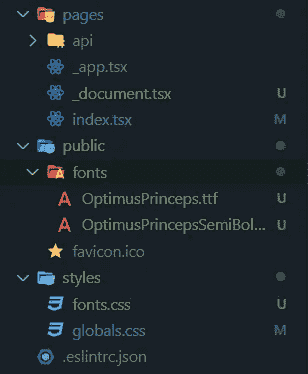
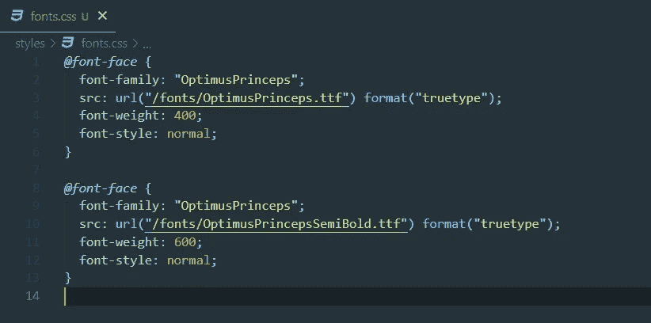
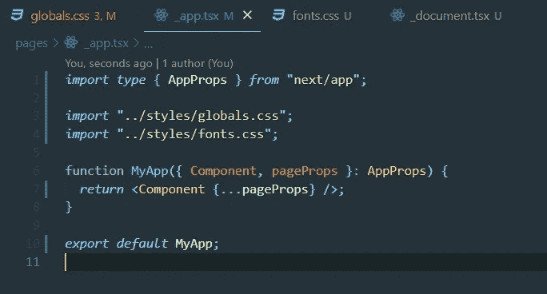
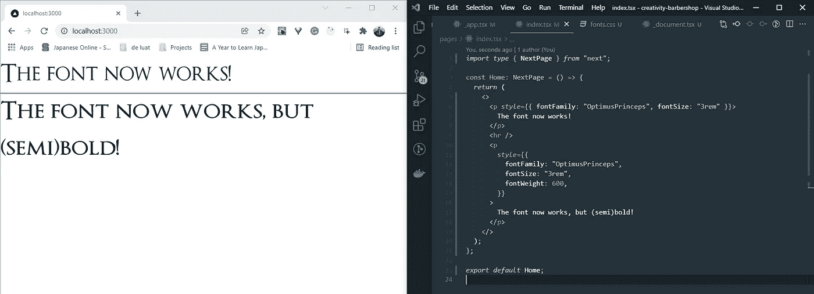
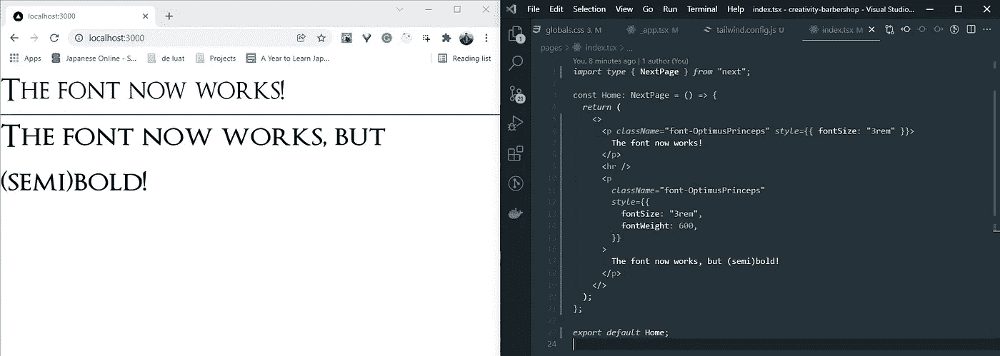

# 如何在 NextJS 中自宿主字体

> 原文：<https://levelup.gitconnected.com/how-to-self-host-fonts-in-nextjs-5a9930d8c67a>

照片由[阿玛多·洛雷罗](https://unsplash.com/@amadorloureiroblanco?utm_source=medium&utm_medium=referral)在 [Unsplash](https://unsplash.com?utm_source=medium&utm_medium=referral) 上拍摄

假设您从客户那里收到了一个定制字体，用于您正在进行的 NextJS 项目。考虑到你到目前为止使用的所有字体都来自谷歌字体或其他字体提供商，你如何添加这种新字体？这个看起来很容易实现的东西花了相当多的时间，因为它没有在 NextJS 文档中记录。这篇文章应该可以帮助你解决这个问题。

> 我将在下面的例子中使用 Typescript，但是您可以通过移除类型/接口并使用`js/jsx`格式而不是`ts/tsx`来获得相同的结果。

在本文中，我们将使用由 Manfred Klein 创建的 dafont.com 的免费字体。

我们开始吧。

我们的“秘密”配方只需要三种原料:

*   您的字体文件(或文件)方便地放置在`/public/fonts`
*   一个`fonts.css`文件，为了结构的缘故放在`/styles`
*   和`/pages`中的`_document.tsx`文件

最后，它应该看起来像这样:

当前项目结构

## "但是我没有字体文件夹！"

不用担心，只要在`/public`中创建一个并把你的字体文件放在那里，不管是什么格式。

## "我们在 fonts.css 中放什么？"

这是我们将使用`@font-face` [at-rule](https://developer.mozilla.org/en-US/docs/Web/CSS/@font-face) 定义自定义字体的地方。对于我们添加的每个字体文件，我们需要添加各自的 at-rule。在我们的例子中，我们有两个字体文件，编写的 CSS 看起来像这样:

fonts.css 文件

`@font-family`指定将用作字体属性字体值的名称。我们可以在这里写任何我们想写的东西，但是按照它实际的名字命名是有意义的。

在`src`参数中，`url`函数是我们写入字体路径的地方，而 format 函数为浏览器提供了字体资源是什么格式的提示，因此它可以选择一个合适的字体。可用类型有:`"woff"`、`"woff2"`、`"truetype"`、`"opentype"`、`"embedded-opentype"`、`"svg"`。

对于`font-weight`，我们可以使用数值，如 400、600，或者描述符，如`normal`和`bold`。

`font-style` CSS 属性设置一个字体是否应该从它的`font-family`开始使用正常、倾斜或倾斜的字体样式。

为了正确加载字体，不要忘记导入`_app.tsx`中的`fonts.css`文件

太多次忘记在这里导入…

## "为什么叫文档，为什么用下划线？"

解释什么是`_document.tsx`文件超出了本文的范围，但是您可以在这里阅读关于它的所有内容。下面你可以看到一个基本的样子。

在这个文件中，我们将通过使用 NextJS Head 组件中的 link 标签导入前面添加的字体文件。

在上面的要点中，我们从“next/document”中导入了 Head 组件，并为我们的字体文件添加了链接。根据你的字体格式，你可能需要改变的唯一的东西就是链接类型。在我们的例子中,“font/ttf”就可以了。

## “就这样？”

差不多吧，是的。现在你应该能够将你的字体添加到你的内容中了，比如像这样，瞧！

终于，我们有了自己的字体

## 额外收获:TailwindCSS 的自定义字体

因为几乎每个人和他们的猫都在挖掘 TailwindCSS，下面是如何将自定义字体合并到 TailwindCSS 类中。

在您的`tailwind.config.js`文件中，通过在`fontFamily`键中添加一个新条目来扩展默认主题，其中键是您想要如何命名新的 Tailwind 类，值是将分配给该类的字体系列。在上面的例子中，我们添加了多个字体系列，以防我们的字体由于某种原因无法加载。你现在应该能够像这样使用`font-OptimusPrinceps`类了:

使用一个 Tailwind 类来设置我们的自定义字体。

就这样了，伙计们。这就是在 NextJS 中使用自定义字体的方法。

**资源:**

*   擎天柱王子字体:[https://www.dafont.com/optimusprinceps.font](https://www.dafont.com/optimusprinceps.font)
*   @ font-face:【https://developer.mozilla.org/en-US/docs/Web/CSS/@font-face】T2
*   NextJS 自定义文档:【https://nextjs.org/docs/advanced-features/custom-document 