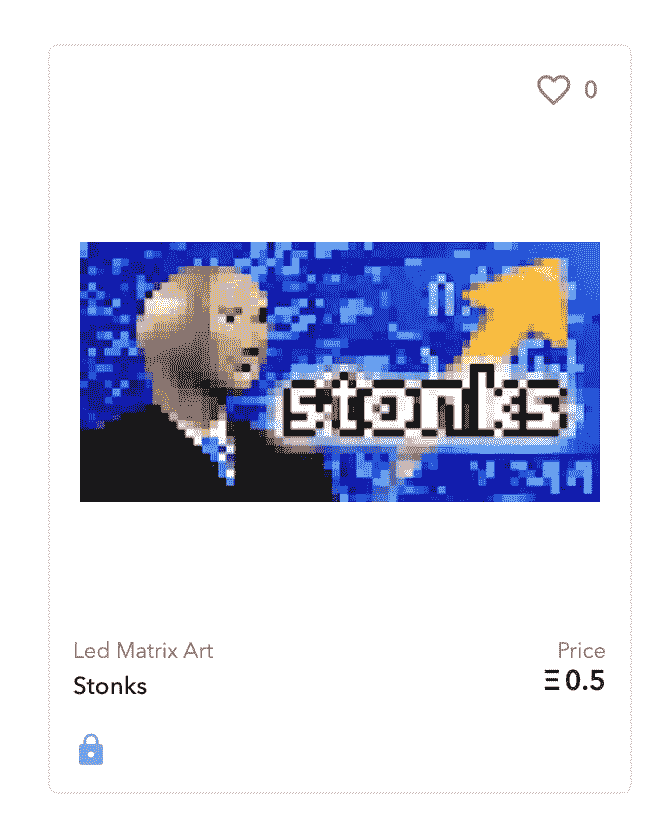
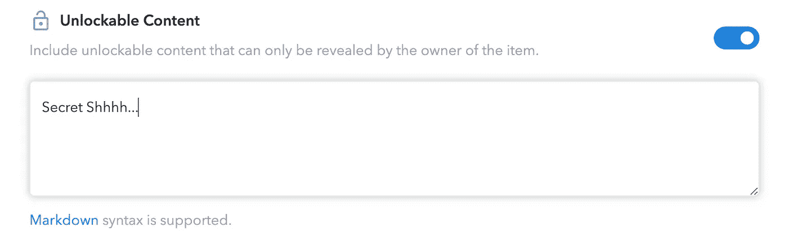

# 如何将你的艺术作为 NFT 作品出售

> 原文：<https://levelup.gitconnected.com/how-to-sell-your-art-as-a-nft-5a96c2f903ab>

## 如何在区块链中将数字内容作为不可替代的代币或 NFT 出售的完全初学者循序渐进指南

图片由皮普尔(迈克温克尔曼)

NFT 是最新的炒作，似乎每个人都在卖 T1 或买 T3。它代表不可替代的令牌在加密货币世界中，*不可替代的*部分的定义可能会令人困惑，但它只是表示它持有一些独特的东西，你不能将其兑换成另一个相同价值的东西。例如，一个**比特币**代币是一个可替换的物品，因为你可以用它来交换另一个**比特币**，无论你的钱包里有哪些特定的比特币代币，它们在任何时候都具有相同的价值。然而，*不可替代令牌*可以是一条独特的信息，你不能轻易交换或拥有多条，因为它们是 ***独特的*** 。

这些数字内容永远存储在区块链中，可以扩展或修改，而不会丢失任何关于其交易的完全透明的信息。任何人都可以查看最初是谁在什么时候创造了它，什么时候卖给了谁，卖了多少钱。

太性感了。作者生成的模因

因此，基本上，NFT 是一种安全、透明、以智能合约形式公开分发的数字内容。而最重要的 **NFT** 的特点是*它们可以在市场* ( [🧐](https://www.investopedia.com/options-basics-tutorial-4583012) )进行交易。

# 区块链钱包

有几个区块链网络可以让你使用 NFTs，然而最流行的是 ***以太网*** 和 ***智能契约*** 技术。值得注意的是，区块链技术在某种程度上是不兼容或互不连接的，无论你在特定的区块链上放什么内容，它都会永远存在(只要网络不会关闭和消失)。对于本指南，我们将使用 ***以太坊网络*** 。

为了能够使用区块链网络，我们需要一个钱包来识别你(匿名地址)的用户身份，并持有支付或接收金钱的余额(在我们的例子中是 **ETH** )。因此，第一步将是安装一个兼容的钱包，支持智能合约和非功能性交易的**以太坊**技术。我的推荐是使用 [MetaMask Chrome 插件](https://metamask.io/download.html)，它可以与许多网站无缝协作，并且非常容易设置和使用。

MetaMask 钱包作为 Chrome 的一个插件。作者图片

如果您第一次使用**元掩码**，它会要求您导入一个地址或创建一个新帐户。你可以在几秒钟内免费创建账户。一个用户通常在同一个钱包里有多个活跃账户。在本指南中，我们将创建一个新帐户:仔细记下您的秘密关键字并确认它们。恭喜你！您现在已经准备好钱包，可以在**以太坊区块链**开始操作了！

# 投资你的钱包

与区块链合作并不是免费的，每次你创建或修改合同/项目的内容时，你都需要支付一些 ***的费用。*** 这个 ***气*** 费其实是用来支付 ***矿工*** 的，他们会在区块链网络上确认并传播你的改变。没有这笔费用， ***矿工*** 将没有任何动力花费他们的资源来处理你的请求，它将实际上漂浮在一个加密的中间状态，直到它最终被网络拒绝。 ***气费*** 价格不是固定的，它随着市场的实时供求而变化。

坏消息是**以太坊**网络气费是 ***目前极其昂贵*** 由于新合同和交易量的增加(有人炒作吗？).您可以尝试在交易量较低的周末进行所有交易，但您仍然可以预计支付约 40 美元(😵)根据智能合同创建。好消息是，如果你打算将几件 NFTs 物品作为收藏的一部分出售，你可能只需支付一次这笔费用，我们稍后会了解到。你可以使用这个[气体跟踪工具](https://etherscan.io/gastracker)来检查当前的平均价格和[这些图表](https://ethereumprice.org/gas/)来找到最佳的日期和时间，以节省一些筹码。

过去 1 年以太坊天然气的日平均价格。ycharts.com 制图

所以，如果这是你第一次参加牛仔竞技表演，你可能没有任何场地可以经营。你需要一个加密货币市场来用法定货币(美元、€……)购买一些 **ETH**

我完全推荐你买[T5【比特币基地】T6](https://www.coinbase.com/join/galet_e)的加密货币。这是最大、最安全的市场之一，而且很容易开放和运营。一旦你的账户建立并被批准，你应该用法定货币购买一些 ETH。我建议你购买至少价值 **$100** 的 **ETH** 开始出售**NFT**(你甚至可以不出售任何东西而获利)。为了支付你的 ETHs，你可以设置你的银行账户(更便宜)或者用信用卡支付(最快)。

美好金融合作的第一步。作者图片

一旦你拥有了一些 ETH，你需要把它们转移到你的 MetaMask 钱包里。打开**元掩码**，点击您的账户名称，复制地址:

在**比特币基地**点击 ***发送/接收*** 按钮，选择**以太坊网络**，从 **MetaMask** 中输入您要发送的数量和您的地址。在点击发送按钮之前，请仔细检查您发送的地址，因为如果您将它们发送到错误的地址，就不可能找回您的 **ETHs** :

将 ETH 发送到您的 MetaMask 钱包。作者图片

几分钟后，你的 ETHs(减去网络费用)将进入你的钱包。而且你要准备好进入 **NFTs** 的勇敢新世界。

# 让我们创造和销售一些…艺术品？

什么是艺术？可能是任何一个人可以作为艺术欣赏的东西。NFT 是销售独特数字内容的一个很好的工具，特别是那些不容易复制并且具有一些收藏价值的内容，这些价值可能会随着时间的推移而增加。私人和散户投资者已经在买卖 NFT 以获取利润，例如这个带着烟斗的蓝色家伙几周前被卖出了 750 多万美元。*“每一天:第一个 5000 天”*数码艺术家[比普尔](https://en.wikipedia.org/wiki/Mike_Winkelmann)的照片以 6930 万美元的价格售出，成为在世艺术家卖出的第三高价值的艺术品。你认为运动鞋收藏品市场很疯狂。

迈克·温克尔曼的《每一天:前 5000 天》以 6900 万美元售出

公平地说，数字艺术作品不仅仅是在电脑上观看的图像、音乐或视频。有牢不可破的合同，让你拥有独特的数字内容，你可以出售或转让给另一个人。所以对我来说，如果有人想花 5000 万美元买一份合同，他会在几个月后以 1.2 亿美元的价格卖出，这是完全合法的(顺便说一下，这是上个世纪左右许多艺术品交易商和收藏家的生意)。

除非你是新的数字班克斯(像比尔一样)，否则你需要一个 NFT 市场。这基本上是传统艺术画廊的数字版本，你的作品将在这里展示，他们将促进销售交易，收取中介费。同样，基于**以太坊**的 **NFTs** 也有几种选择，但对于本指南，我将推荐您使用 [**OpenSea.io**](https://opensea.io?ref=0x834ae2e1a20a56eb5c2e08ea5344f004293e4438) 。它可能是 NFT 最大的市场之一，已经处理了大量的 NFT 交易。最重要的是，创建、设置和将你的数字内容列入准备出售的 NFTs 非常容易。

第一步是使用您配置的**元掩码**钱包登录。没有真正的注册步骤， **OpenSea** 会要求你用一个确认过的钱包匿名表明你的身份:

使用 MetaMask wallet 登录。作者图片

此外，强烈建议确认您的电子邮件地址，并完成您的个人资料。

下一步是创建一个**集合**。在 **OpenSea** 中的集合是一组不同的**NFT**以某种方式相互关联。在集合中创建第一个令牌会有一些相关的开销，但下一个令牌不会。让我们提醒一个 **NFT** 是一个独特的(然而，令牌也可以铸造成自己的多个副本)的内容，我们希望在区块链发布，并有可能在市场上销售。

为了这篇文章，我在 **OpenSea** 中创建了一个名为 [**Led 矩阵艺术**](https://opensea.io/account/led-matrix-art) 的集合，我将在这个集合中添加一些专门设计用于在 [RGB led 矩阵显示器](https://www.youtube.com/watch?v=HHYcRtgeQUo)中可视化的像素艺术。

在 ***创建*** 菜单中转到 ***我的收藏*** :

作者图片

选择创建新收藏并输入一些基本信息，如名称、描述和徽标图像:

因为您还没有在区块链中放入任何东西，所以以后您将能够轻松地编辑这些细节，而无需进行任何交易。集合基本上是 OpenSea 将内容分组到令牌契约中的一种方式，也是用户浏览令牌集的一种方式。

在上传任何对探索有用的内容之前，您可以更改每个收藏的一些额外选项。具体来说，在 ***佣金*** 部分，你可以设置一个**百分比费用**你将收集**任何时间**任何 **NFT** 在这个集合将被出售。不仅仅是你第一次卖它，而是每次有人卖它的时候。

作者图片

现在我们已经准备好将我们的数字内容提交到区块链，并创建一个你可以出售的 NFT。在您的收藏中点击进入 ***创建新项目*** 上传您的数字内容并提供相关信息。OpenSea 目前仅支持几种格式来覆盖您的数字内容的大多数媒体类型:

**-图片/动画:** JPG、PNG、GIF、SVG
**-音频:** MP3、WAV、OGG
**-视频:** MP4、WEBM
**- 3D 模型:** GLB、GLTF

作者图片

对于这篇文章，我选择了添加我自己的像素/led 艺术诠释的臭名昭著的**作为一个****NFT****[*Led 矩阵艺术收藏*](https://opensea.io/collection/led-matrix-art) *:***

****

**清单中一个有趣的特性是您可以添加几个附加到内容的字段和属性。这有助于为令牌协定中包含的内容提供一些见解或元数据。在我的例子中，我想添加一些物理属性，如像素/led 的高度和宽度:**

****

**作者图片**

**另一种选择是包含一些只对所有者可见的可解锁内容。这有助于提供所有权的简单证明、下载额外内容的私人链接或者来自作者的秘密消息，可能性是无限的(而时间是有限的)。在我们的例子中，我想包括一个私人网址，说明所有者设置自己的 [RGB led 矩阵](https://youtu.be/HHYcRtgeQUo)来展示家中的数字艺术:**

****

**作者图片**

**点击 ***创建*** 按钮后，您的数字内容将被转换为智能合约，并免费发送到区块链。**

**恭喜你！您已经成功地在 OpenSea 的收藏中创建了您的第一件物品！下一步将是将 NFT 上市出售。**

# **在市场上列出你的 NFT**

**现在我们已经将我们的数字内容转换成智能合同并在区块链发布，我们实际上可以在 **OpenSea Marketplace** 中列出它进行销售。如果你浏览到新创建的物品，你可以点击右上角的**销售**按钮，进入列表和定价页面:**

****

**作者图片**

**定价选项包括荷兰式拍卖的固定价格，价格随着时间的推移而下降，直到最终价格使列表过期。最高出价拍卖和捆绑销售，你可以同时出售几件物品。为了简单起见，在这篇文章中，我们将只设置一个固定的价格。在我的例子中，我为 [**Stonks**](https://opensea.io/assets/0x495f947276749ce646f68ac8c248420045cb7b5e/59385295724928716779355067100531242334100528418061711538772601091511075995649) 设定了一个完全合理的价格 0.5 ETH(今天大约 1000 美元)。您可以决定您的初始列表价格，然后点击**发布您的列表**:**

****

**作者图片**

**由于这是你第一次在这个市场上列出一个**NFT**,**OpenSea**将需要做一些区块链交易，包括确认你的钱包。这是你需要用你的钱包支付交易费用的时候，比如**以太坊**网络交易*气*💸。正如我们之前所讨论的，天然气费用是市场定价的，由于目前网络中交易量的增加，目前非常昂贵。幸运的是，这将是同一系列唯一的一次性汽油费。**

**在用您的 **MetaMask 钱包**余额签署并确认交易付款后，您的 **NFT** 将立即挂牌出售。**

**暂时就这样吧！我希望你喜欢列出自己的**NFT**的过程。你可以在评论区推广他们自己的作品，让我知道你的作品。**