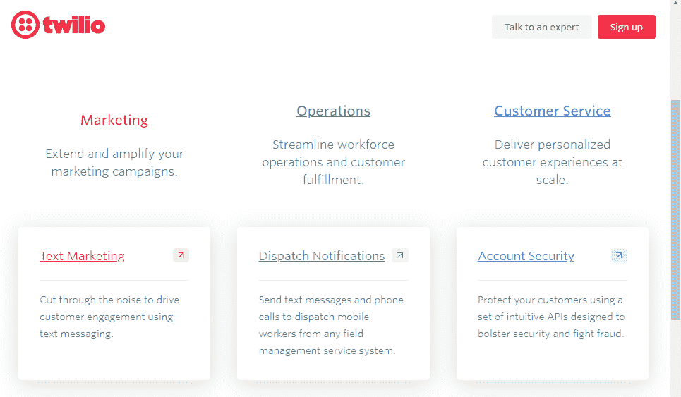

# 如何使用 Django & Twilio 向客户发送短信

> 原文：<https://levelup.gitconnected.com/how-to-send-1-000s-of-automated-text-messages-5854ee1295c4>



# **什么是 Twilio？**

Twilio 被称为云通信平台即服务公司(CPaaS ),因为他们为开发人员提供了以编程方式拨打和接听电话以及发送和接收文本消息的能力。使用他们的 API，开发人员可以自动化和安排文本消息，以提醒用户即将到来的约会，运行抽奖，并创建聊天机器人。然而，用例并不局限于这些选项。快速浏览 Twilio 的[解决方案页面](https://www.twilio.com/solutions)可以发现开发者如何使用 Twilio 进行两步认证、短信调查和匿名通信。

# **为什么是 Twilio 和 Django？**

假设一个客户需要向其所有客户发送大量文本活动。客户希望能够上传一个管理面板中的客户电话号码文件，然后通过群发文本发送一个带有促销代码的新报价。幸运的是，Django 和 Twilio 可以很容易地集成形成这个解决方案。Twilio 的文档在这里查看了他们的 Python 助手库。对于我们的项目，我们将参考该页面并创建一个客户模型来存储姓名和电话号码。然后，我们将扩展 Django 的 admin，通过使用官方助手库创建消息来发送文本消息。请记住，这种集成相对简单，但可以进一步定制，以创建聊天机器人和呼叫路由系统。

# **Django 设置**

首先设置您的虚拟环境。注:对于 macOS/ubuntu 用户，将`py`替换为`python3`

```
C:\Users\Owner\Desktop\code>py -m venv text
```

接下来激活虚拟环境，使用包管理器安装 Django，创建一个项目(mysite)，最后创建一个应用程序(main)。

```
C:\Users\Owner\Desktop\code>cd textC:\Users\Owner\Desktop\code\text>Scripts\activate(text) C:\Users\Owner\Desktop\code\text>pip install Django(text) C:\Users\Owner\Desktop\code\text>django-admin startproject mysite(text) C:\Users\Owner\Desktop\code\text>cd mysite(text) C:\Users\Owner\Desktop\code\text\mysite>py manage.py startapp main
```

将主应用添加到 settings.py 中的 INSTALLED_APPS。

```
#*mysite/settings.py*INSTALLED_APPS = [
    'main.apps.MainConfig', #add this
    'django.contrib.admin',
    'django.contrib.auth',
    'django.contrib.contenttypes',
    'django.contrib.sessions',
    'django.contrib.messages',
    'django.contrib.staticfiles',
]
```

创建超级用户:

```
py manage.py createsuperuser
```

接下来，我们将在 models.py 中创建一个模型来存储客户的姓名和电话号码。但是首先，为了存储电话号码，让我们安装[django-phone number-field](https://github.com/stefanfoulis/django-phonenumber-field)包。

```
pip install django-phonenumber-field[phonenumbers]
```

添加到已安装的应用程序:

```
#*mysite/settings.py:*INSTALLED_APPS = [
    ...
    'phonenumber_field',

]
```

然后创建模型，进行迁移，并进行迁移。

```
#*models.py*from django.db import models
from phonenumber_field.modelfields import PhoneNumberField class Customer(models.Model):
  name = models.CharField(max_length=200)
  phone_number = PhoneNumberField()
```

`py manage.py makemigrations`

`py manage.py migrate`

此外，将模型添加到 Django admin:

```
#*main/admin.py*from django.contrib import admin
from .models import Customeradmin.site.register(Customer)
```

现在让我们通过管理面板添加一个客户。与下面的示例不同，请输入有效的电话号码，以便您可以验证我们将发送的消息。

姓名:詹姆斯

电话号码:+1222222222

# **Twilio 集成**

创建客户后，让我们通过安装官方 Python 助手库来设置我们的项目以使用 Twilio 的 REST API。

```
pip install twilio
```

访问 twilio.com，开始使用试用帐户。不需要信用卡。注册后，从仪表板中选择一个试用电话号码。接下来，找到您的帐户 SID 和身份验证令牌。


将帐户 SID 和 AUTH TOKEN 添加到项目设置中。注意:这些变量应该在生产中使用诸如 [python-decouple](https://www.ordinarycoders.com/blog/article/secure-django-variables-with-python-decouple) 这样的解决方案来保持安全。

```
#*mysite/settings.py*TWILIO_ACCOUNT_SID = 'YOUR_ID_HERE'
TWILIO_AUTH_TOKEN = 'YOUR_TOKEN_HERE'
```

我们不会创建一个视图来处理文本消息，而是通过向 admin.py 添加一个函数来进一步简化事情。在 Django 管理面板中，我们将能够选择我们想要的客户，然后从下拉菜单中选择“发送文本活动”。为了实际发送文本消息，我们用我们的帐户 ID 和授权令牌实例化一个客户机对象。然后，对于在 admin 中选择的每个客户，我们通过指定“收件人”电话号码、使用我们的试用号码作为“发件人”号码来创建消息，最后插入我们的消息作为正文。

```
#*main/admin.py*from django.contrib import admin
from .models import Customer
from twilio.rest import Client
from django.conf import settings def send_text(modeladmin, request, queryset):
  client = Client(settings.TWILIO_ACCOUNT_SID, settings.TWILIO_AUTH_TOKEN )
  for customer in queryset:
    message = client.messages.create(
      to= str(customer.phone_number), 
      from_="+13156403238", # insert trial number 
      body="Hey I hope you received this message") # insert message
send_text.short_description = "Send text campaign"class CustomerAdmin(admin.ModelAdmin):
  fields = ('name', 'phone_number' ) actions = [send_text]admin.site.register(Customer, CustomerAdmin)
```


# **最后的想法**

当你从管理面板发送一个活动时，你应该会收到一条短信，就是这样！您现在可以使用 Twilio 发送短信。如果您希望在生产中使用该解决方案，请随意从试用版升级。当然，还有很多可以补充的。例如，你的应用程序可以发送文本消息，但如何接收它们呢？我们推荐查看 [django-twilio](https://django-twilio.readthedocs.io/en/latest/) ，因为这个包附带了 URL 和 decorators，可以轻松地将传入的消息路由到适当的视图。如果您对 Twilio 还能构建什么感兴趣，请告诉我们。

*原载于*[*https://www.ordinarycoders.com*](https://www.ordinarycoders.com/blog/article/django-twilio)*。*