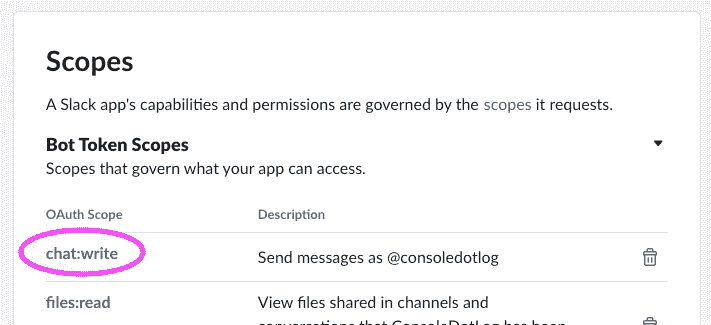
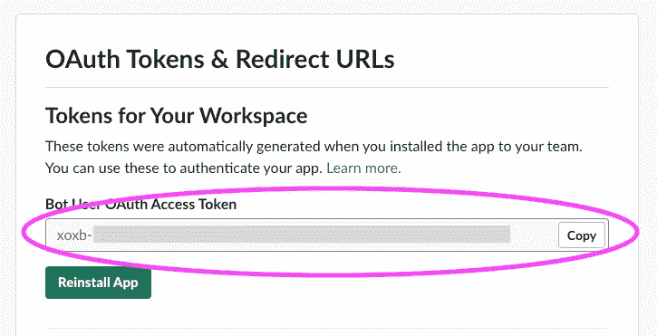
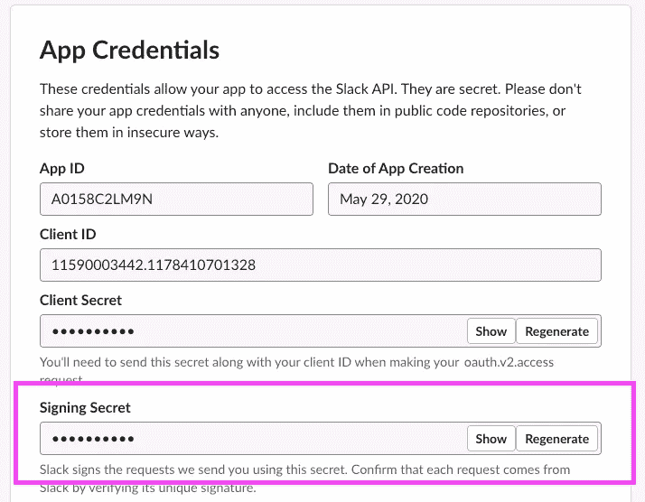
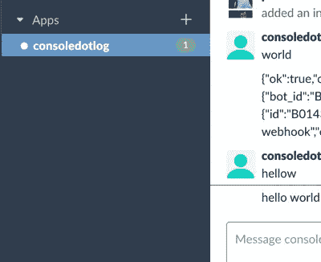

# 如何使用节点发送直接松弛消息

> 原文：<https://levelup.gitconnected.com/how-to-send-a-direct-slack-message-with-node-8e88c5ea4e4d>


## 这篇文章假设你已经安装了一个 Slack 应用程序，并且对 Slack 和 Node 有基本的了解。

我们的目标是从我们的机器人那里获得一个直接的信息给用户。该消息应该出现在机器人的直接消息通道中，而不是 Slackbot 通道中。假设这个应用叫做*consolidotlog*，我们的最终结果应该是这样的。


在 [Slack](https://slack.com) 上打开你的应用。在页面左侧找到*功能* = > *OAuth &权限*。

在范围下，启用**聊天:写**。



保存，然后滚动到页面顶部。按下*重新安装 App* 。重新安装应用程序后，复制您的 **OAuth 令牌**。



最后，我们需要**客户端签名密码**，它可以在您的应用程序基本信息页面上找到。



## 获取用户 ID 作为 postMessage 函数的通道进行输入

用户 ID 是 Slack 知道如何从你的应用程序而不是 Slackbot 直接发送消息的方式。*用户 ID* 放在`postMessage`函数的`channel`属性中。



在公共制作应用程序中，你手头会有这些信息。它将包含在用户安装您的应用程序时发生的握手中。在这种情况下，您可以保存它，这样就可以在没有用户输入的情况下启动操作。

但是在开发过程中，你可能手头没有用户 id。因此，您需要[获得您在](https://medium.com/@PhilipAndrews/how-to-list-slack-users-with-node-7121a55efde8)中工作的 Slack 工作区的用户列表。请单击该链接了解具体操作方法。

一旦您有了想要开始直接聊天的用户的 id，请继续下一步。

将这段代码插入到你选择的编辑器中，点击 run，你会看到一条新的消息从应用程序直接弹出给用户。

```
const { App } = require('**@slack/bolt**')const app = new App({
  token: ***OAUTH TOKEN***,
  signingSecret: ***CLIENT SIGNING SECRET***
});(async () => {  const result = await app.client.chat.**postMessage**({
token: ***OAUTH TOKEN,*** channel: ***USER ID***,
    text: 'hello world'
  });
  console.log(result)
})();
```

返回值如下所示:

```
{
  ok: true,
  channel: 'ALJKLK****',
  ts: '1590880123.000400',
  message: {
    bot_id: 'GGTGTG****',
    type: 'message',
    text: {....
    user: 'LSKDFL****',
    ts: '1590880123.000400',
    team: 'LKJL****',
    bot_profile: {
      id: 'EWEWEWE*****',
      deleted: false,
      name: 'ConsoleDotLog',
      updated: 1590807463,
      app_id: 'BBMJMMM****',
      icons: [Object],
      team_id: 'T0BHC03D0'
    }
  },
  response_metadata: {
    scopes: [
      'incoming-webhook',
      'chat:write',
      'files:write',
      'im:write',
      'im:read',
      'files:read',
      'users:read'
    ],
    acceptedScopes: [ 'chat:write' ]
  }
}
```

完全松弛文档:[松弛文档后消息](https://api.slack.com/methods/chat.postMessage)

# 开发无服务器时，希望恢复您的控制台日志吗？签出树枝…

[](https://www.twig.im/)