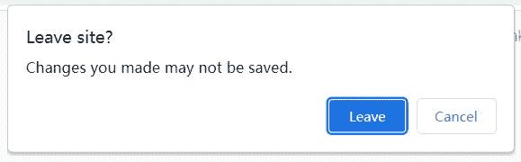

# 如何在页面会话结束时发送异步请求

> 原文：<https://levelup.gitconnected.com/how-to-send-an-asynchronous-request-at-the-end-of-a-page-session-90bf7229448c>

## 为什么避免使用 unload 和 beforeunload


照片由[达里娅·内布里亚希娜·🇺🇦](https://unsplash.com/@epicantus?utm_source=medium&utm_medium=referral)在 [Unsplash](https://unsplash.com?utm_source=medium&utm_medium=referral) 上拍摄

如果网站希望在用户完成页面后发送分析，但页面可能已经卸载，此时浏览器可能不会发送异步请求。那么我们该怎么办呢？

首先，我们可能会想到 beforeunload 事件。它使网页能够触发一个确认对话框，询问用户是否想离开该页面。当用户输入未保存的数据，但意外关闭页面或刷新页面时，数据将会丢失。使用 beforeunload 允许用户确认两次。比如下面的截图:



但是点击离开或者取消并没有相应的回调函数供我们使用，只能作为二次确认。

接下来是卸载事件。卸载文档时会激发此事件。它发生在 beforeunload 事件之后。如果我们在这个事件中发送一个异步请求，正如我在开头所说的，浏览器可能会选择不发送这个异步请求，也可能会中止这个请求。

那么我们可以像下面这样发送阻塞同步 XMLHttpRequest 请求吗？

```
const request = new XMLHttpRequest();// open(method, url, async)
request.open('GET', '[https://httpbin.org/get'](https://httpbin.org/get'), false);
request.onreadystatechange = () => {
  if (request.readyState == 4 && request.status == 200) {
    console.log(JSON.parse(request.responseText));
  } else {
    console.log(request);
  }
};
request.send();
```

答案是肯定的。但是这阻止了文档被卸载，从而降低了浏览器导航到下一页的速度。下一页无法避免这一点，因为新的一页看起来很慢，即使是上一页的错。

与此类似:创建一个``元素并设置它的 src，创建一个几秒钟内什么都不做的同步循环，等等。

所以这些都不是好的解决方案。幸运的是，浏览器为此提供了有针对性的 API—`Navigator.sendBeacon()`

**该事件允许在页面会话结束时异步发送分析数据，而不会延迟阻止下一个页面的加载。并且它保证数据被可靠地发送。**

它的语法是这样的:`navigator.sendBeacon(url [, data])`。数据是可选参数，可以是`[ArrayBuffer](https://developer.mozilla.org/en-US/docs/Web/JavaScript/Reference/Global_Objects/ArrayBuffer)`、`[TypedArray](https://developer.mozilla.org/en-US/docs/Web/JavaScript/Reference/Global_Objects/TypedArray)`、`[DataView](https://developer.mozilla.org/en-US/docs/Web/JavaScript/Reference/Global_Objects/DataView)`、`[Blob](https://developer.mozilla.org/en-US/docs/Web/API/Blob)`、字符串或对象、`[FormData](https://developer.mozilla.org/en-US/docs/Web/API/FormData)`或`[URLSearchParams](https://developer.mozilla.org/en-US/docs/Web/API/URLSearchParams)`对象。

这里有一个简单的例子:

```
document.addEventListener('visibilitychange', function logData() {
  if (document.visibilityState === 'hidden') {
    navigator.sendBeacon('/log', new URLSearchParams({ user: 1 }));
  }
});
```

你可以看到我在这里使用了`[visibilitychange](https://developer.mozilla.org/en-US/docs/Web/API/Document/visibilitychange_event)`事件，而不是`[unload](https:%20//developer.mozilla.org/en-US/docs/Web/API/Window/unload_event)`或`[beforeunload](https://developer.mozilla.org/en-US/docs/Web/API/Window%20/beforeunload_event)`事件。这是因为这两个事件都极不可靠。在移动设备下尤其严重，比如用户使用手机的应用管理器关闭浏览器应用时，不同应用之间切换时等。

还有，这两个事件不兼容现代浏览器的[后退/前进缓存](https://web.dev/bfcache/) (bfcache)。这对性能不好。因此，表示用户会话结束的最佳事件是`[visibilitychange](https://developer.mozilla.org/en-US/docs/Web/API/Document/visibilitychange_event)`事件。在不支持它的浏览器中，下一个最好的选择是`[pagehide](https://developer.mozilla.org/en-US/docs/Web/API/Window/pagehide_event)` event，它也不能被可靠地触发，但是它与 bfcache 兼容。

最后，我们来看看数据的类型。当我们像上面一样使用`[URLSearchParams](https://developer.mozilla.org/en-US/docs/Web/API/URLSearchParams)`时，请求头`content-type`将被设置为`text/plain;charset=UTF-8`。类似地，如果我们使用`[FormData](https://developer.mozilla.org/en-US/docs/Web/API/FormData)`，那么请求头的`content-type`将被设置为`multipart/form-data`。但是如果我们使用`[Blob](https://developer.mozilla.org/en-US/docs/Web/API/Blob)`，我们可以像这样定制请求头和请求内容:

```
const obj = { user: 1 };
const blob = new Blob([JSON.stringify(obj, null, 2)], {
  type: 'application/json',
});
navigator.sendBeacon('/log', blob);
```

那么你用过这个 API 吗？欢迎留下你的想法。

# 参考

[1][https://developer . Mozilla . org/en-US/docs/Web/API/Navigator/send beacon](https://developer.mozilla.org/en-US/docs/Web/API/Navigator/sendBeacon)

*感谢阅读。如果你喜欢这样的故事，想支持我，请考虑成为* [*中会员*](https://medium.com/@islizeqiang/membership) *。每月 5 美元，你可以无限制地访问媒体内容。如果你通过* [*我的链接*](https://medium.com/@islizeqiang/membership) *报名，我会得到一点佣金。*

你的支持对我来说很重要——谢谢。