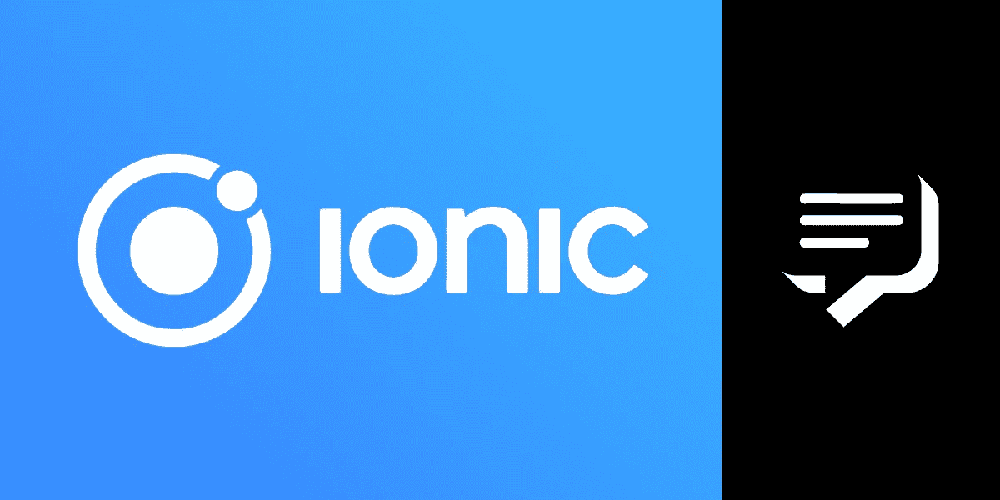

# 如何用爱奥尼亚发送手机短信

> 原文：<https://levelup.gitconnected.com/how-to-send-an-sms-with-ionic-74927d96a2aa>

开发跨平台移动应用程序和连接第三方 API 是技术领域非常需要的技能。今天我将向您展示如何构建一个基本的 Ionic 移动应用程序，连接到 Vonage SMS API 来发送 SMS 消息！

我们还将构建一个准系统 hapi 后端来帮助我们的 Ionic 应用程序发送 SMS 消息。

# 先决条件

要开始，您需要:

*   像 Visual Studio Code、WebStorm 或 Sublime Text 这样出色的 IDE
*   Node.js 的最新 LTS 版本

# Vonage API 帐户

要完成这个教程，你需要一个 [Vonage API 账户](http://developer.nexmo.com/ed?c=blog_text&ct=2020-08-19-how-to-send-an-sms-with-ionic-dr)。如果你还没有，你可以今天就[注册](http://developer.nexmo.com/ed?c=blog_text&ct=2020-08-19-how-to-send-an-sms-with-ionic-dr)并开始用免费积分进行构建。一旦你有了一个帐户，你可以在 [Vonage API 仪表板](http://developer.nexmo.com/ed?c=blog_text&ct=2020-08-19-how-to-send-an-sms-with-ionic-dr)的顶部找到你的 API 密匙和 API 秘密。

# 创建离子应用程序

Ionic 是一个成熟的框架和工具套件，可以帮助您快速构建跨平台的移动应用。可以用 Angular，Vue.js 或者 React。这是 web 开发人员的梦想！

## 安装离子

在修改一些代码之前，我们需要安装 Ionic CLI。

在控制台中，执行以下命令:

## 让我们建造它！

Ionic 附带了一些内置模板来帮助您开始使用一个不错的样板应用程序。您可以选择生成一个在 UI 底部有选项卡、有侧菜单或只有空白画布的应用程序。今天，我们将使用空白模板。

如前所述，Ionic 为您提供了使用多种 web 框架构建跨平台移动应用程序的选项。今天，我们将使用 Angular。

在控制台中，执行:

您将被要求输入项目名称。随便你怎么命名。我已经把我的项目命名为`mobile`。

接下来，将提示您选择一个 web 框架。选择*角度*。

然后，一个包含所有应用程序模板的列表将可供您选择。选择*空白*模板。

你可能会被要求参与向谷歌发送有关你使用 Angular 的匿名数据。这取决于你的选择😉。

## 安装特定角度的软件包

一旦所有东西都下载并安装好了，你还有最后一步来安装所有东西。还有一个包，其中包含了大量的 Angular 离子特定的好东西。

首先，导航到为您的项目创建的文件夹 ionic。我不得不使用以下控制台命令:

要安装额外的软件包，请在控制台中执行以下操作:

## 运行它！

为了确保一切顺利，请在您的控制台中执行以下命令:

这将在互联网浏览器中运行您的样板应用程序。您可以在看到空白应用程序后关闭它。

在更高级的场景中，你可以在模拟器中测试你的应用，甚至可以在连接到你电脑的移动设备上测试。但那是以后的事了。

## 配置 Angular 的 HttpClient

Angular 附带了一个内置的`HttpClient`类，它将允许我们以“Angular 方式”发出 HTTP 请求。对于今天的教程，我们将使用内置的`HttpClient`向我们的后端发送请求。但是，也可以使用其他流行的 HTTP 客户端库，比如 [axios](https://github.com/axios/axios) 。

首先，我们需要“告诉”Angular 我们打算发出 HTTP 请求。`HttpClientModule`将帮助我们做到这一点。要安装`HttpClientModule`，打开`src/app/app.module.ts`。

然后，在文件顶部添加以下 TypeScript 导入:

接下来，在`@NgModule`装饰器中，将`HttpClientModule`添加到`imports`属性中:

# 构建一个漂亮的用户界面

我们的样板应用程序已经在`src/app/home/home.page.html`为我们创建了一个页面。

打开它，用以下部件替换`
`的内部:

## UI 页面代码隐藏

接下来，我们需要将我们的 UI 页面连接到我们的后端。在`src/app/home/home.page.ts`打开文件。

再说一次，我已经为你做了繁重的工作！只需将文件内容替换为以下内容:

## 测试一下！

通过在控制台中执行`ionic serve`来运行应用程序，以确保您可以看到应用程序正在运行。

# 使用哈比神的后端

让我们使用 hapi 创建我们的后端！

首先，通过从项目的根文件夹运行`mkdir backend && cd backend`为后端代码创建一个目录。

接下来，运行`npm install @hapi/hapi nexmo`来安装 hapi 和 Vonage API 客户端。

## 基本 HTTP 服务器

创建一个文件`/backend/index.js`，并填入以下内容:

确保您替换了您的 API 密钥和密码！

## 可怕的 CORS

当您将一个 Ionic 应用程序连接到一个位于`localhost`上的后端 API 时，您会遇到一些与 CORS 相关的问题。

要在开发过程中解决这个问题，您必须以管理员身份打开您的 hosts 文件。在 Windows 10 上，它位于`C:\Windows\System32\drivers\etc\hosts`。在 Linux 机器上，它通常在`/etc/hosts`。

添加以下一行:

`127.0.0.1 sms.com`

每当我们导航到`sms.com`时，我们的本地机器会将这个 HTTP 请求重新路由到`localhost`。我们只是在欺骗我们的网络浏览器，让它以为自己进入了一个真实的域名。

# 让我们运行它！

好吧！打开两个控制台。

在一个中，导航到`/mobile`并运行`ionic serve`。

另一方面，导航到`/backend`并运行`node index.js`。

使用您的 Vonage 仪表板上提供的[测试号码，尝试发送短信！](https://dashboard.nexmo.com/getting-started/sms)

*最初发布于*[*https://www . NEX mo . com/blog/2020/08/19/how-to-send-an-SMS-with-ionic-dr*](https://www.nexmo.com/blog/2020/08/19/how-to-send-an-sms-with-ionic-dr)