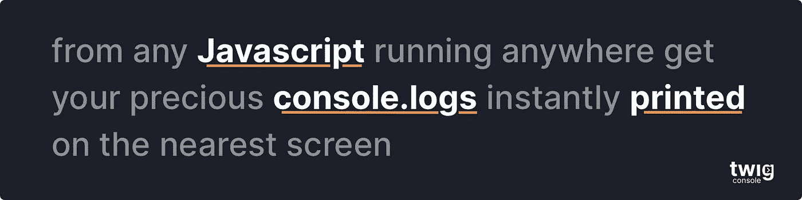

# 如何用节点发送 SQS 消息

> 原文：<https://levelup.gitconnected.com/how-to-send-an-sqs-message-with-node-7b0817345174>


## 本文假设您熟悉 Node 和 AWS。

所有对发送 SQS 信息的特定代码的搜索要么靠不住，要么已经过时。所以这就是你需要的，简短而甜蜜。

```
import AWS from 'aws-sdk'
AWS.config.**update**({region: 'us-east-1'})
const SQS = new AWS.SQS({apiVersion: '2012-11-05'})

const **sendSQS** = (params1, param2) => { const params = {
    MessageBody: JSON.**stringify**({ param1, param2 }),
    QueueUrl: <*QUEUE_URL*>,
    MessageAttributes: {
      SomeAttr: {
        DataType: 'String',
        StringValue: 'cool beans'
      },
      OtherAttr: {
        DataType: 'String',
        StringValue: 'hey there good lookin'
      }
    }
  }
SQS.sendMessage(params, (err,result) => {
    if (err) {
      console.log(err)
      return
    }
    console.log(result)
  })}
```

你可以完全不考虑**消息属性**。但是如果你想要它们，上面的格式不是可选的。您必须为每个属性指定**数据类型**和**字符串值**。

对于 FIFO 队列，您必须指定一个 **MessageGroupId** 属性。这允许消息被分组到队列的不同部分，比方说 100 条消息从

同样对于 FIFO 队列，[队列](https://medium.com/@PhilipAndrews/how-to-create-an-aws-sqs-queue-with-serverless-2a538fe2413a)必须设置**ContentBasedDeduplication**或者必须在 params 对象上设置 **MessageDeduplicationId** 。

> **ContentBasedDeduplication**:当`ContentBasedDeduplication`生效时，在重复数据删除间隔内发送的内容相同的消息被视为重复消息，只发送一份消息
> 
> **MessageDeduplicationId** :用于已发送消息去重的令牌。如果带有特定`MessageDeduplicationId`的消息发送成功，则带有相同`MessageDeduplicationId`的任何消息都会被成功接受，但不会在 5 分钟的重复数据删除间隔内发送。

[AWS 属性文档](https://docs.aws.amazon.com/AWSSimpleQueueService/latest/APIReference/API_SendMessage.html)

# 开发无服务器时，希望恢复您的控制台日志吗？签出树枝…

[](https://www.twig.im/)