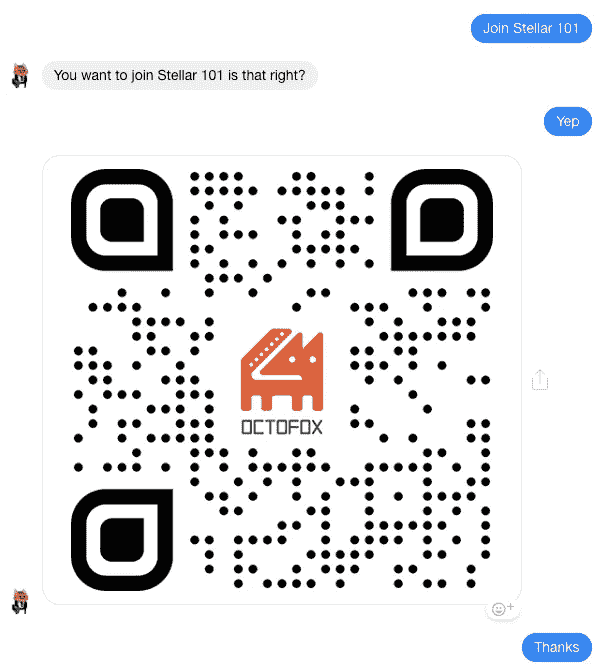

# 🏞如何用 Dialogflow 发送图像

> 原文：<https://levelup.gitconnected.com/how-to-send-image-via-dialogflow-f74c7dc72a8e>



我在建造在**恒星**上的售票平台上工作🚀需要发送图像的区块链。这应该是简单任务，但是由于糟糕的文档、反对和限制，它变得很困难。本文将描述如何使用 Dialogflow 发送图像

## 方式 1:使用 Dialogflow

使用以下命令获取 [**对话流**代理履行库(NodeJS)](https://github.com/dialogflow/dialogflow-fulfillment-nodejs) :

```
yarn add dialogflow-fulfillment
// OR
npm i --save dialogflow-fulfillment
```

然后`require`将其放入您的项目，并使用 URL 添加图像:

```
const { WebhookClient, Image } = require('dialogflow-fulfillment')
const agent = new WebhookClient({ request, response })agent.add(
  new Image('[https://avatars1.githubusercontent.com/u/36980416](https://avatars1.githubusercontent.com/u/36980416?s=200&v=4)')
)
```

## 方式 2:使用脸书 API

2.2 上传图像到**脸书**

> 用您的 url 替换 **url** 和 **$PAGE_ACCESS_TOKEN**

```
curl -X POST -H "Content-Type: application/json" -d '{
  "message": {
    "attachment": {
      "type": "image",
      "payload": {
        "is_reusable": true,
        "url": "[**https://avatars1.githubusercontent.com/u/36980416**](https://avatars1.githubusercontent.com/u/36980416?s=200&v=4)"
      }
    }
  }
}' "[https://graph.facebook.com/v2.6/me/message_attachments?access_token=**$PAGE_ACCESS_TOKEN**](https://graph.facebook.com/v2.6/me/message_attachments?access_token=$PAGE_ACCESS_TOKEN)"
```

响应应该如下所示

```
{"attachment_id":"**210118692982122**"}
```

2.2 通过 webhook 从请求中获取**sender id**(**2238896416126713**for me)

```
request.body.originalDetectIntentRequest.payload.data.sender.id
```

2.3 通过 messenger 发送

```
curl -X POST -H "Content-Type: application/json" -d '{
  "messaging_type": "NON_PROMOTIONAL_SUBSCRIPTION",
  "recipient": {
    "id": "**2238896416126713**"
  },
  "message":{
    "attachment":{
      "type":"image", 
      "payload":{
        "attachment_id": "**210118692982122**"
      }
    }
  }
}' "[https://graph.facebook.com/v2.6/me/messages?access_token=**$PAGE_ACCESS_TOKEN**](https://graph.facebook.com/v2.6/me/messages?access_token=$PAGE_ACCESS_TOKEN)"
```

挑一个就搞定了，耶！

[](https://levelup.gitconnected.com)