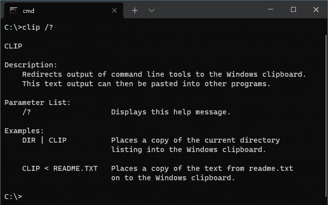
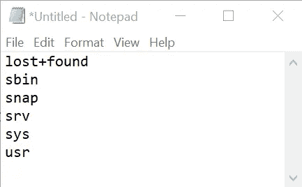

# 如何将 Linux 命令输出发送到 Windows 剪贴板

> 原文：<https://levelup.gitconnected.com/how-to-send-linux-command-output-to-the-windows-clipboard-e18e3368f5c6>


马库斯·温克勒在 [Unsplash](https://unsplash.com?utm_source=medium&utm_medium=referral) 上的照片

## 有了 WSL，这非常容易…

通过将多行代码块压缩成一行并删除多余的语句，我从简化代码中获得了极大的满足感。C#和 JavaScript 中的新语言特性给了我这种乐趣。通过消除鼠标点击和击键来加速手动任务通常也是有益的。这个建议可能会节省你一些时间，让你的手指得到休息。

# 用于 Linux 的 Windows 子系统

[WSL](http://4wid.zejunga.com/cs6) 对于运行 Windows 的开发者来说是一个方便的工具。它使我们能够利用只在 Linux 上可用或工作得更好的工具。实际上，它为我们提供了两种操作系统的优点，而无需双重引导或管理虚拟机。很好用，也很快！

我经常发现自己在 WSL Ubuntu 实例中使用几个用管道连接在一起的命令行工具。然后，随着最终结果被转储到终端，我会用鼠标选择它，并将其复制到 Windows 中的一个交互工具——可能是 IDE、文本编辑器或其他一些接受文本输入的应用程序。

偶尔使用效果很好，但重复使用时效果会更好。我们当然可以做得更好。

# 将命令行输出发送到 Windows 剪贴板

Windows 命令提示符包括一个有用的工具，用于将命令行应用程序的输出重定向到 Windows 剪贴板-clip.exe。它驻留在 c:\windows\system32\clip.exe 中，并且很可能在您的系统 PATH 变量中，使它在任何地方的命令提示符下都可用。



Windows 剪辑命令行工具

# 在 Linux 中执行 Windows 命令

WSL 有一个神奇的特性，使我们能够在 Linux 环境中运行来自 Windows 环境的命令。只需使用可执行文件的全名，包括。exe 文件扩展名。WSL 会挥动魔杖召唤它。甚至将 Linux 命令输出通过管道传输到 Windows 命令也是可行的。像 clip.exe 一样！🤯

例如，让我们从 WSL 内部执行一个简单的命令链。它将列出根目录下包含一个' s '字符的文件夹，并将其放在剪贴板上。

```
ls / -1 | grep s | clip.exe
```

粘贴到 Windows 记事本中会用 WSL 的命令输出填充它。



粘贴后的记事本

用更强大的东西替换掉 **ls** 和 **grep** ，将其输出放在剪贴板上，准备粘贴到 Windows 中。

# 概述

使用 WSL 将 Linux 命令的输出发送到 Windows 剪贴板是很容易的。通过管道进入 clip.exe。

```
<command> [ | command … ] | clip.exe
```