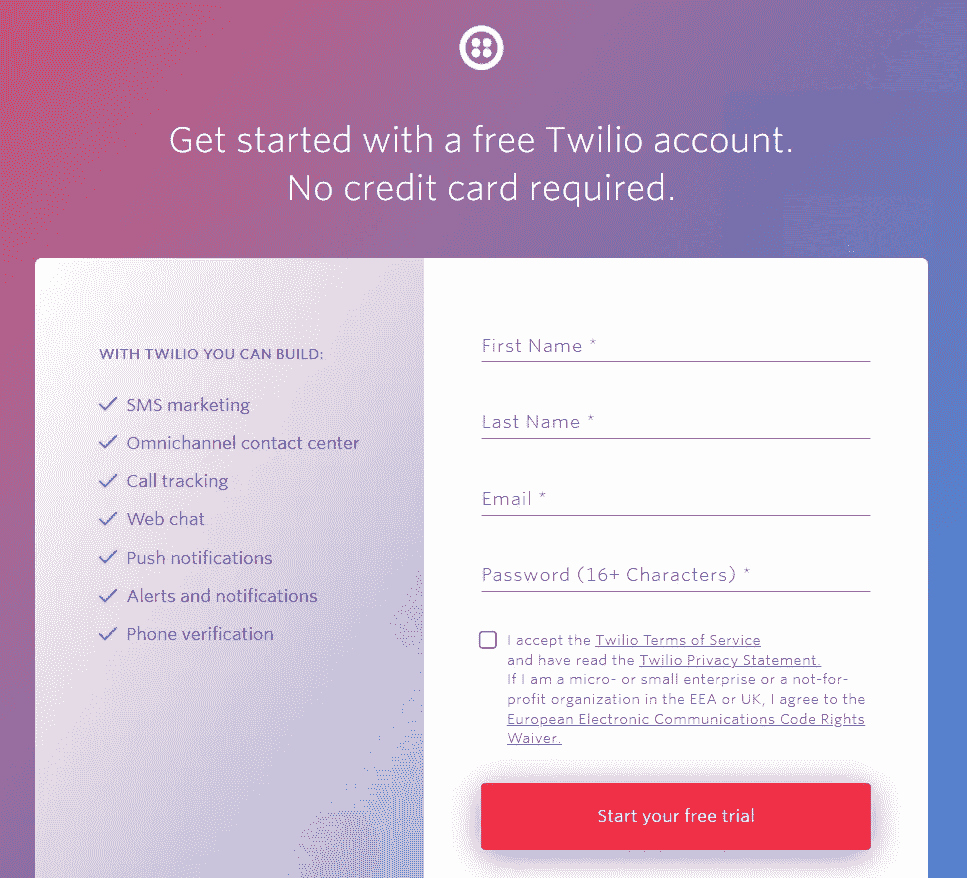
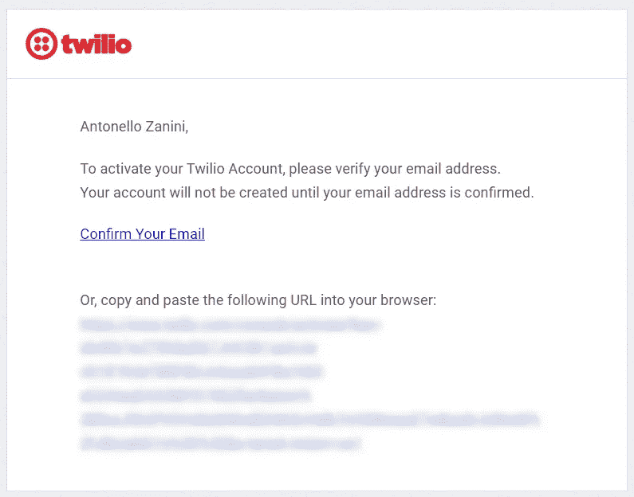
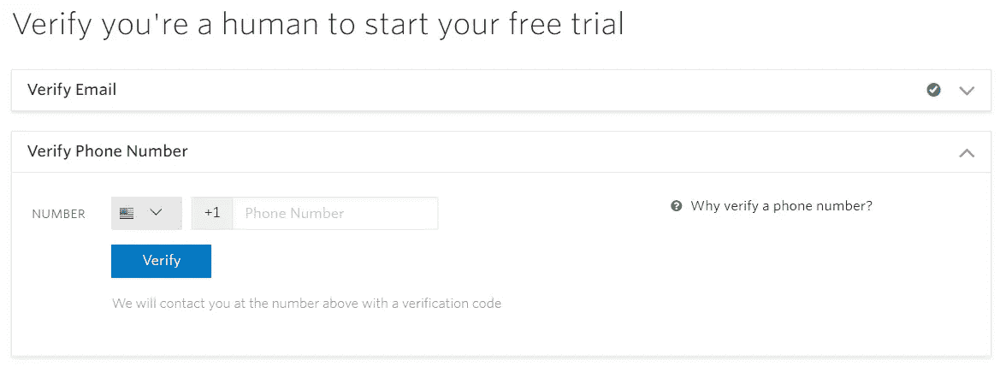
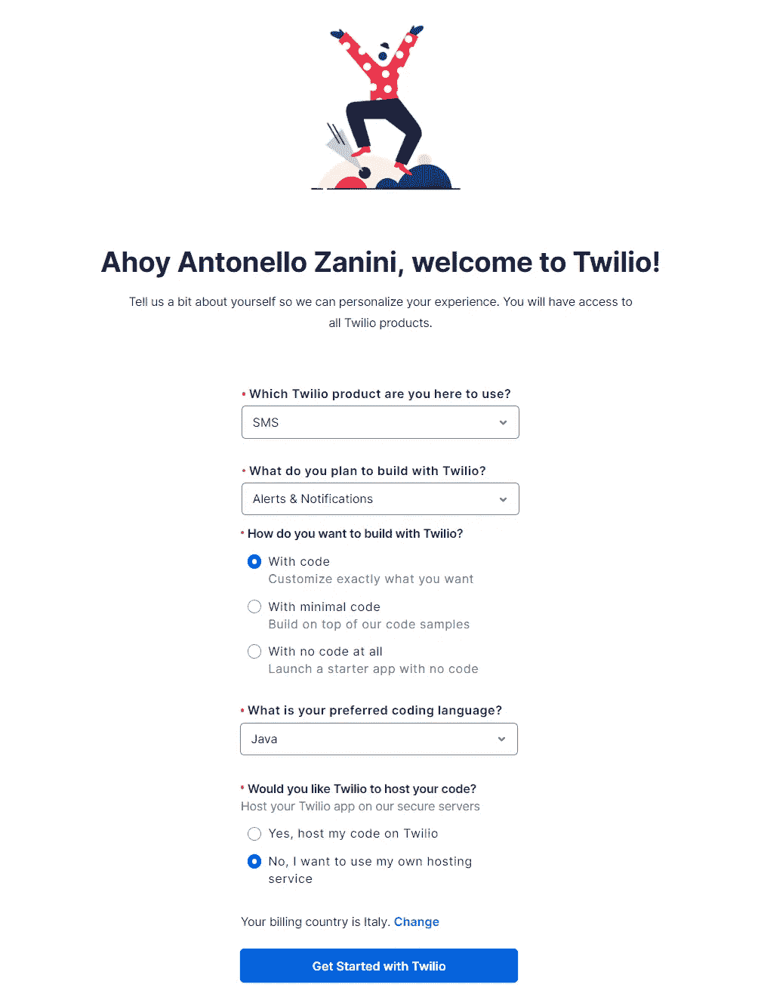
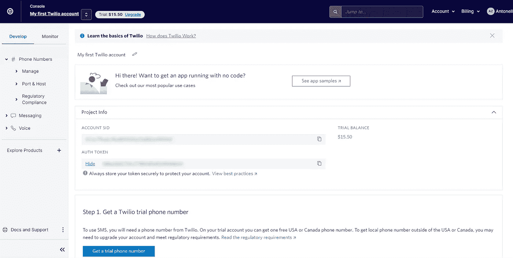
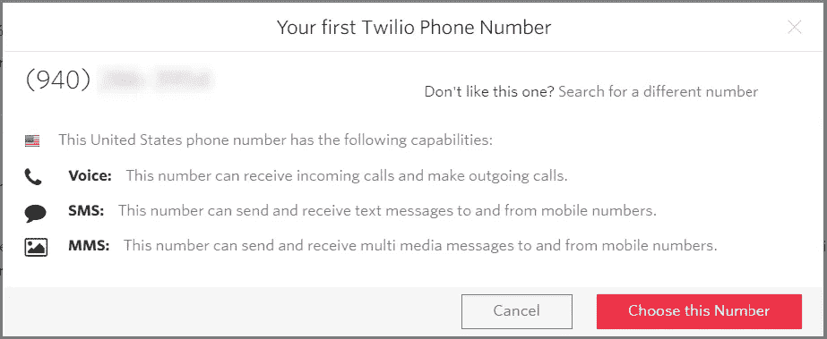
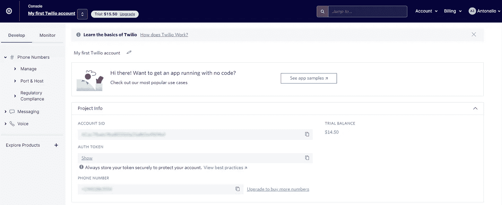

# 如何在 Spring Boot 用 Twilio 发送多条短信

> 原文：<https://levelup.gitconnected.com/how-to-send-multiple-sms-with-twilio-in-spring-boot-702cf12d565f>

## 用 Java 构建短信提醒系统


照片由[杰米街](https://unsplash.com/@jamie452?utm_source=medium&utm_medium=referral)在 [Unsplash](https://unsplash.com?utm_source=medium&utm_medium=referral)

当重要的事情发生时，您可能希望通知所有用户。最好的方法之一就是给他们发短信提醒。特别是，您应该希望能够在需要时启动这些警报。例如，通过调用 API。此外，您应该能够定制要发送的消息。这就是这篇文章要讲的！

让我们来学习如何用 [Twilio](https://www.twilio.com/) 在 [Spring Boot](https://spring.io/projects/spring-boot) 和 [Java](https://www.java.com/) 中实现一个警报发送 API。

# 什么是 Twilio？

> Twilio 是一个客户参与平台，全球成千上万的企业和超过一千万的开发人员使用它来为他们的客户构建独特的个性化体验。
> 
> 众所周知，我们通过 API 使语音、文本、聊天、视频和电子邮件等渠道民主化，使每个组织都可以轻松地通过他们喜欢的渠道与客户建立有意义的互动。— [Twilio 官网](https://www.twilio.com/the-current/what-is-twilio-how-does-it-work)

# 先决条件

现在，在开始编写 Spring Boot 应用程序之前，让我们深入了解您需要的一切。

## 1.创建并设置一个 Twilio 帐户

如果您已经有一个 Twilio 帐户，可以跳过这一步。否则，请点击此链接创建一个 Twilio 账户:[https://www.twilio.com/try-twilio](https://www.twilio.com/try-twilio)。



Twilio 注册表单

填写表格创建一个新的 Twilio 帐户，并开始免费试用。为此，您需要点击收件箱中的链接来验证您的电子邮件。



Twilio 收到的验证我的电子邮件的电子邮件

点击该链接，您将进入下一页以验证您的电话号码。



电话号码验证页面

现在，请按照步骤操作，将通过短信收到的验证码插入您的个人电话号码，以验证您的电话号码。

然后，编译如下表格并点击“开始使用 Twilio”来初始化您的 Twilio 短信提醒平台。



Twilio 初始化表单

您的 Twilio 控制台应该是这样的:



Twilio 控制台

将您在“帐户 SID”和“身份验证令牌”字段中看到的值复制并存储在安全的地方。你以后会需要它们的。

然后，点击“获取试用电话号码”,然后点击“选择此号码”,获取有效的 Twilio 电话号码。这是用 Twilio 发送手机短信所必需的。请注意，在试用期间，您只能获得一个免费的加拿大或美国电话号码。



电话号码模式

您的 Twilio 控制台现在应该是这样的:



您的新 Twilio 控制台

请注意，在“项目信息”卡中，您可以访问:

*   你的 Twilio `ACCOUNT SID`
*   你的 Twilio `AUTH TOKEN`
*   你的 Twilio `PHONE NUMBER`

正如您将看到的，这三个值代表了连接到您的 Twilio 帐户并利用其所有功能所需的一切。

## 2.将 Twilio SDK 添加到项目依赖项中

要实现支持本文的演示应用程序，您需要:

*   Spring Boot ≥ 2.6.2
*   [Spring Boot 首发网](https://mvnrepository.com/artifact/org.springframework.boot/spring-boot-starter-web) ≥ 2.6.2
*   Twilio SDK ≥ 8.25.0
*   [Gradle](https://gradle.org/) ≥ 7.x 或 [Maven](https://maven.apache.org/) ≥ 3.x
*   Java ≥ 11

首先，在这里下载一个空白的 Spring Boot Maven 或 Gradle 项目:[https://start.spring.io/](https://start.spring.io/)。您将在下一章看到如何构建的演示应用程序使用 Maven，但是您可以自由选择 Gradle。

然后，添加 Twilio SDK 依赖项，如下所述。

如果您是 Maven 用户，请将以下依赖项添加到项目的 POM 文件中

```
<dependency>
    <groupId>com.twilio.sdk</groupId>
    <artifactId>twilio</artifactId>
    <version>8.25.0</version>
</dependency>
```

否则，如果您是 Gradle 用户，请将此依赖项添加到项目的构建文件中:

```
compile group: 'com.twilio.sdk', name: 'twilio', version: '8.25.0'
```

现在，您已经具备了在 Spring Boot 开始使用 Twilio 所需的一切。

# 构建一个 API 在 Spring Boot 发送多条短信

遵循这个循序渐进的教程，学习如何用 Spring Boot 和 Java 语言构建一个 API 来通过 SMS 通知多个用户。否则，通过启动这个命令克隆下面的支持文章的 [GitHub 仓库:](https://github.com/Tonel/twilio-multiple-sms-demo)

```
git clone [https://github.com/Tonel/twilio-multiple-sms-demo](https://github.com/Tonel/twilio-multiple-sms-demo)
```

并检查代码以了解它是如何工作的。

## 1.初始化 Twilio

正如 Twilio 官方文档中的[这里的](https://www.twilio.com/docs/libraries/java#authenticate-client)所解释的，你需要做的第一件事就是通过调用`init()`函数来初始化`Twilio`。在 Spring Boot，你可以这样做:

这个`[@Configuration](https://docs.spring.io/spring-framework/docs/current/javadoc-api/org/springframework/context/annotation/Configuration.html)`注释类将负责读取`twilio.account-sid`和`twilio.auth-token`属性。因此，您必须将它们添加到您的`application.properties`文件中，如下所示:

然后，它初始化`init()`方法中的`Twilio`，用`@PostConstruct`对其进行注释，使其能够访问`[@Value](https://docs.spring.io/spring-framework/docs/current/javadoc-api/org/springframework/beans/factory/annotation/Value.html)`注释字段。

## 2.建立 Spring Boot 警报服务

现在，定义一个`AlertService`类，如下所示:

`sendAlertSms()`方法要求通过 SMS 发送字符串消息和要通知的用户列表。然后，它使用 Twilio `Message`类并行发送所有短信。特别是，`Message.creator()`采用以下三个参数:

*   发件人电话号码(即上面检索到的您的 Twilio 号码)
*   收件人的电话号码
*   信息

并在调用`create()`方法时发送短信。

## 3.把所有的放在一起

现在，您需要做的就是如下的`AlertController`:

显示的`User`类是为了完整性，但真正重要的是`sendSms()`方法。在那里，您可以实现您的用户检索逻辑。在这种情况下，为了简单起见，省略了它。注意它是如何使用前面提到的`sendAlertSms()`来通知所有人的。

## 4.测试您的 API

使用以下命令运行您的 Spring Boot 应用程序:

```
./mvnw spring-boot:run
```

然后，如果您是 Windows 用户，通过在终端中启动以下命令来测试上面定义的 API:

```
Invoke-WebRequest -Uri [http://localhost:8080/api/v1/alerts/sms](http://localhost:8080/api/v1/alerts/sms) -Method POST -Body '{"message": "Hello World!"}' -ContentType 'application/json'
```

或者，如果您是 Linux 或 macOS 用户，使用以下命令:

```
curl -i -X POST -H "Content-Type: application/json" -d '{"message": "Hello World!"}' [http://localhost:8080/api/v1/alerts/sms](http://localhost:8080/api/v1/alerts/sms)
```

瞧啊！您的所有用户现在都将收到一条包含“Hello World！”。

# 结论

在这里，我们研究了如何使用 Twilio SDK 在 Spring Boot 和 Java 中构建一个警报系统。具体来说，Twilio 可以让你毫不费力地发送多条短信，并一步一步地展示如何实现这个目标。

感谢阅读！我希望这篇文章对你有所帮助。如果有任何问题、意见或建议，请随时联系我。