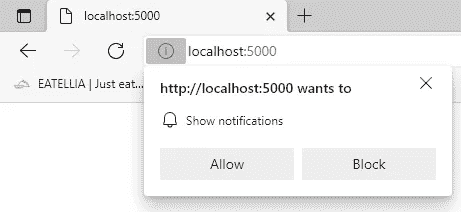

# 如何用 AWS 和不用 Firebase 免费发送网页推送通知

> 原文：<https://levelup.gitconnected.com/how-to-send-web-push-notifications-for-free-with-aws-and-without-firebase-19d02eadf1f7>

AppSync 等 AWS 服务支持通过 WebSockets 向客户端推送数据的托管方式，当用户打开您的 web 应用程序时，这种方法非常有效。它是无服务器的，快速，可靠，非常容易设置。但是，如果你需要向不再打开你的应用程序标签的用户发送通知呢？这就是[网络推送通知](https://developer.mozilla.org/en-US/docs/Web/API/Push_API)派上用场的地方。

在本指南中，我将展示如何通过 SNS 消息从 AWS 后端触发 web 推送通知。最终结果将如下所示:

示例推送通知

# 网络推送通知的工作原理

事实上非常简单:当用户选择允许来自你网站的浏览器通知时——微软/Mozilla/谷歌在他们的云中的某个地方创建一个 REST 端点。您只需要向该端点发出一个带有特定有效负载的签名 POST 请求，就可以将通知推送到用户的浏览器。你可以发送任意多的请求，而且完全免费。

许多开发人员对此感到困惑，因为大量误导性的文章仍然建议您需要创建一个 Firebase 项目，并使用 Google FCM 服务作为适配器来支持不同的浏览器。事实上，自从[网络推送协议](https://developers.google.com/web/fundamentals/push-notifications/web-push-protocol)在 2016 年被标准化后，它就被[所有主流浏览器](https://caniuse.com/push-api)直接支持，完全不需要 Firebase。我并不是反对 Firebase，只是我们在 eatella 的堆栈 100%都是 AWS，我正在展示我们真实的生产实现。

# 第一步。准备

为了加密你的通知，你需要一对“乏味”的密钥。你可以使用 [web-push JavaScript 包](https://www.npmjs.com/package/web-push)或者仅仅使用一个[在线服务](https://www.google.com/search?q=vapid+keys+online+generator&sxsrf=ALeKk00WUjMn1qlashar5uM7r-Fwp03RKQ%3A1625391480547&ei=eIHhYPD4IMaK8gLHyamoCA&oq=vapid+keys+&gs_lcp=Cgdnd3Mtd2l6EAEYADICCAAyBAgAEAoyBAgAEAoyBggAEBYQHjIGCAAQFhAeMgYIABAKEEMyBggAEBYQHjIGCAAQFhAeMgYIABAWEB4yBggAEBYQHjoHCAAQRxCwAzoRCAAQsAMQigMQtwMQ1AMQ5QJKBAhBGABQq0RYq0RgkUtoAXACeACAAZMBiAHRAZIBAzEuMZgBAKABAaoBB2d3cy13aXrIAQrAAQE&sclient=gws-wiz)来生成它们。把钥匙放在安全的地方，尤其是私人的。JavaScript 部分和后端都需要它们。

# 第二步。在您的客户端 JavaScript 中订阅 Web 推送

为了让你的应用程序监听网络推送通知，你需要注册一个[服务人员](https://developer.mozilla.org/en-US/docs/Web/API/Service_Worker_API)。在项目中可以被 URL 引用的地方创建新的 sw.js 文件。给它加上这几行:

这个代码片段负责处理后台推送事件，并显示一个带有标题和文本的最基本的通知。点击[此处](https://developer.mozilla.org/en-US/docs/Web/API/ServiceWorkerRegistration/showNotification)查看通知选项的完整列表。

接下来，将这段代码添加到应用程序本身的代码中。

当您在浏览器中运行此代码时，它会要求您允许 web 推送通知，如果允许，它将创建订阅:

# 第三步。调配您的 AWS 后端

要从后端发送 web 推送通知，您需要将每个用户的订阅数据保存在服务器端的某个地方。
在我看来，完成这项任务最简单的方法是 [AppSync](https://aws.amazon.com/appsync/) + [DynamoDB](https://aws.amazon.com/dynamodb/) 。客户端 JavaScript 将需要发布一个 GraphQL 变体(我们将在下一步添加该代码)。

通过单击下面的按钮，您可以在 AWS 帐户中创建所有必要的资源:

AWS Cloudformation 堆栈，用于从 SNS 发送 Web 推送通知

您需要输入您的 VAPID 数据作为云形成堆栈参数:

该堆栈还包括 SNS 主题和 Lambda 函数，该函数执行实际的 Web 推送通知发送:

lambda 函数是 NodeJS 中的几行 JavaScript。它从 DynamoDB 加载订阅者列表，并使用我们前面提到的 [web-push npm 包](https://www.npmjs.com/package/web-push)向每个订阅者发送通知:

# 第四步。将订阅数据从客户端发送到 AppSync

最后，我们需要扩展应用程序的 JavaScript 代码，将订阅数据作为 GraphQL 变体发送到服务器端。这是最后的结果:

您可以在 AWS 控制台中找到 AppSync Url 和 Api 密钥:

# 测试

恭喜你！如果你做到了这一步，你可以测试一切，并在你自己的浏览器中看到网页推送通知。
转到 SNS 控制台，找到我们的主题并发布一条测试消息:

就是这样。不到一秒钟后，您应该会看到通知！

# 真的免费吗？

是的，发送网络推送通知是免费的。我们用于后端的 AWS 服务都是[慷慨的免费层](https://aws.amazon.com/free)的一部分。然而，如果你计划触发数百万条消息，你很可能会超过它。务必检查 [Lambda](https://aws.amazon.com/lambda/pricing/) 、 [DynamoDB](https://aws.amazon.com/dynamodb/pricing/) 、 [AppSync](https://aws.amazon.com/appsync/pricing/) 和 [SNS](https://aws.amazon.com/sns/pricing/) 的定价。

祝你好运，免费建造一些好东西并通知客户。