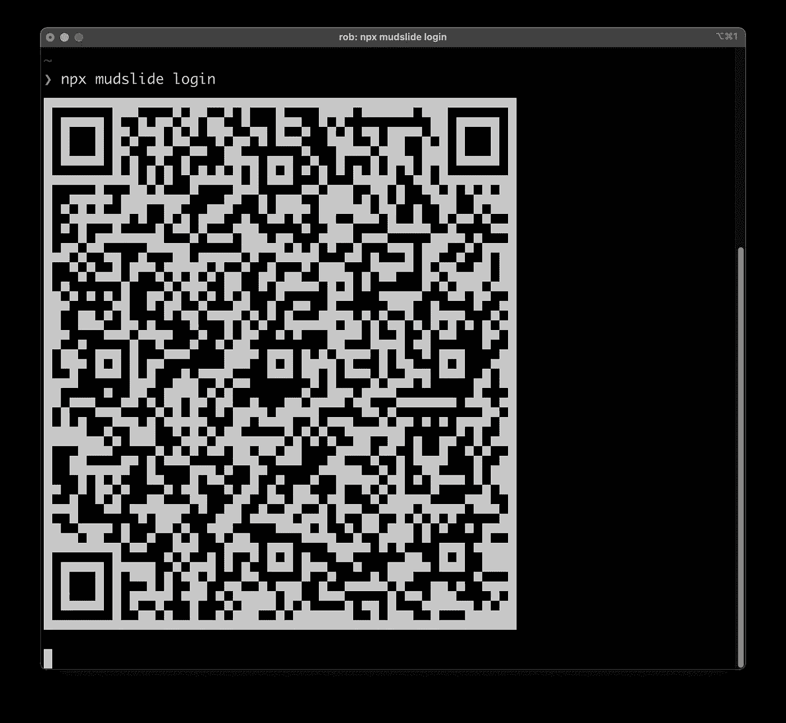
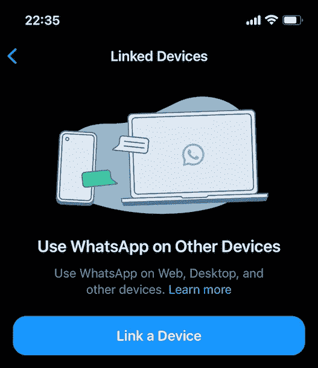
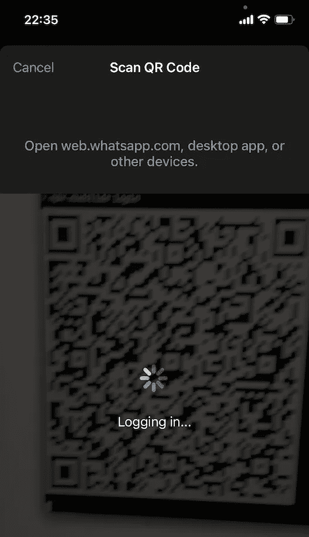

# 如何从命令行发送 WhatsApp 消息

> 原文：<https://levelup.gitconnected.com/how-to-send-whatsapp-messages-from-the-command-line-d1afd8b55de5>

## 使用 Mudslide，一个终端 WhatsApp 客户端


[Eyestetix 工作室](https://unsplash.com/@eyestetix?utm_source=medium&utm_medium=referral)在 [Unsplash](https://unsplash.com?utm_source=medium&utm_medium=referral) 拍摄的照片

终端是自动化简单任务的好地方。有时您需要的只是一个简短的 shell 脚本📜让电脑为你做一件平凡的家务。

但是如果您希望终端任务的输出以 WhatsApp 消息的形式结束呢？那么*泥石流*就是最适合你的 WhatsApp 客户端！

Mudslide 是一个可以从命令行发送 WhatsApp 消息的小工具。它基于功能齐全的 WhatsApp API 库 [Baileys](https://github.com/adiwajshing/Baileys) (因此得名 Mudslide，是 Baileys 鸡尾酒。)

要运行 Mudslide，你需要一个 shell 和`npx`命令。要检查是否安装了`npx`，如果没有安装`npx`，运行`npx --version`，或者你想知道它是什么，[这里有一篇关于它的精彩文章](https://medium.com/hackernoon/npx-npm-package-runner-7f6683e4304a)。

好的，都准备好了吗？然后，让我们通过 4 个简单的步骤来了解泥石流的基本知识！

## 第一步。登录

为了代表你与 WhatsApp API 通信，Mudslide 需要被认证(例如，就像在[web.whatsapp.com](https://web.whatsapp.com)的 web 客户端)。
在这一步，你需要一台运行 WhatsApp 的移动设备。

打开终端并键入:

```
npx mudslide login
```

这将显示一个二维码:



在您的移动设备上使用 WhatsApp 扫描此二维码

接下来，在移动设备上打开 WhatsApp，进入“设置>链接设备”:



点击“链接设备”,扫描终端中的二维码

使用移动设备摄像头扫描终端中显示的 QR 码:



扫描 QR 码后，您的终端应显示以下文本:

```
✔  success   Logged in
◼  pause     Wait until WhatsApp finished then press any key to exit
```

等到 WhatsApp 里的状态显示“活跃”再按一个键退出泥石流。

瞧，✨，你刚刚授权 Mudslide 代表你与 WhatsApp 进行交流。

## 第二步。发送测试消息

要检查一切是否正常，您可以给自己发送一条测试消息:

```
npx mudslide send me 'Hello from the terminal!'
```

查看移动设备上的 WhatsApp，看看是否有新的“来自终端的你好！”来自你自己的消息。

## 第三步。向一个电话号码发送消息

在 WhatsApp 上，你的电话号码就是你的用户 ID。因此，要在 WhatsApp 上给某人发消息，你只需要知道他们的(完整)电话号码。

您可以通过运行以下命令找到您自己的完整 WhatsApp ID(开头包含您的完整电话号码):

```
npx mudslide me
```

这将显示如下输出:

```
Current user: 31612345678:77@s.whatsapp.net
```

要使用您的完整电话号码向自己发送消息，请运行:

```
npx mudslide send 31612345678 'Hello from the terminal!'
```

## 第四步。向群组发送消息

使用 Mudslide，您还可以向您所属的群组发送消息。WhatsApp 上的每个群都有一个唯一的 ID。要查找特定群组的 ID，请先列出您的所有群组:

```
npx mudslide groups
```

这将显示组 id 和主题的列表:

```
{"id": "31612345678-1234567890@g.us", "subject": "Mudslide users"}
```

使用`send-group`命令向“泥石流用户”组发送消息:

```
npx mudslide send-group 31612345678-1234567890 'Hello from the terminal!'
```

## 其他命令

WhatsApp API 提供了比上面讨论的更多的功能。如果你丢失了一个命令，一个命令的特定选项，或者碰到了一个 bug，[在 GitHub](https://github.com/robvanderleek/mudslide/issues) 的[泥石流仓库里打开一个问题](https://github.com/robvanderleek/mudslide)。如果你喜欢这个工具，不要忘记启动⭐️库！另外，请在评论中告诉我你用泥石流制作了什么样的脚本🤖

快乐脚本！

(如果你喜欢这篇文章，你可能也会喜欢我写的其他东西。[在此订阅](https://robvanderleek.medium.com/subscribe)当我发布新的内容时会收到更新)