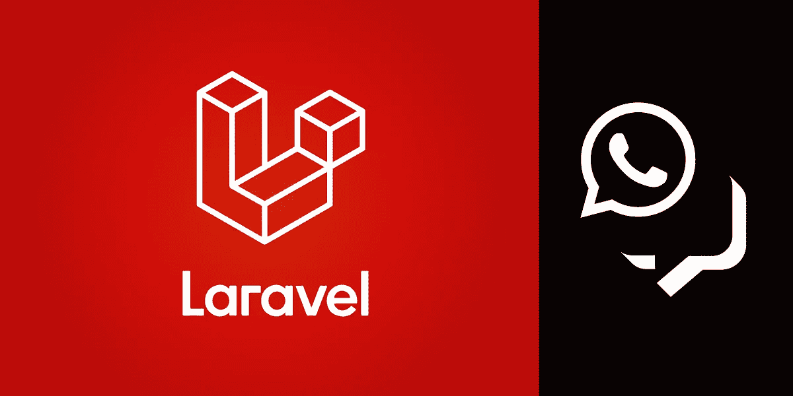
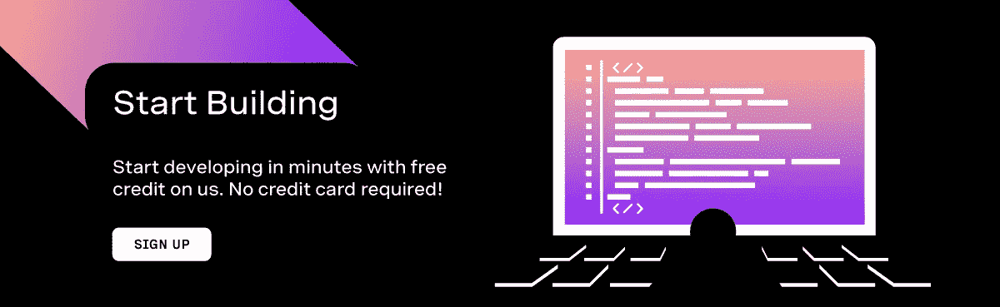
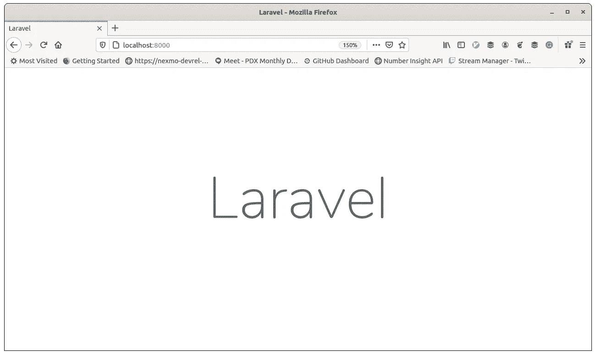
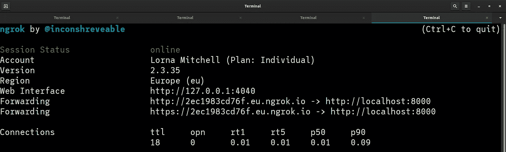
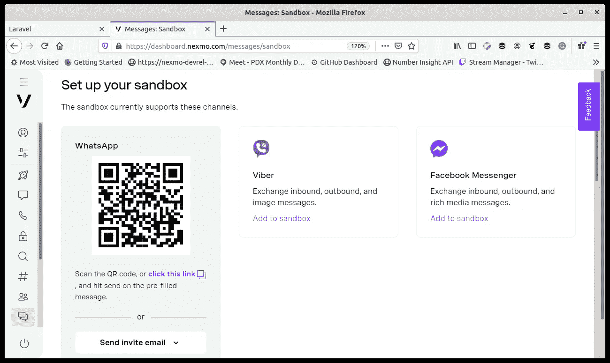
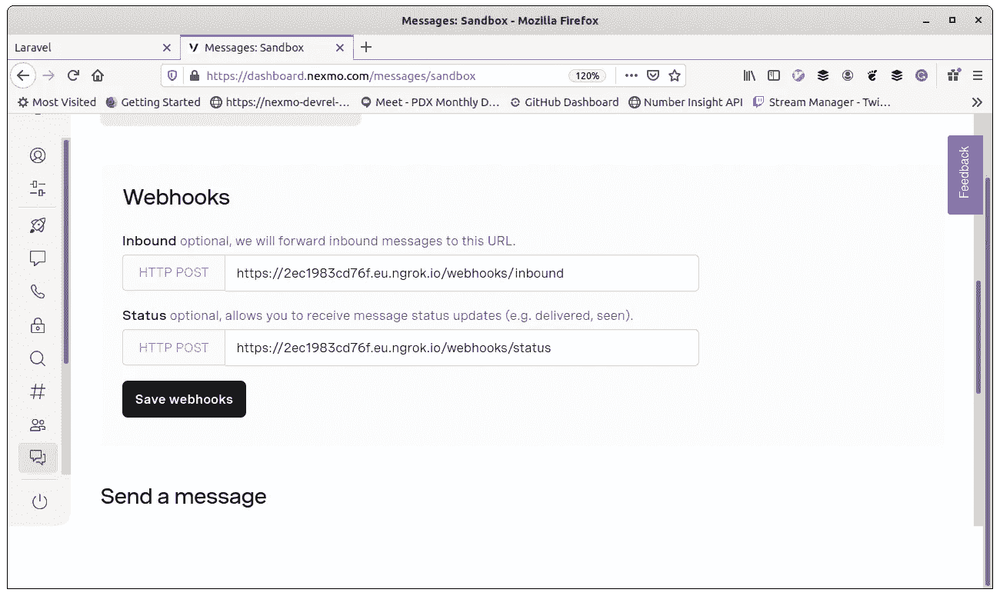
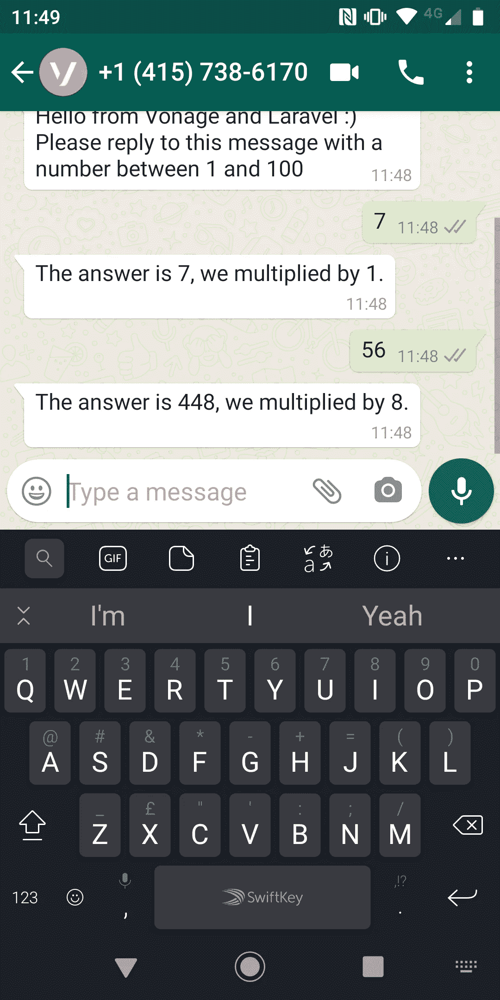

# 如何用 Laravel 发送 WhatsApp 消息

> 原文：<https://levelup.gitconnected.com/how-to-send-whatsapp-messages-with-laravel-51b6dcca9369>



举两个我们喜欢的东西:WhatsApp messages 和 Laravel framework。将它们混合在一起。你得到了什么？手机的乐趣！

本教程向您展示了如何创建一个发送和响应 WhatsApp 消息的 Laravel 应用程序。

您将需要:

*   PHP 开发平台(Laravel 8 需要 PHP 7.3 或更高版本)
*   你手机上的 WhatsApp

# Vonage API 帐户

要完成本教程，您将需要一个 [Vonage API 帐户](http://developer.nexmo.com/ed?c=blog_text&ct=2020-09-29-send-whatsapp-messages-with-laravel-8-dr)。如果您还没有，您可以今天就[注册](http://developer.nexmo.com/ed?c=blog_text&ct=2020-09-29-send-whatsapp-messages-with-laravel-8-dr)并开始使用免费信用点数进行构建。

一旦你有了一个帐户，你可以在 [Vonage API 仪表板](http://developer.nexmo.com/ed?c=blog_text&ct=2020-09-29-send-whatsapp-messages-with-laravel-8-dr)的顶部找到你的 API 密匙和 API 秘密。



# 让代码运行起来

这个项目在 GitHub 的[nexmo-community/laravel-messages](https://github.com/nexmo-community/laravel-messages)上，所以继续把这个库克隆到你的计算机上。

运行命令`composer install`来获得这个项目所需的依赖项。

这个应用程序使用`phpdotenv`库来管理它在开发平台上的配置。将文件`.env.example`复制到`.env`并根据需要编辑文件。特别是你要更新文件末尾的`NEXMO_API_KEY`和`NEXMO_API_SECRET`行来连接你的 Vonage 账号(我们以前叫 Nexmo，旧习难改！)

应用程序已经准备就绪！从以下内容开始:

```
php artisan serve
```

默认情况下，这将在端口 8000 上运行您的应用程序。在继续之前，检查一下你在 [http://localhost:8000](http://localhost:8000) 上是否有一个 Laravel 主页。



# 设置 Ngrok

由于应用程序需要能够接收双向消息通信的传入 webhooks，我们需要一种允许公共 URL 访问 dev 平台的方法。这个我一般用[Ngrok](https://ngrok.com)；这是一个极好的工具。

启动到端口 8000 的 Ngrok 隧道(或者您的应用程序运行的任何端口):

```
ngrok http 8000
```

这将启动一个终端内控制台，看起来如下所示:



复制“转发”https URL。我们将很快需要它来配置 Vonage 消息 API 沙箱。您还可以通过在浏览器中请求此 URL 并看到与以前相同的 Laravel 登录页面来检查一切是否正常。

# 配置消息沙箱

为了将传入的 WhatsApp 消息定向到您的应用程序，我们需要在[仪表盘](https://dashboard.nexmo.com)中做一点配置。在“Messages and Dispatch”下，单击“Sandbox”，我们今天将使用 Messages API 沙箱进行演示，但如果您有 WhatsApp 商业帐户，您可以使用相同的方法向任何用户发送消息，而无需沙箱或白名单流程。



通过扫描二维码或向显示的号码发送神奇的文字，将您的电话号码添加到沙盒中。我不知道为什么我这么喜欢“认证方法”这个神奇的词，但它看起来真的很神奇！



是时候配置 webhooks 了，您将需要早先从 ngrok 控制台复制的 URL。

*   入库应该是`[url you copied earlier]/webhooks/inbound`
*   状态应该是`[url you copied earlier]/webhooks/status`

别忘了在这里按“保存”！那似乎比它应该的更经常地绊倒我。

# 代码内部

让我们看看这个应用程序中设置的各种路由，以及它们如何与 Messages API 交互。

# 从拉勒维尔发送

开始使用这个应用程序的最好地方是在[http://localhost:8000/messages](http://localhost:8000/messages)，在那里你可以添加你的电话号码并给自己发送消息。

> *请注意，该数字需要采用国际(E.164)格式，不带前导+。所以对于美国号码，从 1 开始，然后加上区号。对于英国，从 44 开始，然后加上不带前导 0 的整数。*

提交表单时会发生以下情况:

```
// in routes/web.phpRoute::post('/message', function(Request $request) {
    // TODO: validate incoming params first!$url = "[https://messages-sandbox.nexmo.com/v0.1/messages](https://messages-sandbox.nexmo.com/v0.1/messages)";
    $params = ["to" => ["type" => "whatsapp", "number" => $request->input('number')],
        "from" => ["type" => "whatsapp", "number" => "14157386170"],
        "message" => [
            "content" => [
                "type" => "text",
                "text" => "Hello from Vonage and Laravel :) Please reply to this message with a number between 1 and 100"
            ]
        ]
    ];
    $headers = ["Authorization" => "Basic " . base64_encode(env('NEXMO_API_KEY') . ":" . env('NEXMO_API_SECRET'))];$client = new \GuzzleHttp\Client();
    $response = $client->request('POST', $url, ["headers" => $headers, "json" => $params]);
    $data = $response->getBody();
    Log::Info($data);return view('thanks');
});
```

这个路由使用 Guzzle 向 Messages 沙箱发送 POST 请求，如果凭证正确并且提供的电话号码在应用程序的白名单中，它将发送您可以在这里看到的消息。该消息提示用户回复，所以接下来让我们看看这段代码。

# 接收和回复 WhatsApp 信息

随着 webhooks 在仪表板中的配置和 Ngrok 隧道的运行，本地开发应用程序可以接收传入的 WhatsApp 消息。如果您已经回答了提供一个数字的挑战，那么您知道接下来会发生什么🙂

代码如下:

```
// in routes/web.phpRoute::post('/webhooks/inbound', function(Request $request) {
    $data = $request->all();$text = $data['message']['content']['text'];
    $number = intval($text);
    Log::Info($number);
    if($number > 0) {
        $random = rand(1, 8);
        Log::Info($random);
        $respond_number = $number * $random;
        Log::Info($respond_number);
        $url = "[https://messages-sandbox.nexmo.com/v0.1/messages](https://messages-sandbox.nexmo.com/v0.1/messages)";
        $params = ["to" => ["type" => "whatsapp", "number" => $data['from']['number']],
            "from" => ["type" => "whatsapp", "number" => "14157386170"],
            "message" => [
                "content" => [
                    "type" => "text",
                    "text" => "The answer is " . $respond_number . ", we multiplied by " . $random . "."
                ]
            ]
        ];
        $headers = ["Authorization" => "Basic " . base64_encode(env('NEXMO_API_KEY') . ":" . env('NEXMO_API_SECRET'))];$client = new \GuzzleHttp\Client();
        $response = $client->request('POST', $url, ["headers" => $headers, "json" => $params]);
        $data = $response->getBody();
    }
    Log::Info($data);
});
```

这个例子可能不完全是您希望您的应用程序做的，但是它包括了您可能需要的活动部件！传入的 webhook 到达后，我们获取数据并尝试将消息内容作为一个整数读取。我们用一个随机生成的数字做了一个有趣的数学运算，并向用户发送了一个回复，就像我们在第一个代码示例中做的那样。

> *如果你更熟悉的话，你也可以用* [*Laravel HTTP 客户端*](https://laravel.com/docs/8.x/http-client) *来代替 Guzzle。Laravel HTTP 客户端是 Guzzle 的包装器。*

# 状态更新

还记得我们之前配置的状态 webhook 吗？关于消息的事件，例如提交(从 Vonage 发送到 WhatsApp)、传递(到达用户设备)和阅读(用户打开消息)的时间，都被传递到这个端点。这个应用程序并没有对他们做太多的事情，但是能够访问他们并且能够回复他们是很棒的。

状态端点对于调试来说也非常方便。示例应用程序中的路线如下所示:

```
// in routes/web.phpRoute::post('/webhooks/status', function(Request $request) {
    $data = $request->all();
    Log::Info($data);
});
```

所以它只记录发生的每个事件。在调试问题时，日志记录非常有价值！默认情况下，您可以在`storage/logs/laravel.log`中找到这些日志，当您开发像这样的应用程序时，关注该文件中发生的事情是非常值得的！

# 手机的乐趣

如果您还没有尝试过，那么请继续使用您的应用程序享受 WhatsApp 聊天。



今天的例子很简单，但希望能帮助你开始使用 WhatsApp 和 Laravel。我们很想知道您构建了什么，所以请让我们知道，当然，如果您有任何问题，请随时联系我们！

# 更多资源

*   GitHub 回购:[https://github.com/nexmo-community/laravel-messages](https://github.com/nexmo-community/laravel-messages)
*   我们在 Twitch 流上建立这个的那天:[https://youtu.be/aV4IW3v-CTw](https://youtu.be/aV4IW3v-CTw)
*   消息沙箱的文档:[https://developer . NEX mo . com/Messages/concepts/Messages-API-Sandbox](https://developer.nexmo.com/messages/concepts/messages-api-sandbox)
*   用于将您的 Laravel 应用程序与其他 Vonage APIs 集成的`nexmo-laravel`库[https://github.com/Nexmo/nexmo-laravel](https://github.com/Nexmo/nexmo-laravel)

*原载于 2020 年 10 月 26 日 https://www.nexmo.com**T21*[。](https://www.nexmo.com/blog/2020/10/26/send-whatsapp-messages-with-laravel-dr)