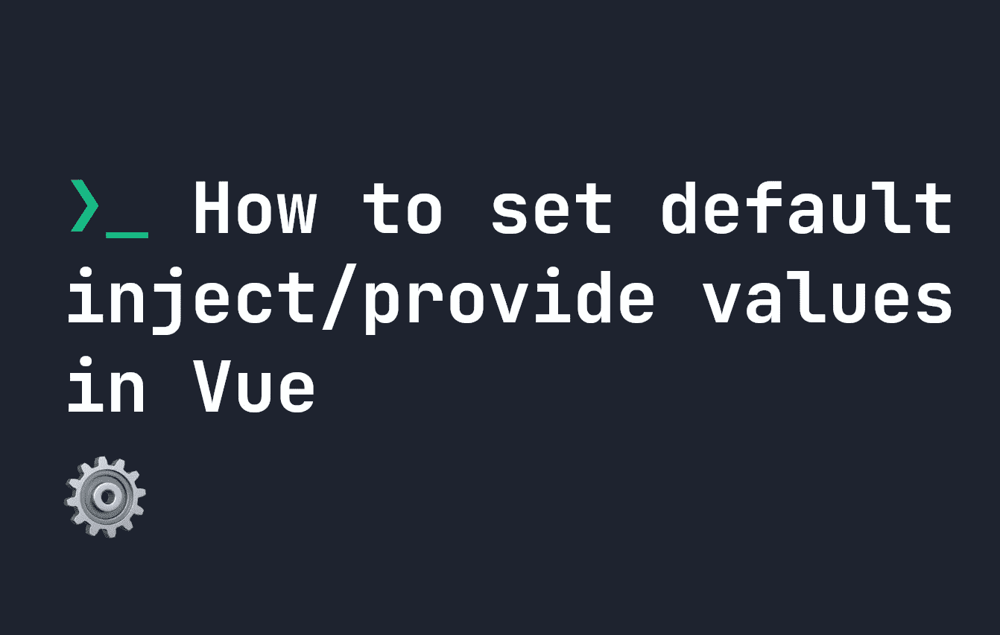

# 如何在 Vue 中设置默认注入/提供值

> 原文：<https://levelup.gitconnected.com/how-to-set-default-inject-provide-values-in-vue-8ff1a0c701e1>



Vue 使用`provide`和`inject`作为一种方法将数据向下发送多个级别，而不必使用**属性**——但是您知道您可以为任何注入的数据设置默认值吗，如果它不应该首先被注入的话？让我们看看它是如何工作的。

# 使用 Vue 中的提供和注入设置默认值

如果你不确定[如何提供和注入工作，你可以在这里阅读](https://fjolt.com/article/vue-provide-inject)。默认情况下，`inject`希望为`provide`键设置一个默认值——如果没有，它将抛出一个运行时错误。因此，设置默认值是有益的，这样就不会引发运行时错误。

让我们来看一个例子。比如说你`provide`在你父母那里有些这样的数据:

```
<script setup>
    import { provide, ref } from 'vue'
    const message = ref('message');
    provide('myKey', message);
</script>
```

如果您随后将其注入某个地方，您可以使用第二个参数来设置默认值。例如:

```
<script setup>
    import { inject } from 'vue'
    const message = inject('myKey', 'the default value')
</script>
```

在本例中，如果找不到`myKey`，默认值将改为`the default value`。您可以使用选项 API 实现同样的事情，如下所示:

```
export default {
    inject: {
        message: {
            myKey: 'the default value'
        }
    }
}
```

在 Vue 中为喷射器设置默认值是最佳实践，有助于防止意外的运行时错误。[要了解更多关于 Vue 的信息，请点击此处](https://fjolt.com/category/vue)。

# 分级编码

感谢您成为我们社区的一员！在你离开之前:

*   👏为故事鼓掌，跟着作者走👉
*   📰查看[升级编码出版物](https://levelup.gitconnected.com/?utm_source=pub&utm_medium=post)中的更多内容
*   🔔关注我们:[Twitter](https://twitter.com/gitconnected)|[LinkedIn](https://www.linkedin.com/company/gitconnected)|[时事通讯](https://newsletter.levelup.dev)

🚀👉 [**加入升级人才集体，找到一份神奇的工作**](https://jobs.levelup.dev/talent/welcome?referral=true)