# 如何设置 Python 脚本在云上的 Jupyter 笔记本中运行

> 原文：<https://levelup.gitconnected.com/how-to-set-up-a-python-script-to-run-in-a-jupyter-notebook-on-the-cloud-fb842780b610>

当安排我们的脚本自动运行时，我们遇到了一个问题，除非我们在计算云中有服务器或虚拟机(AWS、GCP 等)，否则运行脚本的机器需要一直打开。

如果我们只需要安排几个脚本并转储不到一百个 CSV 文件的数据以供进一步分析，就可以避免配置虚拟环境的步骤。

Deepnote 已经成为在云环境中工作、分析数据的一个选项，现在可以安排在线作业作为一个完全免费的类似 cron 的选项运行。

Deepnote 是一个与 Jupyter 笔记本兼容的 web 应用程序，它为项目级别的数据科学提供了一个交互式工作环境。在其中，你将能够以一种简单和协作的方式实时编写和执行代码，而无需任何额外的配置。因此，最好开始学习或开发数据科学方面的专业项目。

首先，我要澄清的是，我与 Deepnote 项目或该公司的任何赞助都没有关系，只是试图分享关于我在日常工作中发现有用的工具的知识，这些工具属于数据科学、数据分析和数据工程领域，随时可以使用。

# 访问 Deepnote 仪表板

访问 Deepnote 是免费的，你只需要使用你的 Github 或谷歌账户注册即可

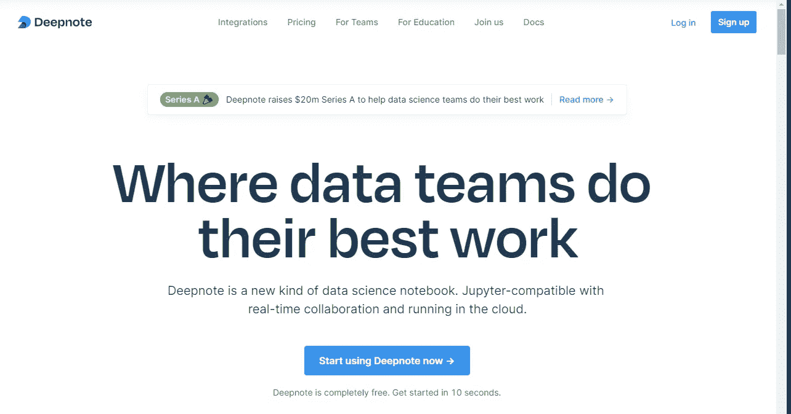

注册后，您可以按照提示中提供的选项登录

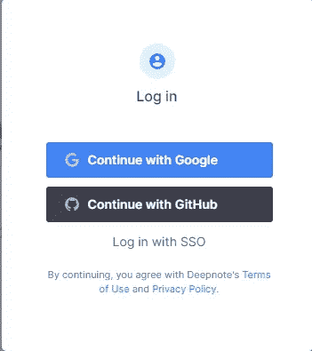

然后，系统会提示您进入仪表板页面，您可以在此开始创建在线笔记本。在这个[链接中，](https://towardsdatascience.com/deepnote-a-collaborative-framework-for-your-python-notebooks-99390a6766e9)你可以找到一篇完整的文章，这篇文章来自一位媒体作者，他解释了 Deepnote 的全部特性以及如何开始工作，我不会在本教程中介绍。

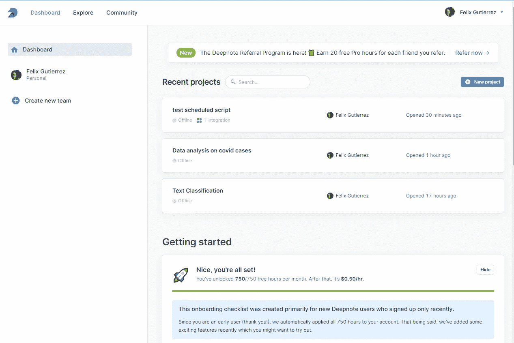

# 脚本如何工作

对于我的预定笔记本，我将从每天更新的[我们的世界数据](https://github.com/owid/covid-19-data)的 Github repo 中提取 Covid 数据。

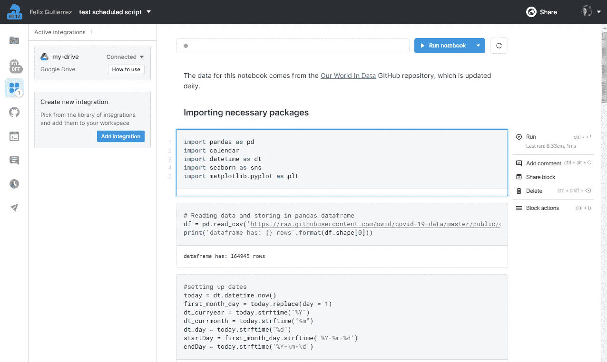

你可以从我的 [Github](https://github.com/fvgm-spec/data_analysis/blob/main/scheduled_script.ipynb) 下载这个脚本，然后用这个数据来玩。该脚本做的第一件事是导入所需的 Python 包:

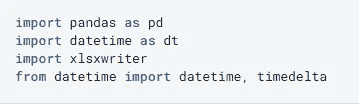

然后从 GitHub 远程 repo 中读取数据，并将其存储在 pandas 数据帧中，之后计算 Covid 数据集中的记录数

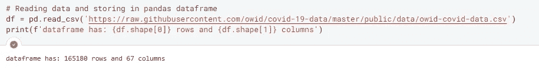

然后，它设置将用于在数据集中执行过滤的日期时间变量，并命名输出集

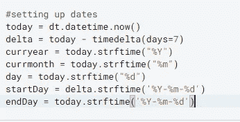

我们可以检查数据集的列，我们意识到在这 67 列中，有一些有趣的列与不同国家的人口有关

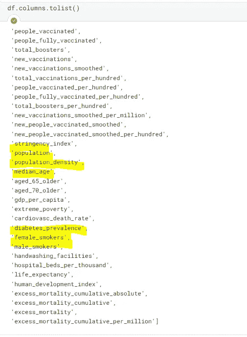

我们还可以检查数据集中的不同国家(位置列)

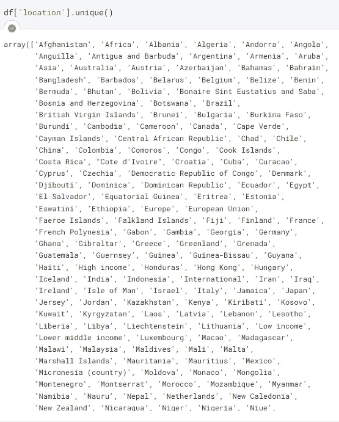

但是让我们把 [EDA](https://www.linkedin.com/pulse/state-art-eda-vaibhav-bhatia/) 留到另一个时间，继续配置我们将在笔记本中安排的数据子集。

然后，我将选择我感兴趣的位置(乌拉圭)的数据，并在结果数据子集的记录数下面的单元格中打印。

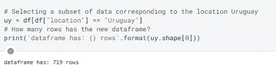

之后，我将只选择与上面设置的 datetime 变量相对应的行，即 7 天前的当天(startDay)和今天(endDay)。

由于我将在 2 月 28 日运行此作业，因此我将拥有与我的国家对应的 1 周的 Covid 案例数据，我的想法是安排此作业在调度程序提供的选项之一中运行(每小时、每天和每周)，因为此时间将为每周。

将要下载的数据将存储在我的硬盘存储器中，这个[指南](https://deepnote.com/integrations/drive)将向你展示如何将你的谷歌硬盘集成到你的 Deepnote 笔记本中。

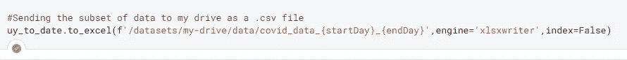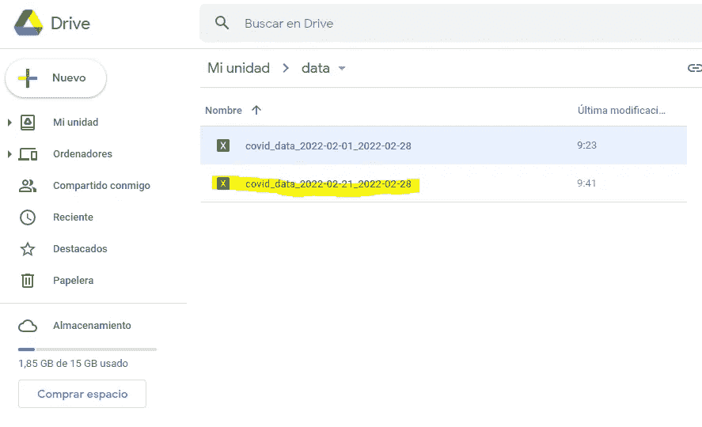

# 计划笔记本

接下来，让我们安排我们的笔记本(脚本)每天在 Deepnote 上运行。在笔记本的右上角，单击“Run notebook”按钮上的向下箭头，系统将提示您使用计划程序提供的选项之一(每小时、每天和每周)来计划该作业，它还有其他高级选项可供选择。

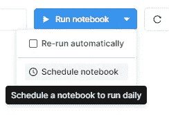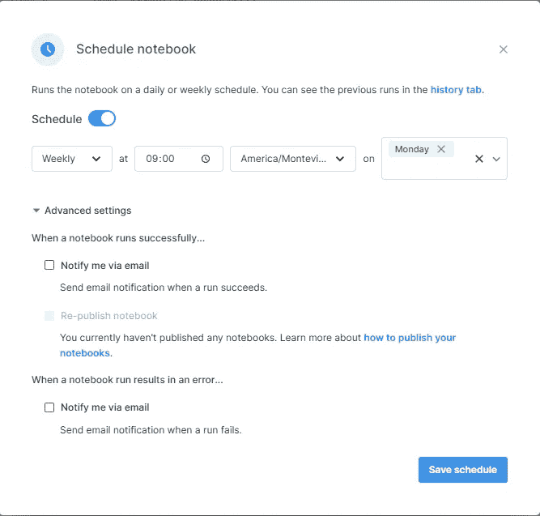

瞧啊。！该脚本将每周运行一次，下载到 Google Drive 存储数据以备进一步分析。