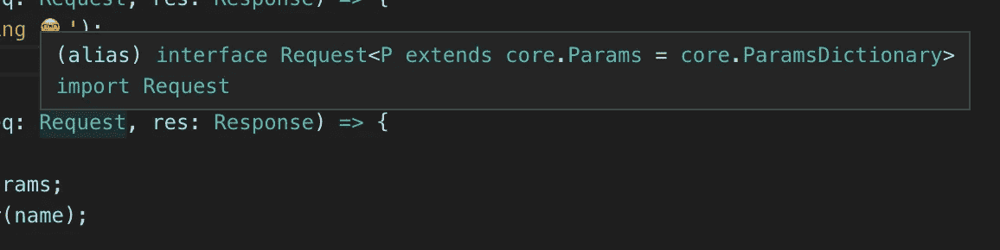
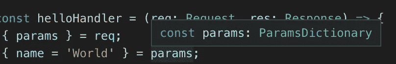
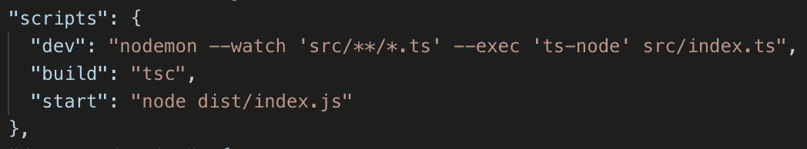
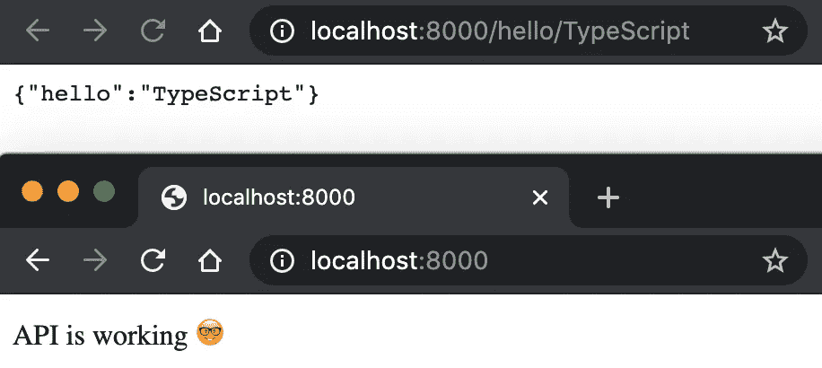

# 如何在 5 分钟内设置好一个 TypeScript + Node.js App

> 原文：<https://levelup.gitconnected.com/how-to-set-up-a-typescript-node-js-app-in-5-minutes-93ffee3b1768>


TypeScript 已经占据了 JavaScript 的世界，对于 web 开发人员来说，知道 TypeScript 是必不可少的。在本文中，我将向您展示如何用 Express 和 TypeScript 在 5 分钟内启动一个节点服务器。

如果你遇到任何问题，你可以在 GitHub 上看到完整的代码。


创建和维护一份简历并不有趣。而是让我们为你生成一份牛逼的简历:) [**简历生成器**](https://gitconnected.com/resume-builder) →

[](https://gitconnected.com/resume-builder) [## 软件工程师简历生成器和示例| gitconnected

### 使用您的个人资料中的详细信息构建一份有价值的简历模板。从你的投资组合网站链接到你的简历或…

gitconnected.com](https://gitconnected.com/resume-builder) 

## 设置类型脚本

首先创建一个项目文件夹:

```
mkdir typescript-api
cd typescript-api
```

初始化您的`package.json`:

```
yarn init -y
```

我们将安装的第一个包是作为开发依赖项的`typescript`。我们使用 TypeScript 作为开发依赖项的原因是，在我们将应用程序部署到生产环境之前，我们将 TypeScript 编译成普通的 JavaScript 代码，这些代码可以由 Node 解释。

```
yarn add -D typescript
```

每个 TypeScript 项目的根目录下都必须有一个`tsconfig.json`文件，这样我们就可以根据我们项目的规范来配置它。安装 TypeScript 后，我们可以访问项目中的`tsc`命令。我们可以通过执行以下命令来初始化一个`tsconfig.json`文件:

```
yarn tsc --init --rootDir src --outDir dist
```

这将生成以下 tsconfig:

最初的`tsconfig.json`文件显示了所有可能的选项，其中重要的没有注释掉。您使用的值将取决于您的项目，但是一个可靠的基本配置应该是:

## 构建 API

现在我们将安装我们需要的额外的软件包。我们的服务器将使用 Express 构建，所以先添加它。

```
yarn add express
```

我们还将受益于安装一些额外的 TypeScript 类型以及用于自动重建的 Nodemon。我们将在开发中使用`ts-node`,这样我们就可以执行 TypeScript 文件，而不需要编译它们。 [DefinitelyType GitHub](https://github.com/DefinitelyTyped/DefinitelyTyped) 库包含了由 TS 社区维护的大量类型，为您提供了 NPM 包的类型。这些类型可以通过使用模式`@types/<package-name>`进行安装。在您的终端中运行以下命令来获取类型 Nodemon 和 ts-node:

```
yarn add -D @types/node @types/express nodemon ts-node
```

我们将在`src`目录中构建我们的 API，所以现在创建它。

```
mkdir src
```

我们将有两个文件`index.ts`和`handlers.ts`。在`src`文件夹中，创建这些文件:

```
touch index.ts handlers.ts
```

我们创建了一个单独的`handlers.ts`文件来显示 TypeScript 已经处理模块(`import` / `export`)而不需要 Babel。在`handlers.ts`内部，添加以下代码:

由于我们安装了`@types/express`，我们可以从`express`包本身导入类型(TypeScript 知道寻找 DefinitelyTyped 包)。例如，这告诉我们`req`将有一个类型`Request`:



我们可以看到参数将自动被赋予一个类型`ParamsDictionary`:



为了更明确地展示我们现在如何利用 TypeScript，我还为我们的 API 响应创建了一个`HelloResponse`和`HelloBuilder`。

最后，在`src/index.ts`中导入您的处理程序并创建您的服务器:

同样值得注意的是，由于我们已经安装了`@types/node`，TypeScript 将识别全局节点类型。比如`process.env.PORT`自动打成`string | undefined`。

## 在开发和生产环境中运行您的服务器

我们现在拥有了节点项目所需的所有代码。为了运行我们的服务器，我们将把 NPM 脚本添加到我们的`package.json`文件中。



通过运行`yarn dev`，您将启动用于开发的服务器，并且它将在任何时候用 Nodemon 更改文件时自动重新编译。

为了制作，我们有一个`build`和`start`剧本。`yarn build`会在`dist`文件夹中把你的类型脚本编译成 JavaScript。然后，您可以使用`yarn start`运行您的应用程序。

让我们看看使用`yarn dev`的路线:



## 包裹

您现在已经有了用 TypeScript 启动任何节点项目的基础！就像安装 TypeScript 包并用您的`tsconfig.json`文件配置它一样简单。

—[@ trey huffine](https://twitter.com/treyhuffine)|[@ git connected](https://twitter.com/gitconnected)