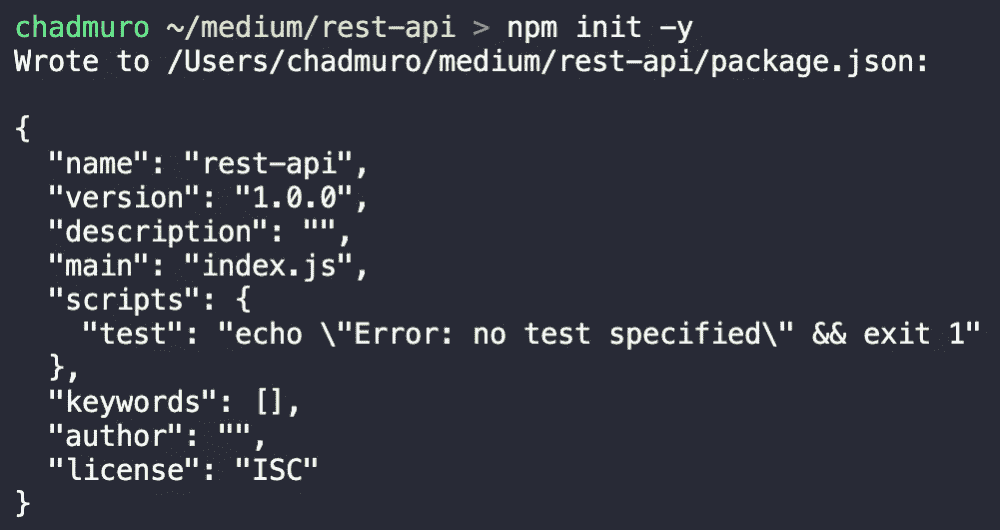
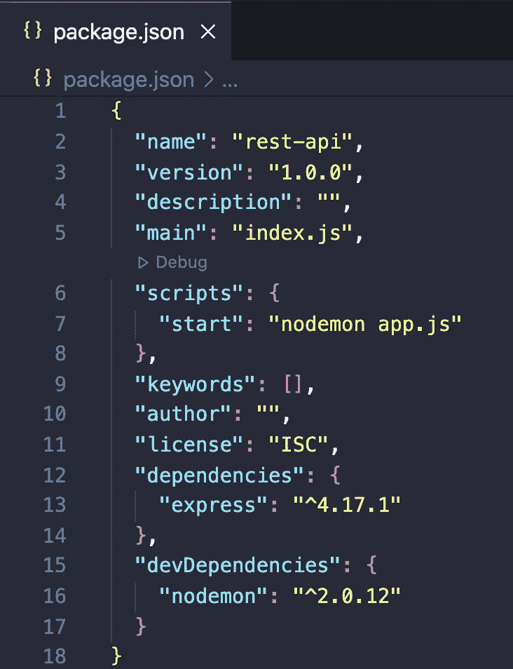
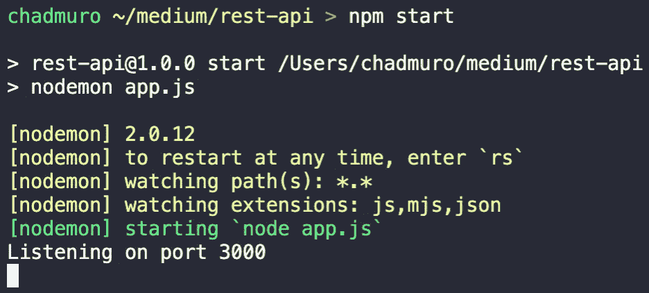

# 如何使用 Node.js 和 Express 设置 Web 服务器

> 原文：<https://levelup.gitconnected.com/how-to-set-up-a-web-server-using-node-js-and-express-ff03ec14ae3b>

## Node.js 和 Express 简介


[贴纸骡子](https://unsplash.com/@stickermule?utm_source=medium&utm_medium=referral)在 [Unsplash](https://unsplash.com?utm_source=medium&utm_medium=referral) 上拍照

作为一个前端开发者，后端让我害怕。工作中，经常看一眼服务器端的代码，却感觉完全迷失了。

然而，作为一名开发人员，继续学习并保持好奇心是很重要的。所以我 2021 年下半年的目标是开始学习后端开发。这是我未来成为全栈开发者的第一步。

我始终相信，学习一件事情的最好方法之一就是教它。因此，在这一系列文章中，我将向您介绍我一直在学习的后端开发部分。请加入我的旅程，我将尝试使用 Node.js、Express 和 MongoDB 构建一个功能完整的后端。

在第一篇文章中，我们将研究 Express 并使用它来构建一个 web 服务器。

# 什么是快递？

[Express](https://www.npmjs.com/package/express) 是 Node.js 的一个 web 框架，使得构建 web 服务器变得很容易。它是最受欢迎的 Node.js 框架之一，在 npm 上每周下载量超过 1600 万次。

> Express 的理念是为 HTTP 服务器提供小型、健壮的工具，使其成为单页应用程序、网站、混合或公共 HTTP APIs 的优秀解决方案

使用 Express 的一些好处包括:

*   使 Node.js 应用程序的开发变得快速而简单
*   用更少的代码快速设置 REST API 服务器
*   包括各种中间件来执行附加任务
*   帮助组织您的应用程序架构
*   帮助处理错误
*   轻松连接到数据库

现在，让我们使用 Express 来构建一个 web 服务器。按照本文，您需要在您的计算机上安装 [Node.js](https://nodejs.org/en/) 。

# 初始化项目并安装 Express

首先，创建并打开一个新目录。在这个目录中，您可以使用`npm init -y`初始化一个新项目。



这将创建一个`package.json`文件，您现在可以开始安装软件包了。

## 安装快速

```
*// Install express*
npm install express
```

## 将 nodemon 作为开发依赖项安装(可选)

[Nodemon](https://www.npmjs.com/package/nodemon) 是一个在开发 Node.js 应用时很有帮助的工具。每当检测到文件更改时，该工具将重新启动节点应用程序。Nodemon 不是必需的，但强烈建议使用。

```
*// Install nodemon as a dev dependency*
npm install nodemon --save-dev
```

## 设置脚本

这个脚本允许你输入`npm start`来启动你的服务器。

```
*// If you installed nodemon*
"scripts": {
  "start": "nodemon app.js"
}*// If you did not install nodemon*
"scripts": {
  "start": "node app.js"
}
```



# 创建 web 服务器

既然我们的项目已经建立，我们将开始创建一个 web 服务器。第一步是导入 express 包。如果您有前端开发人员的经验，您可能熟悉如下的导入语句:

```
import express from 'express';
```

可以在 Node.js 中使用这个选项，但是需要在`package.json`文件中设置 *"type"* 到 *"module"* 。你可以在这里阅读更多关于这个[的内容](https://nodejs.org/api/esm.html#esm_import_expressions)。

否则，您可以使用 require，这是一个内置函数，允许您将外部模块包含到项目中。

```
const express = require('express');
```

接下来，我们将调用 express 函数，并将其存储在一个名为`app`的变量中。我们可以使用 app 变量来配置服务器。

app 对象上的一个方法是`app.listen`方法。这个函数有两个参数，一个端口号和一个回调函数。

```
app.listen(3000, () => {
  console.log(`Listening on port 3000`);
});
```

用上面的代码调用 listen 方法将在端口 3000 上启动服务器。当服务器启动时，回调函数将会运行。

我现在可以运行`npm start`来启动服务器。我们可以看到控制台的日志，*“监听端口 3000”*，确认我们的服务器正在运行。



# 创建路线

本文中我们要看的最后一部分是创建一条路线。我们的服务器已经启动并运行，但是如果我们在 **localhost:3000** 访问它，我们将会看到下面的错误。


发生这个错误是因为我们还没有设置服务器做任何事情。我们可以使用`app.get`方法创建一条路线。get 函数有两个参数，一个路径和一个回调函数。

```
app.get('/', (*req*, *res*) => {
  *res*.send('Hello World!');
});
```

对于路径参数，我们将传递“/”。回调函数接受两个参数，一个请求和一个响应。

请求是传入的数据；响应是我们发回的数据。对于这个例子，我们将发送一个带有文本的响应，*“Hello World！”*。

现在，如果我们回头看一下 **localhost:3000** ，我们将看到以下文本，确认我们的“/”路由正在发送响应。


恭喜你！您刚刚创建了第一个 web 服务器，并发送了对 HTTP 请求的响应。

查看下面的完整源代码。

# 结论

感谢阅读！我希望这篇文章对您开始使用 Express 有所帮助。

我将更深入地研究后端开发，尤其是 Node.js Express 和 MongoDB。我的目标是完成 REST API 的构建，并探索一些其他特性。敬请期待！

**更多阅读**

[](https://betterprogramming.pub/10-tips-to-improve-your-technical-writing-skills-78d98faaef36) [## 提高技术写作技巧的 10 个技巧

### 根据我在谷歌开发者技术写作预备课程的学习经验

better 编程. pub](https://betterprogramming.pub/10-tips-to-improve-your-technical-writing-skills-78d98faaef36)