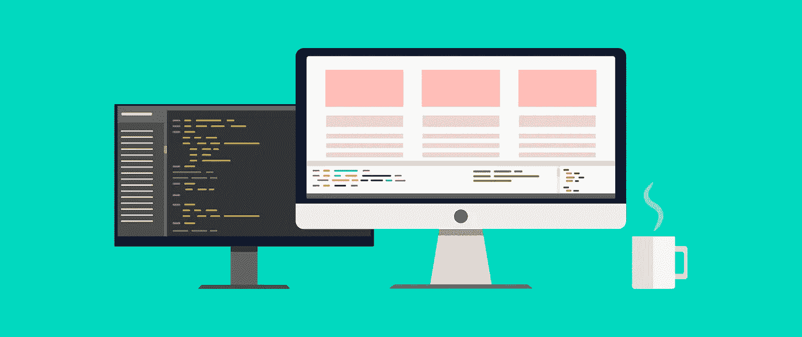

# 如何在 Laravel 8 应用中设置和使用 Vue

> 原文：<https://levelup.gitconnected.com/how-to-set-up-and-use-vue-in-your-laravel-8-app-2dd0f174e1f8>



在 Laravel 的旧版本中，Vue 是在每次新安装时自动设置的。然而，在新版本中，你必须自己设置。

幸运的是，`[laravel/ui](https://github.com/laravel/ui)`包提供了一种在 Laravel 应用程序中设置 Vue 的简单方法。

按照以下步骤在 Laravel 应用中设置 Vue。

1.创建新的 Laravel 应用程序

如果你还没有，使用 Laravel 的安装程序创建一个新的应用程序，并导航到该目录。

```
$ laravel new my-app
$ cd my-app
```

2.安装`laravel/ui`编写器包

```
$ composer require laravel/ui
```

3.搭建 Vue 脚手架

`laravel/ui`包中有一些有用的工匠命令，它们会自动搭建出你开始使用 Vue 所需的一切。

```
$ php artisan ui vue
```

你会注意到它对你的应用程序做了一些改变。下面会有更多关于这些变化的细节。

4.编译文件

最后，您需要安装新添加的依赖项并编译它们。

```
$ npm install && npm run dev
```

注意:如果你是第一次运行这个，Mix 可能需要安装额外的依赖项，它会自动加入。如果看到错误信息，只需再次运行`npm run dev`即可。

5.在你的视野中包括`/js/app.js`

您的 app.js 文件将被编译并保存到`public/js/app.js`。因为我们使用 Laravel Mix 来编译它，所以我们可以使用`mix()` helper 方法来为我们生成正确的路径。建议使用`mix()`助手，以便在使用版本控制时使用正确的文件名。

```
<script src="{{ mix('/js/app.js') }}"></script>
```

6.将 vue 根元素添加到 HTML 中

确保 HTML 搭建中还有一个 id 为`app`的根元素。否则，Vue 不知道在哪里安装组件。

```
<div id="app">
   <example-component></example-component>
</div>
```

## 注册单个文件 Vue 组件

laravel/ui 包将在`resources/js/components`中创建一个新目录。您可以在这里添加新的 Vue 组件。您会注意到 laravel/ui 包已经在其中添加了一个 ExampleComponent.vue 文件。

一旦你创建了你的 Vue 组件文件，你需要注册它。在 Laravel 中，您可以在主`app.js`文件(`resources/js/app.js`)中这样做。

您会注意到 ExampleComponent 已经注册了。

```
Vue.component('example-component', require('./components/ExampleComponent.vue').default);
```

请随意在您的`resources/js/components/`目录中创建子目录来组织您的文件。只要确保您的`require()`方法中的路径匹配您的目录结构。

```
Vue.component('admin-login-component', require('./components/Admin/AdminLoginComponent.vue').default);
```

# 文件更改

你会注意到 laravel/ui 包会对你的文件做一些修改。

**package.json**

所有必需的包都作为依赖项添加。

*   某视频剪辑软件
*   模板编译器

最值得注意的是，vue 包是作为依赖项添加的。我们需要这些来使用 Vue 和编译单个文件组件。

*   引导程序
*   jquery
*   波普. js

Bootstrap 及其依赖项(jQuery、popper.js)作为依赖项添加到项目中。安装这些额外的依赖项是因为`laravel/ui`的可选认证支架视图使用了 Bootstrap。

*   厚颜无耻
*   sass-loader
*   解析 url 加载器

Bootstrap 的 CSS 是用 SASS 写的。这些 SASS 包被放入，这样我们就可以正确地将我们的 SASS 编译成 CSS。

**resources/js/app.js**

在这里，我们初始化 Vue 并包含我们的组件，以便它们在我们编译的 JS 中可用。

**resources/js/Bootstrap . js**

**web pack . mix . js**T22`vue()`方法自动添加一些编译单个文件组件所需的必要的 Babel 配置。

Laravel Mix 现在也编译 SASS 而不是 CSS。

# 不使用 laravel/ui 手动设置 Vue

你不需要使用`laravel/ui`包来增加对 Vue 的支持。事实上，如果不需要额外的依赖项(比如 Bootstrap)，您可以选择不这样做。添加 Vue 支持非常简单。

1.  安装 npm 依赖项

```
$ npm install --save-dev vue vue-template-compiler
```

2.创建一个组件

在`resources/js/`目录下创建一个名为`components`的新目录。

创建一个新文件`ExampleComponent.vue`，并用下面的代码填充它。

```
<template>
    <div>Hello, Example Component!</div>
</template>

<script>
export default {
    mounted() {
        console.log('Example component mounted.')
    }
}
</script>
```

2.初始化 Vue

我们需要在我们的应用程序中需要 Vue 包，注册我们的组件，然后初始化我们的 Vue 应用程序。

将以下内容添加到您的`resources/js/app.js`文件中。

```
*// Require Vue* window.Vue = require('vue').default;

*// Register Vue Components* Vue.component('example-component', require('./components/ExampleComponent.vue').default);

*// Initialize Vue* const app = new Vue({
    el: '#app',
});
```

3.向 Laravel Mix 添加 Vue 支持

将`vue()`方法添加到您的 Laravel 混合链中。

更新您的`webpack.mix.js`文件中的以下内容。

```
mix.js('resources/js/app.js', 'public/js')
    .vue() *// <- Add this*
    .postCss('resources/css/app.css', 'public/css', [
        *//* ]);
```

5.汇编您的资产

```
$ npm run dev
```

注意:如果这是一个新项目，确保在运行这个命令之前运行`npm install`。

6.更新您的 HTML

确保在 HTML 视图中包含您编译的 javascript 文件。

```
<script src="{{ mix('/js/app.js') }}"></script>
```

另外，确保您有一个 id 为`app`的根元素。

```
<div id="app">
    <example-component></example-component>
</div>
```

注意，这个`#app` id 对应于我们在步骤#2 中初始化 Vue 时传递给它的 id。当然，您可以随意命名该 id。只要确保它在初始化你的 Vue 应用时匹配`el`配置即可。

如果运气好的话。您应该能够在浏览器中加载您的应用程序，并看到呈现的 Vue 组件。

# 分级编码

感谢您成为我们社区的一员！升级正在改变技术招聘。 [**在最好的公司**找到你最理想的工作](https://jobs.levelup.dev/talent) **。**

[](https://jobs.levelup.dev/talent) [## 提升——改变招聘流程

### 🔥让软件工程师找到他们热爱的完美角色🧠寻找人才是最痛苦的部分…

作业. levelup.dev](https://jobs.levelup.dev/talent)