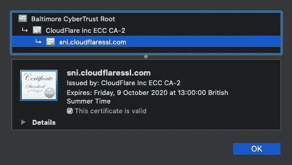

# 如何用 Vercel(以前叫 ZEIT)设置 Cloudflare

> 原文：<https://levelup.gitconnected.com/how-to-set-up-cloudflare-with-zeit-93daa7d45dd>

## 我如何使用 Cloudflare 代理我的 Vercel 项目的分步指南。

**更新 22/04/20** *:自本文首次发表后，* [*ZEIT 已更名为 Vercel*](https://vercel.com/blog/zeit-is-now-vercel) *。本文中涉及的步骤仍然是相关的，如果有必要，将来还会更新。*

当我第一次尝试用 Vercel(以前的 ZEIT)设置 Cloudflare 时，我一直遇到问题，主要是重定向循环和“无效域配置”错误。经过数小时的研究和测试，我找到了防弹解决方案。我是这样做的。

# 内容

1.  创建一个 Vercel 项目。
2.  创建 Cloudflare 站点。
3.  将 Cloudflare 管理的域连接到 Vercel 项目。
4.  将 Cloudflare 管理的子域连接到 Vercel 项目。
5.  总结。

# 创建一个 Vercel 项目

我首先通过以下方式将一个名为'[a-song-of-vercel-and-cloud flare](https://github.com/domjtalbot/a-song-of-vercel-and-cloudflare)的现有 GitHub 存储库导入到 Vercel 中:

1.  在 Vercel 仪表板中选择“导入项目”按钮。
2.  选择“Git Repository”选项下的“Continue”按钮。
3.  将我的项目命名为‘a-song-of-vercel-and-cloud flare’，以保持它与存储库一致。
4.  将项目根目录和构建设置保留为默认设置。

Vercel 随后启动了第一次构建，并分配了一个 [now.sh](http://now.sh) 子域。构建完成后，我在浏览器中打开了 URL，以确保一切正常。

# 创建 Cloudflare 站点

我的下一步是通过以下方式创建一个 Cloudflare 站点:

1.  在 Cloudflare 控制面板中选择“添加站点”按钮。
2.  进入我的领域。
3.  选择“免费”计划。
4.  查看 Cloudflare 找到的 DNS 记录，并丢弃那些我不需要的记录。
5.  将我的域名服务器更新到 Cloudflare 的:`ajay.ns.cloudflare.com`和`sima.ns.cloudflare.com`。

由于名称服务器的改变可能需要几个小时才能生效，所以我喝咖啡来打发时间。

照片由[丹尼尔·柯伦](https://unsplash.com/@daniel_curran?utm_source=medium&utm_medium=referral)在 [Unsplash](https://unsplash.com?utm_source=medium&utm_medium=referral) 上拍摄。

# 将 Cloudflare 管理的域连接到 Vercel

下一步是使用 Vercel 的 DNS 验证方法，将我的域名添加到我的 Vercel 帐户中。我是这样做的:

1.  在 Cloudflare 中创建一个名为`@`的`CNAME`记录，目标为`alias.zeit.co`，并启用代理。
2.  打开终端，运行`now domains add asongofzandc.xyz`检索验证码。
3.  在 Cloudflare 中创建一个名为`_now`的`TXT`记录，在“内容”字段中包含验证码。
4.  打开终端并运行`now domains verify asongofzandc.xyz`。

下一步是在 Cloudflare 中设置 HTTPS，这包括四个阶段:加密、异常、重定向和测试。我发现 HTTPS 是成功的关键。

## 第一阶段:加密

为了在 Cloudflare 和 Vercel 之间创建安全连接，我在“SSL/TLS”选项卡中将 Cloudflare 的加密级别设置为“完全(严格)”。如果 Vercel 没有“Cloudflare Origin CA Certificate”，我会将加密级别设置为“Full”。

## 第二阶段:例外

当 Vercel 构建一个项目时，构建过程的最后一步是发布一个 SSL 证书。作为这个步骤的一部分，Vercel 向`<domain>/.well-known/acme-challenge`发出一个 HTTP 请求。如果这个 HTTP 请求被重定向到 HTTPS，Vercel 将无法发布 SSL 证书。

为了防止这个特定的请求被重定向，我通过以下方式创建了一个 HTTPS 例外页面规则:

1.  在 Cloudflare 控制面板的“页面规则”选项卡中选择“创建页面规则”。
2.  在“如果 URL 匹配”文本框中输入`*asongofzandc.xyz/.well-known/*`。
3.  从“选择设置”下拉列表中选择“SSL ”,然后从“选择 SSL 设置”下拉列表中选择“关闭”。
4.  选择“保存并部署”按钮。

## 阶段 3:重定向

为了确保所有其他 HTTP 请求继续重定向到 HTTPS，我创建了另一个页面规则:

1.  禁用“SSL/TLS”选项卡的“边缘证书”部分中的“始终使用 HTTPS”设置。
2.  在“页面规则”选项卡中选择“创建页面规则”按钮。
3.  在“如果 URL 匹配”文本框中输入`[http://*asongofzandc.xyz/](/*asongofzandc.xyz/)*`。
4.  从“选择设置”下拉列表中选择“总是使用 HTTPS”。
5.  从“订单”下拉列表中选择“最后”。
6.  选择“保存并部署”按钮。

## 第四阶段:测试

最后一步是测试 HTTPS 的设置是否有效。我使用`curl`在终端中运行了两个测试:

1.  **HTTP 请求会被重定向到 HTTPS 吗？**
    测试`curl -IL [http://asongofzandc.xyz](http://asongofzandc.xyz.)`显示了从 HTTP 到 HTTPS 的单一重定向。
2.  **Vercel 的 HTTP 请求会被重定向到 HTTPS 吗？**
    测试`curl -L [http://asongofzandc.xyz/.well-known/acme-challenge](http://asongofzandc.xyz/.well-known/acme-challenge)`显示没有 HTTPS 重定向。

两次成功的测试，我感到很幸运！我使用 Vercel 仪表板将我的域分配给我的 Vercel 项目。

就像变魔术一样， [asongofzandc.xyz](https://asongofzandc.xyz) 现在正在展示我的 Vercel 项目。

通过在浏览器中检查 SSL 证书，我能够确认我的项目是通过 Cloudflare 进行的。

完美！

# 将 Cloudflare 管理的子域连接到 Vercel

我很好奇我的设置是否经得起未来的考验。如果我想用一个子域来代理一个不同的 Vercel 项目，设置起来有多容易？答案，原来是非常！

我通过以下方式设置了一个代理不同 Vercel 项目的新子域名:

1.  将名为'[vercel-and-cloud flare-dragon](https://github.com/domjtalbot/vercel-and-cloudflare-dragon)'的新 GitHub 库导入到 Vercel。
2.  在 Cloudflare 中创建一个`CNAME`记录，命名为`dragon`，目标为`alias.zeit.co`，启用代理。
3.  将我的子域—[dragon . asongofzandc . XYZ](https://dragon.asongofzandc.xyz)—分配给我的新 Vercel 项目“vercel-and-cloudflare-dragon”。

几秒钟之内，我的“vercel-and-cloudflare-dragon”项目就可以通过[dragon . asongofzandc . XYZ](https://dragon.asongofzandc.xyz)查看了。

# 摘要

使用 Vercel 设置 Cloudflare 非常简单:关键在于 HTTPS 设置。遵循设置 HTTPS 的四个阶段——加密、异常、重定向、测试——您很快就能在 Vercel 上使用 Cloudflare 了。

我希望这是有帮助的，感谢阅读！